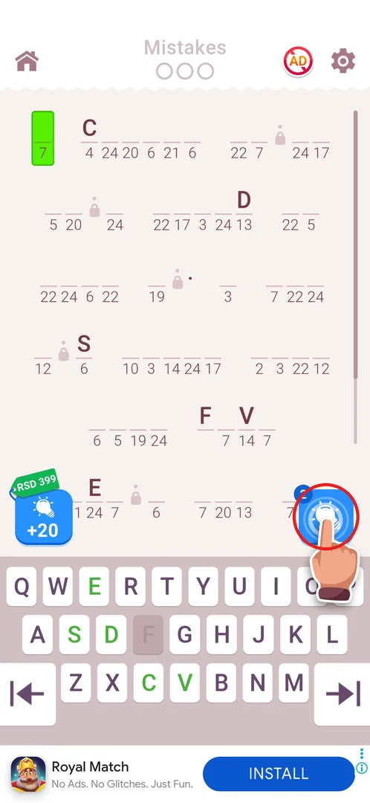
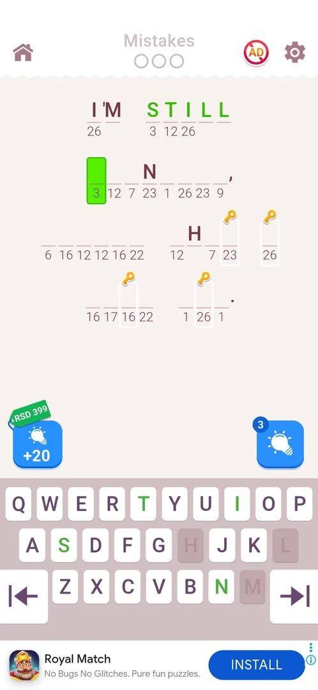
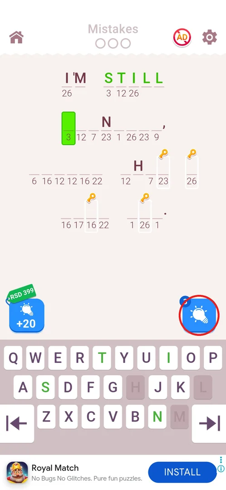
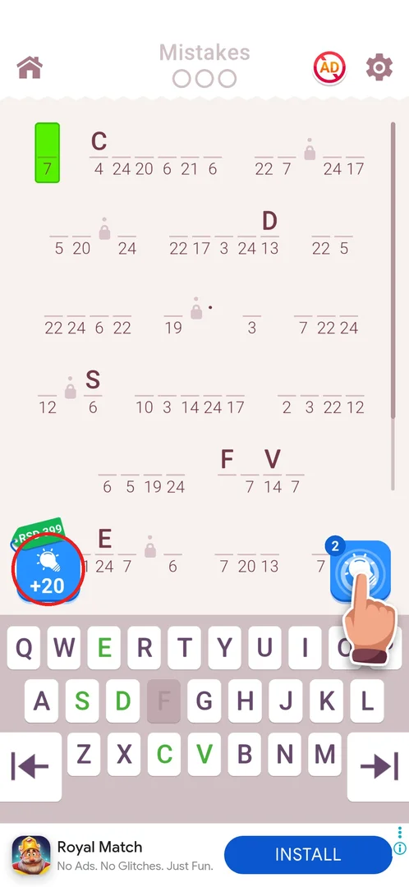
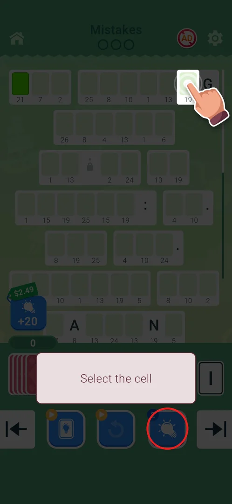
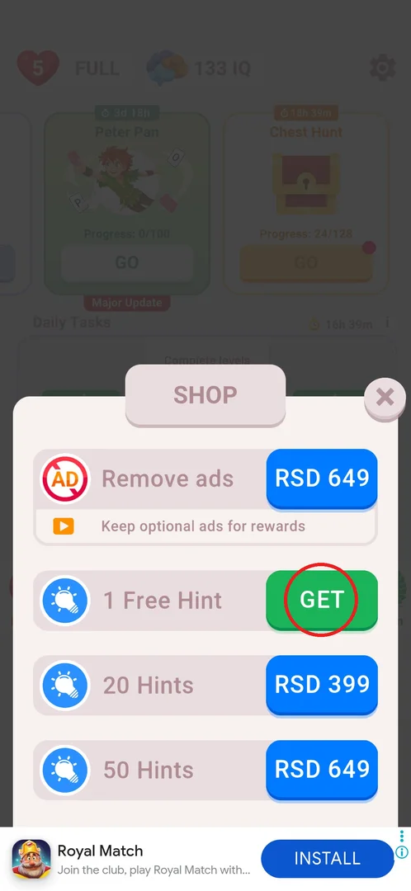
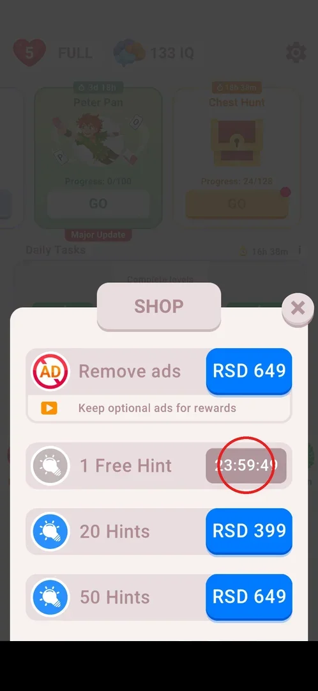

# Hints

Hints are the game's help item for a stuck cryptogram: a stock of hints is shown on a lightbulb button
on every level board. The stock is refilled by one free hint a day from the Shop, or bought for real
money in packs of 20 or 50 [^s1] [^s4]. What a single hint reveals has not been observed yet.

## Where to find it

On any level board (classic levels and event levels). The hint button is the blue lightbulb at the
bottom right, just above the keyboard, with a blue badge showing the stock (2 at level 9); on first
view a tutorial hand points at it. The "+20" pack button with a price tag sits at the bottom left
[^s1]. More hints come from the main screen's **Shop** button (see
[Shop: 1 Free Hint](#shop-1-free-hint)) [^s4].

 [^s1]

## What it looks like

The board has the number-coded quote in the middle, Mistakes 0/3 and the home, no-ads and settings
buttons at the top, and the QWERTY keyboard with previous/next-cell arrows below. The two hint
controls sit in the strip between the quote and the keyboard: the "+20" pack on the left, the hint
button with its stock badge on the right [^s1] [^s2].

 [^s2]

## What you can do

| Tab or button | What it does |
|---|---|
| [Hint button](#hint-button) | Spends one hint from the stock on the board (effect not yet observed) |
| [+20 pack](#20-pack) | Opens the Google Play payment sheet for 20 hints (real money) |
| [Event level board](#event-level-board) | On event levels the hint button moves into the bottom button row |
| [Shop: 1 Free Hint](#shop-1-free-hint) | GET adds one hint for free, no ad |
| [Free hint cooldown](#free-hint-cooldown) | After GET the free hint is locked for 24 h |

### Hint button

The lightbulb with the stock badge. The stock was 2 at level 9 [^s1] and 3 at level 15, after one
free hint had been claimed in the Shop in between [^s4] [^s2] (inferred: no hint was used on levels
9–14). Tapping it on a board was never done, so what one hint reveals and how the badge changes is
not known.

 [^s2]

### +20 pack

A blue "+20" button with a lightbulb and a green price tag (RSD 399 on classic levels). It opens the
Google Play sheet "Hints Small Pack", RSD 399, marked "Top selling", with a "1-tap buy" button; this
is a real-money purchase [^s6]. Backing out of the sheet returns to the level with a
"Purchase failed!" toast and nothing bought [^s7].

 [^s1]

### Event level board

On a Peter Pan event level ("Special Game") the keyboard is replaced by a card hand, and the hint
button (stock 2) moves into the bottom button row, next to two other buttons marked with a
video-ad badge. The "+20" pack stays at the left above the hand, but its tag showed $2.49 instead of
RSD 399 [^s3]. The frame was taken while the event's tutorial ("Select the cell", with a pointing
hand) covered the board, so it shows the layout only; no hint was used there [^s3].

 [^s3]

### Shop: 1 Free Hint

Main screen → **Shop** (bottom left; it carries a red badge "1" while the free hint is ready). The
Shop lists Remove ads RSD 649, **1 Free Hint** with a green GET button, **20 Hints** RSD 399 and
**50 Hints** RSD 649 [^s4]. GET grants the hint after about 4 s with no ad shown [^s5].

 [^s4]

### Free hint cooldown

After GET the row turns grey and the button becomes a countdown (23:59:49 right after the claim), so
the free hint is once per 24 h; the Shop badge on the main screen is gone afterwards [^s5].

 [^s5]

## How it works

| What (v3.6.1) | Value | Source |
|---|---|---|
| Hint stock at level 9 | 2 | [^s1] |
| Hint stock at level 15, after one free hint | 3 | [^s2] |
| Free hint | 1 per 24 h from the Shop, no ad | [^s5] |
| 20 hints ("Hints Small Pack", +20 on the board) | RSD 399 (real money); $2.49 on the event board | [^s4] [^s6] [^s3] |
| 50 hints | RSD 649 (real money) | [^s4] |

## Cases

| Case | What was done | Result | Source |
|---|---|---|---|
| Hint pack price | The +20 button was hit by an accidental tap on level 9 | Google Play sheet "Hints Small Pack", RSD 399, "Top selling", with 1-tap buy; Back gave a "Purchase failed!" toast, nothing was bought | [^s6] [^s7] |
| Free hint | Shop → 1 Free Hint → GET | One hint granted after ~4 s with no ad; the row shows a 24 h countdown | [^s5] |
| Use a hint on a cell | Not done | not verified | |

## Not verified

- What a hint reveals (one cell, one letter everywhere, a whole word) and how the stock changes after use.
- Whether hints can be earned elsewhere (rewarded video, level or event rewards, daily tasks).
- What the two video-ad buttons beside the hint button on event levels do.

[^s1]: session 20261001-020937-chrono-2FYKPJ, step 8 — [video at 3:06](https://youtu.be/UqLGP_sLnX8?t=186)
[^s2]: session 20261001-071926-chrono-2FYKPJ, step 22 — [video at 6:37](https://youtu.be/TiPdn57GNJY?t=397)
[^s3]: session 20261001-050941-chrono-2FYKPJ, step 8 — [video at 1:54](https://youtu.be/0QFSEGBnZG8?t=114)
[^s4]: session 20261001-071926-chrono-2FYKPJ, step 4 — [video at 1:12](https://youtu.be/TiPdn57GNJY?t=72)
[^s5]: session 20261001-071926-chrono-2FYKPJ, step 5 — [video at 1:23](https://youtu.be/TiPdn57GNJY?t=83)
[^s6]: session 20261001-020937-chrono-2FYKPJ, step 9 — [video at 4:25](https://youtu.be/UqLGP_sLnX8?t=265)
[^s7]: session 20261001-020937-chrono-2FYKPJ, step 10 — [video at 4:33](https://youtu.be/UqLGP_sLnX8?t=273)
