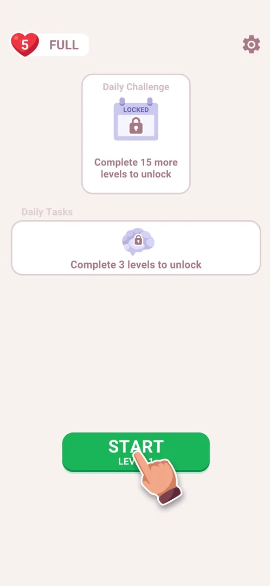
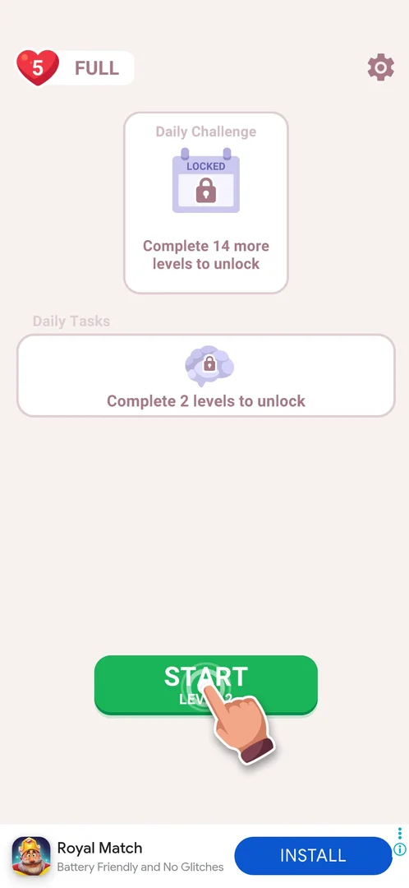

# Home screen

The home screen is the game's hub: the screen the app opens on, with the lives counter, the Settings gear, the cards of the two daily modes and the button that starts the next level. On a fresh install of 3.6.1 it shows no shop, no currency counter and no event icon [^s2]; after the third level won it adds an IQ counter, the open Daily Tasks list, a Leagues button and a bottom bar with Shop, Statistics, Collection and Album [^s7].

## Why it appeared

On the first launch, after a notification permission prompt and a "Welcome to Cryptogram" loading screen of about 20 seconds, the app opens on the home screen [^s1].

## Where to find it

The home screen is the first screen after the loading screen; no control leads to it from elsewhere in this session. Closing Settings or How to play returns to it [^s3].

<!-- no-entry: the only screen before home is the loading screen, which shows a device identifier under its progress bar (personal data) -->

## What it looks like

 [^s1]
*Home on a fresh install (level 1): the lives counter top left, the gear top right, two locked cards in the middle, START LEVEL 1 at the bottom*

Top to bottom on a fresh install [^s1]:

- the lives counter (a heart with 5 and FULL) at the top left, the Settings gear at the top right;
- the Daily Challenge card, a calendar marked LOCKED with "Complete 15 more levels to unlock";
- the Daily Tasks card, a lock with "Complete 3 levels to unlock";
- the green START LEVEL 1 button with an animated tutorial hand pointing at it.

After the first level won, the same layout shows lower unlock counters, START LEVEL 2 and a banner ad at the bottom [^s5]; see [After level 1](#after-level-1). After the third, the screen fills out; see [After level 3](#after-level-3).

## What you can do

| Tab or button | What it does |
|---|---|
| [Lives counter](#lives-counter) | Shows the lives; with 5/5 a tap does nothing |
| [Settings gear](#settings-gear) | Opens Settings |
| [Daily Challenge](#daily-challenge) | Locked: a tap does nothing |
| [Daily Tasks](#daily-tasks) | Locked: a tap does nothing |
| [START LEVEL 1](#start-level-1) | Starts the next level; CONTINUE LEVEL N when a level was left unfinished |
| [After level 1](#after-level-1) | The home screen as it changes with progress |
| [After level 3](#after-level-3) | IQ, open Daily Tasks, Leagues and the bottom bar appear |

### Lives counter

The heart with the number of lives and the word FULL when all 5 are there. A tap with 5/5 lives opens nothing [^s2] [^s4]. See [Lives (hearts)](lives.md).

<!-- no-frame: the control is on the home frame above -->

### Settings gear

The gear at the top right opens the Settings popup over the home screen [^s3]. See [Settings](settings.md).

<!-- no-frame: the control is on the home frame above -->

### Daily Challenge

A card with a LOCKED calendar and "Complete 15 more levels to unlock"; a tap does nothing while it is locked [^s2] [^s4]. See [Daily Challenge](daily-challenge.md).

<!-- no-frame: the control is on the home frame above -->

### Daily Tasks

A card with a lock and "Complete 3 levels to unlock"; a tap does nothing while it is locked [^s2]. See [Daily Tasks](daily-tasks.md).

<!-- no-frame: the control is on the home frame above -->

### START LEVEL 1

The green button at the bottom, labelled with the next level's number, with an animated tutorial hand on a fresh install [^s1]. It opens the level; after a level is left by its home icon the button reads CONTINUE LEVEL N instead of START [^s6]. The tutorial hand was still on it after level 1 [^s5]. See [Cryptogram level](cryptogram-level.md).

<!-- no-frame: the control is on the home frame above -->

### After level 1

After level 1 is won and NEXT is tapped on its win card, home shows "Complete 14 more levels to unlock" on Daily Challenge, "Complete 2 levels to unlock" on Daily Tasks, START LEVEL 2 with the tutorial hand, and a banner ad along the bottom edge, which was not there on a fresh install [^s5].

 [^s5]
*Home after level 1: the unlock counters down by one, START LEVEL 2, a banner ad at the bottom*

### After level 3

After level 3 is won and NEXT is tapped, home adds [^s7]:

- an IQ counter (a brain icon, 100 IQ) right of the lives counter; see [IQ score](iq.md);
- the Daily Tasks card, now open: a timer to the day's reset (1h 29m), an "i" button that opens an IQ popup, and the day's tasks with progress bars; see [Daily Tasks](daily-tasks.md);
- START LEVEL 4, now without the tutorial hand, and right of it a locked Leagues shield; see [Leagues](leagues.md);
- a bottom bar of four buttons: Shop with a red badge 1, Statistics, and locked Collection and Album; see [Shop](shop.md), [Statistics](statistics.md), [Collection](collection.md), [Album](album.md).

A tap on a locked button shows a tooltip with the levels still needed: Leagues "Complete 47 more levels to unlock", Collection "Complete 12 more levels to unlock", Album "Complete 96 more levels to unlock" [^s8] [^s9] [^s10]. Daily Challenge reads "Complete 12 more levels to unlock" [^s7].

 [^s7]
*Home after level 3: the IQ counter top, Daily Tasks open, Leagues right of START, the four-button bottom bar*

## How it works

- Unlock thresholds shown on a fresh install (3.6.1): Daily Tasks after 3 completed levels, Daily Challenge after 15 more completed levels [^s1].
- Each won level lowers both unlock counters by one (after level 1: 14 and 2) [^s5].
- A banner ad shows at the bottom of home from the first level won on [^s5].
- Leaving a level unfinished turns START LEVEL N into CONTINUE LEVEL N; the lives stay as they were [^s6].
- Unlock thresholds in completed levels (3.6.1): Daily Tasks 3, Collection 15, Daily Challenge 15, Leagues 50, Album 99; Shop and Statistics come with the third level won [^s7] [^s8] [^s9] [^s10].
- Locked buttons answer a tap with a tooltip "Complete N more levels to unlock" [^s8].

## Cases

| Case | What was done | Result | Source |
|---|---|---|---|
| Why it appeared <!-- case:chk-appeared --> | First launch of a fresh install | Home opens after the permission prompt and the loading screen | [^s1] |
| Where to find it <!-- case:chk-entry --> | Launched the app; closed Settings and How to play; left a level | Home is the first screen after the loader; popups and levels return to it | [^s1] |
| What it looks like <!-- case:chk-screen --> | Looked at home on a fresh install | Lives widget top left, gear top right, Daily Challenge and Daily Tasks cards, START LEVEL N with a tutorial hand | [^s1] |
| Every entry point on it <!-- case:chk-entries --> | Listed the controls at level 1 | Lives, gear (Settings), Daily Challenge (locked), Daily Tasks (locked), START LEVEL 1; no shop, currency or event entry | [^s2] |
| Badges, timers and counters on it <!-- case:chk-badges --> | Tapped the lives badge (5 FULL) and the locked Daily Challenge card | Nothing opens; the cards read 15 more levels and 3 levels | [^s4] |
| What changes on it with progress <!-- case:chk-changes --> | Won level 1, NEXT | Counters 14 more / 2 levels, START LEVEL 2, a banner ad at the bottom | [^s5] |
| After level 3 <!-- case:after-level-3 --> | Won level 3, NEXT; tapped the locked buttons | IQ counter (100), Daily Tasks open with a day timer, Leagues (locked, 50), bottom bar Shop (badge 1), Statistics, Collection (locked, 15), Album (locked, 99) | [^s7] |

## Not verified

- No open cases. The route before home has no frame on purpose: the loading screen shows a device identifier. What appears on home as Daily Challenge and Collection (15 levels), Leagues (50) and Album (99) unlock is not known yet.

[^s1]: session 20261003-201504-chrono-2FYKPJ, step 1 — [video at 0:12](https://youtu.be/D5rsIC9WNT8?t=12)
[^s2]: session 20261003-201504-chrono-2FYKPJ, step 8 — [video at 2:11](https://youtu.be/D5rsIC9WNT8?t=131)
[^s3]: session 20261003-201504-chrono-2FYKPJ, step 2 — [video at 1:15](https://youtu.be/D5rsIC9WNT8?t=75)
[^s4]: session 20261003-234451-chrono-2FYKPJ, step 2 — [video at 0:45](https://youtu.be/WwMBaKGzEUU?t=45)
[^s5]: session 20261003-234451-chrono-2FYKPJ, step 16 — [video at 3:48](https://youtu.be/WwMBaKGzEUU?t=228)
[^s6]: session 20261003-234451-chrono-2FYKPJ, step 19 — [video at 4:35](https://youtu.be/WwMBaKGzEUU?t=275)

[^s7]: session 20261005-221933-chrono-2FYKPJ, step 32 — [video at 10:45](https://youtu.be/I7zPQ2z7rvA?t=645)
[^s8]: session 20261005-221933-chrono-2FYKPJ, step 36 — [video at 11:58](https://youtu.be/I7zPQ2z7rvA?t=718)
[^s9]: session 20261005-221933-chrono-2FYKPJ, step 37 — [video at 12:18](https://youtu.be/I7zPQ2z7rvA?t=738)
[^s10]: session 20261005-221933-chrono-2FYKPJ, step 38 — [video at 12:37](https://youtu.be/I7zPQ2z7rvA?t=757)
