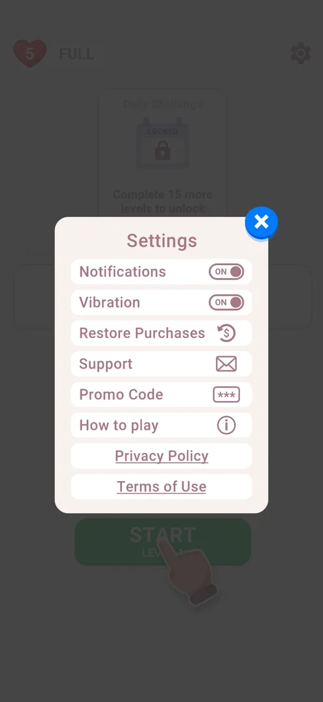
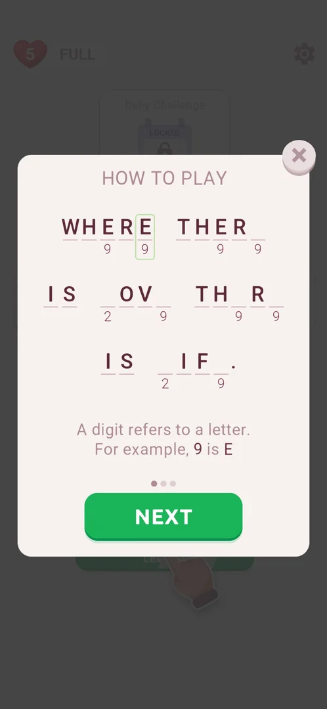
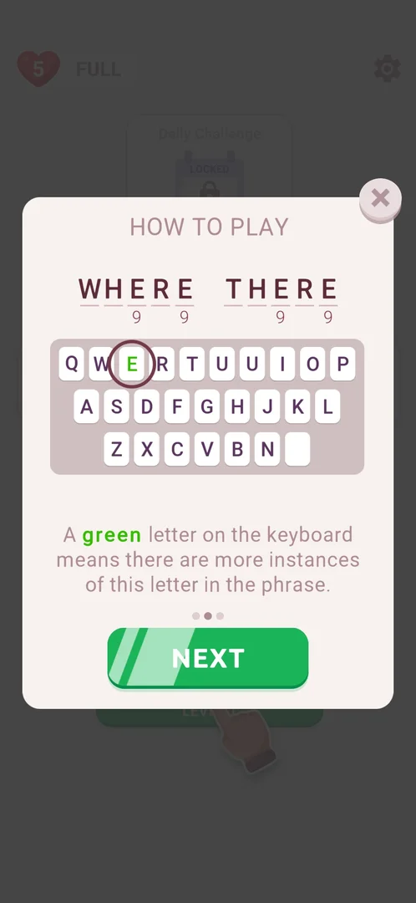
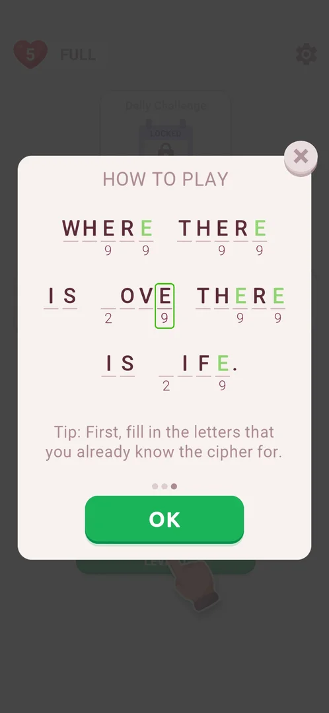

# How to play

The game's rules in a three-page popup, opened from Settings. Each page shows a sample cryptogram and one line of text; NEXT turns the page; OK on the last page, or the X on any page, closes it [^s2] [^s5] [^s6].

## Why it appeared

The How to play row is in Settings from the first launch [^s1].

## Where to find it

Home screen > the gear at the top right > Settings > How to play, the sixth row, with an "i" icon [^s1].

 [^s1]
*Settings: the How to play row, sixth from the top, with an "i" icon*

## What it looks like

 [^s2]
*How to play, page 1 of 3: a sample phrase, the rule line, the page dots and NEXT; the close X at the top right*

A popup over the home screen: the title HOW TO PLAY, a sample phrase drawn as letter slots (some filled, some empty, a digit under the coded ones), one line of text, three dots for the page, a green button (NEXT on pages 1 and 2, OK on page 3) and a close X at the top right [^s2].

## What you can do

| Tab or button | What it does |
|---|---|
| [Page 1](#page-1) | The cipher rule; NEXT to page 2 |
| [Page 2](#page-2) | The keyboard hint; NEXT to page 3 |
| [Page 3](#page-3) | The solving tip; OK closes How to play |

### Page 1

The sample phrase with two empty slots coded 9 highlighted; the text says that a digit stands for a letter, with the example that 9 is E [^s2].

 [^s2]
*Page 1: a digit stands for a letter (9 is E)*

### Page 2

Two words of the sample above a QWERTY keyboard, with the E key green and circled; the text says that a green letter on the keyboard means there are more instances of that letter in the phrase [^s3].

 [^s3]
*Page 2: a green key means the letter occurs again in the phrase*

### Page 3

The sample phrase with every slot coded 9 filled with a green E; the text advises filling in first the letters whose cipher is already known. The button is OK [^s4].

 [^s4]
*Page 3: the tip to fill known letters first; OK closes*

## How it works

- 3 pages, turned by NEXT; OK on page 3 closes How to play and Settings together, back to the home screen (3.6.1) [^s5].
- The close X at the top right closes How to play and Settings together from any page, back to the home screen (tried on page 3) [^s6].
- The same rules are taught again by tutorial cards inside level 1 (with 19 as E instead of 9) [^s7]; see [Cryptogram level](cryptogram-level.md).
- It opened the same way again in a second session, from Settings > How to play [^s8].

## Cases

| Case | What was done | Result | Source |
|---|---|---|---|
| Where to find it <!-- case:chk-entry --> | Settings (gear at the top right of home) > How to play; NEXT, NEXT, OK | 3 pages; OK returns to home and closes Settings too | [^s5] |
| Why it appeared <!-- case:chk-appeared --> | Opened Settings on a fresh install | The How to play row is there | [^s1] |
| What it looks like <!-- case:chk-screen --> | Opened How to play | HOW TO PLAY popup over home: a sample coded phrase, one rule line, 3 page dots, NEXT, X | [^s2] |
| Each step and what it teaches <!-- case:chk-steps --> | Read the three pages | Page 1: a digit is a letter (9 is E); page 2: a green key means more of that letter remain; page 3: fill known letters first | [^s4] |
| Skip, and leaving the app in the middle <!-- case:chk-skip --> | Tapped X on page 3 | How to play and Settings close at once, back to home | [^s6] |
| Where it ends and what opens after <!-- case:chk-end --> | Tapped OK on page 3 | How to play and Settings close, back to home | [^s5] |
| Seen again <!-- case:chk-replay --> | Opened it again from Settings in a later session | It can be opened at any time from Settings > How to play | [^s8] |

## Not verified

- Leaving the app on a page of How to play was not tried <!-- case:chk-skip -->
- Whether the sample phrases on the pages are animated was not checked <!-- case:chk-steps -->

[^s1]: session 20261003-201504-chrono-2FYKPJ, step 2 — [video at 1:15](https://youtu.be/D5rsIC9WNT8?t=75)
[^s2]: session 20261003-201504-chrono-2FYKPJ, step 3 — [video at 1:26](https://youtu.be/D5rsIC9WNT8?t=86)
[^s3]: session 20261003-201504-chrono-2FYKPJ, step 4 — [video at 1:37](https://youtu.be/D5rsIC9WNT8?t=97)
[^s4]: session 20261003-201504-chrono-2FYKPJ, step 5 — [video at 1:46](https://youtu.be/D5rsIC9WNT8?t=106)
[^s5]: session 20261003-201504-chrono-2FYKPJ, step 6 — [video at 1:55](https://youtu.be/D5rsIC9WNT8?t=115)
[^s6]: session 20261003-234451-chrono-2FYKPJ, step 7 — [video at 1:48](https://youtu.be/WwMBaKGzEUU?t=108)
[^s7]: session 20261003-234451-chrono-2FYKPJ, step 8 — [video at 2:06](https://youtu.be/WwMBaKGzEUU?t=126)
[^s8]: session 20261003-234451-chrono-2FYKPJ, step 4 — [video at 1:02](https://youtu.be/WwMBaKGzEUU?t=62)
