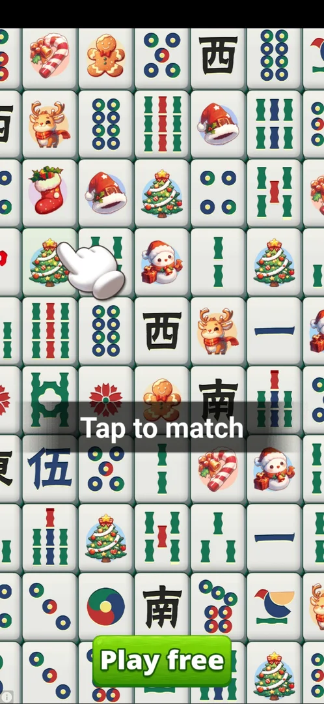

# Interstitial ads

Full-screen ads for other games that the game shows on its own, without the player asking: when a
level starts, after a level is won and sometimes in the middle of a level [^s2] [^s10]
[^s11]. They usually start as a video of about 35 s and then turn
into a playable demo of the advertised game [^s8]. Some of them can be
left with the skip icon and the Play Store sheet it opens; others have no working close control at
all, and only restarting the game gets out [^s9] [^s12]. On level 16 every tap on CONTINUE LEVEL
brought such an ad, 9 times out of 9 in two sessions [^s42] [^s40]. Level 16 could
still be reached: the skip icon tapped while the ad was still running, before it opened the Play Store
by itself, then Back, loaded the level 16 board in three sessions [^s19]
[^s20] [^s43]. Unlike the REVIVE and CLAIM ×3
buttons (rewarded ads), they give nothing.

> ⚠️ Previously (v3.6.1, 2026-10-01): "In one session every tap on CONTINUE LEVEL 16 (4 of 4) brought
> such an ad, so no level could be played at all." True for that session only; the skip-early route
> above reached the board in other sessions.

## Where to find it

<!-- no-entry: an interstitial has no button of its own; it is shown when the player taps a button that starts or ends a level. The frames show the buttons after which it appeared. -->

The most common moment is the tap on PLAY on the Quote Race screen (or CONTINUE LEVEL / START LEVEL on
the main screen): the ad plays before the level opens [^s2] [^s13]
[^s14]. On level 16 it came on every CONTINUE LEVEL tap: 5 of 5 in one session and 4 of 4 in the next,
each try right after a restart [^s44] [^s42] [^s31] [^s33] [^s39] [^s40].

 [^s1]

It also appeared after:

- CLAIM 5 (keys, the button without a video) on a level's win screen [^s11];
- NEXT on the Daily Challenge win screen [^s7];
- PLAY on the Secret Level offer, both times it was tapped [^s15];
- typing letters in the middle of level 9, about 330 s after the previous ad [^s10].

Opening the Daily Challenge calendar from the main screen showed no interstitial, only the banner ad
at the bottom [^s38] [^s40].

 [^s16]

## What it looks like

A full-screen video of another game (here Royal Match). At the top: a "Skip to playable" pill, a strip
with the advertised app's icon and name, Install and a collapse arrow, then sound and pause buttons
[^s2]. Advertisers seen: Royal Match, a Sudoku game (Oakever), Zoodoku, a word game, a crossword and a
Bus Jam parking game, a "Queens"-style animal logic puzzle, a word-search game and Free Mahjong
[^s2] [^s7] [^s13] [^s17] [^s18] [^s4] [^s32] [^s34] [^s40].

 [^s2]

## What you can do

| Tab or button | What it does |
|---|---|
| [Skip to playable](#skip-to-playable) | Ends the video; the ad becomes a playable demo with a small skip icon top left |
| [Skip icon](#skip-icon) | Opens a Google Play overlay or sheet for the advertised game |
| [Playable with no close](#playable-with-no-close) | Some playables have no control that closes them; only a game restart leaves |
| [Play Store sheet](#play-store-sheet) | Its X or Back returns to the game with the ad gone |
| [End card](#end-card) | Back or the X top left closes it |
| [Next pill](#next-pill) | On some playables it does nothing |
| [End card with no close](#end-card-with-no-close) | After Back from the Play Store, some ads stay on an end card that nothing closes |

### Skip to playable

The pill is shown during the video. After the video (about 35 s), the ad switched to a playable demo by
itself: a Royal Match level with "No Ads and Free DOWNLOAD", and the pill shrank to a skip icon at the
top left [^s2] [^s8].

 [^s2]

### Skip icon

Tapping the skip icon of the playable did not close the ad: it opened a Google Play overlay for the
advertised game [^s3]. Back from there returned to the level with the ad gone (the screen first stayed
frozen for a few seconds) [^s9]. The overlay (the app's icon, name, Install and Close at the top left)
has no frame here: it is another app [^s3]. The same route worked in later sessions [^s8]
[^s19] [^s20].

On level 16 this is the only route that reached the board: tap the skip icon (top left) while the ad
still runs, before the ad opens the store by itself, then Back once; if the game screen stays blank,
bring the game back (launch) and the board appears [^s45]
[^s46] [^s43]. It worked with a Royal Match
playable [^s47] [^s20], a word-game playable [^s48]
[^s19] and a Gossip Harbor video [^s45]. Waiting instead (45 s or more)
let the ad open the store first, and then the end card with no close followed
[^s49] [^s50].

<!-- no-frame: other app (Google Play) -->

### Playable with no close

A Bus Jam playable took over level 9 in the middle of typing. It had no close control: Back (several
times), the edge swipe, the "Google Play" pill painted in the ad, taps in the corners and the black top
bar, playing the ad itself, and going Home and reopening the game (the ad came back) all failed; the session ended stuck
after about 9 minutes [^s4] [^s21] [^s22].
In later sessions the same kind of playable (Bus Jam, Sudoku, Zoodoku, a word game, a crossword) was
left by restarting the game (closing it fully and starting it again) [^s23]
[^s18] [^s24].

 [^s4]

### Play Store sheet

Some ads open a Google Play sheet for the advertised game (from the skip icon, or by themselves after
the video). The sheet shows the app with an Install button and an X at the top right; the X closed it and returned
to the game [^s5] [^s8]. The player never tapped Install. The sheet has no frame here: it is another app.

When the ad opened the store as a full listing, bringing the game back (launch) or restarting it left
the store in front [^s51] [^s52]
[^s53] [^s54]; Back from the listing was what
returned (to the game's end card, or to the phone's home screen) [^s55]
[^s56].

<!-- no-frame: other app (Google Play) -->

### End card

At the end, some ads show an end card: the app's icon, its name and Install. Back closed it and went to
the main screen [^s11]; another time the X at the top left closed it and
the level started [^s25].

 [^s6]

### Next pill

Some playables (a Sudoku game, a word game, Zoodoku) show a "Next" pill instead of the skip icon. Next
and Back did nothing for 60–70 s, and the word game looped between Next and Back; a restart was the way
out [^s7] [^s12] [^s17]
[^s26].

In version 3.6.1 the Next pill of a Free Mahjong ad, tapped a few seconds after it appeared, did not
end the ad: the pill disappeared, the ad kept running and about 30 s later opened the Play Store
listing by itself [^s34]. A Math Crossword ad did the same: Next tapped early, the store opened about
50 s later [^s57]. On a Zoodoku playable, Next, the skip icon next to it,
Back and a 30 s wait changed nothing; only a restart left it [^s26] [^s58].

> ⚠️ Previously (v3.6.1, 2026-10-01): "the Next pill … tapped a few seconds after it appeared, did
> nothing either". The tap did hide the pill; the ad itself went on.

 [^s7]

### End card with no close

On level 16 each ad ran for about 67–120 s and then opened the advertised game's Play Store listing
on its own [^s59] [^s60] [^s33] [^s39]. Back from the store returned not to the game but to the ad's end card: a playable scene
(for Free Mahjong, a "Tap to match" hint and a Play free button) with no close control. Back on it did
nothing, waiting 25 s changed nothing [^s41], and only restarting the game left it [^s35] [^s36]
[^s37] [^s40]. The same happened on all four tries, also with a word-search ad [^s39], and on all
five tries of the session before, with a Math Crossword and other ads: Back from the store, then an
end card with no close, 3 times out of 3 [^s61]
[^s62] [^s63]. The end card was avoided only
by the skip icon tapped early (see [Skip icon](#skip-icon)).

> ⚠️ Previously (v3.6.1, 2026-10-01): "each ad ran for about 50–55 s". Timed from the CONTINUE tap to the
> store opening, the ads took 67–120 s.

 [^s35]

## How it works

Version 3.6.1.

- When: on starting a level (PLAY on the race screen, CONTINUE LEVEL), after CLAIM on a win screen,
  after NEXT on the Daily Challenge win screen, on Secret Level PLAY, and once in the middle of a level
  [^s2] [^s11] [^s7]
  [^s15] [^s10].
- No cooldown across restarts: CONTINUE LEVEL 16 right after a restart (that had ended an ad) showed
  another interstitial at once [^s14]. In a later session CONTINUE LEVEL 16 showed one on 4 taps out of
  4, about 2.6–3.3 min apart, each right after a restart [^s40].
- Length: the ads on level 16 ran about 67–120 s from the CONTINUE tap before opening the Play Store
  by themselves (8 ads: about 92, 69, 67 and 74 s in one session, about 73–120 s in the session before)
  [^s32] [^s33] [^s39] [^s64] [^s60].
  ⚠️ Previously (v3.6.1, 2026-10-01): "about 50–55 s … the first one was noted as about 100 s".
- Gap: CONTINUE taps 2.7–3.1 min apart each brought a new ad, so there is no cooldown of that length
  [^s33] [^s39].
- Not on every entry: opening the Daily Challenge calendar showed none [^s38].
- Progress after a restart: level 9, interrupted by the ad, resumed with the letters of the quote's first
  words in place; the letters typed later were empty again. No life was lost, mistakes stayed 0/3
  [^s27]. A Daily Challenge already won before the ad stayed counted
  (progress 1/31) [^s12].
- Removing ads: the Shop sells "Remove ads" for RSD 649, which keeps the optional rewarded ads
  [^s28]. The No ADS button on the main screen and the ADS toggle in
  Settings both open the Google Play payment sheet directly [^s29]
  [^s30].

## Cases

| Case | What was done | Result | Source |
|---|---|---|---|
| Ad on PLAY | Tapped PLAY on the race screen | Video ad with a "Skip to playable" pill, then a playable | [^s2] |
| Skip a video ad | Tapped the skip icon at the top left | A Play Store overlay opened; Back returned to the game with the ad gone | [^s3] [^s9] |
| Ad in the middle of a level | Typed letters on level 9 | A Bus Jam playable ad took over about 330 s after the previous ad | [^s10] |
| Close the playable | Back (twice), edge swipe, the "Google Play" pill, corners, Home and reopening the game, playing the ad | Nothing closed it in about 9 minutes; the session ended stuck | [^s4] [^s22] |
| Close the playable, next session | Skip icon on a Royal Match playable, then X on the Play Store sheet | ✅ Back in the game | [^s8] |
| Playable with no close | Restarting the game | ✅ The game started again on the main screen; the ad was gone | [^s12] |
| Level kept after the ad | Resumed level 9 after the stuck ad | ✅ Letters up to the last save kept, later ones lost; no life lost | [^s27] |
| Ad right after a restart | CONTINUE LEVEL 16 just after a restart | ✅ Another interstitial at once | [^s14] |
| End card | Back on the end card | ✅ Closed, main screen | [^s11] |
| Ad on every level start | CONTINUE LEVEL 16 four times, each after a restart | ✅ An interstitial all 4 times | [^s40] |
| Next pill, early tap | Tapped Next on a Free Mahjong ad a few seconds after it appeared | Nothing; the ad opened the Play Store about 30 s later | [^s34] |
| End card after the store | Back from the Play Store, then Back on the end card | ❌ The end card stayed; only a restart left it | [^s36] [^s37] |
| Daily Challenge entry | Opened the Daily Challenge calendar from the main screen | ✅ No interstitial, only the banner | [^s38] |
| Ad on every level-16 start, next session | CONTINUE LEVEL 16 five times, each after a restart | ✅ An interstitial all 5 times; the store opened after about 73–120 s | [^s44] [^s60] |
| Skip early on level 16 | Skip icon top left before the ad opened the store, Back, launch | ✅ The level 16 board loaded | [^s45] [^s43] |
| Skip on a Royal Match playable on level 16 | Skip icon, then Back on the store sheet | ✅ The level 16 board loaded | [^s47] [^s20] |
| Next pill on a Zoodoku playable | Next, the skip icon next to it, Back, a 30 s wait | ❌ Nothing; a restart left it | [^s65] [^s26] |
| Launch with the store in front | Launch and restart while the ad's store listing was open | ❌ The store stayed in front; Back worked | [^s52] [^s55] |

## Not verified

- What triggers the mid-level ad (time since the last ad?) and the minimum gap between ads.
- Whether every level start shows an interstitial or only some of them: level 16 showed one 9 times
  out of 9; earlier levels were not counted.
- Whether the level-16 ad wall is tied to the level or to time (no try after a 2 h+ gap yet).
- Whether the end card with no close ever closes by itself (the longest wait on it was 25 s), and
  whether any tap on it returns to the level.
- Whether "Remove ads" (RSD 649) removes interstitials as well as banners (not bought).
- Exactly when the game saves the letters of a level (the unsaved tail was lost after the restart).

[^s1]: session 20261001-020937-chrono-2FYKPJ, step 2 — [video at 0:48](https://youtu.be/UqLGP_sLnX8?t=48)
[^s2]: session 20261001-020937-chrono-2FYKPJ, step 3 — [video at 0:57](https://youtu.be/UqLGP_sLnX8?t=57)
[^s3]: session 20261001-020937-chrono-2FYKPJ, step 4 — [video at 2:24](https://youtu.be/UqLGP_sLnX8?t=144)
[^s4]: session 20261001-020937-chrono-2FYKPJ, step 16 — [video at 7:01](https://youtu.be/UqLGP_sLnX8?t=421)
[^s5]: session 20261001-071926-chrono-2FYKPJ, step 20 — [video at 5:46](https://youtu.be/TiPdn57GNJY?t=346)
[^s6]: session 20261001-071926-chrono-2FYKPJ, step 25 — [video at 7:45](https://youtu.be/TiPdn57GNJY?t=465)
[^s7]: session 20261001-071926-chrono-2FYKPJ, step 40 — [video at 15:24](https://youtu.be/TiPdn57GNJY?t=924)
[^s8]: session 20261001-071926-chrono-2FYKPJ, step 21 — [video at 5:57](https://youtu.be/TiPdn57GNJY?t=357)
[^s9]: session 20261001-020937-chrono-2FYKPJ, step 5 — [video at 2:31](https://youtu.be/UqLGP_sLnX8?t=151)
[^s10]: session 20261001-020937-chrono-2FYKPJ, step 15 — [video at 6:22](https://youtu.be/UqLGP_sLnX8?t=382)
[^s11]: session 20261001-071926-chrono-2FYKPJ, step 26 — [video at 9:02](https://youtu.be/TiPdn57GNJY?t=542)
[^s12]: session 20261001-071926-chrono-2FYKPJ, step 41 — [video at 16:14](https://youtu.be/TiPdn57GNJY?t=974)
[^s13]: session 20261001-114433-chrono-2FYKPJ, step 2 — [video at 0:39](https://youtu.be/orHIc1UWwXE?t=39)
[^s14]: session 20261001-114433-chrono-2FYKPJ, step 7 — [video at 2:45](https://youtu.be/orHIc1UWwXE?t=165)
[^s15]: session 20261001-071926-chrono-2FYKPJ, step 48 — [video at 21:03](https://youtu.be/TiPdn57GNJY?t=1263)
[^s16]: session 20261001-071926-chrono-2FYKPJ, step 24 — [video at 7:19](https://youtu.be/TiPdn57GNJY?t=439)
[^s17]: session 20261001-071926-chrono-2FYKPJ, step 46 — [video at 19:20](https://youtu.be/TiPdn57GNJY?t=1160)
[^s18]: session 20261001-071926-chrono-2FYKPJ, step 62 — [video at 30:04](https://youtu.be/TiPdn57GNJY?t=1804)
[^s19]: session 20261001-092740-chrono-2FYKPJ, step 9 — [video at 4:32](https://youtu.be/g7StIT6Li9U?t=272)
[^s20]: session 20261001-114433-chrono-2FYKPJ, step 18 — [video at 8:02](https://youtu.be/orHIc1UWwXE?t=482)
[^s21]: session 20261001-020937-chrono-2FYKPJ, step 31 — [video at 12:29](https://youtu.be/UqLGP_sLnX8?t=749)
[^s22]: session 20261001-020937-chrono-2FYKPJ, step 32 — [video at 13:38](https://youtu.be/UqLGP_sLnX8?t=818)
[^s23]: session 20261001-071926-chrono-2FYKPJ, step 49 — [video at 21:25](https://youtu.be/TiPdn57GNJY?t=1285)
[^s24]: session 20261001-114433-chrono-2FYKPJ, step 6 — [video at 2:23](https://youtu.be/orHIc1UWwXE?t=143)
[^s25]: session 20261001-071926-chrono-2FYKPJ, step 54 — [video at 23:39](https://youtu.be/TiPdn57GNJY?t=1419)
[^s26]: session 20261001-114433-chrono-2FYKPJ, step 10 — [video at 5:34](https://youtu.be/orHIc1UWwXE?t=334)
[^s27]: session 20261001-050941-chrono-2FYKPJ, step 50 — [video at 12:34](https://youtu.be/0QFSEGBnZG8?t=754)
[^s28]: session 20261001-071926-chrono-2FYKPJ, step 4 — [video at 1:12](https://youtu.be/TiPdn57GNJY?t=72)
[^s29]: session 20261001-071926-chrono-2FYKPJ, step 27 — [video at 9:18](https://youtu.be/TiPdn57GNJY?t=558)
[^s30]: session 20261001-071926-chrono-2FYKPJ, step 51 — [video at 22:08](https://youtu.be/TiPdn57GNJY?t=1328)
[^s31]: session 20261001-224924-chrono-2FYKPJ, step 1 — [video at 0:34](https://youtu.be/RSACUWOF_ak?t=34)
[^s32]: session 20261001-224924-chrono-2FYKPJ, step 2 — [video at 2:17](https://youtu.be/RSACUWOF_ak?t=137)
[^s33]: session 20261001-224924-chrono-2FYKPJ, step 4 — [video at 3:16](https://youtu.be/RSACUWOF_ak?t=196)
[^s34]: session 20261001-224924-chrono-2FYKPJ, step 10 — [video at 6:40](https://youtu.be/RSACUWOF_ak?t=400)
[^s35]: session 20261001-224924-chrono-2FYKPJ, step 11 — [video at 7:34](https://youtu.be/RSACUWOF_ak?t=454)
[^s36]: session 20261001-224924-chrono-2FYKPJ, step 12 — [video at 7:53](https://youtu.be/RSACUWOF_ak?t=473)
[^s37]: session 20261001-224924-chrono-2FYKPJ, step 13 — [video at 8:17](https://youtu.be/RSACUWOF_ak?t=497)
[^s38]: session 20261001-224924-chrono-2FYKPJ, step 14 — [video at 8:31](https://youtu.be/RSACUWOF_ak?t=511)
[^s39]: session 20261001-224924-chrono-2FYKPJ, step 16 — [video at 8:59](https://youtu.be/RSACUWOF_ak?t=539)
[^s40]: session 20261001-224924-chrono-2FYKPJ, step 17 — [video at 10:18](https://youtu.be/RSACUWOF_ak?t=618)
[^s41]: session 20261001-224924-chrono-2FYKPJ, step 7 — [video at 5:07](https://youtu.be/RSACUWOF_ak?t=307)

[^s42]: session 20261001-190315-chrono-2FYKPJ, step 25 — [video at 15:53](https://youtu.be/UgPM48lteCw?t=953)
[^s43]: session 20261001-192245-chrono-2FYKPJ, step 17 — [video at 7:58](https://youtu.be/bp2LGsK-mEE?t=478)
[^s44]: session 20261001-190315-chrono-2FYKPJ, step 2 — [video at 0:51](https://youtu.be/UgPM48lteCw?t=51)
[^s45]: session 20261001-192245-chrono-2FYKPJ, step 15 — [video at 7:40](https://youtu.be/bp2LGsK-mEE?t=460)
[^s46]: session 20261001-192245-chrono-2FYKPJ, step 16 — [video at 7:48](https://youtu.be/bp2LGsK-mEE?t=468)
[^s47]: session 20261001-114433-chrono-2FYKPJ, step 17 — [video at 7:55](https://youtu.be/orHIc1UWwXE?t=475)
[^s48]: session 20261001-092740-chrono-2FYKPJ, step 8 — [video at 4:25](https://youtu.be/g7StIT6Li9U?t=265)
[^s49]: session 20261001-192245-chrono-2FYKPJ, step 10 — [video at 4:00](https://youtu.be/bp2LGsK-mEE?t=240)
[^s50]: session 20261001-192245-chrono-2FYKPJ, step 13 — [video at 6:30](https://youtu.be/bp2LGsK-mEE?t=390)
[^s51]: session 20261001-192245-chrono-2FYKPJ, step 2 — [video at 1:46](https://youtu.be/bp2LGsK-mEE?t=106)
[^s52]: session 20261001-192245-chrono-2FYKPJ, step 3 — [video at 2:02](https://youtu.be/bp2LGsK-mEE?t=122)
[^s53]: session 20261001-190315-chrono-2FYKPJ, step 9 — [video at 6:23](https://youtu.be/UgPM48lteCw?t=383)
[^s54]: session 20261001-190315-chrono-2FYKPJ, step 10 — [video at 6:45](https://youtu.be/UgPM48lteCw?t=405)
[^s55]: session 20261001-192245-chrono-2FYKPJ, step 8 — [video at 3:18](https://youtu.be/bp2LGsK-mEE?t=198)
[^s56]: session 20261001-190315-chrono-2FYKPJ, step 12 — [video at 7:49](https://youtu.be/UgPM48lteCw?t=469)
[^s57]: session 20261001-190315-chrono-2FYKPJ, step 26 — [video at 16:10](https://youtu.be/UgPM48lteCw?t=970)
[^s58]: session 20261001-114433-chrono-2FYKPJ, step 9 — [video at 5:04](https://youtu.be/orHIc1UWwXE?t=304)
[^s59]: session 20261001-190315-chrono-2FYKPJ, step 5 — [video at 3:22](https://youtu.be/UgPM48lteCw?t=202)
[^s60]: session 20261001-190315-chrono-2FYKPJ, step 20 — [video at 12:35](https://youtu.be/UgPM48lteCw?t=755)
[^s61]: session 20261001-190315-chrono-2FYKPJ, step 16 — [video at 10:56](https://youtu.be/UgPM48lteCw?t=656)
[^s62]: session 20261001-190315-chrono-2FYKPJ, step 22 — [video at 14:45](https://youtu.be/UgPM48lteCw?t=885)
[^s63]: session 20261001-190315-chrono-2FYKPJ, step 28 — [video at 17:23](https://youtu.be/UgPM48lteCw?t=1043)
[^s64]: session 20261001-190315-chrono-2FYKPJ, step 14 — [video at 8:42](https://youtu.be/UgPM48lteCw?t=522)
[^s65]: session 20261001-114433-chrono-2FYKPJ, step 4 — [video at 1:56](https://youtu.be/orHIc1UWwXE?t=116)
