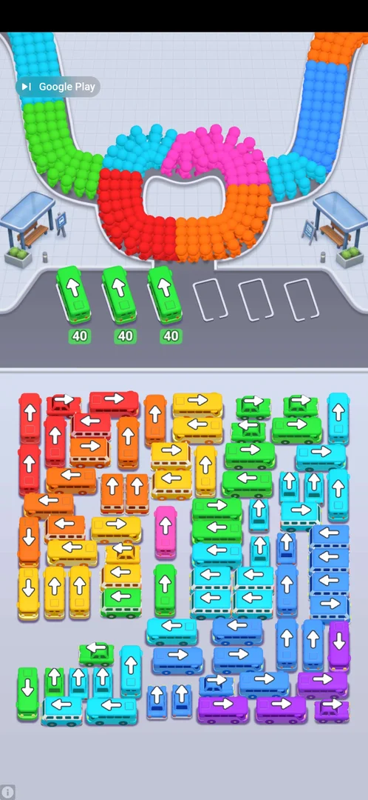

# Interstitial ads

Full-screen ads appear when a level starts and also in the middle of a level.

## Cases

| Case | What was done | Result | Source |
|---|---|---|---|
| Ad on PLAY | Tapped PLAY on the race screen | Video ad with a "Skip to playable" pill, then a playable | [s:20261001-020937-chrono-2FYKPJ#3] |
| Skip a video ad | Tapped the skip icon at the top left | A Play Store overlay opened; Back returned to the game with the ad gone | [s:20261001-020937-chrono-2FYKPJ#4] [s:20261001-020937-chrono-2FYKPJ#5] |
| Ad in the middle of a level | Typed letters on level 9 | A Bus Jam playable ad took over about 330 s after the previous ad | [s:20261001-020937-chrono-2FYKPJ#15] |
| Close the playable | Back (twice), edge swipe, the "Google Play" pill, corners, home + launch, playing the ad | Nothing closed it in about 9 minutes; the session ended stuck | [s:20261001-020937-chrono-2FYKPJ#16] [s:20261001-020937-chrono-2FYKPJ#32] |

## Not verified

- What triggers the mid-level ad (time since the last ad?) and the minimum gap between ads.
- Whether `sw.py restart` (force-stop + start, added to the harness after this session) leaves the
  playable and whether level progress survives.
- Whether the level that the ad interrupted was kept.
