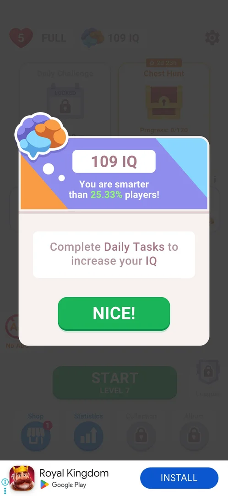
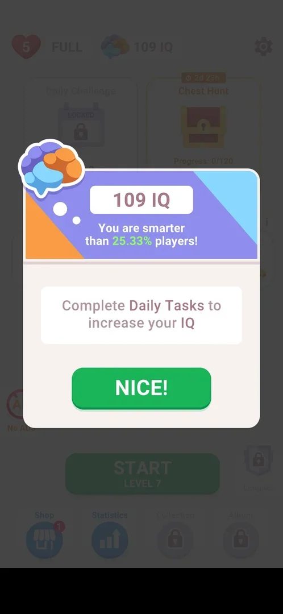

# IQ score

A score shown as "IQ" with a brain icon in the home screen's top bar. It starts at 100 when it appears, rises only with finished [Daily Tasks](daily-tasks.md), and a popup compares it with other players ("You are smarter than 25.33% players!" at 109) [^s2] [^s3] [^s5].

## Why it appeared

The IQ counter appeared in the home top bar, right of the lives, after the third level was won, together with the open Daily Tasks list [^s2].

## Where to find it

Home screen > the top bar, right of the lives counter: a brain icon and "100 IQ" [^s2]. A tap on the counter opens the IQ popup [^s4], and so does the "i" at the right end of the Daily Tasks title [^s3].

 [^s2]
*The IQ counter (100 IQ) right of the lives in the home top bar*

## What it looks like

A popup over the dimmed home screen: a brain icon in a thought bubble, the score on a white plate, "You are smarter than N% players!" on a purple banner, a box with "Complete Daily Tasks to increase your IQ", and a green NICE! button that closes it [^s3].

 [^s3]
*The IQ popup at 109 IQ: the score, a percentile line, how to raise it, NICE!*

## What you can do

| Tab or button | What it does |
|---|---|
| [IQ counter](#iq-counter) | Opens the IQ popup; its NICE! button closes it |

### IQ counter

A tap on the counter in the top bar opens the same popup as the Daily Tasks "i" (109 IQ, 25.33%) [^s4].

 [^s4]
*The counter opens the same IQ popup (the banner ad at the bottom is blacked out)*

## How it works

All in 3.6.1:

- Starting value: 100 IQ, after 3 levels won [^s2].
- Raised by Daily Tasks only; the popup says so, and the counter changed only when a task was done: 100 (levels 1-3) → 107 after levels 4-5 → 109 after level 6 → 115 after level 7 → 118 after level 8 [^s7] [^s3] [^s6] [^s5].
- Inferred from these numbers: a task gives as many IQ as the brain icons on its tile, 1, 2 and 3 in the day's three batches, 18 a day.
- The popup ranks the score: 100 IQ was "smarter than 20% players", 109 IQ "smarter than 25.33% players" [^s1] [^s3].
- IQ was never spent: no price in IQ was seen through level 8 [^s5].

## Cases

| Case | What was done | Result | Source |
|---|---|---|---|
| Why it appeared <!-- case:chk-appeared --> | Won level 3, NEXT | 100 IQ in the home top bar | [^s1] |
| Where to find it <!-- case:chk-entry --> | Looked at home; tapped the Daily Tasks "i" | The counter right of the lives; the "i" opens the IQ popup | [^s1] |
| What it looks like <!-- case:chk-screen --> | Opened the popup, then NICE! | "100 IQ", "You are smarter than 20% players!", "Complete Daily Tasks to increase your IQ", NICE! closes it | [^s1] |
| The progress <!-- case:chk-progress --> | Won levels 4-8, read the counter and the popup | 100 → 107 → 109 → 115 → 118; 109 IQ = smarter than 25.33% players | [^s5] |
| How it is earned <!-- case:chk-earn --> | Finished Daily Tasks | Every finished task raises it, by 1, 2 or 3 (inferred: its brain icons) | [^s6] |
| The items <!-- case:chk-items --> | — | Does not apply: one score, no sets, skins or tiers | [^s3] |
| Using it <!-- case:chk-use --> | — | Does not apply so far: never spent, no sink seen through level 8 | [^s5] |
| Completing it <!-- case:chk-complete --> | — | Does not apply: no bar or set; the score only rises, no reward for a threshold seen | [^s5] |

## Not verified

- Whether IQ has a cap, or a reward or title at some score.
- Whether anything besides Daily Tasks raises it later.

[^s1]: session 20261005-221933-chrono-2FYKPJ, step 33 — [video at 11:35](https://youtu.be/I7zPQ2z7rvA?t=695)
[^s2]: session 20261005-221933-chrono-2FYKPJ, step 32 — [video at 11:04](https://youtu.be/I7zPQ2z7rvA?t=664)
[^s3]: session 20261006-003220-chrono-2FYKPJ, step 37 — [video at 12:01](https://youtu.be/W0PeVNo113E?t=721)
[^s4]: session 20261006-003220-chrono-2FYKPJ, step 39 — [video at 12:16](https://youtu.be/W0PeVNo113E?t=736)
[^s5]: session 20261006-003220-chrono-2FYKPJ, step 72 — [video at 23:31](https://youtu.be/W0PeVNo113E?t=1411)
[^s6]: session 20261006-003220-chrono-2FYKPJ, step 60 — [video at 19:37](https://youtu.be/W0PeVNo113E?t=1177)

[^s7]: session 20261006-003220-chrono-2FYKPJ, step 22 — [video at 6:45](https://youtu.be/W0PeVNo113E?t=405)
