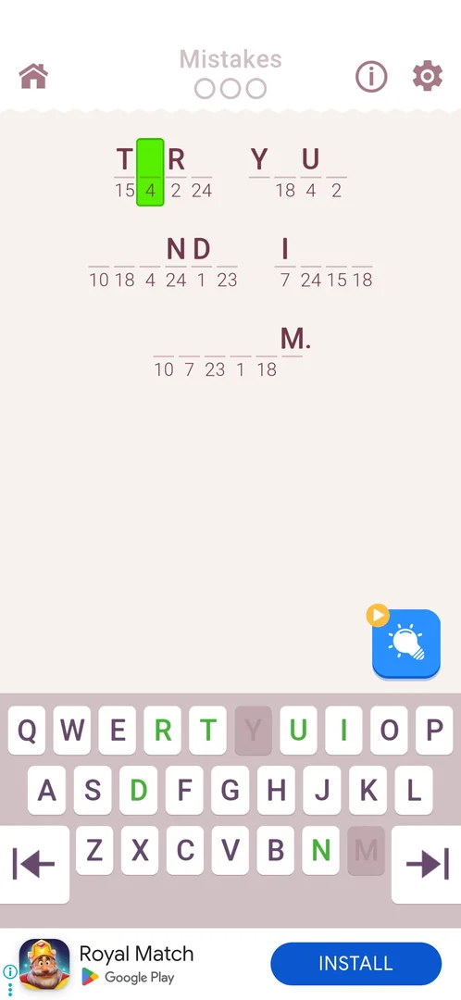
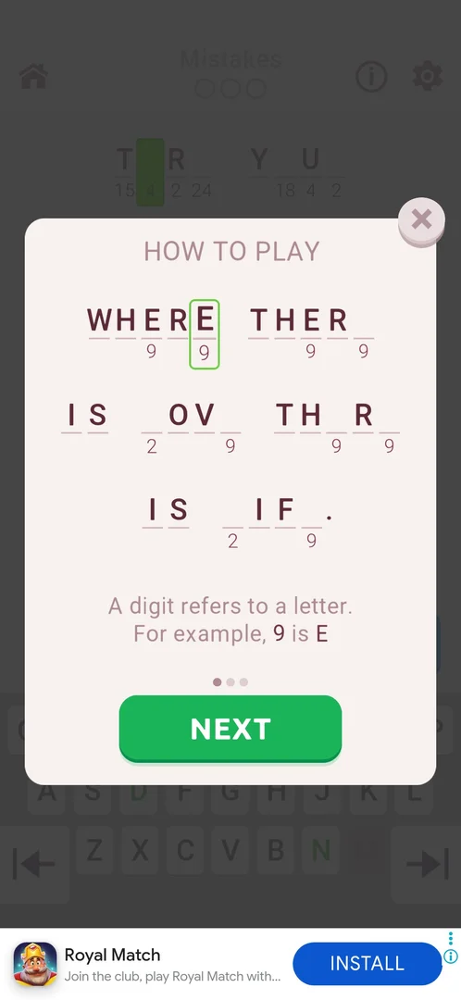
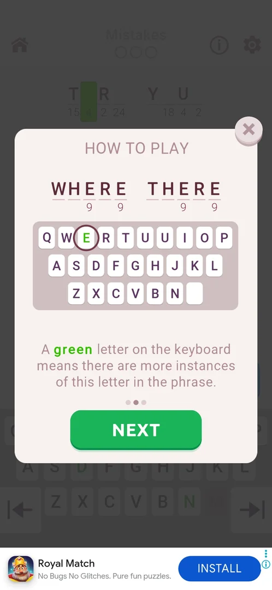
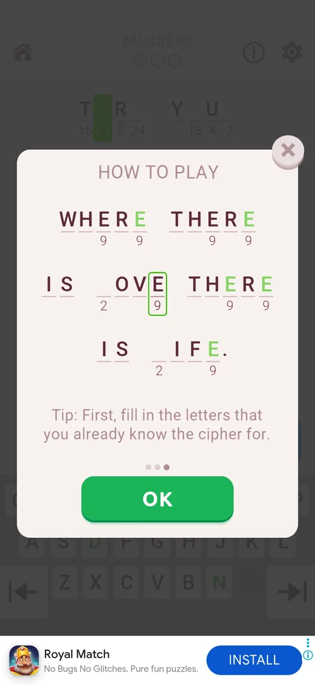

# Level info button (i)

A round (i) button in the level's top bar. It opens the game's rules, the three-page HOW TO PLAY popup, over the level. You close it to go back to the same board [^s3] [^s7]. In 3.6.1 the popup shows the same three pages as [How to play](how-to-play.md) opened from Settings: the same sample phrase and the same rule lines [^s3] [^s4] [^s5].

## Why it appeared

The button is in the level's top bar from level 1, at the top right next to the gear [^s1]. It is a button the player taps and never opens by itself [^s6].

## Where to find it

Level screen > the (i) button at the top right of the top bar, left of the gear. The bar has the home icon at the left, the Mistakes counter in the middle, and the (i) and the gear at the right [^s2].

 [^s2]
*Level 2: the info (i) button at the top right, left of the gear*

## What it looks like

A white popup over the dimmed level, with the title HOW TO PLAY and a round X button on its top right corner. Each page has a sample phrase of letter slots with digits under some of them, one line of rules text, three page dots and a green button: NEXT on pages 1 and 2, OK on page 3. Page 1 shows a phrase of 7 words with some letters missing. The digit 9 sits under every E slot, and one E slot is framed in green. The text says that a digit refers to a letter, with the example that 9 is E [^s3]. The banner ad at the bottom stays visible under the popup [^s3].

 [^s3]
*Page 1 of 3: a digit refers to a letter (9 is E); NEXT; the X closes*

## What you can do

| Tab or button | What it does |
|---|---|
| [Page 2](#page-2) | NEXT on page 1 opens it: the green keyboard letter rule |
| [Page 3](#page-3) | NEXT on page 2 opens it: a solving tip; OK ends the popup |
| [X](#x) | Closes the popup on any page and returns to the board as it was |

### Page 2

The first two words of the sample phrase, with a small copy of the keyboard. The E key is green and circled. The text says that a green letter on the keyboard means the phrase has more of that letter left to fill. The second dot is active and the button is NEXT [^s4].

 [^s4]
*Page 2 of 3: a green key means more of that letter remains*

### Page 3

The whole sample phrase again, with every E now filled in green and one E slot framed. The text is a tip: fill in first the letters whose cipher you already know. The third dot is active and the button reads OK [^s5].

 [^s5]
*Page 3 of 3: the tip and OK*

### X

The round X button on the popup's top right corner, on all three pages. Tapped on page 3, it closed the popup and gave back the level as it was: the same cell selected, the Mistakes counter still empty [^s7].

<!-- no-frame: the X is in the page frames above; the frame after closing is the same board as under Where to find it -->

## How it works

All in 3.6.1:

- The button is there from level 1 [^s1].
- The popup has three pages in a fixed order. NEXT moves one page forward. No control to go back was seen [^s3] [^s4] [^s5].
- The X closed the popup from page 3 and gave back the same board: the same cell selected, the Mistakes counter still empty [^s7].
- No toggles, no links and no other controls on any of the three pages [^s7].
- OK on page 3 was not tapped in the level, so this session did not see whether it closes the popup the same way as the X. From Settings, OK also closes Settings ([How to play](how-to-play.md)).

## Cases

| Case | What was done | Result | Source |
|---|---|---|---|
| Where to find it <!-- case:chk-entry --> | Looked at the level's top bar | The (i) icon at the top right, left of the gear, from level 1 | [^s6] |
| A prompt or a button <!-- case:chk-answers --> | Played levels 1 and 2 | Never opened by itself; a button the player taps | [^s6] |
| Why it appeared <!-- case:chk-appeared --> | Started level 1 | The (i) is in the top bar from the first level | [^s1] |
| What it looks like <!-- case:chk-screen --> | Tapped (i) on level 2, NEXT twice | HOW TO PLAY popup, 3 pages: a digit is a letter, green keys, the tip | [^s7] |
| Its controls <!-- case:chk-options --> | NEXT on pages 1 and 2, then the X on page 3 | NEXT turns the page, OK ends on page 3, X closes on any page; no toggles; X gave back the board | [^s7] |
| Links <!-- case:chk-links --> | Looked through all 3 pages | No links | [^s7] |

## Not verified

- OK on page 3 opened from the level: whether it closes only the popup, as the X does (not tapped in this session).

[^s1]: session 20261003-234451-chrono-2FYKPJ, step 8 — [video at 2:05](https://youtu.be/WwMBaKGzEUU?t=125)
[^s2]: session 20261005-123057-chrono-2FYKPJ, step 1 — [video at 0:41](https://youtu.be/dEccP_OkBQk?t=41)
[^s3]: session 20261005-123057-chrono-2FYKPJ, step 2 — [video at 1:03](https://youtu.be/dEccP_OkBQk?t=63)
[^s4]: session 20261005-123057-chrono-2FYKPJ, step 3 — [video at 1:12](https://youtu.be/dEccP_OkBQk?t=72)
[^s5]: session 20261005-123057-chrono-2FYKPJ, step 4 — [video at 1:21](https://youtu.be/dEccP_OkBQk?t=81)
[^s6]: session 20261003-234451-chrono-2FYKPJ, step 18 — [video at 4:19](https://youtu.be/WwMBaKGzEUU?t=259)
[^s7]: session 20261005-123057-chrono-2FYKPJ, step 5 — [video at 1:29](https://youtu.be/dEccP_OkBQk?t=89)
