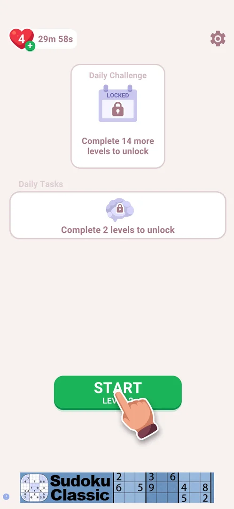

# Lives (hearts)

The player's lives, shown as a heart with a number at the top left of the home screen. A fresh install of 3.6.1 starts with 5 lives, marked FULL [^s1]. Each level lost by three mistakes costs one life [^s4] [^s8]. Below 5 the heart gets a green plus and a timer counts down to the next life, about 30 minutes per life [^s8] [^s9]. Lives have no screen of their own. The heart opens nothing at 5 lives or at 4 [^s2] [^s9].

## Why it appeared

The counter is at the top left of the home screen from the first launch, showing 5 and FULL [^s1].

## Where to find it

Home screen > the lives counter at the top left: a red heart with the number of lives. Next to it is FULL, or a refill timer when lives are missing [^s2] [^s8]. In a level the counter is hidden. It shows only on the loss popup, at the top left in place of the home icon [^s7].

 [^s2]
*The lives counter at the top left of home: a heart with 5 and FULL*

## What it looks like

<!-- no-screen: there is no lives screen: taps on the heart at 5/5 and on the heart and its green plus at 4/5 open nothing -->

With fewer than 5 lives the counter changes. The heart shows the new number (4) with a green plus on its lower right corner, and a countdown replaces FULL. The countdown read 29m 58s right after a loss [^s8]. In an earlier session it read 26m 35s a few minutes after a loss [^s3]. Tapping the heart or the green plus at 4 lives opens nothing [^s9].

 [^s8]
*After a loss: 4 lives, the green plus on the heart and the refill timer at 29m 58s*

### Loss popup

When a level is lost by three mistakes, the loss popup says "You will lose:" over a heart marked -1. The top left of the level, where the home icon was, shows a heart with the current lives (5). The life is taken away when the player leaves the popup: home then showed 4 [^s7] [^s8].

 [^s7]
*The loss popup: the lives heart (5) at the top left and the life to be lost (-1)*

## How it works

All in 3.6.1:

- Starting balance on a fresh install: 5, shown as FULL [^s1].
- A level lost by three mistakes costs one life. The loss popup shows a heart -1, and home then showed 4 [^s4] [^s7] [^s8]. Both Home and Restart on the loss popup cost it [^s3]. Leaving a level by the home icon or by closing the app costs none [^s5] [^s6].
- Refill: one life about every 30 minutes. The timer showed 29m 58s right after the loss, so the period is inferred, not measured to the end [^s8].
- The refill runs while the app is closed: one session ended at 4/5 with the timer at 26m 35s, and the next session's loss popup showed 5 [^s3] [^s7].
- The heart and the green plus open nothing at 4/5, so no refill offer was seen [^s9].
- Inferred from FULL at 5, not verified: 5 is the maximum.

## Cases

| Case | What was done | Result | Source |
|---|---|---|---|
| Tap the counter with full lives <!-- case:tap-full --> | Tapped the lives counter with 5/5 FULL | Nothing opens | [^s2] |
| Why it appeared <!-- case:chk-appeared --> | First launch of a fresh install | The counter shows 5 FULL | [^s1] |
| Where to find it <!-- case:chk-entry --> | Tapped the counter at 5/5 | Home top left: the heart with the count and FULL; nothing opens at 5/5 | [^s2] |
| What it looks like <!-- case:chk-screen --> | Lost a level, went home, tapped the heart and the plus | No lives screen: a heart on home (count, FULL or the timer, a green plus below 5) and on the loss popup | [^s9] |
| What one life does <!-- case:chk-effect --> | Lost level 2 by 3 mistakes, tapped Home | One life is spent per lost level: 5 to 4 | [^s9] |
| The balance <!-- case:chk-balance --> | Watched home and the loss popup | Home top left: the heart with the count; 5 FULL at the start; also on the loss popup | [^s3] |
| Sinks <!-- case:chk-sinks --> | Lost level 2, tried Home, Restart, the home icon and closing the app | One life per lost level (3 mistakes): Home and Restart on the loss popup both cost it; quitting by the home icon or closing the app costs none | [^s3] |
| Refill timer <!-- case:chk-refill --> | Went home right after the loss | The green plus and a countdown at 29m 58s: about 30 min per life; heart and plus taps do nothing at 4 | [^s9] |
| Tap below full <!-- case:tap-below-full --> | Tapped the heart, then the green plus, at 4/5 | Nothing opens | [^s9] |
| Refill while the app is closed <!-- case:regen-offline --> | Ended a session at 4/5 (timer 26m 35s), started the next one later | The next session's loss popup showed 5 lives | [^s7] |
| Sources <!-- case:chk-sources --> | — | not verified |  |
| At zero <!-- case:chk-empty --> | — | not verified |  |

## Not verified

- Sources: the refill timer is the only one seen. The green plus opened nothing at 4 lives. Video, daily or pack sources were not seen <!-- case:chk-sources -->
- At zero: what happens and the offers to refill (task lives-zero-and-sources) <!-- case:chk-empty -->
- The maximum of 5 and the full refill time (only the start of the countdown was seen).

[^s1]: session 20261003-201504-chrono-2FYKPJ, step 1 — [video at 0:12](https://youtu.be/D5rsIC9WNT8?t=12)
[^s2]: session 20261003-201504-chrono-2FYKPJ, step 8 — [video at 2:11](https://youtu.be/D5rsIC9WNT8?t=131)
[^s3]: session 20261005-003245-chrono-2FYKPJ, step 11 — [video at 4:03](https://youtu.be/xwf29tc75Dk?t=243)
[^s4]: session 20261005-003245-chrono-2FYKPJ, step 4 — [video at 1:04](https://youtu.be/xwf29tc75Dk?t=64)
[^s5]: session 20261003-234451-chrono-2FYKPJ, step 19 — [video at 4:32](https://youtu.be/WwMBaKGzEUU?t=272)
[^s6]: session 20261005-003245-chrono-2FYKPJ, step 12 — [video at 4:44](https://youtu.be/xwf29tc75Dk?t=284)
[^s7]: session 20261005-123057-chrono-2FYKPJ, step 8 — [video at 2:08](https://youtu.be/dEccP_OkBQk?t=128)
[^s8]: session 20261005-123057-chrono-2FYKPJ, step 9 — [video at 2:19](https://youtu.be/dEccP_OkBQk?t=139)
[^s9]: session 20261005-123057-chrono-2FYKPJ, step 11 — [video at 2:36](https://youtu.be/dEccP_OkBQk?t=156)
