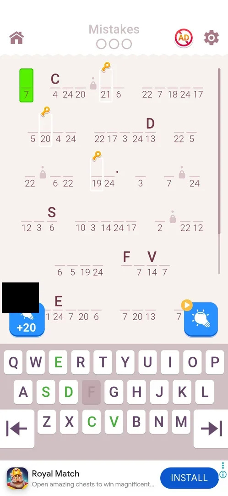
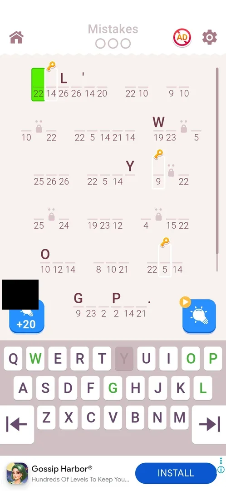
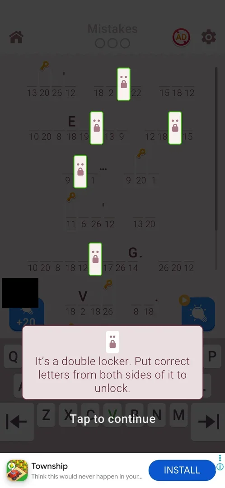
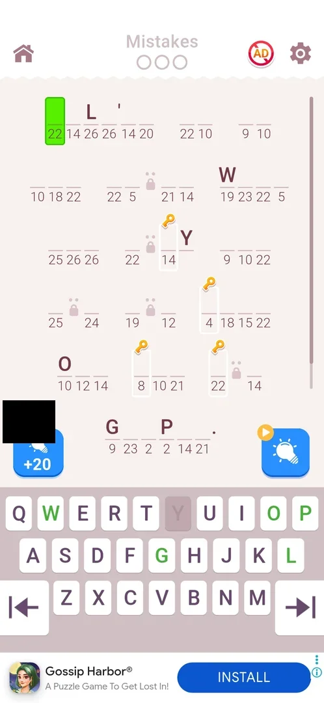

# Lockers (padlocked cells)

A level element of the cryptogram board: some cells of the quote are replaced by a small padlock, with one dot or two dots above it, and the cell's number is not shown. A locker opens when the letters next to it are correct; a double locker (two dots) needs the correct letters on both its sides [^s1]. Lockers are part of the level, not a screen or a button.

## Why it appeared

Padlocks first showed on the level 7 board, the level after the Daily Tasks batch that asked to "Remove lockers on the levels" (0/5) [^s2]. One-dot lockers were on the level 9 board, and the first double lockers came on level 10 with a tooltip [^s3] [^s1]. Inferred: they start at level 7; whether a lower level can carry them was not checked.

## Where to find it

On the level board itself: there is no entry button. On level 9 the padlocks stand in the gaps of four words on the first screen, each with one dot above it, next to the Chest Hunt key cells [^s3].

 [^s3]
*The padlocks in the words of the level 9 board, among the numbered cells*

## What it looks like

A padlock in light grey, the size of a letter cell, sits on the cell's line where a number would be; one dot above it marks a single locker, two dots a double locker. On the level 10 start the board was dimmed, the five double lockers of the first screen were lit in white with a green frame, and a panel at the bottom read "It's a double locker. Put correct letters from both sides of it to unlock." over "Tap to continue"; a tap closed it (see [Double locker tooltip](#double-locker-tooltip)) [^s1] [^s4].

 [^s5]
*Double lockers (two dots) in place of cells on level 11, next to key cells; compare [after a restart](#lockers-after-a-restart)*

## What you can do

| Tab or button | What it does |
|---|---|
| [Double locker tooltip](#double-locker-tooltip) | Explains the double locker; Tap to continue closes it |
| [Lockers after a restart](#lockers-after-a-restart) | The same level restarted puts the lockers on other cells |

A locker itself is not tapped: it opens by typing the correct letters around it.

### Double locker tooltip

 [^s1]
*The double-locker tooltip, shown once on the first level with double lockers*

The tooltip appeared on level 10 before any move; the next frame after the tap shows the normal board [^s4]. It was not seen again on level 11, which also had double lockers [^s5].

### Lockers after a restart

Level 11 started with five double lockers and three key cells on the first screen [^s5]. After three wrong letters and Restart the quote was the same, but the lockers and the keys stood on other cells: for example, the second line's first word had a locker in its middle before and none after [^s6].

 [^s6]
*Level 11 after Restart: the lockers moved*

## How it works

All in 3.6.1:

- A padlock replaces a cell: the cell's number is hidden until the locker opens [^s1].
- Double locker (two dots): the correct letters on both sides open it (the tooltip's text) [^s1]. Single locker (one dot): inferred to need one correct neighbour; the rule was not shown.
- Levels with lockers seen: 7 and 8 (padlocks noted), 9 (one dot), 10 and 11 (two dots) [^s2] [^s3] [^s1] [^s5].
- Lockers and Chest Hunt key cells share a board (levels 9, 10, 11) [^s1].
- Level 9 was won in 4:10 and level 10, with double lockers, in 3:19 [^s7] [^s8].
- Lockers add no way to lose: the only loss on these boards is the third mistake [^s9].
- What a locker looks like while it opens was not captured.

## Outcomes

| Outcome | Under lockers | Source |
|---|---|---|
| Win | As the base: levels 9 and 10 ended on the win card (with the event claims of Chest Hunt and the Quote Race strip) | [^s7] [^s8] |
| Loss: 3 mistakes | As the base: the 3-mistakes popup with heart -1, Home, Restart, REVIVE; nothing about the lockers | [^s9] |
| Restart after a loss | Differs from the base: the same quote, mistakes reset, but the lockers and keys move to other cells, and an interstitial ad came first (Chest Hunt and Quote Race were running; which feature moves the cells is not known) | [^s6] |
| Quit by the home icon | Not seen | |
| Close the app mid-level | Not seen | |

 [^s9]
*The loss on a board with lockers is the base loss popup*

## Cases

| Case | What was done | Result | Source |
|---|---|---|---|
| First level with lockers <!-- case:chk-first-level --> | Played levels 9 and 10 | One-dot lockers on level 9; the double-locker tooltip at the start of level 10 | [^s1] |
| Rules <!-- case:chk-rules --> | Read the level 10 tooltip | A double locker opens when the letters on both its sides are correct | [^s1] |
| Where to find it <!-- case:chk-entry --> | Started levels 9 and 10 | Padlocks inside the board; no entry button | [^s3] |
| What it looks like <!-- case:chk-screen --> | Looked at the boards and the tooltip | One-dot and two-dot padlocks in place of cells, their numbers hidden; the tutorial lights the double lockers with a green frame | [^s1] |
| With other elements <!-- case:chk-interactions --> | Won level 10 | Key cells and double lockers on one board; won in 3:19 | [^s8] |
| Loss <!-- case:chk-loss --> | Played levels 9-11, lost level 11 by three wrong letters | No locker-specific loss: only the 3-mistakes popup | [^s9] |
| Why it appeared <!-- case:chk-appeared --> | Reached level 7 | Padlocks on the level 7 board after the Daily Tasks lockers task appeared | [^s2] |

## Not verified

- The rule of a single (one-dot) locker; what an opening locker looks like
- Quit by the home icon and closing the app on a board with lockers

[^s1]: session 20261006-024420-chrono-2FYKPJ, step 21 — [video at 10:31](https://youtu.be/ZmbMZC7iP0E?t=631)
[^s2]: session 20261006-003220-chrono-2FYKPJ, step 46 — [video at 15:29](https://youtu.be/W0PeVNo113E?t=929)
[^s3]: session 20261006-024420-chrono-2FYKPJ, step 7 — [video at 4:03](https://youtu.be/ZmbMZC7iP0E?t=243)
[^s4]: session 20261006-024420-chrono-2FYKPJ, step 22 — [video at 10:56](https://youtu.be/ZmbMZC7iP0E?t=656)
[^s5]: session 20261006-024420-chrono-2FYKPJ, step 34 — [video at 16:11](https://youtu.be/ZmbMZC7iP0E?t=971)
[^s6]: session 20261006-024420-chrono-2FYKPJ, step 39 — [video at 17:52](https://youtu.be/ZmbMZC7iP0E?t=1072)
[^s7]: session 20261006-024420-chrono-2FYKPJ, step 17 — [video at 8:04](https://youtu.be/ZmbMZC7iP0E?t=484)
[^s8]: session 20261006-024420-chrono-2FYKPJ, step 28 — [video at 13:43](https://youtu.be/ZmbMZC7iP0E?t=823)
[^s9]: session 20261006-024420-chrono-2FYKPJ, step 35 — [video at 16:34](https://youtu.be/ZmbMZC7iP0E?t=994)
