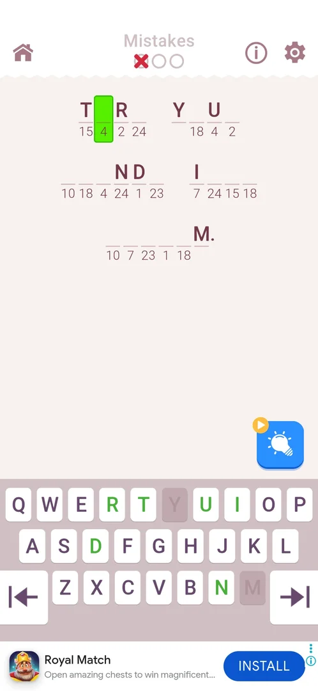
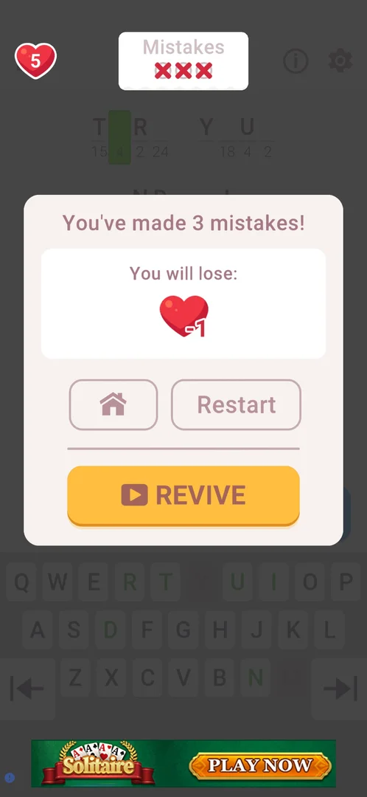

# Mistakes counter

Three circles under the word Mistakes in the middle of the level's top bar. Each wrong letter the player types turns one circle into a red cross. The third cross loses the level and costs a life ([Lives](lives.md)) [^s1] [^s3] [^s4]. Level 1 does not have the counter; it is there from level 2 [^s1].

## Why it appeared

The counter appears at the start of level 2. The board opens dimmed under a tutorial card. The card says this is a mistake counter, that three mistakes with wrong letters lose the level, and to tap to continue. Level 1 has no counter [^s1]. See the card under [Mistakes on the level page](cryptogram-level.md#mistakes).

## Where to find it

Level screen (from level 2) > the top bar, in the middle: the word Mistakes over three circles, between the home icon on the left and the info (i) and gear on the right [^s2] [^s5].

 [^s2]
*Level 2: Mistakes and its three empty circles at the top centre*

## What it looks like

The counter starts as three empty grey circles. A wrong letter fills the leftmost empty circle with a red cross. The selected cell stays empty and stays selected (green), and the wrong key on the keyboard does not change colour or grey out [^s3].

 [^s3]
*One wrong letter: one red cross; the cell stays empty and selected*

### Result

The third wrong letter fills the last circle. The loss popup then opens over the dimmed board. The counter stays lit above the dim with its three crosses. The popup says "You've made 3 mistakes!" and shows the life to be lost (a heart, -1), the Home and Restart buttons and the yellow REVIVE button with a video icon [^s4].

 [^s4]
*Three crosses: the loss popup*

 [^s6]
*Clip 6 s · [original on YouTube from 0:58](https://youtu.be/xwf29tc75Dk?t=58)*

## How it works

All in 3.6.1:

- 3 circles, so 3 wrong letters per attempt. The third loses the level [^s1] [^s6].
- A wrong letter is not placed: the cell stays empty and selected, so the next key goes to the same cell. Three different wrong letters (Q, W, H) typed into one cell made the three mistakes [^s3] [^s4] [^s7]. In an earlier session, the same wrong letter (Q) typed three times into one cell also counted three times [^s6].
- Losing by 3 mistakes costs one life: 5 before, 4 on home after Home in the loss popup [^s4] [^s7].
- Restart in the loss popup brings the counter back to three empty circles [^s8]. Closing the app mid-level and coming back by CONTINUE also starts the level with the counter at zero [^s9].
- Level 1 has no counter [^s1].

## Outcomes

How each outcome of the level ([Cryptogram level](cryptogram-level.md#outcomes)) looks under the counter:

| Outcome | Under the Mistakes counter | Source |
|---|---|---|
| Win | Not seen with the counter: level 2 or later was not won in these sessions | — |
| Loss: 3 mistakes | The third cross opens the loss popup; one life is lost | [^s4] [^s7] |
| Restart after a loss | The counter is reset to three empty circles | [^s8] |
| Quit by the home icon | Not seen with crosses on the counter | — |
| Close the app mid-level | CONTINUE reopens the level with the counter at zero | [^s9] |

## Cases

| Case | What was done | Result | Source |
|---|---|---|---|
| Where to find it <!-- case:chk-entry --> | Opened level 2 | The top bar, middle: Mistakes with 3 circles, from level 2 | [^s5] |
| What it looks like <!-- case:chk-screen --> | Opened level 2 | 3 empty circles under Mistakes at the top of the board | [^s5] |
| First level with it <!-- case:chk-first-level --> | Finished level 1, opened level 2 | Level 2, introduced by a dimmed tutorial card: three wrong letters lose | [^s1] |
| Why it appeared <!-- case:chk-appeared --> | Opened level 2 | The tutorial card and the counter at the start of level 2; absent on level 1 | [^s1] |
| Rules <!-- case:chk-rules --> | Typed wrong letters on level 2, then Restart | Each wrong letter gives one red cross; the third gives the "You've made 3 mistakes" popup; Restart resets the counter | [^s6] |
| Is it a loss <!-- case:chk-loss --> | Lost level 2 by 3 mistakes | Yes: the level's loss outcome, one life (-1) | [^s6] |
| A wrong letter <!-- case:wrong-letter --> | Typed Q, W, then H into one empty cell on level 2 | Each leaves the cell empty and selected and adds one red cross; after H, the loss popup | [^s7] |
| How it interacts with the other pieces <!-- case:chk-interactions --> | — | not verified |  |

## Not verified

- How it interacts with the other pieces: whether a hint changes the counter or REVIVE in the loss popup gives mistakes back; REVIVE was not tapped and no hint was used with crosses on the counter <!-- case:chk-interactions -->
- Win with crosses on the counter: whether the win card shows the mistakes made.

[^s1]: session 20261003-234451-chrono-2FYKPJ, step 17 — [video at 4:04](https://youtu.be/WwMBaKGzEUU?t=244)
[^s2]: session 20261005-123057-chrono-2FYKPJ, step 1 — [video at 0:41](https://youtu.be/dEccP_OkBQk?t=41)
[^s3]: session 20261005-123057-chrono-2FYKPJ, step 6 — [video at 1:52](https://youtu.be/dEccP_OkBQk?t=112)
[^s4]: session 20261005-123057-chrono-2FYKPJ, step 8 — [video at 2:08](https://youtu.be/dEccP_OkBQk?t=128)
[^s5]: session 20261003-234451-chrono-2FYKPJ, step 18 — [video at 4:19](https://youtu.be/WwMBaKGzEUU?t=259)
[^s6]: session 20261005-003245-chrono-2FYKPJ, step 4 — [video at 1:04](https://youtu.be/xwf29tc75Dk?t=64)
[^s7]: session 20261005-123057-chrono-2FYKPJ, step 11 — [video at 2:36](https://youtu.be/dEccP_OkBQk?t=156)
[^s8]: session 20261005-003245-chrono-2FYKPJ, step 5 — [video at 1:16](https://youtu.be/xwf29tc75Dk?t=76)
[^s9]: session 20261005-003245-chrono-2FYKPJ, step 12 — [video at 4:44](https://youtu.be/xwf29tc75Dk?t=284)
