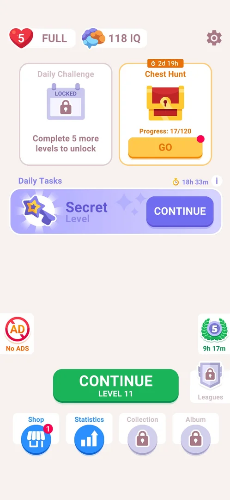
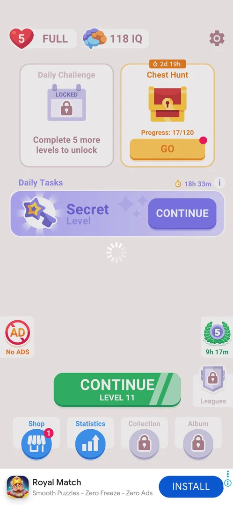

# No ADS offer

A paid offer to remove the ads (inferred from its label and the payment sheet it opens). On home it is a button at the left edge, a red crossed-out AD sign labelled "No ADS"; on the level board the same red sign takes the place of the (i) at the top right. A tap on the home button goes straight to the Google Play payment sheet: the game draws no offer screen of its own [^s2] [^s3].

## Why it appeared

After the level-4 win and its full-screen ad (the first of the game), the red crossed-out AD button replaced the (i) on the level HUD from level 5, and the "No ADS" button appeared at the left edge of home from the next home visit [^s1].

## Where to find it

Home, the "No ADS" button at the left edge, level with the Quote Race badge on the right and above the CONTINUE button [^s2]. On the level board from level 5 the red crossed-out AD button replaces the (i) at the top right of the HUD [^s1]; that one was not tapped.

 [^s2]
*The "No ADS" button at the left edge of home, left of the CONTINUE button*

## What it looks like

The game has no No ADS screen: the tap opened the Google Play payment sheet directly. The sheet was closed without paying and is not shown (it is not the game's screen). Back in the game, home was dimmed with a loading spinner in the middle and the CONTINUE button greyed, and a banner ad appeared at the bottom of home [^s3].

 [^s3]
*After the payment sheet closed: home dimmed with a spinner; no game-drawn offer*

## How it works

All in 3.6.1:

- Unlock: after the level-4 win and its first full-screen ad; the button is on home from the next home visit and on the board from level 5 [^s1].
- Path: one step, No ADS → Google Play payment sheet [^s3].
- Price and what is included (ads removed of which kind) were not read: they are only on the payment sheet, which was closed [^s3].
- No timer or limit on the button; it stays on home on every visit and never opened by itself as a popup [^s3].

## Cases

| Case | What was done | Result | Source |
|---|---|---|---|
| Where to find it <!-- case:chk-entry --> | Looked at home | The No ADS button at the left edge; on the board the red AD button in place of (i) | [^s3] |
| Its screen <!-- case:chk-screen --> | Tapped No ADS | No game screen: the Google Play payment sheet opened directly; closed without paying | [^s3] |
| What is offered <!-- case:chk-contents --> | Tapped No ADS | No tiers drawn by the game; the price is only on the payment sheet, not read | [^s3] |
| The way to pay <!-- case:chk-buy-path --> | Tapped No ADS | One step: the button opens the payment sheet | [^s3] |
| Closing it <!-- case:chk-close --> | Closed the payment sheet | Home dimmed with a spinner, then a banner ad at the bottom | [^s3] |
| Timer or limit <!-- case:chk-timer --> | Looked at the button | A static label, no timer or limit | [^s3] |
| How often it shows <!-- case:chk-frequency --> | Came back to home | The button is on home on every visit from level 5; no popup by itself | [^s3] |
| Why it appeared <!-- case:chk-appeared --> | Won level 4 and saw its full-screen ad | The red AD button on the board from level 5, No ADS on home from the next visit | [^s1] |

## Not verified

- The price and what the purchase removes: only on the Google Play sheet, which was closed unread
- The red AD button on the level board: not tapped

[^s1]: session 20261006-003220-chrono-2FYKPJ, step 13 — [video at 4:44](https://youtu.be/W0PeVNo113E?t=284)
[^s2]: session 20261006-052618-chrono-2FYKPJ, step 0 — [video at 0:00](https://youtu.be/w3lLhvQap0A?t=0)
[^s3]: session 20261006-052618-chrono-2FYKPJ, step 1 — [video at 0:32](https://youtu.be/w3lLhvQap0A?t=32)
