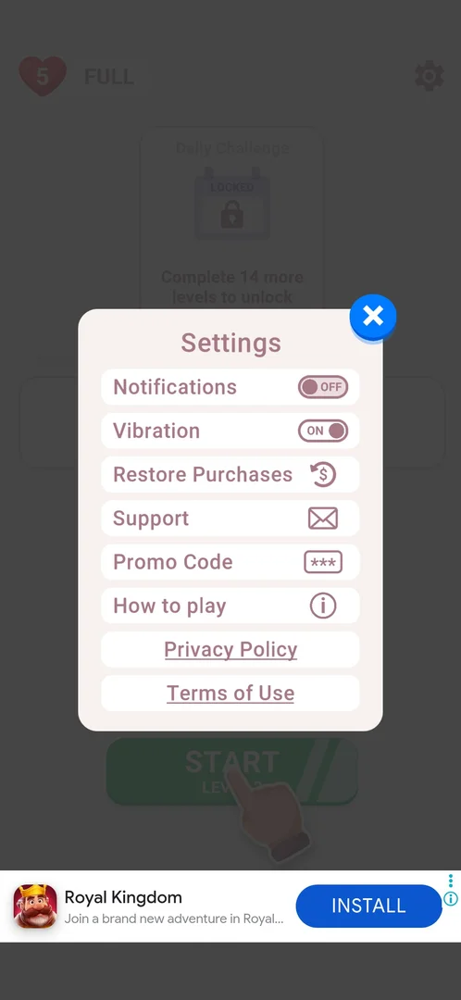

# Notification permission prompt

The Android system dialog that asks whether Cryptogram may send notifications. It appears by itself on the first launch of a fresh install, before the game's "Welcome to Cryptogram" loader; the player answers Allow or Don't allow [^s1]. Inside the game, the only related control is the Notifications toggle in [Settings](settings.md) [^s2].

## Why it appeared

On the first launch of a fresh install, over the game, before the "Welcome to Cryptogram" loader (an Android system dialog) [^s1].

## Where to find it

There is no control that opens it: the system shows it on the first launch [^s1]. After Don't allow it did not come back on later launches, and switching the in-game Notifications toggle does not bring it up [^s3].

<!-- no-entry: the dialog is raised by the system on the first launch; there is no in-game entry point -->

## What it looks like

A standard Android permission dialog shown over the app, asking to allow Cryptogram to send notifications, with two answers: Allow and Don't allow [^s1].

<!-- no-screen: the dialog belongs to the Android permission controller, not the game, so its frame is not used -->

## What you can do

| Tab or button | What it does |
|---|---|
| [Allow](#allow) | Not tried |
| [Don't allow](#dont-allow) | Closes the dialog; the game goes on to the loader and home [^s1] |
| [Notifications toggle](#notifications-toggle) | The in-game switch in Settings; switching it raises no system dialog [^s3] |

### Allow

Not tried: the only install so far answered Don't allow.

<!-- no-frame: a system dialog button, not the game's -->

### Don't allow

Tapped on the fresh install: the dialog closed and the game went on to the "Welcome to Cryptogram" loader and then home [^s1]. The dialog did not come back on later launches [^s3].

<!-- no-frame: a system dialog button, not the game's -->

### Notifications toggle

The first row of Settings (home screen > the gear at the top right). On the install where Don't allow was answered it still showed ON [^s4]. Switched OFF and back ON, it changed its label and no system dialog followed [^s2] [^s3].

 [^s2]
*Settings: the Notifications toggle in the first row, switched OFF; nothing else appeared*

## How it works

- Version 3.6.1: shown once, on the first launch, before the loader [^s1].
- After Don't allow it was not shown again on later launches, this session included [^s3].
- The in-game Notifications toggle and the system permission are not linked in any visible way: the toggle reads ON while the permission is denied, and switching it asks nothing of the system [^s4] [^s3]. Whether the game sends notifications with the toggle ON is not known.

## Cases

| Case | What was done | Result | Source |
|---|---|---|---|
| What it looks like <!-- case:chk-screen --> | First launch of a fresh install | An Android system dialog asking to allow notifications, over the app | [^s1] |
| Where to find it <!-- case:chk-entry --> | — | No entry: shown by itself on the first launch; Settings > Notifications is the in-game switch | [^s1] |
| Links out <!-- case:chk-links --> | — | None on a system permission dialog | [^s1] |
| Every option <!-- case:chk-options --> | Read the dialog | Two answers: Allow and Don't allow; Don't allow tapped | [^s1] |
| Why it appeared <!-- case:chk-appeared --> | First launch of a fresh install | Shown before the "Welcome to Cryptogram" loader | [^s1] |
| Answers <!-- case:chk-answers --> | Don't allow on the fresh install; later launches; Settings > Notifications OFF, then ON | Not shown again; the toggle switches with no system dialog | [^s3] |

## Not verified

- Allow: not tried, so what changes with the permission granted is not known.
- Whether the game sends any notification with the in-game toggle ON.

[^s1]: session 20261003-201504-chrono-2FYKPJ, step 1 — [video at 0:12](https://youtu.be/D5rsIC9WNT8?t=12)
[^s2]: session 20261005-143208-chrono-2FYKPJ, step 10 — [video at 2:05](https://youtu.be/-oFCHQRu4HA?t=125)
[^s3]: session 20261005-143208-chrono-2FYKPJ, step 11 — [video at 2:16](https://youtu.be/-oFCHQRu4HA?t=136)
[^s4]: session 20261003-201504-chrono-2FYKPJ, step 2 — [video at 1:15](https://youtu.be/D5rsIC9WNT8?t=75)
