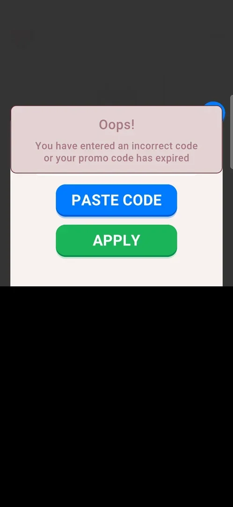

# Promo Code

A dialog in Settings for entering a promo code: a text field, a PASTE CODE button and an APPLY button. An invalid code gets an "Oops!" panel saying the code is incorrect or expired; no valid code was tried, so what a code gives is not known [^s2] [^s3].

## Why it appeared

The Promo Code row is in Settings from the first launch [^s1].

## Where to find it

Home screen > the gear at the top right > Settings > Promo Code, the fifth row, with an icon of asterisks in a box [^s1].

 [^s1]
*Settings: the Promo Code row, fifth from the top*

## What it looks like

 [^s2]
*The Promo Code dialog over Settings: the text field, PASTE CODE (blue), APPLY (green), the close X*

The dialog opens over Settings with the title "Enter your promo code", a text field, a blue PASTE CODE button and a green APPLY button, and a close X at its top right; the banner ad stays at the bottom of the screen [^s2]. When the phone's keyboard opens for the field, the dialog moves up above it [^s4].

## What you can do

| Tab or button | What it does |
|---|---|
| [Text field](#text-field) | Takes the code from the phone's keyboard |
| [PASTE CODE](#paste-code) | Puts the clipboard into the field; with an empty clipboard it empties the field |
| [APPLY](#apply) | Empty field: nothing; invalid code: the "Oops!" panel |
| [X](#x) | Closes the dialog back to Settings |

### Text field

Tapping it opens the phone's keyboard and the dialog moves up above it [^s4]. A code typed there stays in the field after a failed APPLY [^s3].

<!-- no-frame: the field is on the dialog frame above; frames with the keyboard open show the phone's keyboard language -->

### PASTE CODE

With an empty clipboard, PASTE CODE emptied the field: a stray letter in it was gone, and nothing was pasted [^s5].

<!-- no-frame: the result is an empty field with the phone's keyboard open; the keyboard shows the phone's language -->

### APPLY

With an empty field, APPLY did nothing visible [^s6]. With an invalid code ("TEST123") a pink "Oops!" panel covered the top of the dialog: "You have entered an incorrect code or your promo code has expired" [^s3]. The panel had gone by the next frame, about 15 s later; the code was still in the field and the dialog stayed open [^s7].

 [^s3]
*An invalid code: the "Oops!" panel over the dialog (the phone's keyboard below is blacked out)*

### X

The X at the dialog's top right closes it back to Settings [^s4] [^s8].

<!-- no-frame: the X is on the dialog frame above -->

## How it works

- Version 3.6.1. The same "Oops!" message covers an incorrect and an expired code: the game does not tell them apart [^s3].
- A failed code costs nothing visible and keeps the dialog open for another try [^s7].
- What a valid code gives is not known.

## Cases

| Case | What was done | Result | Source |
|---|---|---|---|
| Open and close <!-- case:open-close --> | Settings > Promo Code, then the dialog's X | The dialog opens with the field, PASTE CODE and APPLY; the phone's keyboard pushes it up; X closes it back to Settings. A stray tap typed "0" into the field, nothing was applied | [^s4] |
| Where to find it <!-- case:chk-entry --> | Settings > Promo Code row | The dialog opens | [^s9] |
| What it looks like <!-- case:chk-screen --> | Opened the dialog | "Enter your promo code": text field, PASTE CODE, APPLY, X; the phone's keyboard pushes it up | [^s9] |
| Answers of a prompt <!-- case:chk-answers --> | — | Not a prompt: the player opens it from Settings | [^s9] |
| Links out <!-- case:chk-links --> | — | None on the dialog | [^s9] |
| Why it appeared <!-- case:chk-appeared --> | Opened Settings on a fresh install | The Promo Code row is there | [^s1] |
| Every option or button <!-- case:chk-options --> | PASTE CODE with an empty clipboard, APPLY empty, APPLY "TEST123", X | PASTE CODE empties the field; empty APPLY does nothing; an invalid code gets the "Oops!" panel; X closes | [^s3] |
| Invalid code <!-- case:apply-invalid --> | Typed "TEST123", APPLY | "Oops!": incorrect code or expired; empty APPLY does nothing visible; PASTE CODE with an empty clipboard empties the field | [^s3] |

## Not verified

- A valid code and what it gives: no code was available.
- PASTE CODE with something on the clipboard.

[^s1]: session 20261003-201504-chrono-2FYKPJ, step 2 — [video at 1:15](https://youtu.be/D5rsIC9WNT8?t=75)
[^s2]: session 20261005-143208-chrono-2FYKPJ, step 2 — [video at 0:46](https://youtu.be/-oFCHQRu4HA?t=46)
[^s3]: session 20261005-143208-chrono-2FYKPJ, step 8 — [video at 1:31](https://youtu.be/-oFCHQRu4HA?t=91)
[^s4]: session 20261003-201504-chrono-2FYKPJ, step 12 — [video at 2:58](https://youtu.be/D5rsIC9WNT8?t=178)
[^s5]: session 20261005-143208-chrono-2FYKPJ, step 4 — [video at 1:06](https://youtu.be/-oFCHQRu4HA?t=66)
[^s6]: session 20261005-143208-chrono-2FYKPJ, step 5 — [video at 1:14](https://youtu.be/-oFCHQRu4HA?t=74)
[^s7]: session 20261005-143208-chrono-2FYKPJ, step 8 — [video at 1:47](https://youtu.be/-oFCHQRu4HA?t=107)
[^s8]: session 20261005-143208-chrono-2FYKPJ, step 9 — [video at 1:57](https://youtu.be/-oFCHQRu4HA?t=117)
[^s9]: session 20261003-201504-chrono-2FYKPJ, step 10 — [video at 2:39](https://youtu.be/D5rsIC9WNT8?t=159)
