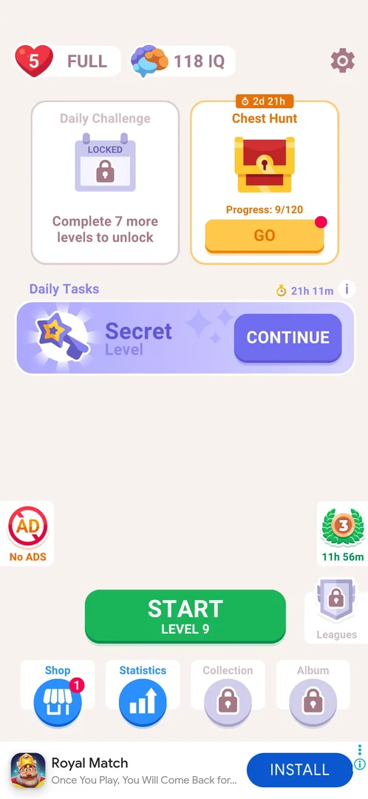
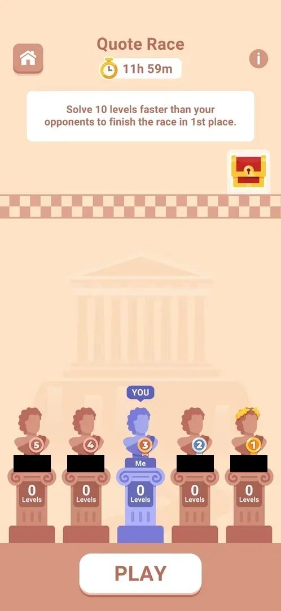
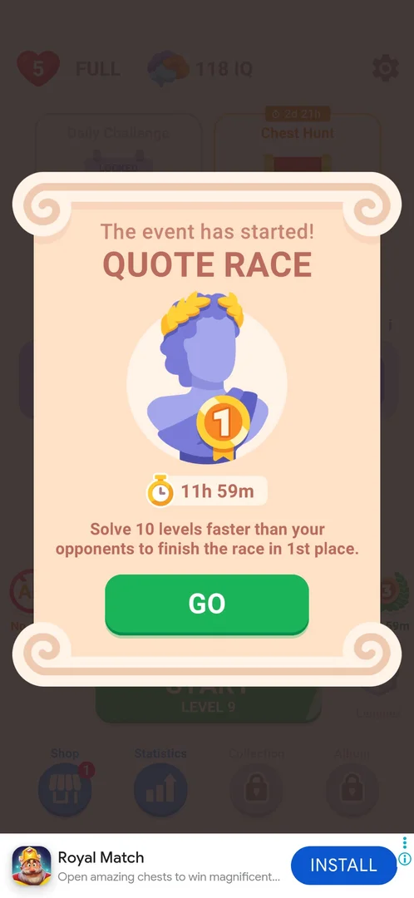
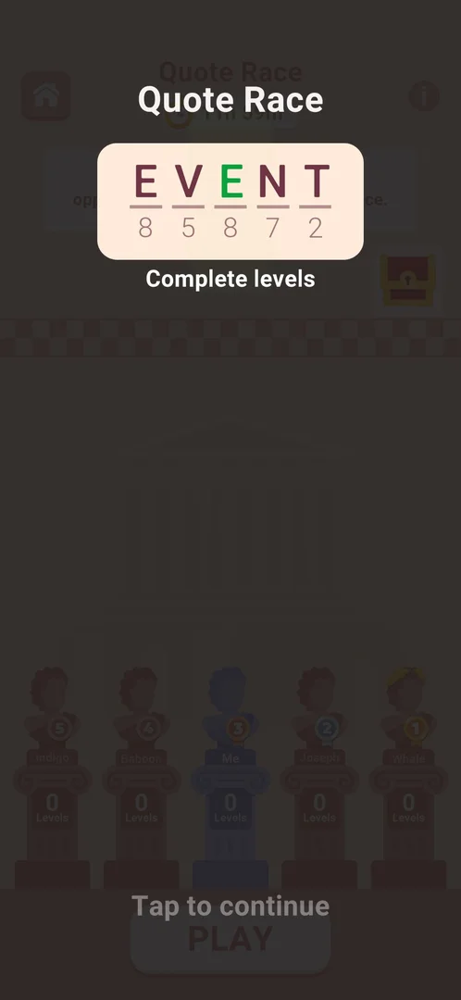
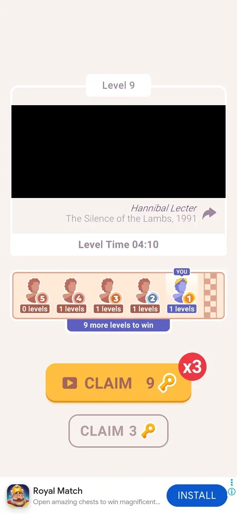
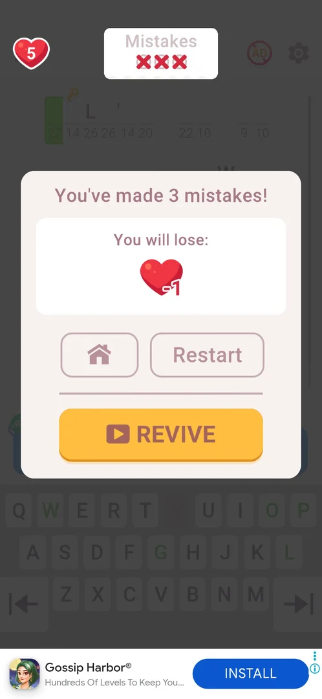

# Quote Race event

A 12-hour race against four opponents: each regular level won counts one level for the player, and the first to solve 10 levels finishes the race in first place. A chest with a lock waits at the finish line. The race has its own screen with a podium of five busts and shows the standings on every win card [^s1] [^s2] [^s3].

## Why it appeared

The session started with the game at level 9 (eight levels won); the first launch went from the loading screen straight to a "QUOTE RACE" popup: "The event has started!", a timer at 11h 59m, the line "Solve 10 levels faster than your opponents" and a GO button [^s1]. Hypothesis: the race unlocks after 8 levels won and starts on the next launch; not verified.

## Where to find it

Two ways in: the start popup's GO on the launch that starts the race [^s4], and on home the race badge at the right edge, above Leagues: a green laurel wreath with the player's rank in it and the time left under it [^s5]. The badge read rank 3 and 11h 56m before the first race level, and rank 2 and 11h 49m after level 9 was won [^s6].

 [^s5]
*The laurel badge at the right edge of home, above Leagues, opens the Quote Race*

## What it looks like

The Quote Race screen: the title "Quote Race" with a stopwatch and the time left (11h 59m), a home button at the top left and an "i" at the top right, the rule "Solve 10 levels faster than your opponents to finish the race in 1st place.", a red chest with a padlock beside a checkered finish line, a temple in the background, and five busts on pedestals. Each pedestal shows the racer's rank badge (5 to 1 from left to right at the start), a name and the levels solved (0 Levels for all); the player is the blue bust in the middle, labelled "Me" with "YOU" above it, ranked 3. A white PLAY button is at the bottom [^s2].

 [^s2]
*The race screen: the podium of five, the finish line with the chest, PLAY (the opponents' names are blacked out)*

## What you can do

| Tab or button | What it does |
|---|---|
| [The event has started!](#the-event-has-started) | The start popup; GO opens the race with a tutorial |
| [Tutorial](#tutorial) | One screen: complete levels |
| [PLAY](#play) | Starts the next regular level |
| [Race strip on the win card](#race-strip-on-the-win-card) | The standings after each level won |

The "i" and the home button of the race screen were not tapped.

### The event has started!

A popup on the launch: the "QUOTE RACE" title, 11h 59m, "The event has started!", the rule about 10 levels and a green GO button; the picture is a blue bust with a laurel wreath and a 1st-place medal. No X was seen. Behind it, home already showed the race badge. GO led to the tutorial over the race screen [^s1] [^s4].

 [^s1]
*The popup that announced the race on launch*

### Tutorial

Over the dimmed race screen: "Quote Race", the word EVENT as a solved cryptogram with its numbers, "Complete levels", and "Tap to continue". A tap opened the race screen [^s4] [^s2].

 [^s4]
*The one-screen tutorial of the race*

### PLAY

PLAY started loading the next level (level 9); an interstitial ad came first, and the session restarted the game to leave it [^s7]. The race levels are the regular levels: the level 9 board has no race element (the HUD shows only Mistakes, the home icon, the AD button and the gear) [^s8].

 [^s8]
*A race level is a regular level: nothing on the board shows the race*

### Race strip on the win card

While the race runs, the win card has a strip under Level Time: the five busts with their levels solved, a checkered finish on the right, and under it how many levels the player still needs. After level 9 (won in 4:10): the player 1st with 1 level, three opponents with 1 level and one with 0, "9 more levels to win" [^s3]. After level 10 (3:19) the frame caught the player's bust moving along the strip with "2 levels", among opponents with 1 and 2 levels [^s9]. Below the strip are the Chest Hunt claim buttons. No clip: the strip's animation falls in a 20 s span between the last letter typed and the next step.

 [^s3]
*The race strip on the win card (the decoded film line is blacked out)*

## How it works

All in 3.6.1:

- Timer: 12 hours (11h 59m on the start popup) [^s2].
- Goal: solve 10 levels before the four opponents; the player starts 3rd of 5 with everyone at 0 [^s2].
- Progress: each regular level won adds 1 level for the player [^s3].
- The opponents gain levels too: after the player's first win three of them had 1 level, after the second, two had 2 [^s3] [^s9]. The home badge showed rank 2 about 2 minutes after the win card showed rank 1 [^s6]; inferred: the opponents advance on their own over time.
- A loss and its Restart change nothing in the race [^s10] [^s11].
- Reward: a locked chest at the finish line; what it holds, and what places 2 to 5 get, was not seen.

## Outcomes

| Outcome | Under the Quote Race | Source |
|---|---|---|
| Win | Differs: the win card adds the race strip with the standings and the levels still needed | [^s3] |
| Loss: 3 mistakes | As the base: the 3-mistakes popup, heart -1, Home, Restart, REVIVE; nothing about the race | [^s10] |
| Restart after a loss | As the base for the race (standing unchanged); the level itself came back after an interstitial ad with the same quote, mistakes reset, and the key and lock cells on other cells | [^s11] |
| Quit by the home icon | Not seen | |
| Close the app mid-level | Not seen | |

 [^s10]
*A loss during the race: the base popup, nothing race-specific*

## Cases

| Case | What was done | Result | Source |
|---|---|---|---|
| Its timer <!-- case:chk-timer --> | Read the popup and the race screen | 12 hours (11h 59m at the start) | [^s2] |
| Rules <!-- case:chk-rules --> | Read the race screen | Solve 10 levels faster than 4 opponents to finish 1st; the podium shows each racer's levels | [^s2] |
| Where to find it <!-- case:chk-entry --> | Came back to home | The laurel badge at the right edge with the rank and the timer; also the start popup on launch | [^s5] |
| What shows during a level <!-- case:chk-in-level --> | Played level 9 | No race element on the board | [^s8] |
| Progress per level <!-- case:chk-progress --> | Won level 9 | +1 level: the player 1st with 1 level, "9 more levels to win" | [^s3] |
| Win card under Quote Race event <!-- case:under-win --> | Won levels 9 and 10 | The race strip with the player's rank moving and the levels count, above the key claim buttons; 2 levels after level 10 | [^s9] |
| Lose by 3 mistakes under Quote Race event <!-- case:under-loss-3-mistakes --> | Typed three wrong letters on level 11 | As the base: heart -1, Home, Restart, REVIVE; nothing about the race | [^s10] |
| Restart from the loss popup under Quote Race event <!-- case:under-restart --> | Tapped Restart | An interstitial, then the same quote with mistakes reset and the key and lock cells moved; race standing unchanged | [^s11] |
| Why it appeared <!-- case:chk-appeared --> | Launched the game with 8 levels won | "The event has started!" popup with 11h 59m and GO | [^s1] |
| What it looks like <!-- case:chk-screen --> | Opened the race with GO | The race screen above; the case is still open in the map | [^s2] |
| The rewards <!-- case:chk-rewards --> | — | not verified | |
| The end <!-- case:chk-end --> | — | not verified | |
| Home icon in level under Quote Race event <!-- case:under-quit --> | — | not verified | |
| Force-stop mid-level under Quote Race event <!-- case:under-exit-app --> | — | not verified | |

## Not verified

- What it looks like: the screen is shown above, but the "i" (rules) screen was not opened and the map's case is still open <!-- case:chk-screen -->
- The rewards per rank: what the chest at the finish holds and what the other places get <!-- case:chk-rewards -->
- The end: the results at 10 levels or at the timer's end, and when the next race starts <!-- case:chk-end -->
- Home icon in level under Quote Race event: whether quitting costs anything in the race (the home icon was blocked by a hint tutorial on the level 11 retry) <!-- case:under-quit -->
- Force-stop mid-level under Quote Race event <!-- case:under-exit-app -->

[^s1]: session 20261006-024420-chrono-2FYKPJ, step 0 — [video at 0:00](https://youtu.be/ZmbMZC7iP0E?t=0)
[^s2]: session 20261006-024420-chrono-2FYKPJ, step 2 — [video at 0:53](https://youtu.be/ZmbMZC7iP0E?t=53)
[^s3]: session 20261006-024420-chrono-2FYKPJ, step 17 — [video at 8:04](https://youtu.be/ZmbMZC7iP0E?t=484)
[^s4]: session 20261006-024420-chrono-2FYKPJ, step 1 — [video at 0:44](https://youtu.be/ZmbMZC7iP0E?t=44)
[^s5]: session 20261006-024420-chrono-2FYKPJ, step 6 — [video at 3:14](https://youtu.be/ZmbMZC7iP0E?t=194)
[^s6]: session 20261006-024420-chrono-2FYKPJ, step 20 — [video at 9:46](https://youtu.be/ZmbMZC7iP0E?t=586)
[^s7]: session 20261006-024420-chrono-2FYKPJ, step 3 — [video at 1:06](https://youtu.be/ZmbMZC7iP0E?t=66)
[^s8]: session 20261006-024420-chrono-2FYKPJ, step 7 — [video at 4:03](https://youtu.be/ZmbMZC7iP0E?t=243)
[^s9]: session 20261006-024420-chrono-2FYKPJ, step 28 — [video at 13:43](https://youtu.be/ZmbMZC7iP0E?t=823)
[^s10]: session 20261006-024420-chrono-2FYKPJ, step 35 — [video at 16:34](https://youtu.be/ZmbMZC7iP0E?t=994)
[^s11]: session 20261006-024420-chrono-2FYKPJ, step 39 — [video at 17:52](https://youtu.be/ZmbMZC7iP0E?t=1072)
