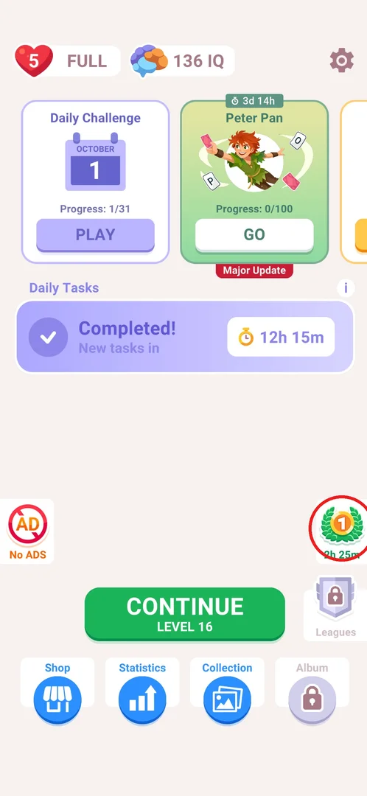
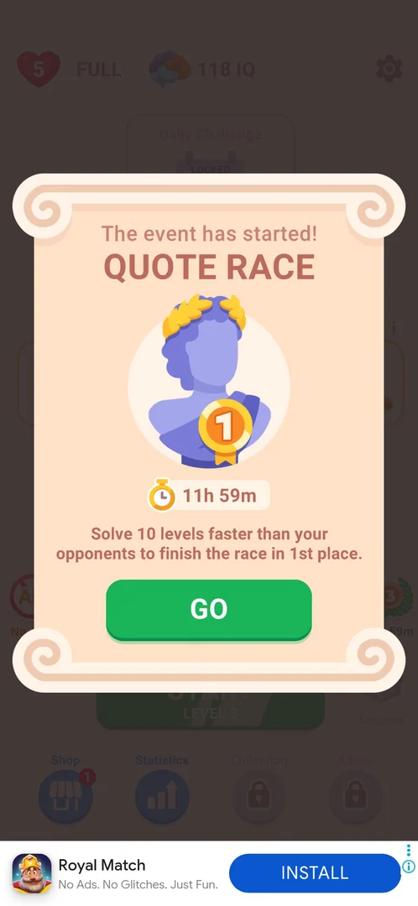
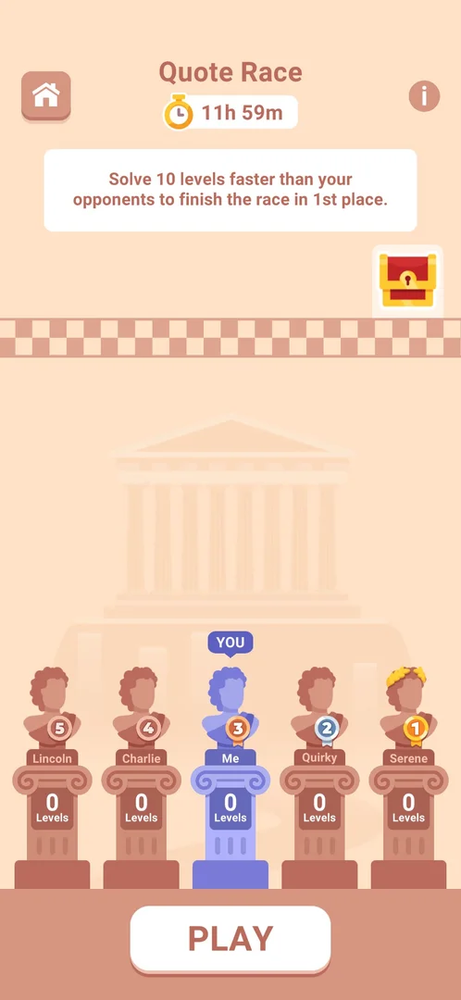
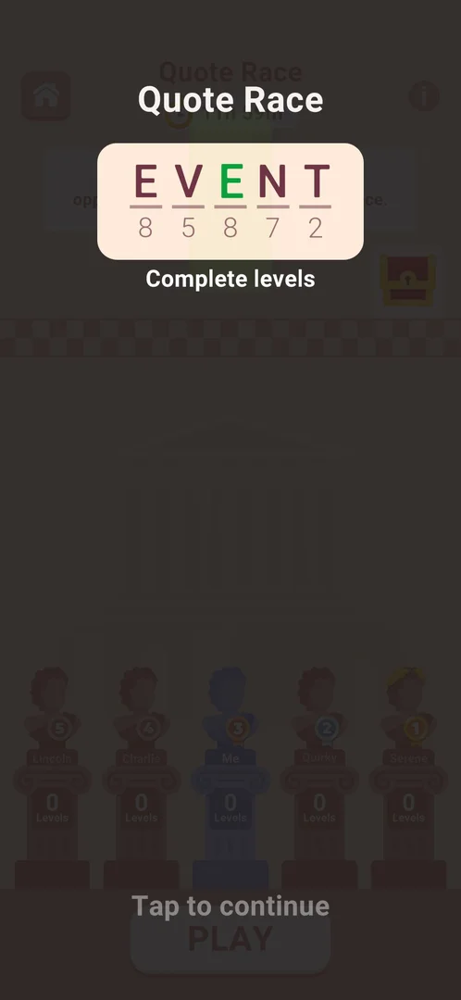
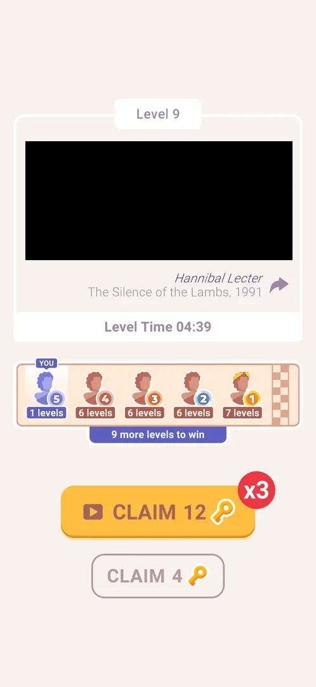
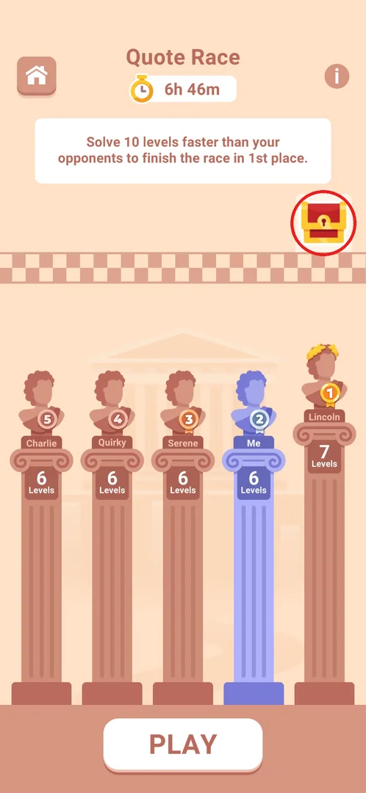
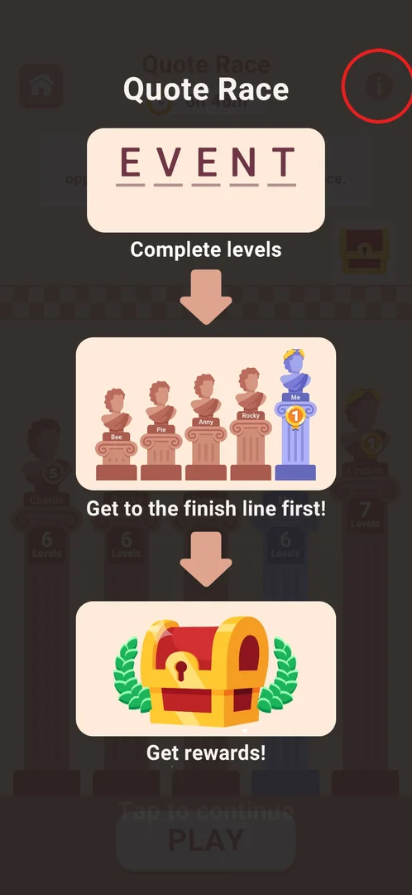
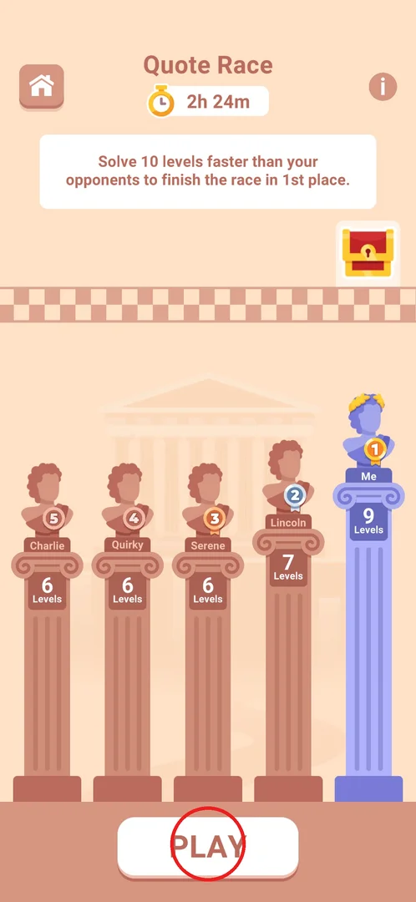
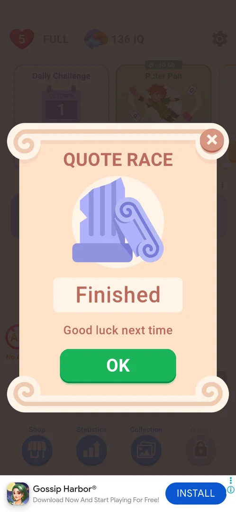

# Quote Race

A timed race event of about 12 hours against four named opponents: every level the player wins moves
them one step up, and the first to win 10 levels finishes in 1st place and gets a chest of rewards
[^s8] [^s6]. Main levels, the Daily Challenge and the secret level all count [^s15] [^s16] [^s17]. It
popped up on launch at level 9 of a progressed install [^s8].

## Where to find it

On the main screen, the badge on the right above Leagues: a laurel wreath with the player's current
place in the race and the time left (here 1st, 2h 25m). Tapping it opens the race screen [^s1] [^s7].
The badge showed the place all through the event: 5th at 8h 45m left, 2nd at 8h 30m and 6h 50m, 1st at
4h 41m and 2h 25m [^s10] [^s11] [^s12] [^s18] [^s1].

 [^s1]

When the event started, it announced itself with a popup on launch: "The event has started!
QUOTE RACE", the timer 11h 59m, the rule "Solve 10 levels faster than your opponents to finish the
race in 1st place" and GO, which joins the race and opens the race screen [^s8] [^s3].

 [^s8]

## What it looks like

A beige screen styled as an ancient Greek stadium. At the top: a home button, the title "Quote Race"
with the time left, and an (i) button; under it the rule banner; on the right a red-and-gold chest
above a chequered finish line [^s2]. Below, five racers stand as busts on columns, each with a name, a
place medal 1–5 and the number of levels won; the player is "Me", coloured blue and marked YOU. A
column grows with the racer's levels, and the leader wears a laurel wreath [^s2] [^s7]. PLAY is at the
bottom [^s2].

 [^s2]

At the start all five racers had 0 levels and the player stood 3rd (Lincoln 5th, Charlie 4th, Quirky
2nd, Serene 1st), so the starting order is preset (inferred) [^s2].

## What you can do

| Tab or button | What it does |
|---|---|
| [Tutorial](#tutorial) | A one-time overlay after joining; tap to continue |
| [Win screen strip](#win-screen-strip) | The race standings shown on every win screen |
| [Chest](#chest) | The reward chest; tapping it showed nothing |
| [Rules](#rules) | (i) opens the three-step rules overlay |
| [PLAY](#play) | Starts the next main level |

### Tutorial

Right after GO, an overlay covers the race screen: the word EVENT written as a cryptogram (letters over
numbers), the caption "Complete levels" and "Tap to continue"; a tap closes it [^s3] [^s2].

 [^s3]

### Win screen strip

Every won level's screen has a race strip under the quote card: the five racers in order of place with
their levels and a finish flag, the player marked YOU, and a counter "N more levels to win" [^s4]. After
level 9 the player had 1 level and stood 5th, the rivals 6, 6, 6 and 7, "9 more levels to win" [^s4].
The Daily Challenge and secret-level win screens report the race the same way ("2 more to win", "1 more
to win") [^s16] [^s17].

 [^s4]

### Chest

The chest at the top right stands for the 1st-place reward ("Get rewards!" in the rules) [^s6].
Tapping it opened nothing: the screen stayed the same, so the reward's contents were not shown [^s5]
[^s6].

 [^s5]

### Rules

The (i) button at the top right opens an overlay of three steps joined by arrows: "Complete levels"
(the EVENT cryptogram), "Get to the finish line first!" (the player's bust on the tallest column with
the 1st medal) and "Get rewards!" (a chest between laurels); "Tap to continue" closes it [^s6] [^s13].

 [^s6]

### PLAY

PLAY at the bottom opens the next main level (the one START/CONTINUE on the main screen would open)
[^s9] [^s13]. Before the level an interstitial ad was shown each time PLAY was recorded: on joining
[^s9], in a later session [^s14] and on the first PLAY of another session [^s19].

 [^s7]

## How it works

- The goal is 10 won levels; the player who gets there first takes 1st place [^s8] [^s6].
- A won main level adds one to the player's count: 1 level after level 9, 6 after level 14, 7 after
  level 15 [^s4] [^s11] [^s15].
- A Daily Challenge day and the secret level (the Daily Tasks bar reward) count as race levels too:
  7 → 8 and 8 → 9 [^s16] [^s17].
- Places follow the level counts. At equal counts the player stood above the rivals: at 6 levels the
  player was 2nd behind Lincoln (7), ahead of three rivals with 6 [^s11] [^s12].
- The rivals advance without the player: from 0 at the start to 6–7 by the next session about three
  hours later [^s2] [^s4], then they stopped: they did not move during the session in which the player
  won levels 9–14 [^s11], and Lincoln still had 7, the others 6, at 2h 24m left [^s7].
- The event lasted about 12 hours: 11h 59m at the start, 2h 25m about 9.5 hours later [^s8] [^s1].
- When the race ran out before the player reached 10 levels (stopped at 9, 1st), the next launch showed
  a QUOTE RACE popup "Finished" / "Good luck next time" with OK and an X; OK closed it, no reward was
  given, and the race widget was gone from the main screen [^s20]
  [^s21].

 [^s20]

| What (v3.6.1) | Value | Source |
|---|---|---|
| Levels to finish | 10 | [^s8] |
| Duration seen at the start | 11h 59m | [^s8] |
| Opponents | 4 (Lincoln, Charlie, Quirky, Serene) | [^s2] |
| Levels that count | main, Daily Challenge, secret level | [^s15] [^s16] [^s17] |
| Best standing seen | 1st, 9 levels, 2h 24m left | [^s7] |

## Cases

| Case | What was done | Result | Source |
|---|---|---|---|
| Event popup on launch: Quote Race, solve 10 levels faster than 4 opponents, 11h 59m timer, GO | Launched the game at level 9 | Popup with the rule, 11h 59m timer, GO | [^s8] |
| Join the race with GO and see opponents/progress | Tapped GO | Race screen behind the tutorial overlay; 5 racers at 0 levels, the player 3rd | [^s3] [^s2] |
| After a won level the race counter goes to 1 | Won level 9 | Win screen strip: YOU 1 level, 5th, "9 more levels to win" | [^s4] |
| Open the (i) rules screen | Tapped (i) on the race screen | Three-step rules overlay | [^s6] |
| Tap the chest to preview the 1st place reward | Tapped the chest | Nothing opened | [^s5] [^s6] |
| Main-screen widget on the right (laurel badge with the rank and a timer) opens the race screen | Tapped the laurel badge | Race screen: Me 9 levels, 1st, 2h 24m left | [^s7] |
| Daily Challenge counts | Won the Daily Challenge of October 1 | Race 7 → 8 levels, 1st, "2 more to win" | [^s16] |
| Secret level counts | Won the secret level | Race 9 levels, "1 more to win" | [^s17] |
| The race runs out before 10 levels | Launched the game after the timer ended, at 9 of 10 levels | ✅ "Finished / Good luck next time" popup, OK, no reward | [^s20] [^s21] |
| Finish 10 levels: placement and reward | — | not verified | |
| Share arrow on the win screen quote card | — | not verified | |

## Not verified

- The finish: the screen at 10 levels, the final placement and what the chest gives. The 10th level
  (level 16) loaded three times after the skip icon + Back on its interstitial, but each of those
  sessions ended right after the board loaded, before the level was played
  [^s22] [^s23] [^s24].
  > ⚠️ Previously (v3.6.1, 2026-10-01): "the 10th level (level 16) was not reached because interstitials
  > blocked it" [^s19].
- Whether a new race starts after this one, and when (no race widget on the main screen at the next
  sessions [^s25]).
- Whether the rivals' progress follows a schedule (they jumped to 6–7 between sessions, then stood still).
- The home button of the race screen (presumably back to the main screen).
- The share arrow on the win screen's quote card.

[^s1]: session 20261001-114433-chrono-2FYKPJ, step 0 — [video at 0:00](https://youtu.be/orHIc1UWwXE?t=0)
[^s2]: session 20261001-020937-chrono-2FYKPJ, step 2 — [video at 0:48](https://youtu.be/UqLGP_sLnX8?t=48)
[^s3]: session 20261001-020937-chrono-2FYKPJ, step 1 — [video at 0:38](https://youtu.be/UqLGP_sLnX8?t=38)
[^s4]: session 20261001-050941-chrono-2FYKPJ, step 52 — [video at 13:41](https://youtu.be/0QFSEGBnZG8?t=821)
[^s5]: session 20261001-071926-chrono-2FYKPJ, step 16 — [video at 3:37](https://youtu.be/TiPdn57GNJY?t=217)
[^s6]: session 20261001-071926-chrono-2FYKPJ, step 17 — [video at 3:44](https://youtu.be/TiPdn57GNJY?t=224)
[^s7]: session 20261001-114433-chrono-2FYKPJ, step 1 — [video at 0:28](https://youtu.be/orHIc1UWwXE?t=28)
[^s8]: session 20261001-020937-chrono-2FYKPJ, step 0 — [video at 0:00](https://youtu.be/UqLGP_sLnX8?t=0)
[^s9]: session 20261001-020937-chrono-2FYKPJ, step 3 — [video at 0:57](https://youtu.be/UqLGP_sLnX8?t=57)
[^s10]: session 20261001-050941-chrono-2FYKPJ, step 53 — [video at 14:07](https://youtu.be/0QFSEGBnZG8?t=847)
[^s11]: session 20261001-050941-chrono-2FYKPJ, step 82 — [video at 29:24](https://youtu.be/0QFSEGBnZG8?t=1764)
[^s12]: session 20261001-071926-chrono-2FYKPJ, step 15 — [video at 3:26](https://youtu.be/TiPdn57GNJY?t=206)
[^s13]: session 20261001-071926-chrono-2FYKPJ, step 18 — [video at 3:59](https://youtu.be/TiPdn57GNJY?t=239)
[^s14]: session 20261001-071926-chrono-2FYKPJ, step 21 — [video at 5:57](https://youtu.be/TiPdn57GNJY?t=357)
[^s15]: session 20261001-071926-chrono-2FYKPJ, step 24 — [video at 7:19](https://youtu.be/TiPdn57GNJY?t=439)
[^s16]: session 20261001-071926-chrono-2FYKPJ, step 36 — [video at 13:29](https://youtu.be/TiPdn57GNJY?t=809)
[^s17]: session 20261001-071926-chrono-2FYKPJ, step 57 — [video at 25:36](https://youtu.be/TiPdn57GNJY?t=1536)
[^s18]: session 20261001-092740-chrono-2FYKPJ, step 3 — [video at 0:49](https://youtu.be/g7StIT6Li9U?t=49)
[^s19]: session 20261001-114433-chrono-2FYKPJ, step 2 — [video at 0:39](https://youtu.be/orHIc1UWwXE?t=39)

[^s20]: session 20261001-190315-chrono-2FYKPJ, step 0 — [video at 0:00](https://youtu.be/UgPM48lteCw?t=0)
[^s21]: session 20261001-190315-chrono-2FYKPJ, step 1 — [video at 0:42](https://youtu.be/UgPM48lteCw?t=42)
[^s22]: session 20261001-092740-chrono-2FYKPJ, step 9 — [video at 4:32](https://youtu.be/g7StIT6Li9U?t=272)
[^s23]: session 20261001-114433-chrono-2FYKPJ, step 18 — [video at 8:02](https://youtu.be/orHIc1UWwXE?t=482)
[^s24]: session 20261001-192245-chrono-2FYKPJ, step 17 — [video at 7:58](https://youtu.be/bp2LGsK-mEE?t=478)
[^s25]: session 20261001-224924-chrono-2FYKPJ, step 0 — [video at 0:00](https://youtu.be/RSACUWOF_ak?t=0)
