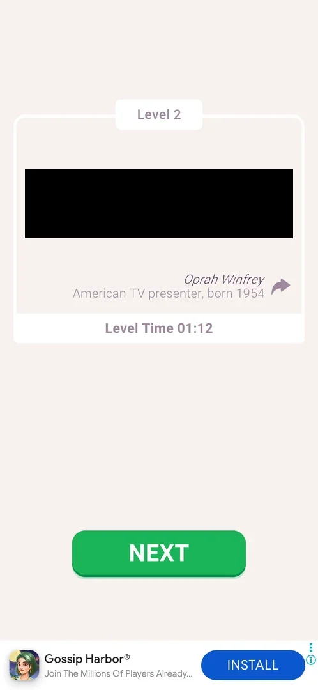

# Quote share (win card)

A share arrow on the win card, the card that shows the solved quote after a level. Tapping it hands the quote to the phone's own share sheet, from which the player picks another app; the game has no share screen of its own [^s2] [^s3].

## Why it appeared

On the win card of level 1, the first level won: the arrow sits next to the quote's author [^s1]. It was on the level 2 win card as well [^s2].

## Where to find it

Win a level: the win card shows "Level N" at the top, the decoded quote, the author with a one-line description, "Level Time" and a green NEXT button. The share arrow is the curved arrow right of the author's name [^s2].

 [^s2]
*The win card: the share arrow right of the quote's author (the quote itself is blacked out)*

## What it looks like

The arrow opens the Android system share sheet over the game: a list of the phone's apps to send to [^s3]. It is a system screen, not the game's. The shared content was not checked in a receiving app; the session's note records it as a text share [^s3].

<!-- no-screen: the share sheet belongs to the Android system (intent resolver), not the game, and lists the phone's apps -->

## What you can do

| Tab or button | What it does |
|---|---|
| [Share arrow](#share-arrow) | Opens the Android share sheet; Back returns to the win card |

### Share arrow

The only control of the feature, right of the author's name on the win card [^s2]. Tapping it opens the system share sheet; the phone's Back button closes it and the win card is there again, unchanged, with NEXT [^s3].

<!-- no-frame: the arrow is on the win card frame above; the share sheet is a system screen -->

## How it works

- Version 3.6.1. Present on every win card seen (levels 1 and 2) [^s1] [^s2].
- Nothing was shared, so whether sharing gives any reward is not known; closing the sheet with Back gave nothing and cost nothing [^s3].

## Cases

| Case | What was done | Result | Source |
|---|---|---|---|
| Where to find it <!-- case:chk-entry --> | Won level 1 | The share arrow right of the quote's author on the win card | [^s1] |
| Answers of a prompt <!-- case:chk-answers --> | — | Not a prompt: a button the player taps | [^s1] |
| Why it appeared <!-- case:chk-appeared --> | Won level 1 | The arrow is on the first win card | [^s1] |
| What it looks like <!-- case:chk-screen --> | Tapped the arrow on the level 2 win card | The Android share sheet opens over the game; Back returns to the win card | [^s3] |
| Every option or button <!-- case:chk-options --> | Tapped the arrow, then Back | One control, the arrow; it opens the share sheet, Back closes it | [^s3] |
| Links out <!-- case:chk-links --> | Tapped the arrow | Leads to the Android share sheet (other apps); nothing was shared; Back returns to the game | [^s3] |

## Not verified

- What a receiving app gets (the quote text, a link, an image) and whether sharing gives a reward: nothing was shared.

[^s1]: session 20261003-234451-chrono-2FYKPJ, step 15 — [video at 3:32](https://youtu.be/WwMBaKGzEUU?t=212)
[^s2]: session 20261005-143208-chrono-2FYKPJ, step 16 — [video at 3:35](https://youtu.be/-oFCHQRu4HA?t=215)
[^s3]: session 20261005-143208-chrono-2FYKPJ, step 18 — [video at 4:15](https://youtu.be/-oFCHQRu4HA?t=255)
