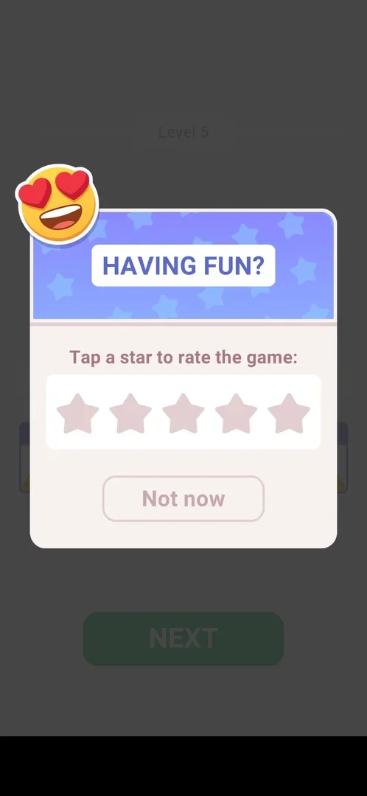

# Rate us popup

A popup that asks the player to rate the game with one to five stars, or to put it off with "Not now". It came up by itself over the win card of level 5 [^s1].

## Why it appeared

It opened over the level 5 win card a few seconds after the last letter was typed, before NEXT was tapped [^s1]. Hypothesis: it is triggered by the fifth level won; not verified. It did not come back on the win cards of levels 6, 7 and 8 in the same session [^s3] [^s4] [^s5].

## Where to find it

<!-- no-entry: the popup has no control that opens it; it comes up by itself over the win card -->
No button opens it: it is shown over the win card (level 5) [^s1]. No rate item was seen in Settings.

## What it looks like

Over the dimmed win card: a heart-eyes emoji at the top left, "HAVING FUN?" on a blue starry header, "Tap a star to rate the game:", a row of five grey stars and an outlined "Not now" button [^s1].

 [^s1]
*The rating popup: five stars to tap, Not now below (the banner ad at the bottom is blacked out)*

## What you can do

| Tab or button | What it does |
|---|---|
| [Stars](#stars) | Rate 1 to 5 (not tapped) |
| [Not now](#not-now) | Closes the popup back to the win card |

### Stars

Five stars under "Tap a star to rate the game:". Not tapped, so as not to rate the game; what a low and a high rating open (a feedback form, the store review sheet) is not known [^s1].

<!-- no-frame: the stars were not tapped -->

### Not now

Closes the popup; the win card of level 5 is back with its banner and NEXT [^s2].

 [^s1]
*Not now, the outlined button under the stars, closes it*

## How it works

- Shown once in this session, over the win card of level 5 (3.6.1) [^s1]; not shown on levels 6-8 after "Not now" [^s3] [^s4] [^s5].
- No reward is offered for rating.

## Cases

| Case | What was done | Result | Source |
|---|---|---|---|
| Why it appeared <!-- case:chk-appeared --> | Won level 5 | The popup over the win card | [^s1] |
| Where to find it <!-- case:chk-entry --> | Looked for a control that opens it | None: it pops up over the level 5 win card; not in Settings | [^s1] |
| What it looks like <!-- case:chk-screen --> | Read the popup | HAVING FUN?, heart-eyes emoji, "Tap a star to rate the game:", five stars, Not now | [^s1] |
| Every option <!-- case:chk-options --> | Tapped Not now | Back to the win card; the stars not tapped | [^s2] |
| Links out <!-- case:chk-links --> | — | None tapped: a star is the only possible link out; not tested so as not to rate | [^s2] |
| What each answer does <!-- case:chk-answers --> | Not now, then won levels 6-8 | Not now closes it; it did not come back on the next three win cards | [^s5] |

## Not verified

- What each answer does: a 1-3 star and a 4-5 star tap, and whether the popup comes back later after Not now <!-- case:chk-answers -->

[^s1]: session 20261006-003220-chrono-2FYKPJ, step 16 — [video at 5:02](https://youtu.be/W0PeVNo113E?t=302)
[^s2]: session 20261006-003220-chrono-2FYKPJ, step 17 — [video at 5:18](https://youtu.be/W0PeVNo113E?t=318)

[^s3]: session 20261006-003220-chrono-2FYKPJ, step 29 — [video at 8:44](https://youtu.be/W0PeVNo113E?t=524)
[^s4]: session 20261006-003220-chrono-2FYKPJ, step 57 — [video at 18:07](https://youtu.be/W0PeVNo113E?t=1087)
[^s5]: session 20261006-003220-chrono-2FYKPJ, step 70 — [video at 21:46](https://youtu.be/W0PeVNo113E?t=1306)
