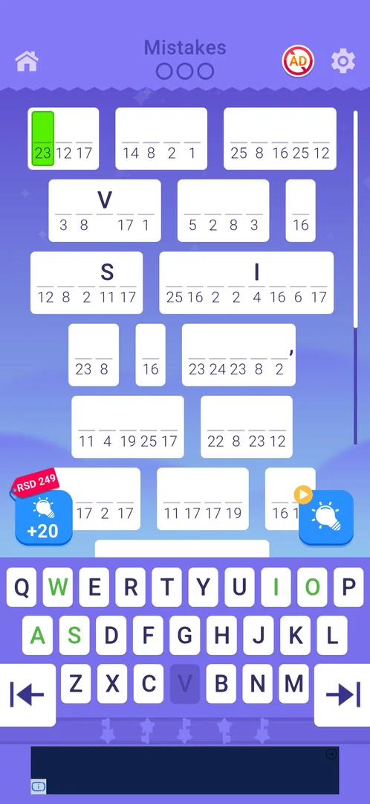
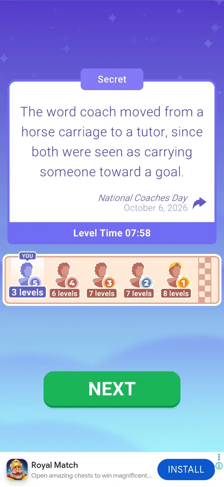

# Secret Level

A bonus cryptogram offered as the reward of the Daily Tasks bar: when the ninth task of the day is done, the Daily Tasks card on home turns into a "Secret Level" card with a PLAY button [^s1]. It is played on the same board and keyboard as a regular level, in a purple theme, and its text is a one-sentence fact tied to the day's date instead of a quote by a known author [^s2]. Winning it closes the Daily Tasks card until new tasks come; no IQ or other reward was shown [^s3].

## Why it appeared

The ninth segment of the Daily Tasks bar filled when the last task of the third batch was done (level 8 won); back on home the Daily Tasks card had become the Secret Level card, with the day's timer still above it (23h 2m) [^s1]. See [Daily Tasks](daily-tasks.md).

## Where to find it

Home screen > the Daily Tasks place under the Daily Challenge and Chest Hunt cards: once the bar is full, the task tiles and the bar are replaced by a lilac card with a star-wand icon, "Secret Level" and a purple PLAY button [^s1].

 [^s1]
*The Secret Level card in place of the Daily Tasks list; PLAY on the right*

Once the level has been opened and left unfinished, the card reads "Secret Level" with CONTINUE instead of PLAY; it stayed so across sessions and while regular levels 9 and 10 were played, with the day's timer running on (21h 11m, then 21h 4m) [^s4] [^s5]. CONTINUE on that card opened the level [^s6].

## What it looks like

Opening it shows the game's loading screen ("Crafting Your Quote", "preparing new quote ...") [^s7], then the board.

 [^s6]
*The Secret Level board: the regular cryptogram layout in a purple theme*

What is on it:

- The same layout as a regular level: the home icon top left, "Mistakes" with three circles at the top, the no-ads and settings buttons top right, the text in numbered cells with a few letters given, the +20 hints offer (with its price tag) at the left and the bulb hint at the right above the keyboard, and a keyboard with arrow keys at both ends [^s6].
- The whole screen, the keyboard included, is purple; the keys of letters that are used up turn darker [^s6].
- No locked cells were seen; the board had 7 rows of words [^s8] [^s9].

### Win card

 [^s2]
*The win card: the solved sentence under the label "Secret", the occasion and date under it, the share arrow, Level Time, the ranking strip, NEXT*

The win card is titled "Secret" (not a level number). The solved text is a one-sentence fact (about the origin of the word "coach", 24 words) with "National Coaches Day" and the date (October 6, 2026) under it in place of an author, and a share arrow. Below: "Level Time 07:58", the [Quote Race](quote-race.md) strip (YOU 5th with 3 levels; the others at 6, 7, 7 and 8 levels), and NEXT [^s2].

### Result

 [^s3]
*Home after the win: the Daily Tasks card shows "Completed!" with the time to new tasks*

## How it works

- Unlocked by filling the 9-segment Daily Tasks bar (nine tasks in three batches of three, levels 4-8 in that session, 3.6.1); the star-wand icon at the end of the bar is this level [^s1].
- Rules are those of a regular cryptogram level: same board, keyboard, hints and Mistakes counter (0/3 at the start) [^s6].
- Progress is kept when the level is left: after the game was force-restarted mid-level, CONTINUE on the card reopened the board with the letters already typed in place [^s10] [^s11].
- During the first attempt a full-screen playable ad came up with no close button; the game had to be restarted (3.6.1) [^s10]. After the win, NEXT led to an interstitial ad that froze, and the game was restarted again; the win was kept [^s3].
- Reward: none shown. IQ stayed 118 before and after, no reward popup came up [^s3].
- After the win the Daily Tasks card reads "Completed! New tasks in" with a timer (15h 22m) [^s3].
- It counts as a level for the [Daily Challenge](daily-challenge.md) lock: "Complete 5 more levels to unlock" became 4 [^s3].
- [Statistics](statistics.md) counts it under Daily Tasks: "Secret Levels Completed 1" [^s12].

## Outcomes

| Outcome | As the base or what differs | Frame |
|---|---|---|
| win <!-- case:under-win --> | As the base: a win card with NEXT, then an interstitial ad. Differs: the card is titled "Secret" with a dated sentence instead of an author's quote; afterwards the Daily Tasks card turns into "Completed!" with the time to new tasks; it counts towards the Daily Challenge unlock (5 to 4) [^s3] |  |
| quit <!-- case:under-quit --> | not verified | — |
| restart <!-- case:under-restart --> | not verified | — |
| exit app <!-- case:under-exit-app --> | not verified | — |
| Lose by 3 mistakes: popup with heart -1, Home/Restart/REVIVE <!-- case:under-loss-3-mistakes --> | not verified | — |

## Cases

| Case | What was done | Result | Source |
|---|---|---|---|
| Why it appeared <!-- case:chk-appeared --> | Finished the ninth Daily Task (level 8 won) | The Daily Tasks card turned into Secret Level PLAY | [^s1] |
| Where to find it <!-- case:chk-entry --> | Looked at home | The Secret Level card in the Daily Tasks place, PLAY on the right | [^s1] |
| How it is announced <!-- case:chk-announce --> | Back on home after level 8 | No popup: the card itself changed, the day's timer still running (23h 2m) | [^s1] |
| The card after PLAY <!-- case:card-continue --> | Came back to home in later sessions, at level 9, 10 and 11 | The card reads Secret Level with CONTINUE (was PLAY); the day's timer runs on | [^s5] |
| What it looks like <!-- case:chk-screen --> | Tapped CONTINUE on the card | The loading screen, then the purple board with Mistakes 0/3, the bulb hint, numbered cells and the keyboard | [^s6] |
| What differs in play <!-- case:chk-differs --> | Played it through, leaving it once mid-level | The same board and keyboard as a regular level in purple; no locks; a dated one-sentence fact instead of an author's quote; typed letters kept after leaving | [^s11] |
| Its win <!-- case:chk-win --> | Typed the last letter, then NEXT | Win card "Secret" with Level Time 07:58 and the Quote Race strip, NEXT, an interstitial; home shows Daily Tasks Completed (15h 22m); IQ 118 unchanged, no reward popup | [^s3] |

## Not verified

- Each loss: its fail screen and what the loss costs <!-- case:chk-loss -->
- Retry and continue offers after a loss <!-- case:chk-retry -->
- Where and how often it comes up: once per day's bar is inferred from the bar's place on the daily card, not verified; also whether the card stays until the day's reset if the level is not played <!-- case:chk-frequency -->
- Home icon in the level under Secret Level <!-- case:under-quit -->
- Restart from the loss popup under Secret Level <!-- case:under-restart -->
- Force-stop mid-level under Secret Level: the typed letters were kept after a restart forced by an ad, but a force-stop with a hint used was not tried <!-- case:under-exit-app -->
- Lose by 3 mistakes under Secret Level <!-- case:under-loss-3-mistakes -->

[^s1]: session 20261006-003220-chrono-2FYKPJ, step 72 — [video at 24:16](https://youtu.be/W0PeVNo113E?t=1456)
[^s2]: session 20261006-082255-chrono-2FYKPJ, step 20 — [video at 11:05](https://youtu.be/8H7YQcfEzZ8?t=665)
[^s3]: session 20261006-082255-chrono-2FYKPJ, step 26 — [video at 13:31](https://youtu.be/8H7YQcfEzZ8?t=811)
[^s4]: session 20261006-024420-chrono-2FYKPJ, step 6 — [video at 3:20](https://youtu.be/ZmbMZC7iP0E?t=200)
[^s5]: session 20261006-024420-chrono-2FYKPJ, step 20 — [video at 10:04](https://youtu.be/ZmbMZC7iP0E?t=604)
[^s6]: session 20261006-082255-chrono-2FYKPJ, step 1 — [video at 0:33](https://youtu.be/8H7YQcfEzZ8?t=33)
[^s7]: session 20261006-003220-chrono-2FYKPJ, step 73 — [video at 24:51](https://youtu.be/W0PeVNo113E?t=1491)
[^s8]: session 20261006-082255-chrono-2FYKPJ, step 2 — [video at 2:37](https://youtu.be/8H7YQcfEzZ8?t=157)
[^s9]: session 20261006-082255-chrono-2FYKPJ, step 3 — [video at 3:20](https://youtu.be/8H7YQcfEzZ8?t=200)
[^s10]: session 20261006-082255-chrono-2FYKPJ, step 9 — [video at 6:48](https://youtu.be/8H7YQcfEzZ8?t=408)
[^s11]: session 20261006-082255-chrono-2FYKPJ, step 10 — [video at 7:15](https://youtu.be/8H7YQcfEzZ8?t=435)
[^s12]: session 20261006-082255-chrono-2FYKPJ, step 31 — [video at 14:59](https://youtu.be/8H7YQcfEzZ8?t=899)
