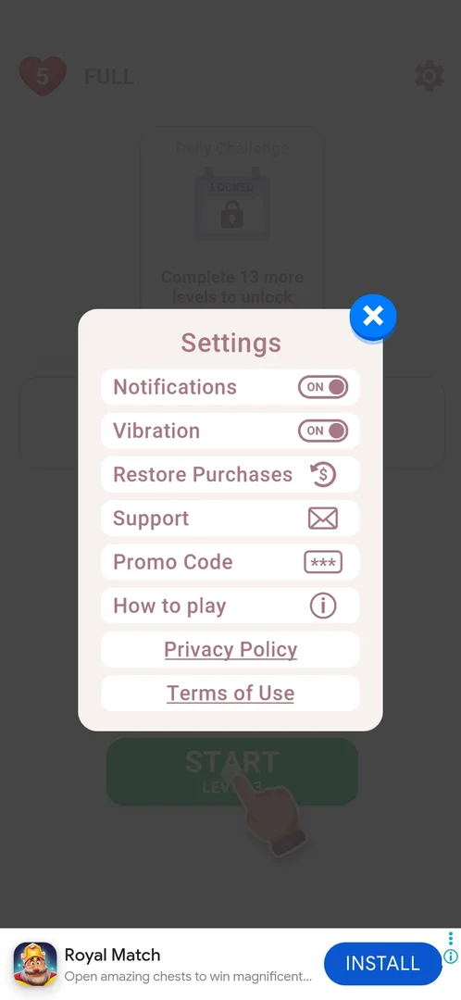
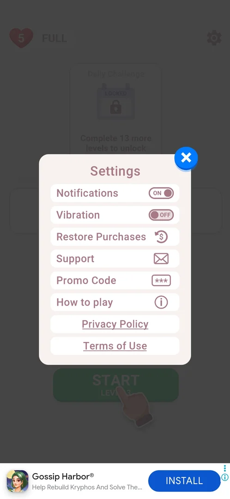
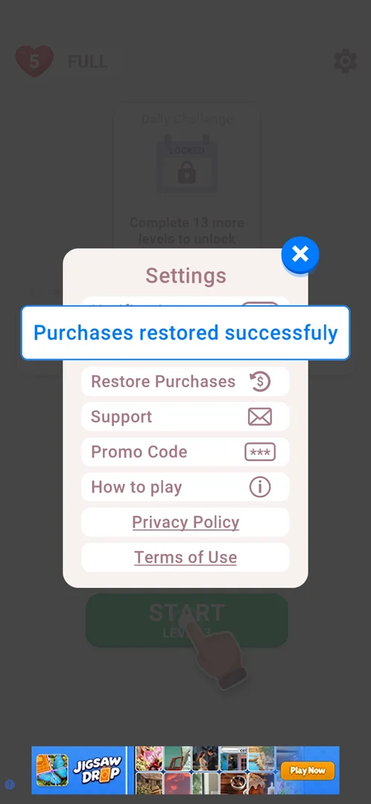

# Settings

A popup over the home screen with two toggles (Notifications, Vibration), four rows that open something (Restore Purchases, Support, Promo Code, How to play) and two links that open the phone's browser (Privacy Policy, Terms of Use) [^s1] [^s6].

## Why it appeared

The gear at the top right of the home screen is there from the first launch [^s1].

## Where to find it

Home screen > the gear at the top right [^s1].

 [^s2]
*The gear at the top right of the home screen opens Settings*

## What it looks like

 [^s3]
*Settings: two toggles, four rows with icons, two underlined links, the blue X at the top right*

The popup is titled Settings and has a blue close X at its top right; the X closes it back to home [^s1] [^s12].

## What you can do

| Tab or button | What it does |
|---|---|
| [Notifications](#notifications) | Toggle, ON on a fresh install; switching it asks nothing of the system |
| [Vibration](#vibration) | Toggle, ON on a fresh install; switches in place |
| [Restore Purchases](#restore-purchases) | Shows a "Purchases restored successfully" banner at once |
| [Support](#support) | Opens the "Need Help?" popup; see [Support](support.md) |
| [Promo Code](#promo-code) | Opens the promo code dialog; see [Promo Code](promo-code.md) |
| [How to play](#how-to-play) | Opens the 3-page rules; see [How to play](how-to-play.md) |
| [Privacy Policy](#privacy-policy) | Opens the developer's privacy policy in Chrome |
| [Terms of Use](#terms-of-use) | Opens the developer's terms of use in Chrome |

### Notifications

The first row, a toggle set to ON on a fresh install (the system notification permission had been denied at the first launch) [^s1]. Switched OFF and back ON, it changes its label in place; no system dialog and no other change follow [^s8]. See [Notification permission prompt](notification-prompt.md).

<!-- no-frame: the row is on the Settings frame above; the OFF state is framed on the Notification permission prompt page -->

### Vibration

The second row, a toggle set to ON on a fresh install [^s1]. Switched OFF, it reads OFF in place with no dialog; switched back ON, nothing else changed [^s4] [^s9].

 [^s4]
*The Vibration toggle, second row, switched to OFF*

### Restore Purchases

The third row, with a dollar sign in a circular arrow [^s1]. A tap shows a blue-framed banner "Purchases restored successfully" over the popup at once; no Google Play sheet opens and nothing else changes. The account had no purchases [^s5].

 [^s5]
*Restore Purchases: the success banner over the popup, with no purchases on the account*

### Support

The fourth row, with an envelope icon. A tap closes Settings and opens the "Need Help?" popup with FAQ and Support buttons [^s6]. See [Support](support.md).

<!-- no-frame: the row is on the Settings frame above; the popup is on the Support page -->

### Promo Code

The fifth row, with asterisks in a box; it opens the "Enter your promo code" dialog [^s7].

<!-- no-frame: the row is on the Settings frame above; the dialog is on the Promo Code page -->

### How to play

The sixth row, with an "i" icon; it opens the three-page rules. OK on the last page closes Settings as well [^s11].

<!-- no-frame: the row is on the Settings frame above; the pages are on the How to play page -->

### Privacy Policy

An underlined link, the seventh row. A tap opens Chrome in a new tab at a joyteractive.com page (the developer's site); returning to the game finds Settings still open [^s10].

<!-- no-frame: the link opens Chrome, another app -->

### Terms of Use

An underlined link, the last row. Like Privacy Policy, it opens Chrome at a joyteractive.com page; Settings is still open on return [^s10].

<!-- no-frame: the link opens Chrome, another app -->

## How it works

- Defaults on a fresh install of 3.6.1: Notifications ON, Vibration ON [^s1].
- The Notifications toggle reads ON although the system permission was denied, and switching it raises no system dialog [^s1] [^s8].
- Restore Purchases answers with a success banner even when there is nothing to restore (3.6.1) [^s5].
- The two links leave the game for Chrome; Support, Promo Code and How to play stay inside it [^s6] [^s10].

## Cases

| Case | What was done | Result | Source |
|---|---|---|---|
| The rows <!-- case:rows --> | Opened Settings on a fresh install | Notifications (ON), Vibration (ON), Restore Purchases, Support, Promo Code, How to play, Privacy Policy, Terms of Use | [^s2] |
| Why it appeared <!-- case:chk-appeared --> | First launch of a fresh install | The gear is on home | [^s1] |
| Where to find it <!-- case:chk-entry --> | Tapped the gear on home | Settings opens | [^s1] |
| What it looks like <!-- case:chk-screen --> | Opened Settings | Two toggles, four rows, two links, a blue X | [^s1] |
| Every option or button <!-- case:chk-options --> | Tried every row | Toggles switch in place; Restore Purchases shows a success banner; Support opens "Need Help?"; Promo Code opens the code dialog; How to play opens the 3-page rules; Privacy Policy and Terms of Use open Chrome | [^s6] |
| Answers of a prompt <!-- case:chk-answers --> | — | Not a prompt: Settings is a menu opened by the player | [^s1] |
| Links out <!-- case:chk-links --> | Tapped Privacy Policy, then Terms of Use | Each opens Chrome in a new tab at joyteractive.com; back in the game Settings is still open | [^s10] |
| Notifications toggle <!-- case:notifications-toggle --> | Switched Notifications OFF, then ON (permission denied at install) | Switches in place; no system dialog, no other change | [^s8] |
| Vibration toggle <!-- case:vibration-toggle --> | Switched Vibration OFF, then ON | Switches in place, no dialog, no other change; left ON | [^s9] |
| Restore Purchases <!-- case:restore-purchases --> | Tapped Restore Purchases on an account with no purchases | An in-game success banner at once; no Google Play sheet, nothing else changes | [^s5] |

## Not verified

- Restore Purchases on an account that has purchases.
- Whether the Vibration toggle changes anything in a level (vibration is not seen in a recording).

[^s1]: session 20261003-201504-chrono-2FYKPJ, step 2 — [video at 1:15](https://youtu.be/D5rsIC9WNT8?t=75)
[^s2]: session 20261003-201504-chrono-2FYKPJ, step 8 — [video at 2:11](https://youtu.be/D5rsIC9WNT8?t=131)
[^s3]: session 20261005-221933-chrono-2FYKPJ, step 1 — [video at 0:33](https://youtu.be/I7zPQ2z7rvA?t=33)
[^s4]: session 20261005-221933-chrono-2FYKPJ, step 2 — [video at 0:42](https://youtu.be/I7zPQ2z7rvA?t=42)
[^s5]: session 20261005-221933-chrono-2FYKPJ, step 8 — [video at 1:46](https://youtu.be/I7zPQ2z7rvA?t=106)
[^s6]: session 20261005-221933-chrono-2FYKPJ, step 9 — [video at 2:05](https://youtu.be/I7zPQ2z7rvA?t=125)
[^s7]: session 20261003-201504-chrono-2FYKPJ, step 10 — [video at 2:39](https://youtu.be/D5rsIC9WNT8?t=159)
[^s8]: session 20261005-143208-chrono-2FYKPJ, step 11 — [video at 2:16](https://youtu.be/-oFCHQRu4HA?t=136)
[^s9]: session 20261005-221933-chrono-2FYKPJ, step 3 — [video at 0:51](https://youtu.be/I7zPQ2z7rvA?t=51)
[^s10]: session 20261005-221933-chrono-2FYKPJ, step 6 — [video at 1:23](https://youtu.be/I7zPQ2z7rvA?t=83)
[^s11]: session 20261003-201504-chrono-2FYKPJ, step 6 — [video at 1:55](https://youtu.be/D5rsIC9WNT8?t=115)
[^s12]: session 20261003-201504-chrono-2FYKPJ, step 13 — [video at 3:11](https://youtu.be/D5rsIC9WNT8?t=191)
