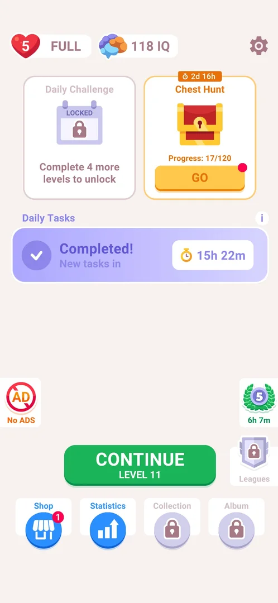
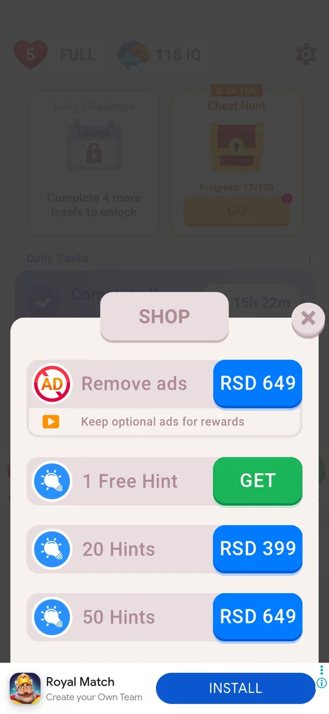
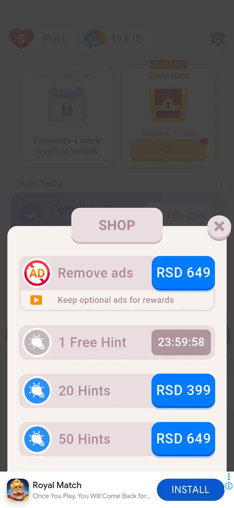

# Shop

A sheet opened from the Shop button on home that sells ad removal and hint packs for real money and gives one free hint a day. It has four rows and no tabs: Remove ads, 1 Free Hint, 20 Hints and 50 Hints; there are no coins, lives or IQ for sale [^s1].

## Why it appeared

The Shop button appeared, open (no lock) and with a red badge 1, in the new bottom bar of home after the third level was won [^s2].

## Where to find it

Home screen > the bottom bar, the leftmost button, Shop (a blue circle with a storefront icon). While the free hint is waiting it carries a red badge 1 on its top right [^s3] [^s1].

 [^s4]
*The Shop button, leftmost in the bottom bar, with the red badge 1*

## What it looks like

 [^s1]
*The Shop sheet: four rows, each with its button on the right; the close X top right*

A sheet titled SHOP slides over the dimmed home screen, with a close X at its top right. The four rows fit without scrolling (a swipe moved nothing) [^s5]. Each row has an icon, a name and a button on the right: blue with a price for the paid rows, green GET for the free hint. The Remove ads row has a second line, "Keep optional ads for rewards", with a video icon [^s1].

## What you can do

| Tab or button | What it does |
|---|---|
| [Remove ads](#remove-ads) | Price button RSD 649 |
| [1 Free Hint](#1-free-hint) | GET: one hint at once, free, then a 24 h wait |
| [20 Hints](#20-hints) | Price button RSD 399 |
| [50 Hints](#50-hints) | Price button RSD 649 |

### Remove ads

<!-- no-frame: the row is in the Shop sheet frame under "What it looks like"; it has no screen of its own -->

RSD 649. The line under it says the optional ads for rewards stay [^s1]. The same offer has its own button on home and in levels: see [No Ads](no-ads.md).

### 1 Free Hint

GET grants the hint at once, with no ad and no confirmation. The row then turns grey and its button becomes a countdown from 23:59:58 [^s6].

 [^s6]
*The free hint claimed: the row is grey with the countdown to the next one*

### 20 Hints

<!-- no-frame: the row is in the Shop sheet frame under "What it looks like"; it has no screen of its own -->

RSD 399 [^s1]. The same pack is the "+20" button with a price tag on the level screen: see [Hint Pack](hint-pack.md).

### 50 Hints

<!-- no-frame: the row is in the Shop sheet frame under "What it looks like"; it has no screen of its own -->

RSD 649 [^s1].

## How it works

- Prices in 3.6.1, in the phone's store currency: Remove ads RSD 649, 20 Hints RSD 399, 50 Hints RSD 649 [^s1].
- The price button is the only step before the store's payment sheet: there is no game screen in between. The price buttons were not tapped [^s1].
- 1 Free Hint: one hint per 24 h, claimed with GET, granted at once without an ad [^s6].
- The red badge 1 on the Shop button marks the unclaimed free hint: after GET and closing the sheet, the badge was gone [^s7].
- The X closes the sheet back to home [^s7].
- The Shop opened only from its button; it did not come up by itself in the session [^s7].

## Cases

| Case | What was done | Result | Source |
|---|---|---|---|
| Why it appeared <!-- case:chk-appeared --> | Won level 3, NEXT | The Shop button with a red badge 1 is in the home bottom bar | [^s2] |
| Where to find it <!-- case:chk-entry --> | Tapped Shop, the first button of the home bottom bar | The Shop sheet opened; the button had the red badge 1 while the free hint was unclaimed | [^s1] |
| What it looks like <!-- case:chk-screen --> | Looked at the sheet, swiped up | A sheet over home with four rows and an X top right; no scrolling | [^s5] |
| Contents and prices <!-- case:chk-contents --> | Read the rows | Remove ads RSD 649 (rewarded ads kept), 1 Free Hint GET, 20 Hints RSD 399, 50 Hints RSD 649; no coins, lives or IQ packs | [^s1] |
| Its timer or limit <!-- case:chk-timer --> | Tapped GET on 1 Free Hint | The row greyed with a 23:59:58 countdown | [^s6] |
| Claim the free hint <!-- case:free-hint-claim --> | Tapped GET | Granted at once, no ad; the row became a 24 h timer; the badge on the Shop button disappeared | [^s6] |
| The way to buy <!-- case:chk-buy-path --> | Looked at the paid rows (not tapped) | The price button is the only path; no game screen before the store's payment sheet | [^s1] |
| Closing it <!-- case:chk-close --> | Tapped the X top right | Back to home; the Shop button's badge was gone | [^s7] |
| How often it comes up by itself <!-- case:chk-frequency --> | Played the session | Only on tapping the Shop button; no automatic shop popup. The in-level +20 hints button is a separate offer | [^s7] |

## Not verified

- What a price button opens: the store's payment sheet is expected, the buttons were not tapped (never paying)

[^s1]: session 20261006-082255-chrono-2FYKPJ, step 27 — [video at 14:10](https://youtu.be/8H7YQcfEzZ8?t=850)
[^s2]: session 20261005-221933-chrono-2FYKPJ, step 38 — [video at 13:02](https://youtu.be/I7zPQ2z7rvA?t=782)
[^s3]: session 20261005-221933-chrono-2FYKPJ, step 32 — [video at 11:04](https://youtu.be/I7zPQ2z7rvA?t=664)
[^s4]: session 20261006-082255-chrono-2FYKPJ, step 26 — [video at 13:31](https://youtu.be/8H7YQcfEzZ8?t=811)
[^s5]: session 20261006-082255-chrono-2FYKPJ, step 28 — [video at 14:24](https://youtu.be/8H7YQcfEzZ8?t=864)
[^s6]: session 20261006-082255-chrono-2FYKPJ, step 29 — [video at 14:32](https://youtu.be/8H7YQcfEzZ8?t=872)
[^s7]: session 20261006-082255-chrono-2FYKPJ, step 30 — [video at 14:43](https://youtu.be/8H7YQcfEzZ8?t=883)
