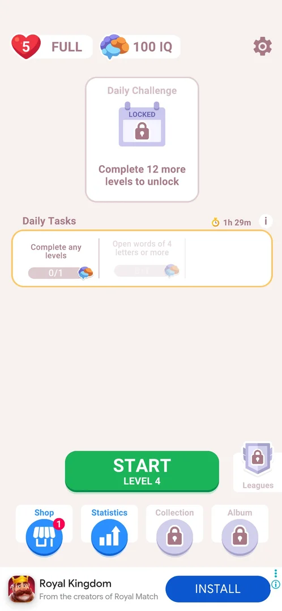

# Shop

A button in the home screen's bottom bar named Shop, a blue circle with a storefront icon and a red badge with 1. It appeared after the third level won; it was not opened, so what it sells is not known [^s1].

## Why it appeared

The Shop button appeared, open (no lock) and with a red badge 1, in the new bottom bar of home after the third level was won [^s1].

## Where to find it

Home screen > the bottom bar, the leftmost button, Shop, with a red badge 1 on its top right [^s2].

 [^s2]
*The Shop button, leftmost in the bottom bar, with the red badge 1*

## What it looks like

<!-- no-screen: the Shop button was not tapped in this session -->

Not seen: the button was not tapped.

## How it works

- Appears with the third level won (3.6.1), open from the start, with a red badge 1. What the badge counts is not known; inferred, not verified: one offer or free item waiting [^s1].

## Cases

| Case | What was done | Result | Source |
|---|---|---|---|
| Why it appeared <!-- case:chk-appeared --> | Won level 3, NEXT | The Shop button with a red badge 1 is in the home bottom bar | [^s1] |
| Where to find it <!-- case:chk-entry --> | — | not verified (seen, not tapped) |  |
| What it looks like <!-- case:chk-screen --> | — | not verified |  |
| Contents and prices <!-- case:chk-contents --> | — | not verified |  |
| How often it comes up by itself <!-- case:chk-frequency --> | — | not verified |  |
| Its timer or limit <!-- case:chk-timer --> | — | not verified |  |
| The way to buy <!-- case:chk-buy-path --> | — | not verified |  |
| Closing it <!-- case:chk-close --> | — | not verified |  |

## Not verified

- Where to find it: the button was seen, not tapped; what it opens <!-- case:chk-entry -->
- What it looks like: the shop screen <!-- case:chk-screen -->
- Contents and price of every pack or tier, and what the badge 1 points to <!-- case:chk-contents -->
- Whether a shop offer comes up by itself (after a level, a loss, a session start) <!-- case:chk-frequency -->
- Its timer or limit, if any <!-- case:chk-timer -->
- The way to buy, up to the price button (never paying) <!-- case:chk-buy-path -->
- Closing it: the close button and what comes up after <!-- case:chk-close -->

[^s1]: session 20261005-221933-chrono-2FYKPJ, step 38 — [video at 12:37](https://youtu.be/I7zPQ2z7rvA?t=757)
[^s2]: session 20261005-221933-chrono-2FYKPJ, step 32 — [video at 10:45](https://youtu.be/I7zPQ2z7rvA?t=645)
