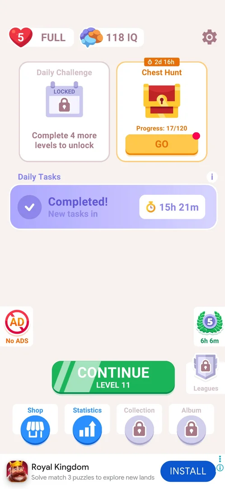
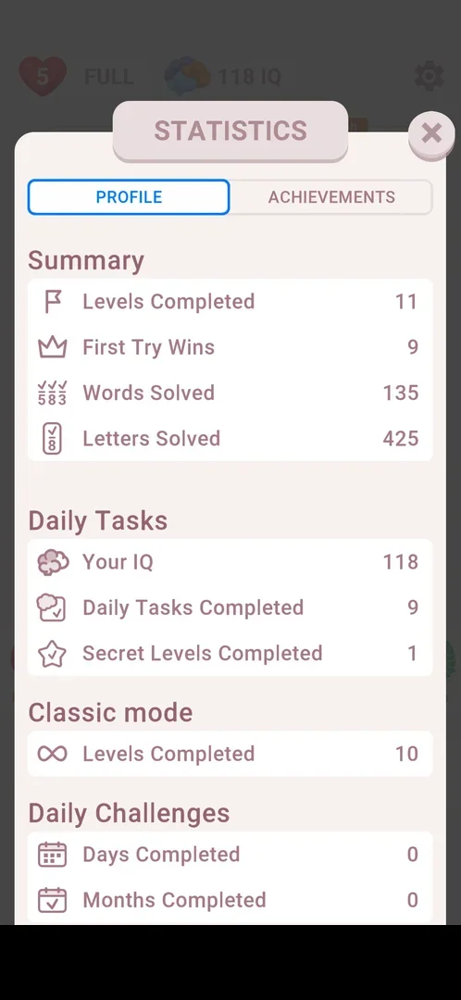
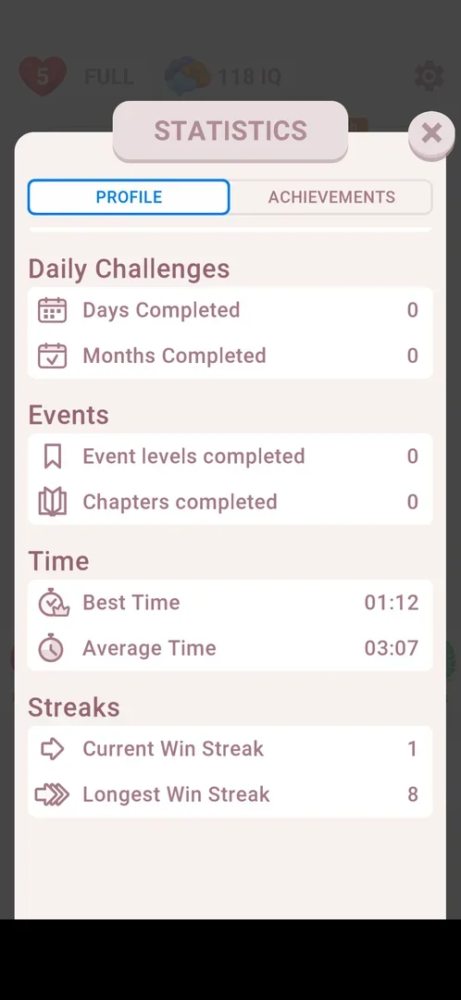
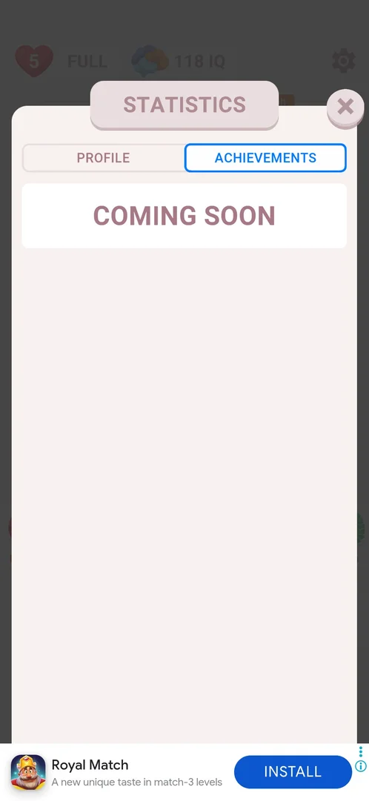

# Statistics

A read-only sheet with the player's own play figures, opened from the Statistics button on home. It has two tabs: Profile, a scrolling list of 16 counters in seven groups, and Achievements, which only says COMING SOON. Nothing on it can be changed or tapped except the tabs and the close X [^s1] [^s2].

## Why it appeared

The Statistics button appeared, open (no lock), in the new bottom bar of home after the third level was won [^s3].

## Where to find it

Home screen > the bottom bar, the second button from the left, Statistics (a blue circle with a bar chart), between Shop and Collection [^s1].

 [^s4]
*The Statistics button, second in the bottom bar*

## What it looks like

 [^s1]
*The Statistics sheet, Profile tab at the top; the tabs under the title, the X top right (the ad banner at the bottom is blacked out)*

A sheet titled STATISTICS over the dimmed home screen, a close X at its top right, the tabs PROFILE and ACHIEVEMENTS under the title. It opens on Profile [^s1].

## What you can do

| Tab or button | What it does |
|---|---|
| [Profile](#profile) | Shows 16 counters in seven groups; scrolls |
| [Achievements](#achievements) | Shows only COMING SOON |

### Profile

 [^s5]
*The lower part of Profile: Daily Challenges, Events, Time, Streaks (the ad banner at the bottom is blacked out)*

The groups and their counters, with the values at the time (after 11 levels, 3.6.1) [^s1] [^s5]:

| Group | Counter | Value seen |
|---|---|---|
| Summary | Levels Completed | 11 |
| Summary | First Try Wins | 9 |
| Summary | Words Solved | 135 |
| Summary | Letters Solved | 425 |
| Daily Tasks | Your IQ | 118 |
| Daily Tasks | Daily Tasks Completed | 9 |
| Daily Tasks | Secret Levels Completed | 1 |
| Classic mode | Levels Completed | 10 |
| Daily Challenges | Days Completed | 0 |
| Daily Challenges | Months Completed | 0 |
| Events | Event levels completed | 0 |
| Events | Chapters completed | 0 |
| Time | Best Time | 01:12 |
| Time | Average Time | 03:07 |
| Streaks | Current Win Streak | 1 |
| Streaks | Longest Win Streak | 8 |

Summary counts 11 levels and Classic mode 10: the difference is the [Secret Level](secret-level.md) (inferred from "Secret Levels Completed 1") [^s1].

### Achievements

 [^s2]
*The Achievements tab: only COMING SOON*

## How it works

- Every value is read-only: nothing on the sheet toggles or opens anything [^s2].
- No prompt and no links out of the game on the sheet [^s1].
- The X top right closes it back to home [^s6].

## Cases

| Case | What was done | Result | Source |
|---|---|---|---|
| Why it appeared <!-- case:chk-appeared --> | Won level 3, NEXT | The Statistics button is in the home bottom bar | [^s3] |
| Where to find it <!-- case:chk-entry --> | Tapped Statistics, the second button of the home bottom bar | The Statistics sheet opened | [^s1] |
| What it looks like <!-- case:chk-screen --> | Looked at the sheet | A sheet with the tabs Profile and Achievements and an X top right | [^s1] |
| Every option or button <!-- case:chk-options --> | Scrolled Profile, opened Achievements | Profile: 16 read-only counters in seven groups (the study log says 20; the two frames show 16); Achievements: COMING SOON only; nothing toggles | [^s2] |
| Answers of a prompt <!-- case:chk-answers --> | Looked at the sheet | Does not apply: no prompt | [^s1] |
| Links out <!-- case:chk-links --> | Looked at the sheet | Does not apply: no links out | [^s1] |

## Not verified

- What the Achievements tab will hold once it is no longer "coming soon"

[^s1]: session 20261006-082255-chrono-2FYKPJ, step 31 — [video at 14:59](https://youtu.be/8H7YQcfEzZ8?t=899)
[^s2]: session 20261006-082255-chrono-2FYKPJ, step 33 — [video at 15:17](https://youtu.be/8H7YQcfEzZ8?t=917)
[^s3]: session 20261005-221933-chrono-2FYKPJ, step 38 — [video at 13:02](https://youtu.be/I7zPQ2z7rvA?t=782)
[^s4]: session 20261006-082255-chrono-2FYKPJ, step 30 — [video at 14:43](https://youtu.be/8H7YQcfEzZ8?t=883)
[^s5]: session 20261006-082255-chrono-2FYKPJ, step 32 — [video at 15:07](https://youtu.be/8H7YQcfEzZ8?t=907)
[^s6]: session 20261006-082255-chrono-2FYKPJ, step 34 — [video at 15:30](https://youtu.be/8H7YQcfEzZ8?t=930)
