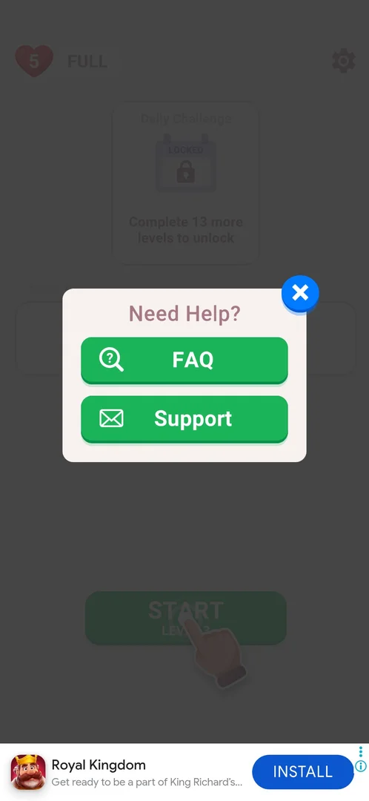
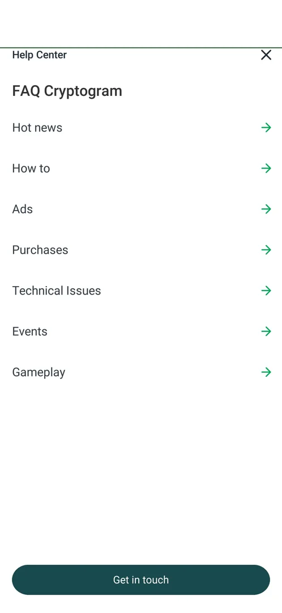
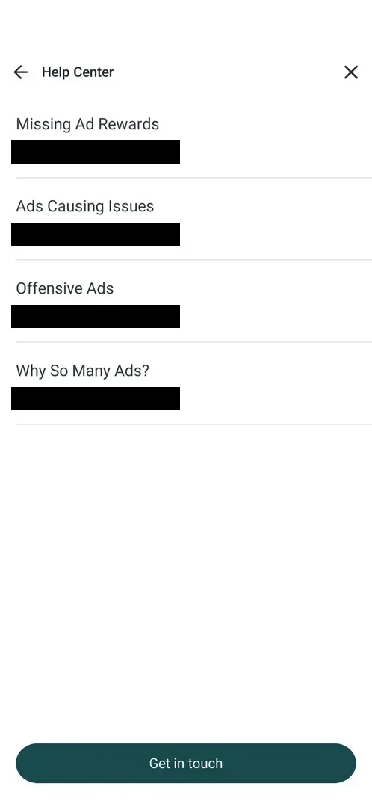
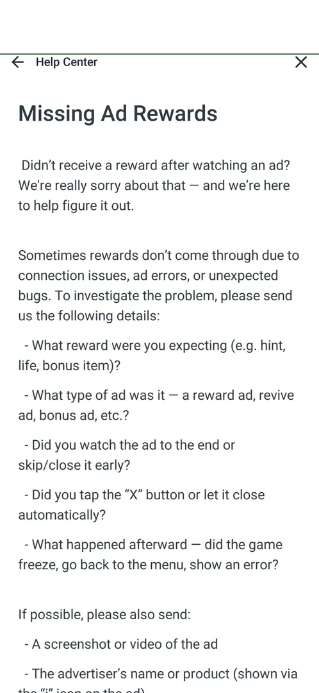
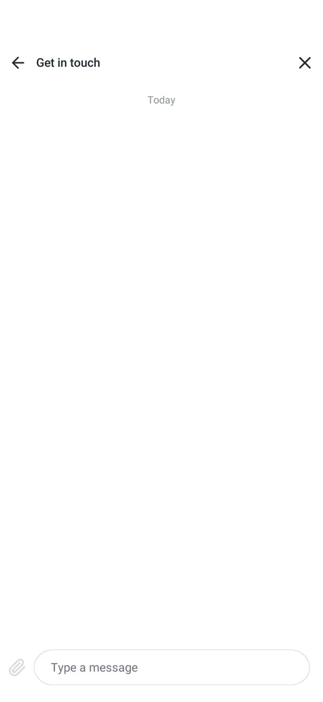
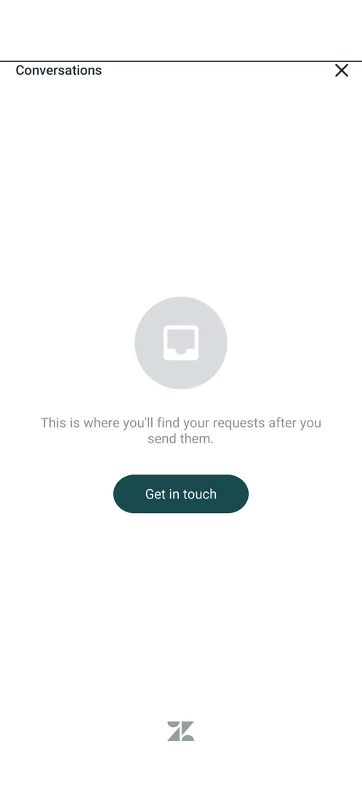

# Support

The player's way to the developer's help: a "Need Help?" popup opened from Settings with two buttons, FAQ (an in-app help center with articles) and Support (an in-app inbox and chat with the support team). Both are Zendesk screens shown inside the game; nothing leaves the app [^s2] [^s8].

## Why it appeared

The Support row is in Settings from the first launch of a fresh install [^s1].

## Where to find it

Home screen > the gear at the top right > Settings > Support, the fourth row, with an envelope icon [^s1]. A tap on the row closes Settings and opens the "Need Help?" popup [^s2].

 [^s1]
*Settings: the Support row, fourth from the top, with an envelope icon*

## What it looks like

A small popup titled "Need Help?" over the dimmed home screen: two green buttons, FAQ (a question-mark magnifier icon) and Support (an envelope icon), and a blue X at its top right corner that closes it [^s2].

 [^s2]
*The "Need Help?" popup: FAQ, Support, and the blue X at the top right*

## What you can do

| Tab or button | What it does |
|---|---|
| [FAQ](#faq) | Opens the in-app Help Center "FAQ Cryptogram" with 7 sections |
| [FAQ section](#faq-section) | A section of the Help Center: a list of articles |
| [FAQ article](#faq-article) | One article: a text page |
| [Get in touch](#get-in-touch) | Opens an empty support chat with a message field |
| [Support](#support) | Opens the Conversations inbox with the player's requests |

### FAQ

The FAQ button opens a full-screen "Help Center" titled "FAQ Cryptogram" with 7 sections, each with a green arrow: Hot news, How to, Ads, Purchases, Technical Issues, Events, Gameplay. An X at the top right closes it back to the "Need Help?" popup; a dark "Get in touch" button is at the bottom [^s3] [^s9].

 [^s3]
*FAQ: the 7 sections of the Help Center, the X at the top right, "Get in touch" at the bottom*

### FAQ section

A section is a list of articles. Ads holds 4: Missing Ad Rewards, Ads Causing Issues, Offensive Ads, Why So Many Ads?; each has an author line, the name of a support agent of the developer (Joyteractive). A back arrow at the top left returns to the sections, the X closes the Help Center; "Get in touch" stays at the bottom [^s4].

 [^s4]
*The Ads section: four articles; the author lines (an agent's name) are blacked out*

### FAQ article

An article is a text page with a back arrow and an X. "Missing Ad Rewards" asks the player to write in with what reward was expected, the type of ad, whether it was watched to the end, whether it was closed with an X or by itself and what happened after, and if possible a screenshot or video of the ad and the advertiser's name [^s5].

 [^s5]
*An FAQ article: "Missing Ad Rewards", a text page*

### Get in touch

"Get in touch" (in the Help Center and in the Conversations inbox) opens an empty chat titled "Get in touch": a "Today" divider, a "Type a message" field and an attachment clip at the bottom, a back arrow and an X at the top. Nothing was typed or sent [^s6].

 [^s6]
*Get in touch: an empty chat with a "Type a message" field and an attachment clip*

### Support

The Support button opens a "Conversations" screen: an empty inbox with the line "This is where you'll find your requests after you send them.", a "Get in touch" button that opens the chat above, an X at the top right and the Zendesk logo at the bottom. X returns to the "Need Help?" popup [^s7] [^s8].

 [^s7]
*Support: the empty Conversations inbox with "Get in touch"*

## How it works

- Every screen is inside the game (Zendesk in-app screens, version 3.6.1): no browser and no mail app open [^s8].
- Each X closes one layer: the Help Center or the inbox closes back to the "Need Help?" popup, and the popup's blue X closes the popup [^s8].
- It is not a prompt: it opens only when the player taps Support in Settings [^s8].

## Cases

| Case | What was done | Result | Source |
|---|---|---|---|
| Why it appeared <!-- case:chk-appeared --> | Opened Settings on a fresh install | The Support row is there from the first launch | [^s1] |
| Where to find it <!-- case:chk-entry --> | Home > gear > Settings | The Support row, fourth, with an envelope icon | [^s1] |
| What it looks like <!-- case:chk-screen --> | Tapped Support in Settings | The "Need Help?" popup: FAQ, Support, a blue X; Settings closes behind it | [^s2] |
| Every option or button <!-- case:chk-options --> | Tapped FAQ, a section, an article, Get in touch, then Support | FAQ: Help Center (7 sections, articles, Get in touch); Support: Conversations inbox, Get in touch chat; X closes each layer back to the popup | [^s8] |
| Answers of a prompt <!-- case:chk-answers --> | — | Not a prompt: opened by the player from Settings | [^s8] |
| Where it leads out <!-- case:chk-links --> | Tapped FAQ and Support | No browser or mail app: both are in-app Zendesk screens; X brings back the popup | [^s8] |
| FAQ <!-- case:faq --> | FAQ > Ads > Missing Ad Rewards, back, X | In-app Help Center "FAQ Cryptogram": 7 sections, each a list of articles, articles are text pages; X returns to "Need Help?" | [^s9] |
| Support button <!-- case:support-button --> | Support, then X | Zendesk Conversations inbox (empty) with Get in touch, which opens an empty chat; X returns to "Need Help?" | [^s8] |

## Not verified

- Sending a message: what the chat asks for and what reply comes back (not sent on purpose).
- The articles of the other 6 sections.

[^s1]: session 20261003-201504-chrono-2FYKPJ, step 2 — [video at 1:15](https://youtu.be/D5rsIC9WNT8?t=75)
[^s2]: session 20261005-221933-chrono-2FYKPJ, step 9 — [video at 2:05](https://youtu.be/I7zPQ2z7rvA?t=125)
[^s3]: session 20261005-221933-chrono-2FYKPJ, step 10 — [video at 2:22](https://youtu.be/I7zPQ2z7rvA?t=142)
[^s4]: session 20261005-221933-chrono-2FYKPJ, step 11 — [video at 2:32](https://youtu.be/I7zPQ2z7rvA?t=152)
[^s5]: session 20261005-221933-chrono-2FYKPJ, step 12 — [video at 2:50](https://youtu.be/I7zPQ2z7rvA?t=170)
[^s6]: session 20261005-221933-chrono-2FYKPJ, step 14 — [video at 3:00](https://youtu.be/I7zPQ2z7rvA?t=180)
[^s7]: session 20261005-221933-chrono-2FYKPJ, step 16 — [video at 3:20](https://youtu.be/I7zPQ2z7rvA?t=200)
[^s8]: session 20261005-221933-chrono-2FYKPJ, step 17 — [video at 3:29](https://youtu.be/I7zPQ2z7rvA?t=209)
[^s9]: session 20261005-221933-chrono-2FYKPJ, step 15 — [video at 3:09](https://youtu.be/I7zPQ2z7rvA?t=189)
