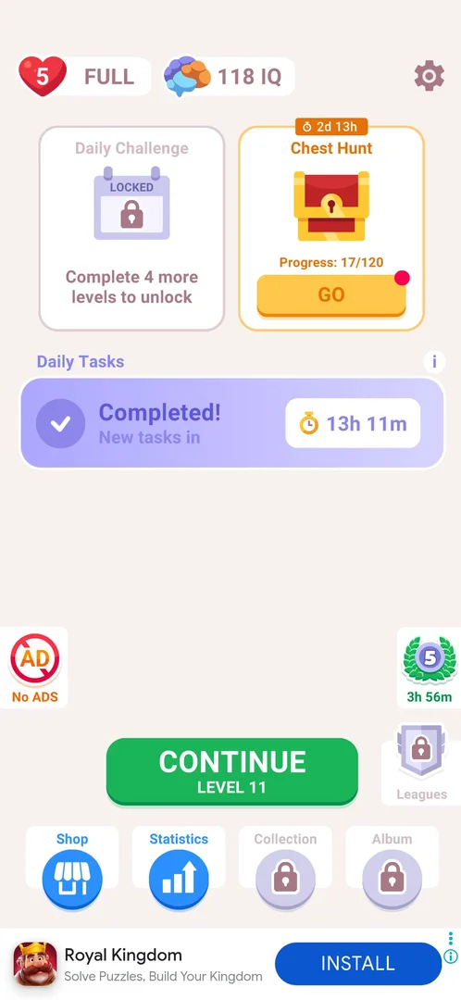
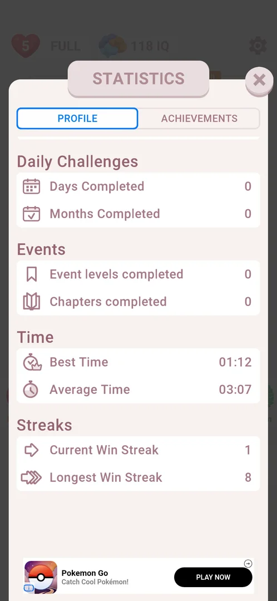
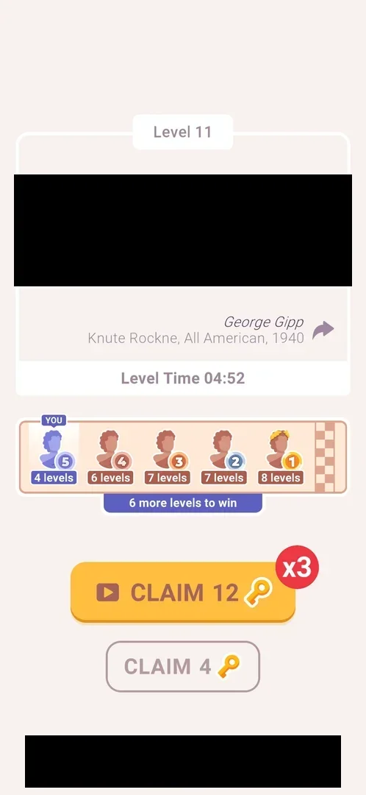

# Win streak banner

The run of levels won in a row. It shows in two places: a banner on the level win card, "AWESOME / A New Longest Win Streak!", when the run becomes the longest so far [^s1] [^s3], and two counters, Current Win Streak and Longest Win Streak, in the Streaks section of Statistics > Profile [^s2]. The banner takes the place of the other win-card banners (best time, faster than other players). No counter on home or in a level, no reward and no offer to keep the run were seen [^s2] [^s8] [^s9].

## Why it appeared

It first showed on the win card of level 6 [^s1]. Level 2 had been lost twice in earlier sessions before it was won (see [Mistakes counter](mistakes-counter.md)), so at level 6 the wins in a row were levels 2-6 (inferred). Hypothesis: the banner shows whenever the current run of wins beats the longest one recorded; not verified.

## Where to find it

The banner has no control that opens it: it shows by itself on the win card, under the quote card and its Level Time line, above NEXT [^s1].

The counters are in Statistics: the Statistics button in the home bottom bar (second from the left, between Shop and Collection) opens the Statistics sheet on its Profile tab; Streaks is the last section, reached by scrolling down [^s7] [^s2]. See [Statistics](statistics.md).

 [^s7]
*The Statistics button in the home bottom bar, second from the left*

## What it looks like

On the win card: a purple header "AWESOME" over a white box with "A New Longest Win Streak!" between two party poppers [^s1]. On level 8 the same banner showed again, above the Chest Hunt claim buttons [^s3].

 [^s1]
*The streak banner on the level 6 win card (the decoded quote and the banner ad are blacked out)*

In Statistics > Profile: the section "Streaks" with two rows, Current Win Streak (a single-arrow icon) and Longest Win Streak (a triple-arrow icon), each with its number on the right; it sits under the Time section (Best Time, Average Time) [^s2].

 [^s2]
*The Streaks section at the bottom of Statistics > Profile: Current Win Streak 1, Longest Win Streak 8*

During a level nothing shows the run: the level 11 board has the home icon, the Mistakes counter, the no-ads button, the gear, the hint pack and the hint bulb, and no streak counter or badge [^s8].

A win that does not extend the run gets no streak banner: the level 11 win card (the level had been lost once before) showed the Level Time line and the Quote Race strip in the banner place [^s10].

 [^s10]
*A win after a loss on the same level: no streak banner (the decoded film line and the banner ad are blacked out)*

## How it works

The banner slot on the win card shows one message per win; in session 003220 (3.6.1):

| Level | Banner |
|---|---|
| 4 | none [^s4] |
| 5 | CONGRATULATIONS! A New Best Time! [^s5] |
| 6 | AWESOME, A New Longest Win Streak! [^s1] |
| 7 | FANTASTIC, Faster than 70.82% of other players! [^s6] |
| 8 | AWESOME, A New Longest Win Streak! [^s3] |

- Level 7 extended the run too, but its card showed the speed banner: inferred, one banner per card, chosen among several messages.
- The level 7 attempt cut short by an ad and a restart before the board (recorded as a quit) did not stop level 8 from showing the banner [^s3].
- Counters (3.6.1): Current Win Streak 1, Longest Win Streak 8 [^s2]. Before that reading, level 11 had been lost by 3 mistakes (session 024420) and one secret level won since; inferred, the 3-mistake loss reset the current run to 0 and the secret-level win counted as 1. Not verified on a fresh loss.
- Level 11, lost by 3 mistakes in an earlier session, was won with one hint: Statistics then read Levels Completed 11 → 12 and Average Time 03:07 → 03:18 (the win was recorded), but First Try Wins stayed 9 and Current Win Streak stayed 1 (Longest 8) [^s11] [^s12]. Inferred: a level won after a loss on it does not extend the run; whether only first-try wins count is not verified.
- The 3-mistake loss popup (level 12) has Home, Restart and REVIVE (video) and lists heart -1 and the [Chest Hunt](chest-hunt.md) keys only: nothing about the streak and no offer to keep it [^s9]. Current Win Streak after that loss was not read (the phone dropped off).
- No streak counter on home or in a level; no reward seen on the card, on home or in Statistics [^s2] [^s8].

## Cases

| Case | What was done | Result | Source |
|---|---|---|---|
| Why it appeared <!-- case:chk-appeared --> | Won level 6 | The banner on the win card | [^s1] |
| Where to find it <!-- case:chk-entry --> | Looked at the win card; opened Statistics from home | The banner has no entry of its own; the counters are in Statistics > Profile > Streaks | [^s1] [^s2] |
| What it looks like <!-- case:chk-screen --> | Won levels 6, 7 and 8 | AWESOME / A New Longest Win Streak! on levels 6 and 8; level 7 showed FANTASTIC / Faster than 70.82% instead | [^s1] |
| An ad quit does not break it <!-- case:streak-survives-ad-quit --> | Level 7 start blocked by a playable ad, game restarted before the board; then levels 7 and 8 won | Level 8 still showed "A New Longest Win Streak!" | [^s3] |
| Win card under Win streak banner <!-- case:under-win --> | Won levels 6 and 8 | The banner takes the place of the speed banner; nothing else differs | [^s3] |
| The counter <!-- case:chk-counter --> | Opened Statistics from home, scrolled the Profile tab down | Streaks section: Current Win Streak 1, Longest Win Streak 8; no counter on home or in a level | [^s2] |
| A win after a loss on the same level <!-- case:non-first-try-win --> | Won level 11 (lost once in an earlier session) with one hint, then opened Statistics | Levels Completed 11 → 12, First Try Wins stays 9, Current Win Streak stays 1; the win card has no streak banner | [^s12] |
| The reward <!-- case:chk-rewards --> | — | not verified |  |
| What shows during a level <!-- case:chk-in-level --> | Played level 11 with a run of 1 | Nothing: home icon, Mistakes, no-ads, gear, hint pack, bulb; no streak counter or badge | [^s8] |
| What breaks it <!-- case:chk-break --> | — | not verified (the counters suggest a 3-mistake loss resets it, inferred) |  |
| Offers to keep it <!-- case:chk-save --> | Made 3 mistakes on level 12 | No offer: the popup has Home, Restart and REVIVE (video) and lists heart -1 and Chest Hunt keys only | [^s9] |
| Home icon in level under Win streak banner <!-- case:under-quit --> | — | not verified |  |
| Restart from the loss popup under Win streak banner <!-- case:under-restart --> | — | not verified |  |
| Force-stop mid-level under Win streak banner <!-- case:under-exit-app --> | — | not verified |  |
| Lose by 3 mistakes under Win streak banner <!-- case:under-loss-3-mistakes --> | Made 3 mistakes on level 12 | As the base (plus Chest Hunt's key -N); no streak text on the popup. The counter after the loss not read | [^s9] |

## Not verified

- The reward for each step of the streak <!-- case:chk-rewards -->
- What breaks it (a loss, a quit, a missed day) and what the break costs; the Current 1 / Longest 8 reading after a 3-mistake loss and one win suggests the loss resets it, and Current stayed 1 after the level 11 win that followed a loss on that level (inferred); the counter right after the level 12 loss was not read <!-- case:chk-break -->
- Home icon in level under Win streak banner: whether a quit breaks the run <!-- case:under-quit -->
- Restart from the loss popup under Win streak banner <!-- case:under-restart -->
- Force-stop mid-level under Win streak banner <!-- case:under-exit-app -->

[^s1]: session 20261006-003220-chrono-2FYKPJ, step 29 — [video at 8:57](https://youtu.be/W0PeVNo113E?t=537)
[^s2]: session 20261006-104733-chrono-2FYKPJ, step 2 — [video at 0:55](https://youtu.be/E5KV2EW_cOY?t=55)
[^s3]: session 20261006-003220-chrono-2FYKPJ, step 70 — [video at 22:31](https://youtu.be/W0PeVNo113E?t=1351)
[^s4]: session 20261006-003220-chrono-2FYKPJ, step 6 — [video at 1:50](https://youtu.be/W0PeVNo113E?t=110)
[^s5]: session 20261006-003220-chrono-2FYKPJ, step 17 — [video at 5:25](https://youtu.be/W0PeVNo113E?t=325)
[^s6]: session 20261006-003220-chrono-2FYKPJ, step 57 — [video at 18:46](https://youtu.be/W0PeVNo113E?t=1126)
[^s7]: session 20261006-104733-chrono-2FYKPJ, step 1 — [video at 0:46](https://youtu.be/E5KV2EW_cOY?t=46)

[^s8]: session 20261006-131052-chrono-2FYKPJ, step 10 — [video at 5:45](https://youtu.be/2fot0pfWAP0?t=345)
[^s9]: session 20261006-131052-chrono-2FYKPJ, step 33 — [video at 16:42](https://youtu.be/2fot0pfWAP0?t=1002)
[^s10]: session 20261006-131052-chrono-2FYKPJ, step 19 — [video at 8:45](https://youtu.be/2fot0pfWAP0?t=525)
[^s11]: session 20261006-131052-chrono-2FYKPJ, step 2 — [video at 0:47](https://youtu.be/2fot0pfWAP0?t=47)
[^s12]: session 20261006-131052-chrono-2FYKPJ, step 24 — [video at 13:19](https://youtu.be/2fot0pfWAP0?t=799)
