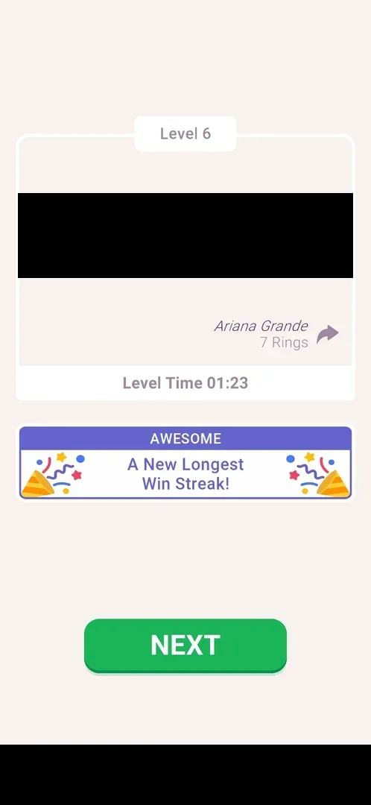

# Win streak banner

A banner on the level win card, "AWESOME / A New Longest Win Streak!", that tells the player the run of wins in a row is the longest so far. It takes the place of the other win-card banners (best time, faster than other players); no streak counter or reward was seen [^s1] [^s2].

## Why it appeared

It first showed on the win card of level 6 [^s1]. Level 2 had been lost twice in earlier sessions before it was won (see [Mistakes counter](mistakes-counter.md)), so at level 6 the wins in a row were levels 2-6 (inferred). Hypothesis: the banner shows whenever the current run of wins beats the longest one recorded; not verified.

## Where to find it

<!-- no-entry: the banner has no control that opens it; it shows on the win card by itself -->
No control opens it: it is a banner on the win card, under the quote card and its Level Time line, above NEXT [^s1].

## What it looks like

A purple header "AWESOME" over a white box with "A New Longest Win Streak!" between two party poppers [^s1]. On level 8 the same banner showed again, above the Chest Hunt claim buttons [^s2].

 [^s1]
*The streak banner on the level 6 win card (the decoded quote and the banner ad are blacked out)*

## How it works

The banner slot on the win card shows one message per win; in this session (3.6.1):

| Level | Banner |
|---|---|
| 4 | none [^s3] |
| 5 | CONGRATULATIONS! A New Best Time! [^s4] |
| 6 | AWESOME, A New Longest Win Streak! [^s1] |
| 7 | FANTASTIC, Faster than 70.82% of other players! [^s5] |
| 8 | AWESOME, A New Longest Win Streak! [^s2] |

- Level 7 extended the run too, but its card showed the speed banner: inferred, one banner per card, chosen among several messages.
- The level 7 attempt cut short by an ad and a restart before the board (recorded as a quit) did not stop level 8 from showing the banner [^s2].
- No counter of the streak and no reward were seen on the card or on home.

## Cases

| Case | What was done | Result | Source |
|---|---|---|---|
| Why it appeared <!-- case:chk-appeared --> | Won level 6 | The banner on the win card | [^s1] |
| Where to find it <!-- case:chk-entry --> | Looked at the win card | No entry of its own: a banner on the win card | [^s1] |
| What it looks like <!-- case:chk-screen --> | Won levels 6, 7 and 8 | AWESOME / A New Longest Win Streak! on levels 6 and 8; level 7 showed FANTASTIC / Faster than 70.82% instead | [^s1] |
| An ad quit does not break it <!-- case:streak-survives-ad-quit --> | Level 7 start blocked by a playable ad, game restarted before the board; then levels 7 and 8 won | Level 8 still showed "A New Longest Win Streak!" | [^s2] |
| Win card under Win streak banner <!-- case:under-win --> | Won levels 6 and 8 | The banner takes the place of the speed banner; nothing else differs | [^s2] |
| The counter <!-- case:chk-counter --> | — | not verified |  |
| The reward <!-- case:chk-rewards --> | — | not verified |  |
| What shows during a level <!-- case:chk-in-level --> | — | not verified |  |
| What breaks it <!-- case:chk-break --> | — | not verified |  |
| Offers to keep it <!-- case:chk-save --> | — | not verified |  |
| Home icon in level under Win streak banner <!-- case:under-quit --> | — | not verified |  |
| Restart from the loss popup under Win streak banner <!-- case:under-restart --> | — | not verified |  |
| Force-stop mid-level under Win streak banner <!-- case:under-exit-app --> | — | not verified |  |
| Lose by 3 mistakes under Win streak banner <!-- case:under-loss-3-mistakes --> | — | not verified |  |

## Not verified

- The counter: whether the streak length is shown anywhere (Statistics was not opened) <!-- case:chk-counter -->
- The reward for each step of the streak <!-- case:chk-rewards -->
- What shows during a level while the streak runs <!-- case:chk-in-level -->
- What breaks it (a loss, a quit, a missed day) and what the break costs <!-- case:chk-break -->
- Offers to keep it after a break and their price <!-- case:chk-save -->
- Home icon in level under Win streak banner: whether a quit breaks the run <!-- case:under-quit -->
- Restart from the loss popup under Win streak banner <!-- case:under-restart -->
- Force-stop mid-level under Win streak banner <!-- case:under-exit-app -->
- Lose by 3 mistakes under Win streak banner: whether the next win's card drops the banner <!-- case:under-loss-3-mistakes -->

[^s1]: session 20261006-003220-chrono-2FYKPJ, step 29 — [video at 8:44](https://youtu.be/W0PeVNo113E?t=524)
[^s2]: session 20261006-003220-chrono-2FYKPJ, step 70 — [video at 21:46](https://youtu.be/W0PeVNo113E?t=1306)

[^s3]: session 20261006-003220-chrono-2FYKPJ, step 6 — [video at 1:50](https://youtu.be/W0PeVNo113E?t=110)
[^s4]: session 20261006-003220-chrono-2FYKPJ, step 17 — [video at 5:18](https://youtu.be/W0PeVNo113E?t=318)
[^s5]: session 20261006-003220-chrono-2FYKPJ, step 57 — [video at 18:07](https://youtu.be/W0PeVNo113E?t=1087)
