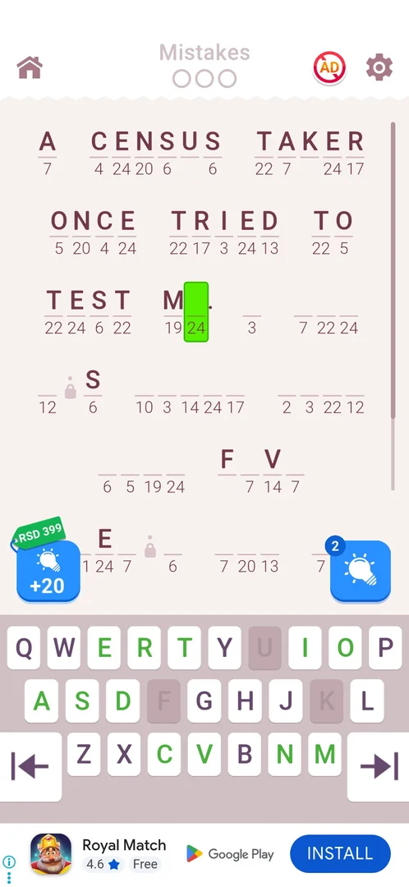

# Cryptogram: Word Logic Puzzles

[Google Play](https://play.google.com/store/apps/details?id=com.crypt.gram.puzz) · version 3.6.1

A word puzzle: a famous quote is coded with numbers, one number per letter, and the player types the
letters. Single and double lockers (from level 10) hide cells. Around the core: 5 lives (one per
30 min), an IQ score, hints, Daily Tasks in sets of three with a secret level as the bar reward, a
Daily Challenge and Collection (after level 14), a Quote Race event, a Chest Hunt key event, a Peter Pan
card-letter event, an Album (level 99) and Leagues (level 50), a shop, statistics, and many
interstitial ads.

## Coverage
- 8 sessions on a progressed install (from level 9): main levels 9-15, the Daily Challenge of
  October 1 and secret level 1 won; level 16 reached three times past its ads but never played (the
  sessions crashed on the output filter, see the [playbook](agent/playbook.md)). FTUE not played from
  scratch; discovery is open.
- 18 features, 51 of 73 cases verified, none fully documented yet. Feature pages:
  [Quote Race](features/quote-race.md), [hints](features/hints.md),
  [interstitial ads](features/interstitial-ads.md).
- Levels met so far, with their starting boards: [levels.md](levels.md).
- All features and cases: [features.md](features.md); tasks: [tasks.md](tasks.md).

## For the agent
[How to play](agent/playbook.md) · [routes](agent/routes.md) · [tactics](agent/tactics.md) ·
[lessons](agent/lessons.md) · [metrics](agent/metrics.md) · [levels](levels.md)
