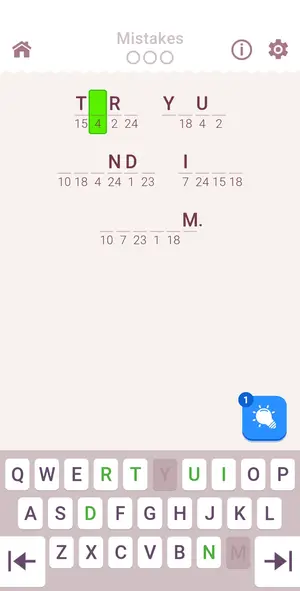

# Levels: Cryptogram: Word Logic Puzzles

Every level the agents met, as its board looked at the start (the ad strips cropped). The notes tell where a new element or rule appears.

| level 1 | level 2 |
|---|---|
| no frame |  |

## Tries

| Level | Mechanic | Result | Time | Note |
|---|---|---|---|---|
| level 1 | cryptogram | 1 won | 113 s | tutorial level, solver did 8 moves, last letter by hand (solver ambiguous) |
| level 2 | cryptogram | 1 lost, 2 quit | — | left via home icon to check quit cost |
