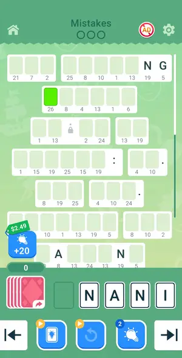
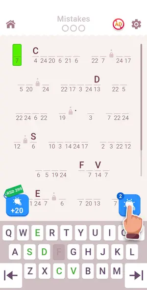
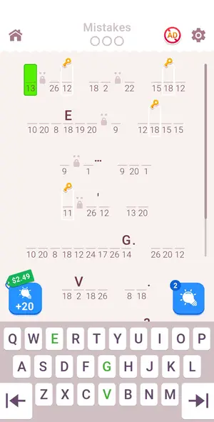
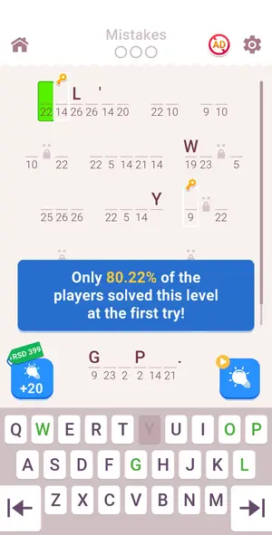
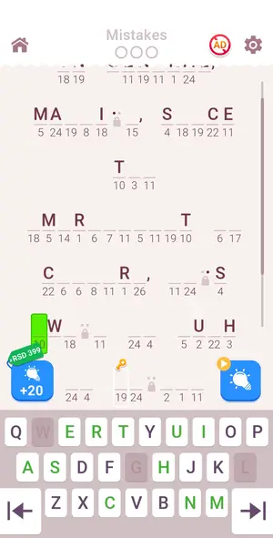
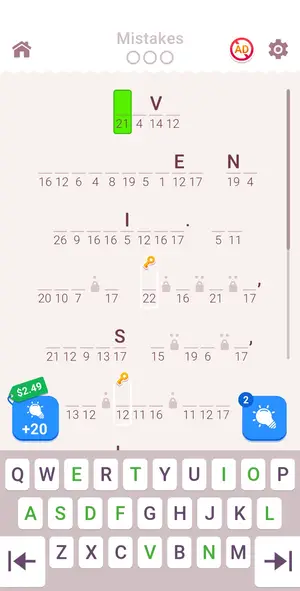
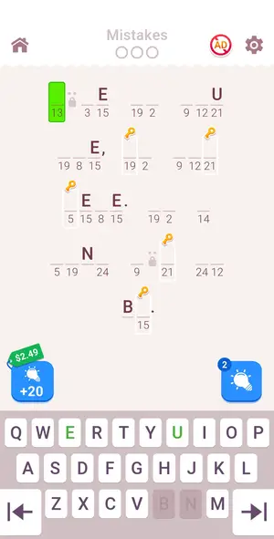
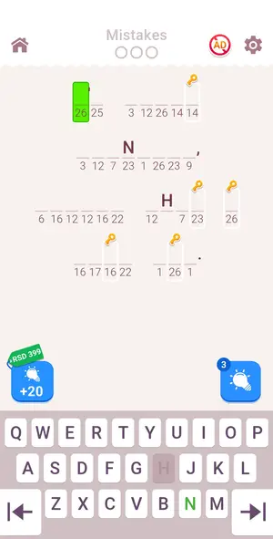
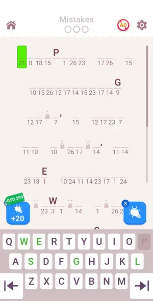
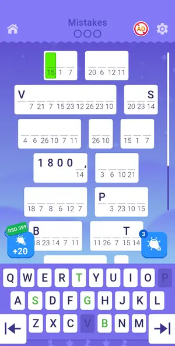

# Levels: Cryptogram: Word Logic Puzzles

Every level the agents met, as its board looked at the start (the ad strips cropped). The notes tell where a new element or rule appears.

| event level 1 | level 9 | level 10 | level 11 | level 12 |
|---|---|---|---|---|
|  |  |  |  |  |

| level 13 | level 14 | level 15 | daily challenge Oct 1 | secret level 1 |
|---|---|---|---|---|
|  |  |  |  |  |

## Tries

| Level | Mechanic | Result | Time | Note |
|---|---|---|---|---|
| event level 1 | card-cryptogram | 1 lost | — | Event level 1 Special Game: decoded at once, but board auto-scroll after placements shifted cells and cost 3 mistakes. Revive ad did not load. Fix: one placement per call when the target or next empty |
| level 9 | cryptogram | 1 won, 1 quit | 57 s | Resumed level 9: map from the board, 2 keyboard batches (10 + 19 taps), 0 mistakes, 0.8 min. Keyboard is fixed, board scroll does not matter |
| level 10 | cryptogram | 1 won | 136 s | Level 10 (double lockers): decoded from 3 givens + word shapes in 1 min, 1-tap probes for lock behaviour, then 3 keyboard batches, 0 mistakes, 2.1 min |
| level 11 | cryptogram | 1 won | 58 s | Level 11: decoded from GIPPER pattern + givens, 2 batches (26+25 taps) incl. lock letters on wrap, 0 mistakes, 0.8 min |
| level 12 | cryptogram | 1 won | 85 s | Level 12: 3 batches + locks on wrap, 0 mistakes, 1.3 min |
| level 13 | cryptogram | 1 won, 1 lost | 138 s | Level 13 retry: single locks typed in order, double locks on wrap; 5 batches, 1 mistake (cause unclear, around WALLS), 2.2 min |
| level 14 | cryptogram | 1 won | 30 s | Level 14: whole quote in one 28-tap batch incl. 2 double-lock O's on wrap, 0.4 min |
| level 15 | cryptogram | 1 won | 58 s | Elton John quote decoded from one shot in ~20 s, 31 taps in 3 batches, 0 mistakes. Key icons on cells are Chest Hunt keys, not locks; cursor fills them normally. |
| daily challenge Oct 1 | cryptogram | 1 won | 177 s | Daily Challenge Oct 1 (Budapest quote, 11 lines, longer than the screen): decoded progressively, 93 taps in 7 batches, 0 mistakes, 2.9 min. The cursor auto-scrolls the board; read new lines after each |
| secret level 1 | cryptogram | 1 won | 100 s | Secret Level (daily-tasks bar reward): purple theme, words in white boxes, same cryptogram rules, a 5-milestone bar (stars/keys) above the keyboard. Fact text (vegetarian), 70 taps in 3 batches, 0 mis |
