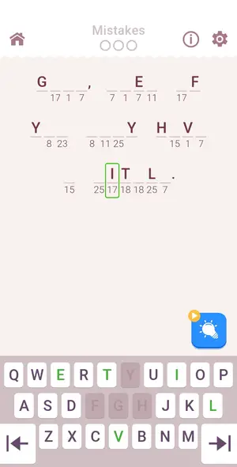
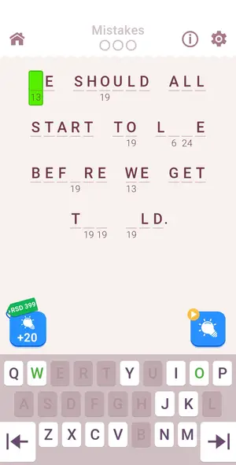
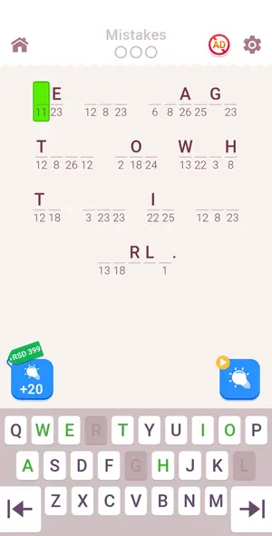
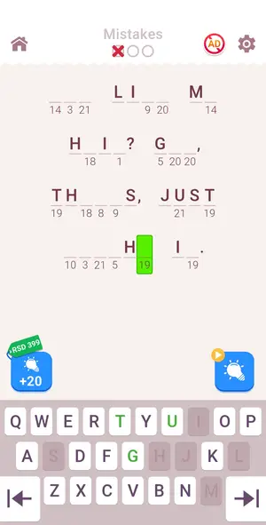
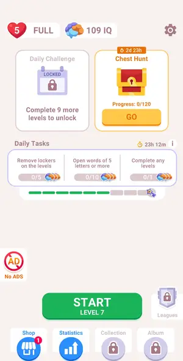
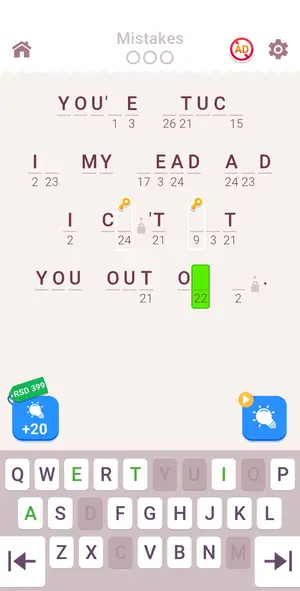
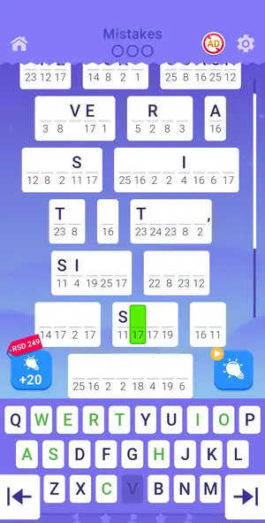
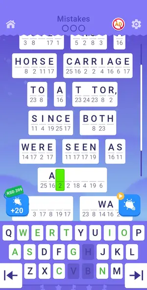

# Levels: Cryptogram: Word Logic Puzzles

Every level the agents met, as its board looked at the start (the ad strips cropped). The notes tell where a new element or rule appears.

| level 1 | level 2 | level 3 | level 4 | level 5 |
|---|---|---|---|---|
| no frame |  |  |  |  |

| level 6 | level 7 | level 8 | level 9 | level 10 |
|---|---|---|---|---|
|  |  |  |  |  |

| level 11 deliberate loss | level 12 | secret level | secret level retry |
|---|---|---|---|
|  |  |  |  |

## Tries

| Level | Mechanic | Result | Time | Note |
|---|---|---|---|---|
| level 1 | cryptogram | 1 won | 113 s | tutorial level, solver did 8 moves, last letter by hand (solver ambiguous) |
| level 2 | cryptogram | 1 won, 2 lost, 2 quit | 98 s | solver typed 28 cells over 3 rounds, last 2 cells of one number by hand (single-number ambiguity again) |
| level 3 | cryptogram | 1 won, 1 quit | 128 s | solver typed 22 cells in 2 rounds, stalled with 5 cells of 3 numbers left (2 near-best solutions, margin 0.21); typed those 5 by hand, 0 mistakes. Tutorial on level 3 (fill known letters) replays afte |
| level 4 | cryptogram | 1 won | 89 s | solver 5 rounds, one toss mistake, last cell by hand |
| level 5 | cryptogram | 1 won | 92 s | solver; last cell by hand |
| level 6 | cryptogram | 1 won | 98 s | solver, last cell by hand |
| level 7 | cryptogram | 1 won, 1 quit | 255 s | solver, 2 tutorial taps, last cell by hand |
| level 8 | cryptogram | 1 won | 116 s | solver, last cell by hand |
| level 9 | cryptogram | 1 won | 279 s | solver stalled on last 5 cells (1 mistake from solver toss), typed by hand; 4m10s; first level with race+chest keys+lockers |
| level 10 | cryptogram | 1 won | 221 s | solver solved incl double lockers in one run; 3m19s |
| level 11 deliberate loss | cryptogram | 1 won, 1 lost, 2 quit | 244 s | solver typed 99 cells, stalled at 0 mistakes on 3 cells of 3 numbers; hint on 1 (key slot), solver 1 more, last cell (one number, word with apostrophe after a name: unknown word) typed by hand. Lab ca |
| level 12 | cryptogram | 1 lost, 1 quit | — | study, not a solver level: one solver round (24 cells, 2 key slots), then Q/Z/X into a known cell for the loss popup |
| secret level | cryptogram | 1 quit | — | secret level: solver patched (3rd white arrow-like box confused keyboard detect), typed 105 moves, then post-win playable ad with no close; restart lost the win, Secret Level still CONTINUE |
| secret level retry | cryptogram | 1 won | 235 s | secret level resumed after ad loss; solver patched for banner and purple theme; last 2 cells typed by hand (study) |
