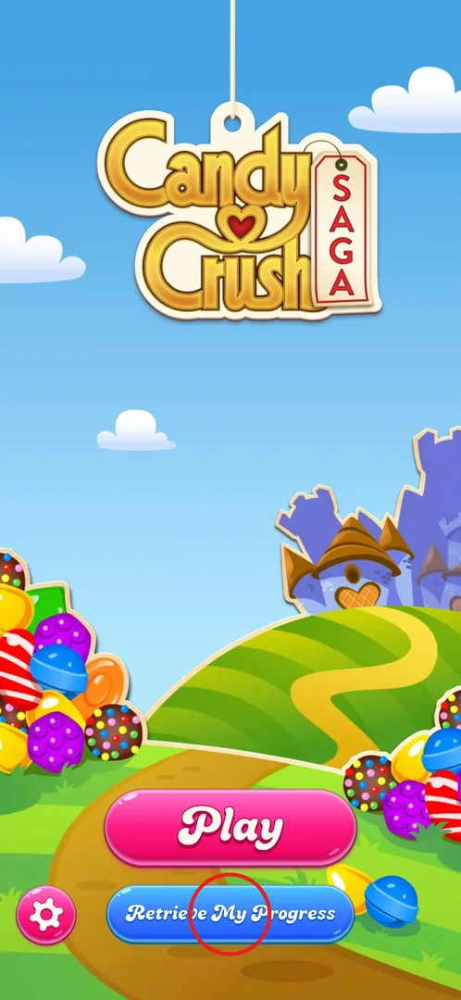
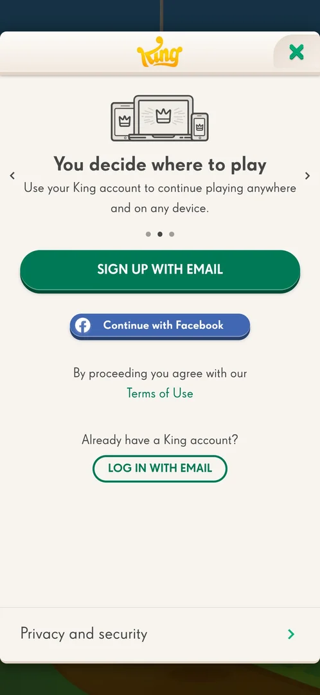
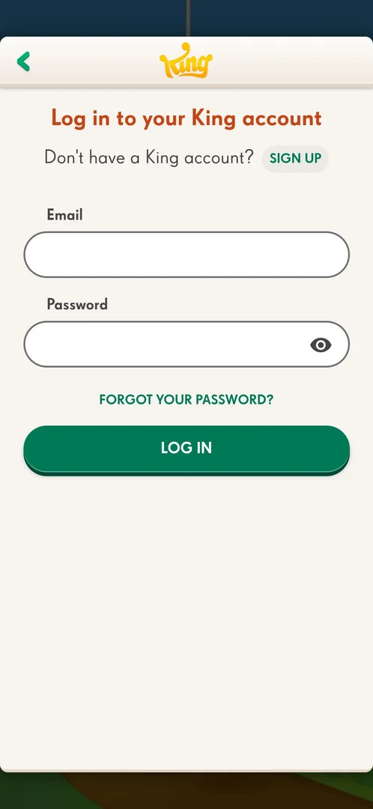

# Retrieve My Progress (King account)

A button on the title screen that opens King's account panel. There the player can create a King account
or log in to an existing one (by e-mail or Facebook), so that the game is saved and can be continued on
another device; the panel also holds King's privacy settings [^s1] [^s2] [^s4]. In the study nothing was
entered and no account was created or signed in to.

## Where to find it

Title screen: the blue Retrieve My Progress button right under Play [^s1]. It is still there after the
first levels have been played on the device (levels 1 to 3 done) [^s2].

 [^s2]

## What it looks like

 [^s4]

A tall white panel over the title screen, with the King logo at the top and a green X in the top-right
corner [^s4]. Under the logo, a carousel of three pages, each with a grey line drawing, a title and one
line of text; small arrows on the sides and three dots show the page [^s4] [^s5]:

1. "Don't lose your progress": save the game and continue where you left off (three smiling stars).
2. "You decide where to play": use the King account on any device (a tablet, a laptop and a phone).
3. "Get more from your games": with a King account the player can get gifts and send and receive lives
   (an envelope and a gift box).

Below the carousel, the same buttons on every page: a big green SIGN UP WITH EMAIL, a blue Continue with
Facebook, a line saying that proceeding means agreeing to the Terms of Use (a green link), then "Already
have a King account?" with an outlined LOG IN WITH EMAIL button. A Privacy and security row with an arrow
runs along the bottom of the panel [^s4].

## What you can do

| Tab or button | What it does |
|---|---|
| [Carousel arrows](#carousel-arrows) | Pages through the three reasons to have an account |
| [Sign up with email](#sign-up-with-email) | Creates a King account (not tapped) |
| [Continue with Facebook](#continue-with-facebook) | Signs in with Facebook (not tapped) |
| [Terms of Use](#terms-of-use) | Opens King's terms in the browser |
| [Log in with email](#log-in-with-email) | Opens the log-in form |
| [Privacy and security](#privacy-and-security) | Opens King's privacy settings |
| [X](#x) | Closes the panel |

### Carousel arrows

<!-- no-frame: account panel window, not exported by the harness -->

The right arrow moves to the next page, the dots show which of the three pages is open; the panel's
buttons stay the same on every page [^s4] [^s5].

### Sign up with email

<!-- no-frame: account panel window, not exported by the harness -->

Not tapped: the study does not create accounts.

### Continue with Facebook

<!-- no-frame: account panel window, not exported by the harness -->

Not tapped: the study does not sign in to accounts.

### Terms of Use

<!-- no-frame: the link leaves the game for the browser -->

The green link opens King's Terms of Use page on king.com in a Chrome tab, with a cookie banner on top.
Returning to the game brings back the panel [^s6].

### Log in with email

 [^s7]

Opens "Log in to your King account": a SIGN UP link for players without an account, an Email field, a
Password field with an eye button to show the password, a FORGOT YOUR PASSWORD? link and a green LOG IN
button. A green back arrow at the top left returns to the panel [^s7]. The form was not filled in.

### Privacy and security

<!-- no-frame: account panel window, not exported by the harness; the next page is on the consent page -->

Opens "Privacy and security", personalising the experience across King games: a row for personalised ads
and the right to opt out of selling or sharing personal information, a "Get emails from King" toggle (off
on this install) and a Privacy Policy link at the bottom [^s3]. The personalised ads page is shown on
[Terms of Use consent](consent.md) [^s8].

### X

<!-- no-frame: account panel window, not exported by the harness -->

Closes the panel and returns to the title screen [^s2].

## How it works

- Nothing on the panel has to be done: X closes it and Play still starts the game without an account
  [^s2].
- The account is shared across King games: the privacy page speaks of "King games" and the third carousel
  page promises gifts and lives through it (version 1.335.1.2) [^s3] [^s5].
- Once the panel opened straight on its Privacy and security page instead of the carousel; the back arrow
  led to the carousel (why is not known) [^s3].

## Cases

| Case | What was done | Result | Source |
|---|---|---|---|
| Page through the carousel | Tapped the right arrow twice | ✅ Three pages: Don't lose your progress, You decide where to play, Get more from your games | [^s4] [^s5] |
| Look at the log-in form | Tapped LOG IN WITH EMAIL, then the back arrow | ✅ E-mail and password form with show-password, forgot password, log in and sign up; nothing entered | [^s7] |
| Open the Terms of Use link | Tapped the link | ✅ king.com terms page opened in Chrome; returning to the game showed the panel again | [^s6] |
| Close the panel | Tapped X | ✅ Back on the title screen | [^s2] |
| See the other options | Looked at Sign up with email and Continue with Facebook | ✅ Shown on every carousel page; not tapped | [^s2] |

## Not verified

- What signing in to an existing account restores, and what happens if the device already has progress.
- What Sign up with email and Continue with Facebook ask for.
- Whether the button stays on the title screen after an account is linked.

[^s1]: session 20261001-202316-chrono-2FYKPJ, step 1 — [video at 0:12](https://youtu.be/EORPFmWikL0?t=12)
[^s2]: session 20261001-232021-chrono-2FYKPJ, step 13 — [video at 2:27](https://youtu.be/3u8PuF6BhwY?t=147)
[^s3]: session 20261001-232021-chrono-2FYKPJ, step 3 — [video at 0:37](https://youtu.be/3u8PuF6BhwY?t=37)
[^s4]: session 20261001-232021-chrono-2FYKPJ, step 7 — [video at 1:21](https://youtu.be/3u8PuF6BhwY?t=81)
[^s5]: session 20261001-232021-chrono-2FYKPJ, step 8 — [video at 1:40](https://youtu.be/3u8PuF6BhwY?t=100)
[^s6]: session 20261001-232021-chrono-2FYKPJ, step 9 — [video at 1:43](https://youtu.be/3u8PuF6BhwY?t=103)
[^s7]: session 20261001-232021-chrono-2FYKPJ, step 11 — [video at 2:13](https://youtu.be/3u8PuF6BhwY?t=133)
[^s8]: session 20261001-232021-chrono-2FYKPJ, step 4 — [video at 0:54](https://youtu.be/3u8PuF6BhwY?t=54)
