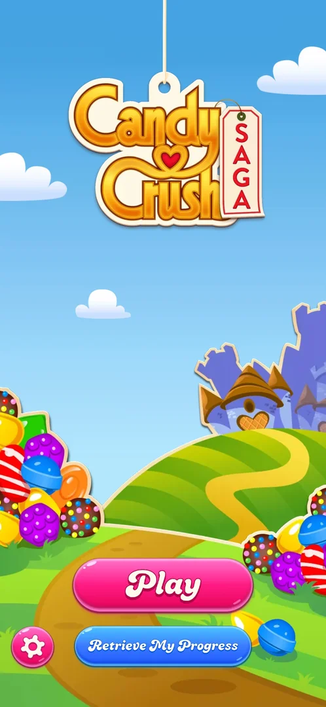
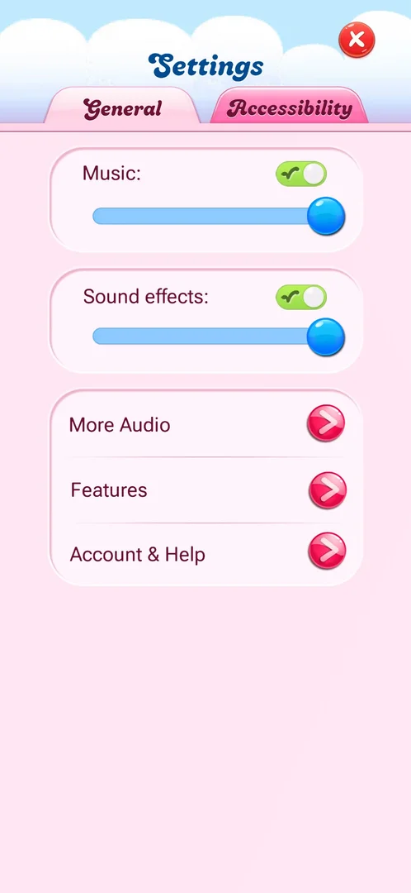
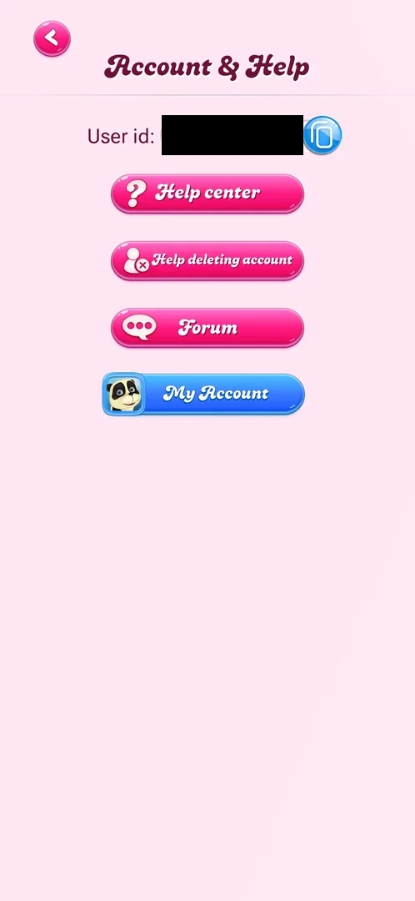

# Account and Retrieve My Progress

The player's account: a numeric user id shown in the game, links to King's help, account deletion help and
forum, and a King account panel where progress can be saved by signing up with an e-mail address or
Facebook, or restored by logging in to an existing King account [^s1]
[^s2]. The game is played without an account: none was created and the
levels and the map worked [^s3].

## Why it appeared

It is there from the first launch: the title screen shows a Retrieve My Progress button under Play
[^s4]. Inside the game it is reached from Settings > Account & Help
[^s5]. No prompt to create an account was seen in either session; the panel
opened only when its button was tapped [^s3].

## Where to find it

Two ways in:

- **Title screen:** the Retrieve My Progress button under Play [^s4]. Not
  tapped.
- **From the map:** the gear at the top right of the map opens Settings; on its General tab, the Account &
  Help row (third row, red arrow button) opens the Account & Help screen; its blue My Account button opens
  the King account panel [^s5] [^s1]
  [^s2].

 [^s4]
*Retrieve My Progress, the button under Play on the title screen*

 [^s5]
*The Account & Help row, the last row of the Settings General tab (Settings opens from the gear at the top right of the map)*

## What it looks like

 [^s1]
*Account & Help: the user id (blacked out here) and four buttons; My Account is the blue one*

Account & Help is a full screen with a back arrow at the top left. At the top, "User id:" with a number and
a blue copy button; below, three pink buttons (Help center, Help deleting account, Forum) and a blue My
Account button that carries the player's avatar [^s1].

## What you can do

| Tab or button | What it does |
|---|---|
| [User id and help links](#user-id-and-help-links) | The user id with a copy button; Help center, Help deleting account and Forum leave the game |
| [My Account](#my-account) | Opens the King account panel: sign up, Facebook, log in |
| [Log in with email](#log-in-with-email) | The log-in form of an existing King account |
| [Sign up with email](#sign-up-with-email) | The form that creates a King account |

### User id and help links

 [^s1]
*The user id row and the three pink help buttons*

The Account & Help screen above (see [What it looks like](#what-it-looks-like)): the user id with a blue
copy button, and three pink buttons, Help center, Help deleting account and Forum. None was tapped: they lead
out of the game [^s3].

### My Account

<!-- no-frame: the King account panel is a separate window of the game (Panel); the harness refuses its frames as personal data -->

A white panel with the King logo at the top and a green X at the top right that closes it
[^s2]. It opens on a carousel of three slides (three dots, arrows left and
right): the first is titled "Don't lose your progress" with three smiling stars, the second "You decide where
to play" with a phone, a tablet and a laptop, each with a short line about saving progress and playing it on
any device [^s2] [^s6]. The third slide was not
opened. Under the carousel:

- a green SIGN UP WITH EMAIL button;
- a blue Continue with Facebook button;
- a line saying that proceeding means agreeing with the Terms of Use (a link);
- "Already have a King account?" with an outlined LOG IN WITH EMAIL button;
- a Privacy and security row at the bottom with an arrow [^s2].

Continue with Facebook, Terms of Use and Privacy and security were not tapped
[^s3].

### Log in with email

<!-- no-frame: a frame of the King account panel (Panel); refused by the harness -->

Titled "Log in to your King account", with a SIGN UP shortcut for players without an account; an Email field,
a Password field with an eye button that shows the password, a FORGOT YOUR PASSWORD? link and a green LOG IN
button. A green back arrow at the top left returns to the panel [^s7]
[^s8]. Nothing was submitted: the session had no credentials
[^s3].

### Sign up with email

<!-- no-frame: a frame of the King account panel (Panel); refused by the harness -->

Titled "Create your King account!", with a LOG IN shortcut; Email and Password fields (with the eye button)
and a green CREATE A KING ACCOUNT button; under it a line that creating an account accepts the Terms of Use
and the Privacy Policy (both links) [^s9]. Not submitted
[^s3].

## How it works

Version 1.337.0.2. The account is optional: the levels and the map worked with no account
[^s3]. Two account kinds are offered: a King account (e-mail and password) and
Facebook [^s2]. The panel is not a prompt: it opened only from My Account,
closed with its X, and did not come back during the session [^s3]. Inferred
from the panel's texts: an account keeps the progress and moves it to another device; not verified.

## Cases

| Case | What was done | Result | Source |
|---|---|---|---|
| Entry: map > gear (top right) > Settings, General tab > Account & Help > My Account (blue button, King panel); also Retrieve My Progress on the title screen <!-- case:chk-entry --> | Opened Settings from the map, then Account & Help and My Account | ✅ As listed | [^s3] |
| Screen: Account & Help with the user id and copy button, Help center, Help deleting account, Forum, My Account; My Account is the King panel with a 3-slide carousel, Sign up with email, Continue with Facebook, Log in with email, Terms of Use, Privacy and security <!-- case:chk-screen --> | Opened both | ✅ As listed; the panel's frames could not be kept (the harness refuses them) | [^s3] |
| Options: Log in with email (e-mail and password form, forgot password, eye toggle, Sign up link) and Sign up (create-account form) <!-- case:chk-options --> | Opened both forms, submitted nothing; Facebook not tapped | ✅ Forms seen; no account created or logged in | [^s3] |
| Answers: is it a prompt, and does it come back <!-- case:chk-answers --> | Closed the panel with X, played on | ✅ Not a prompt; it did not come back | [^s3] |
| Why it appeared <!-- case:chk-appeared --> | Fresh install | ✅ Retrieve My Progress on the title screen; Account & Help in Settings | [^s4] |

> ⚠️ **Previously** (corrected 2026-10-06): this page listed the links case as verified.
> "Links: Help center, Forum, Help deleting account, Terms of Use, Privacy and security: not opened
> (they leave the game); seen as buttons and links only" [^s3]. Seeing the links does not show where
> they lead, which is what the case asks; none was opened.

## Not verified

- Signing up, logging in, and Continue with Facebook: what changes in the game after an account is linked
  (the session had no credentials).
- Retrieve My Progress on the title screen: not tapped; inferred to open the same King log-in.
- The third slide of the My Account carousel.
- Where Help center, Help deleting account, Forum, Terms of Use and Privacy and security lead, and
  whether each returns straight to the game <!-- case:chk-links -->: seen as buttons and links on
  Account & Help and the King panel [^s3], none opened.
- A frame of the King account panel: the harness refuses its frames, so it is described in words.

[^s1]: session 20261003-225003-chrono-2FYKPJ, step 2 — [video at 0:28](https://youtu.be/EeHt-Knje2A?t=28)
[^s2]: session 20261003-225003-chrono-2FYKPJ, step 3 — [video at 0:35](https://youtu.be/EeHt-Knje2A?t=35)
[^s3]: session 20261003-225003-chrono-2FYKPJ, step 9 — [video at 1:26](https://youtu.be/EeHt-Knje2A?t=86)
[^s4]: session 20261003-194350-chrono-2FYKPJ, step 1 — [video at 0:11](https://youtu.be/OjVVcEHXMyI?t=11)
[^s5]: session 20261003-225003-chrono-2FYKPJ, step 1 — [video at 0:20](https://youtu.be/EeHt-Knje2A?t=20)
[^s6]: session 20261003-225003-chrono-2FYKPJ, step 4 — [video at 0:54](https://youtu.be/EeHt-Knje2A?t=54)
[^s7]: session 20261003-225003-chrono-2FYKPJ, step 5 — [video at 1:05](https://youtu.be/EeHt-Knje2A?t=65)
[^s8]: session 20261003-225003-chrono-2FYKPJ, step 6 — [video at 1:12](https://youtu.be/EeHt-Knje2A?t=72)
[^s9]: session 20261003-225003-chrono-2FYKPJ, step 7 — [video at 1:15](https://youtu.be/EeHt-Knje2A?t=75)
