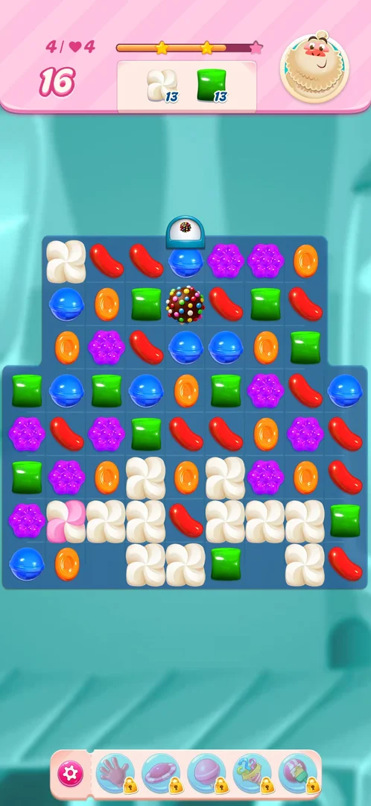
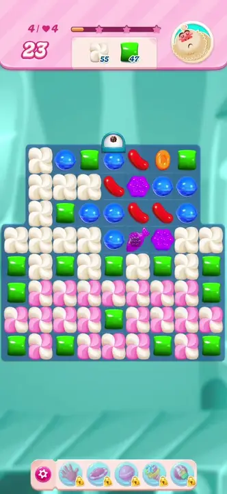

# Candy dispenser

A level element of the [level](core-level.md) board: a small white dome with a blue rim that sits above
the top cell of a column, with the icon of a special candy on it. New candies for that column fall in
through it. On level 2 the domes carry a striped candy icon, on level 4 a [colour bomb](color-bomb.md) icon
[^s4] [^s1]. On level 4 the dome dropped a colour bomb into its column after the third, sixth and ninth
moves of a level [^s6].

## Why it appeared

It is part of the board's layout from the first frame of the level; no tutorial or hint came with it
[^s1] [^s2]. First seen on level 2: two domes with a striped candy icon, one above the left column and one
above the right column [^s4]. Level 4 has one dome with a colour bomb icon above the middle column of its
top row [^s1].

## Where to find it

There is no button: the dispenser is on the board itself. From the map, tap the level 4 node, then **Play!**
in the level popup; the dome is seen on the board once the level loads, not in the popup [^s2].

 [^s2]
*The Level 4 popup over the map: the pink **Play!** button opens the board with the dispenser*

## What it looks like

 [^s1]
*The dispenser: the dome with the colour bomb icon above the top row, in the middle*

The dome stands outside the board, above the top cell of its column, and does not take a cell of its own.
The candy under it is a normal candy that can be swapped and matched [^s1]. The level 4 board in version
1.337.0.2: 25 moves, orders of 65 meringue and 50 green candies [^s1].

### Result

 [^s6]
*The third bomb the dome dropped, after move 9: the sprinkle ball in the second cell under the dome*

 [^s3]
*2026-10-05, after the bomb move: the middle column refilled through the dome with plain candies, a blue right under it*

## How it works

Version 1.337.0.2, level 4.

- **A colour bomb every three moves.** Level 4 was played nine moves with plain three- and four-candy
  matches only, no five-in-a-line swap. A colour bomb appeared in the dome's column after move 3 (moves 22,
  meringue 52, green 47), after move 6 (moves 19, meringue 44, green 39) and after move 9 (moves 16,
  meringue 13, green 13); moves 1, 2, 4, 5, 7 and 8 gave none [^s7]
  [^s8] [^s6].
- **No match in the column needed.** Moves 1 to 3 each cleared a cell of the dome's column; move 9 was a
  four-red line two columns to the left of it, and the bomb still came [^s7]
  [^s6].
- **Where it lands.** The first bomb landed in the fourth cell of the column, the second and the third in
  the second cell under the dome [^s7] [^s8]
  [^s6].

 [^s7]
*Clip 6 s · [original on YouTube from 8:40](https://youtu.be/7Qqt9Jow58Q?t=520)*

- **A dropped bomb is an ordinary colour bomb.** The first one, swapped with a blue on move 4, cleared the
  blues: meringue 52 to 50, green 47 unchanged, moves 22 to 21 [^s9]. The
  second one was gone after move 7, a match with a wrapped candy next to it; meringue went 44 to 13 and
  green 39 to 16 in that move [^s10]. Inferred, not seen frame by frame: the
  wrapped candy's blast set the bomb off.
- **Refill through the dome.** On 2026-10-05 a colour bomb under the dome, made there by a five-blue line,
  was swapped with the green below it; every green cleared, the middle column emptied and refilled from the
  top through the dome with plain candies (blue, blue, orange at the top); moves 24 to 23, meringue 59 to
  23, green 50 to 27 [^s5] [^s3].

 [^s3]
*Clip 3 s · [original on YouTube from 1:43](https://youtu.be/oC4G7CtG6t4?t=103)*

- **The 2026-10-05 run gave no bomb by its third move.** That run started with the five-blue line (a bomb
  made by the player, used on move 2), and after move 3, a four-purple line elsewhere, the blue under the dome
  stayed; the level was quit after move 4 [^s2]. Hypothesis, not verified: the count of three moves does not
  run while a colour bomb is on the board, or starts again when one is made.

## Outcomes

The base level is [core-level](core-level.md). Level 4 was quit both times, after four and after nine
moves [^s2] [^s6].

| Outcome | What happens | Source |
|---|---|---|
| Win: order done | Not reached on a level with a dispenser; level 2 (two striped dispensers) was won the same as the base level | [^s4] |
| Out of moves | Not reached; the dome only supplies candies, no extra way to lose was seen | [^s2] |
| Quit | Same as the base level | [^s2] |

## Cases

| Case | What was done | Result | Source |
|---|---|---|---|
| Why it appeared: the trigger that brought it up (the first launch, a level won, a threshold, a timer, a loss): a fact with its frame, or a hypothesis to test <!-- case:chk-appeared --> | Played level 2 | ✅ Two domes with a striped candy icon on the level 2 board, part of its layout | [^s4] |
| No button: it is on the L4 board, reached via map level 4 > Play (frame 5) <!-- case:chk-entry --> | Map > level 4 > Play! | ✅ The dome is on the board after Play!, not in the popup | [^s2] |
| Cap with a colour-bomb icon on the top row above column 4 (frame 7) <!-- case:chk-screen --> | Looked at the level 4 board at its start | ✅ A white dome with a colour bomb icon above the middle column of the top row | [^s1] |
| Level 4 (65 meringue + 50 green): no tutorial text seen, dispenser visible from the first frame <!-- case:chk-first-level --> | Started level 4 | ✅ No tutorial; first seen earlier, on level 2 (striped icon) | [^s2] |
| Correction (review): no dispense was seen yet. The colour bomb under the cap in frame 9 came from the move itself: a blue swapped up into the middle of 4 blues on the top row (frame 7) is a 5-in-a-line, which makes a colour bomb at the swap cell, and that cell is under the cap. After the bomb was used, the cap's column refilled with plain candies (frame 11); step 8 did not clear the cap's column (frame 13). The real rule is the open case dispense-trigger <!-- case:chk-rules --> | Five-blue line through the cell under the dome; then the bomb swapped with a green; then a four-purple line elsewhere | ✅ The bomb under the dome was left by the five-blue line; the column refilled through the dome with plain candies; the rule itself is under dispense-trigger | [^s5] [^s3] [^s2] |
| Correction (review): the bomb+green clear (meringue 59 to 23, green 50 to 27, frames 9-11) is the colour bomb's own interaction (color-bomb), not the cap's. The cap itself stays in place above column 4 through every blast seen (frames 9-13) <!-- case:chk-interactions --> | Swapped the bomb under the dome with the green below; nine moves on 2026-10-06 with blasts of a colour bomb and a wrapped candy | ✅ The dome stayed above its column through every blast | [^s3] [^s10] |
| No extra way to lose seen: it only supplies candies; level is still out-of-moves bound <!-- case:chk-loss --> | Four moves, then nine moves on level 4 | ✅ None seen | [^s2] [^s6] |
| What the cap with the colour-bomb icon releases and when (after N clears of the cell under it, N moves, or never): goal dispenser-rule-exp <!-- case:dispense-trigger --> | Nine moves on level 4 with plain matches, no five-in-a-line; move 9 away from the dome's column | ✅ A colour bomb after moves 3, 6 and 9, none after the others; a match in the column is not needed | [^s7] [^s6] |

## Not verified

- Why the 2026-10-05 run gave no bomb by move 3 (a player-made bomb had been on the board): hypothesis
  above.
- Whether the dome drops a bomb only when the cell under it is free. In a 2026-10-06 run the player saw no
  bomb drop while the top cell of the column held a candy; one dropped only after a vertical stripe cleared
  that column, and it fell to the bottom row between meringue. This conflicts with the every-three-moves
  count above; the moves of that run were not counted against it (task dispenser-blocked-exp) [^s11]
  <!-- case:dispense-blocked-hypothesis -->
- What the striped-icon domes of level 2 drop, and how often.
- Win and out of moves on level 4 with the dispenser: the level was quit both times.

[^s1]: session 20261005-001914-chrono-2FYKPJ, step 5 — [video at 0:58](https://youtu.be/oC4G7CtG6t4?t=58)
[^s2]: session 20261005-001914-chrono-2FYKPJ, step 8 — [video at 2:15](https://youtu.be/oC4G7CtG6t4?t=135)
[^s3]: session 20261005-001914-chrono-2FYKPJ, step 7 — [video at 1:45](https://youtu.be/oC4G7CtG6t4?t=105)
[^s4]: session 20261003-225003-chrono-2FYKPJ, step 25 — [video at 6:30](https://youtu.be/EeHt-Knje2A?t=390)
[^s5]: session 20261005-001914-chrono-2FYKPJ, step 6 — [video at 1:25](https://youtu.be/oC4G7CtG6t4?t=85)
[^s6]: session 20261006-094912-chrono-2FYKPJ, step 32 — [video at 12:44](https://youtu.be/7Qqt9Jow58Q?t=764)
[^s7]: session 20261006-094912-chrono-2FYKPJ, step 26 — [video at 8:45](https://youtu.be/7Qqt9Jow58Q?t=525)
[^s8]: session 20261006-094912-chrono-2FYKPJ, step 29 — [video at 11:13](https://youtu.be/7Qqt9Jow58Q?t=673)
[^s9]: session 20261006-094912-chrono-2FYKPJ, step 27 — [video at 10:20](https://youtu.be/7Qqt9Jow58Q?t=620)
[^s10]: session 20261006-094912-chrono-2FYKPJ, step 30 — [video at 11:37](https://youtu.be/7Qqt9Jow58Q?t=697)
[^s11]: session 20261006-120721-chrono-2FYKPJ, step 20 — [video at 7:09](https://youtu.be/d7On5DG_97A?t=429)
