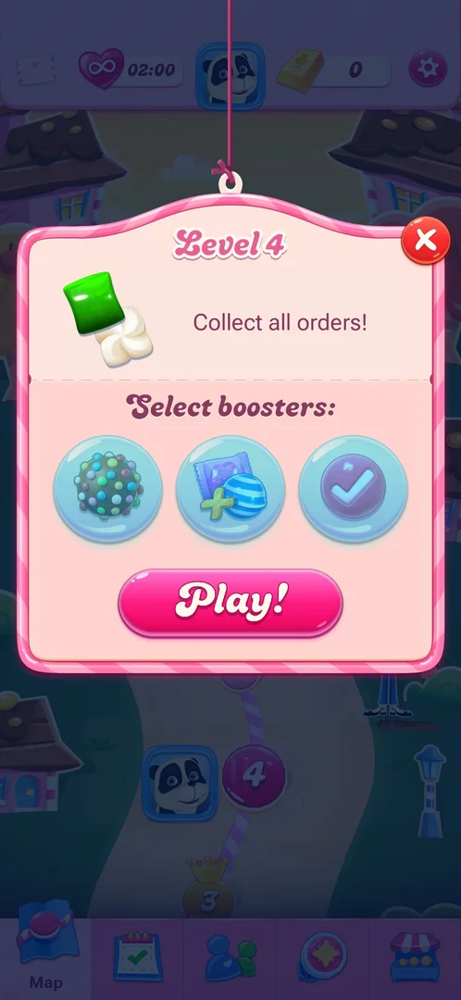
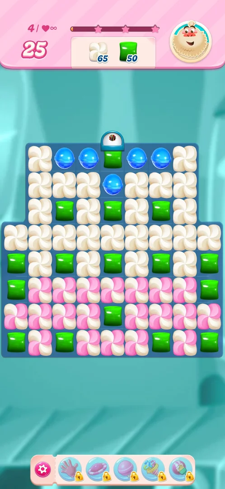
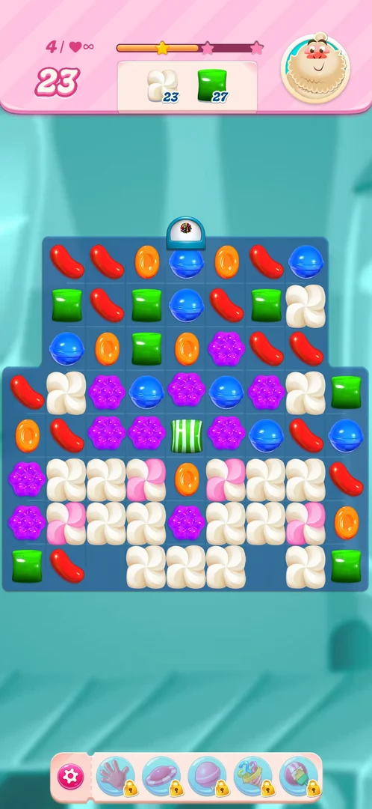
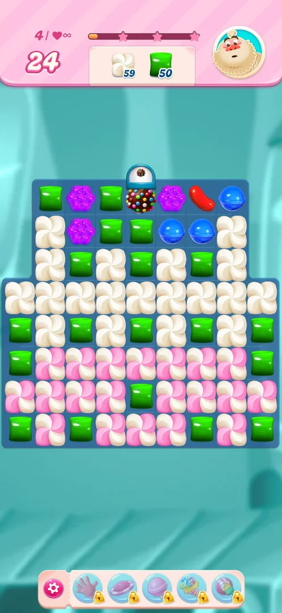
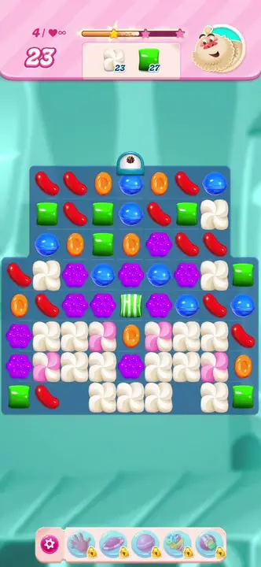

# Candy dispenser

A level element of the [level](core-level.md) board: a small white dome with a blue rim that sits above
the top cell of a column, with the icon of a special candy on it. New candies for that column fall in
through it. On level 2 the domes carry a striped candy icon, on level 4 a [colour bomb](color-bomb.md) icon
[^s4] [^s1]. Inferred from the icon, not seen: the dome adds that special candy to the board from time to
time.

## Why it appeared

It is part of the board's layout from the first frame of the level; no tutorial or hint came with it
[^s1] [^s2]. First seen on level 2: two domes with a striped candy icon, one above the left column and one
above the right column [^s4]. Level 4 has one dome with a colour bomb icon above the middle column of its
top row [^s1].

## Where to find it

There is no button: the dispenser is on the board itself. From the map, tap the level 4 node, then **Play!**
in the level popup; the dome is seen on the board once the level loads, not in the popup [^s2].

 [^s2]
*The Level 4 popup over the map: the pink **Play!** button opens the board with the dispenser*

## What it looks like

 [^s1]
*The dispenser: the dome with the colour bomb icon above the top row, in the middle*

The dome stands outside the board, above the top cell of its column, and does not take a cell of its own.
The candy under it is a normal candy that can be swapped and matched [^s1]. The level 4 board in version
1.337.0.2: 25 moves, orders of 65 meringue and 50 green candies [^s1].

### Result

 [^s3]
*After the bomb move: the middle column refilled through the dome with plain candies, a blue right under it*

## How it works

Version 1.337.0.2, level 4.

- **The cell under the dome.** A swap that lined up five blues in the top row, through the cell under the
  dome, left a colour bomb in that cell; moves 25 to 24, meringue 65 to 59, green 50 [^s5]. This is the
  cell where the swap was made, and a five-candy line makes a colour bomb anywhere on the board (see
  [Colour bomb](color-bomb.md)); the same move on 2026-10-03 gave the same result. So the bomb is not
  evidence that the dome dropped it.

 [^s5]
*The colour bomb under the dome, left by the five-blue line*

- **Refill through the dome.** The bomb swapped with the green below it cleared every green; the middle
  column emptied and refilled from the top through the dome with plain candies (blue, blue, orange at the
  top); moves 24 to 23, meringue 59 to 23, green 50 to 27 [^s3].

 [^s3]
*Clip 3 s · [original on YouTube from 1:43](https://youtu.be/oC4G7CtG6t4?t=103)*

- **Next move.** A four-purple line in the fifth row (moves 23 to 22, meringue 23 to 18) cleared cells in
  other columns; the middle column was not refilled, and the blue under the dome stayed [^s2].
- **Seen in total:** one refill of the dome's column, with plain candies only. No special candy was seen
  coming out of a dome on level 2 or level 4 [^s3] [^s4].

## Outcomes

The base level is [core-level](core-level.md). Level 4 was quit after four moves (unlimited lives were on)
[^s2].

| Outcome | What happens | Source |
|---|---|---|
| Win: order done | Not reached on a level with a dispenser this session; level 2 (two striped dispensers) was won the same as the base level | [^s4] |
| Out of moves | Not reached; the dome only supplies candies, no extra way to lose was seen | [^s2] |
| Quit | Same as the base level | [^s2] |

## Cases

| Case | What was done | Result | Source |
|---|---|---|---|
| Why it appeared: the trigger that brought it up (the first launch, a level won, a threshold, a timer, a loss): a fact with its frame, or a hypothesis to test <!-- case:chk-appeared --> | Played level 2 | ✅ Two domes with a striped candy icon on the level 2 board, part of its layout | [^s4] |
| No button: it is on the L4 board, reached via map level 4 > Play (frame 5) <!-- case:chk-entry --> | Map > level 4 > Play! | ✅ The dome is on the board after Play!, not in the popup | [^s2] |
| Cap with a colour-bomb icon on the top row above column 4 (frame 7) <!-- case:chk-screen --> | Looked at the level 4 board at its start | ✅ A white dome with a colour bomb icon above the middle column of the top row | [^s1] |
| Level 4 (65 meringue + 50 green): no tutorial text seen, dispenser visible from the first frame <!-- case:chk-first-level --> | Started level 4 | ✅ No tutorial; first seen earlier, on level 2 (striped icon) | [^s2] |
| When the cell under the cap is cleared it refills from the dispenser: first refill after a 5-line blue match was a colour bomb (frame 9), later refills (frames 11, 13) were plain candies, so bombs are not every refill <!-- case:chk-rules --> | Five-blue line through the cell under the dome; then the bomb swapped with a green; then a four-purple line elsewhere | ⚠️ The column refills through the dome with plain candies (once). The bomb under the dome was left by the five-blue line in the swapped cell, not by the dome; the third move did not refill the dome's column. The dome dropping a bomb is not verified | [^s5] [^s3] [^s2] |
| Bomb swapped with green cleared all greens and many meringue layers (65 to 23 meringue, 50 to 27 green, frames 9-11); the bomb sits in the column like a normal candy <!-- case:chk-interactions --> | Swapped the bomb under the dome with the green below | ✅ Greens cleared; meringue 59 to 23 in that move (65 to 59 in the move before), green 50 to 27; the bomb sat under the dome like a normal candy | [^s3] |
| No extra way to lose seen: it only supplies candies; level is still out-of-moves bound <!-- case:chk-loss --> | Four moves on level 4 | ✅ None seen | [^s2] |

## Not verified

- Whether a dome ever drops its special candy (a colour bomb on level 4, a striped candy on level 2), and how
  often: not seen in one refill of the level 4 column (chk-rules).
- Win and out of moves on level 4 with the dispenser: the level was quit.

[^s1]: session 20261005-001914-chrono-2FYKPJ, step 5 — [video at 0:58](https://youtu.be/oC4G7CtG6t4?t=58)
[^s2]: session 20261005-001914-chrono-2FYKPJ, step 8 — [video at 2:15](https://youtu.be/oC4G7CtG6t4?t=135)
[^s3]: session 20261005-001914-chrono-2FYKPJ, step 7 — [video at 1:45](https://youtu.be/oC4G7CtG6t4?t=105)
[^s4]: session 20261003-225003-chrono-2FYKPJ, step 25 — [video at 6:30](https://youtu.be/EeHt-Knje2A?t=390)
[^s5]: session 20261005-001914-chrono-2FYKPJ, step 6 — [video at 1:25](https://youtu.be/oC4G7CtG6t4?t=85)
