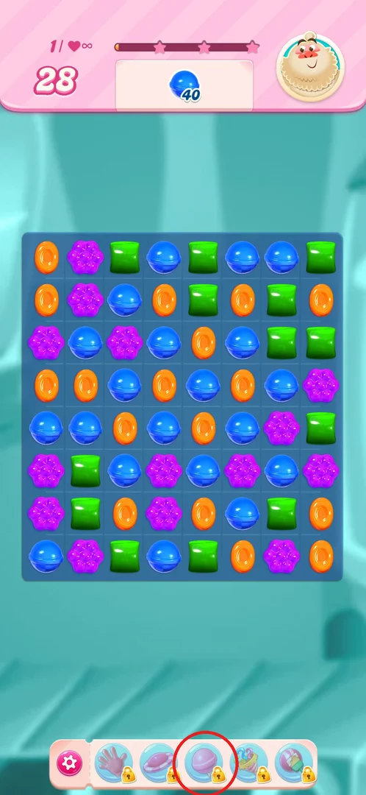
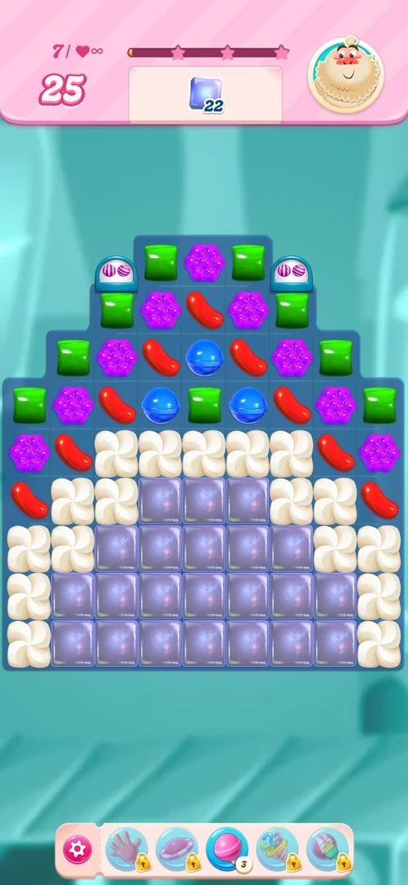
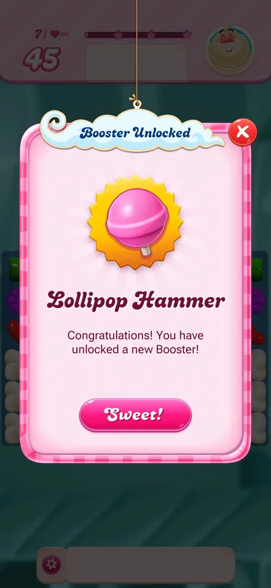

# Pre-level and in-level boosters

Boosters are one-off helpers a player can use on a level. During a level, five booster slots sit in the bar
under the board. On a fresh install all five are locked; they unlock one by one as the player progresses,
the first, the Lollipop Hammer, on arriving at level 7 with 3 free uses [^s1] [^s3] [^s4].

## Where to find it

During any level: the bar under the board, to the right of the pink gear [^s1].

 [^s1]

## What it looks like

Five round slots, each with an icon: a hand, a flying saucer, a lollipop, a group of candies with a
striped one, and a candy with a wrapper. They read as the hand swap, UFO, Lollipop Hammer,
striped-and-wrapped and party boosters (only the Lollipop Hammer's name was shown by the game; the others
are inferred from the icons) [^s1] [^s3]. A locked slot has a small padlock; an unlocked one has no
padlock and a small white badge with the number of uses [^s4].

 [^s4]

## What you can do

| Tab or button | What it does |
|---|---|
| [Booster Unlocked](#booster-unlocked) | Popup announcing a new booster; Sweet! closes it |
| [Lollipop Hammer](#lollipop-hammer) | The first unlocked slot, 3 uses |

### Booster Unlocked

 [^s3]

A pink popup titled "Booster Unlocked" over the level's board, with the booster's icon on a yellow badge,
its name (Lollipop Hammer), a line congratulating the player on a new booster, a pink Sweet! button and a
red X at the top right [^s3]. Sweet! closes the popup and leaves the level ready to play [^s4].

### Lollipop Hammer

<!-- no-frame: not used yet; the slot is visible on the board frame above -->

The third slot, a pink lollipop, unlocked with a count of 3 on level 7 [^s4]. It was not used in the session.

## How it works

- All five slots stayed locked on levels 1 to 6 (version 1.335.1.2) [^s1] [^s2] [^s5].
- The Lollipop Hammer unlocks on arriving at level 7, after level 6 is won: the popup appears before the
  first move, and the slot comes with 3 uses (version 1.335.1.2) [^s3] [^s4].
- The other four slots were still locked on level 7 [^s4].

## Cases

| Case | What was done | Result | Source |
|---|---|---|---|
| See the first booster unlock | Won level 6 and arrived at level 7 | ✅ Booster Unlocked popup for the Lollipop Hammer; Sweet! closed it; the slot shows 3 uses | [^s3] [^s4] |
| See which level unlocks each of the other four slots | <!-- --> | not verified |  |
| Use the Lollipop Hammer on a level | <!-- --> | not verified |  |

## Not verified

- What the Lollipop Hammer does when used, and what happens when its 3 uses run out.
- Which levels unlock the hand, UFO, striped-and-wrapped and party slots.
- What tapping a locked slot shows.
- Pre-level boosters (picked before a level starts): no pre-level screen appeared on levels 1 to 7.

[^s1]: session 20261001-202316-chrono-2FYKPJ, step 5 — [video at 0:46](https://youtu.be/EORPFmWikL0?t=46)
[^s2]: session 20261001-202316-chrono-2FYKPJ, step 31 — [video at 13:17](https://youtu.be/EORPFmWikL0?t=797)
[^s3]: session 20261001-232021-chrono-2FYKPJ, step 52 — [video at 20:54](https://youtu.be/3u8PuF6BhwY?t=1254)
[^s4]: session 20261001-232021-chrono-2FYKPJ, step 53 — [video at 21:22](https://youtu.be/3u8PuF6BhwY?t=1282)
[^s5]: session 20261001-232021-chrono-2FYKPJ, step 33 — [video at 12:28](https://youtu.be/3u8PuF6BhwY?t=748)
