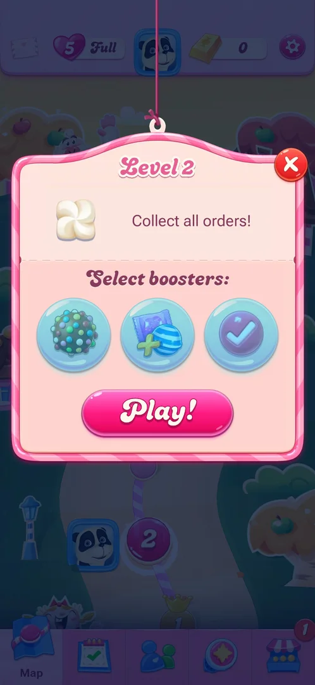
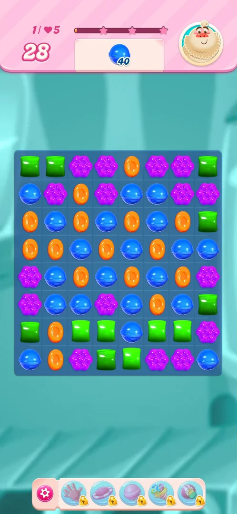

# Boosters (hand, lollipop hammer etc.)

Items that help in a level. They show in three places: the bar under the board during a level, the
"Select boosters" row of the level start popup, and the profile inventory. On a fresh install at level 2,
the in-level bar and the inventory show every booster with a padlock and a count of 0 [^s1] [^s2] [^s3].

## Why it appeared

On level 1, the first level of a fresh install: the bar under the board shows five boosters, each with a
padlock [^s1]. The level at which they unlock is not shown. Hypothesis: they unlock one by one in the first
levels (about levels 3 to 10), not verified.

## Where to find it

- During a level: the bar under the board, right of the gear [^s1].
- Before a level: "Select boosters", the row of three slots above Play! in the level start popup [^s2].
- On the map: the avatar in the top bar opens Profile, whose Inventory lists them [^s3].

 [^s2]
*Select boosters row in the Level 2 start popup, above Play!*

## What it looks like

 [^s1]
*The booster bar under the level 1 board: five boosters, all locked*

The bar under the board: a pink gear, then five round booster buttons with a gold padlock each. By the
icons: a hand, a UFO, a lollipop hammer, a striped and wrapped candy pair, a party popper [^s1].

## What you can do

| Tab or button | What it does |
|---|---|
| [In-level bar](#in-level-bar) | Five locked boosters under the board |
| [Select boosters](#select-boosters) | Three slots in the level start popup |
| [Inventory](#inventory) | The count of each booster, all 0 and locked |

### In-level bar

<!-- no-frame: the bar is on the screen frame above -->
Five boosters with padlocks, right of the gear [^s1]. Not tapped.

### Select boosters

<!-- no-frame: the row is on the entry frame above -->
Three slots in the level start popup: a colour bomb, a striped and wrapped pair, a slot with a tick; no
padlocks [^s2]. Not tapped.

### Inventory

 [^s3]
*Profile, Inventory: ten booster slots locked at 0*

Eleven slots: unlimited lives (open, 0) and ten boosters, each with a padlock and 0. Among the icons: a
colour bomb, a lollipop, a striped and wrapped pair, a hand, a fish [^s3].

## How it works

Version 1.337.0.2. At level 2 every booster count is 0 and the in-level and inventory slots are locked [^s1]
[^s3]. The start popup's three slots show no padlock [^s2]; what they do at a count of 0 was not tried. The
Shop's Daily Deal includes one lollipop (see [Shop](shop.md)) [^s4]. Under the Shop's More Offers, the Basic
Bundle holds two of each booster (lollipop hammer, colour bomb, fish, striped and wrapped pair, free
switch) and the Mega Bundle two of each plus 12 hours of unlimited boosters, all for real money [^s5].

## Cases

| Case | What was done | Result | Source |
|---|---|---|---|
| The Level 2 start popup shows Select boosters with 3 slots (colour bomb, striped+wrapped, a third with a tick) and no lock icons, while the profile inventory shows them locked at 0: find what the slots do at 0 balance and whether they are free or for gold bars <!-- case:pre-level-select --> | — | not verified: the slots were not tapped | [^s2] |
| Why it appeared <!-- case:chk-appeared --> | Played level 1 | ✅ The locked bar under the board from level 1 | [^s1] |
| Where to find it <!-- case:chk-entry --> | Level 1, the Level 2 popup, Profile | Open in the map; seen in three places, as above | [^s2] |
| What it looks like <!-- case:chk-screen --> | Looked at the in-level bar | Open in the map; five locked boosters seen | [^s1] |
| What it does <!-- case:chk-effect --> | — | not verified: all locked |  |
| The balance <!-- case:chk-balance --> | Read the inventory | Open in the map; all 0 in the Profile inventory | [^s3] |
| Sources <!-- case:chk-sources --> | Read the Shop | Open in the map; partly: a lollipop in the Daily Deal, the Shop bundles; other sources not seen | [^s4] [^s5] |
| Shop sources <!-- case:shop-sources --> | Opened More Offers in the Shop | ✅ Daily Deal: 1 lollipop hammer; Basic Bundle: 2 of each booster; Mega Bundle: 2 of each booster and 12 h of unlimited boosters | [^s5] |
| Sinks <!-- case:chk-sinks --> | — | not verified |  |
| At zero <!-- case:chk-empty --> | — | not verified |  |
| Refill timer <!-- case:chk-refill --> | — | not verified |  |

## Not verified

- ⚠️ Previously this page showed as done: the entry (three places), the look (five locked boosters) and the
  balance (all 0). The map keeps them open: chk-entry, chk-screen, chk-balance.
- What the start popup's three slots do at a count of 0, and their price <!-- case:pre-level-select -->
- The level at which each booster unlocks (the hypothesis above)
- The effect of each booster <!-- case:chk-effect -->
- Every source (level rewards, events, packs) <!-- case:chk-sources -->
- How a booster is spent and its price in gold bars <!-- case:chk-sinks -->
- What a tap on a booster at 0 offers <!-- case:chk-empty -->
- Whether any booster refills on a timer <!-- case:chk-refill -->

[^s1]: session 20261003-194350-chrono-2FYKPJ, step 3 — [video at 0:29](https://youtu.be/OjVVcEHXMyI?t=29)
[^s2]: session 20261003-194350-chrono-2FYKPJ, step 6 — [video at 1:33](https://youtu.be/OjVVcEHXMyI?t=93)
[^s3]: session 20261003-194350-chrono-2FYKPJ, step 18 — [video at 4:08](https://youtu.be/OjVVcEHXMyI?t=248)
[^s4]: session 20261003-194350-chrono-2FYKPJ, step 14 — [video at 3:34](https://youtu.be/OjVVcEHXMyI?t=214)
[^s5]: session 20261006-020945-chrono-2FYKPJ, step 2 — [video at 0:47](https://youtu.be/bLHRGXNqFXM?t=47)
