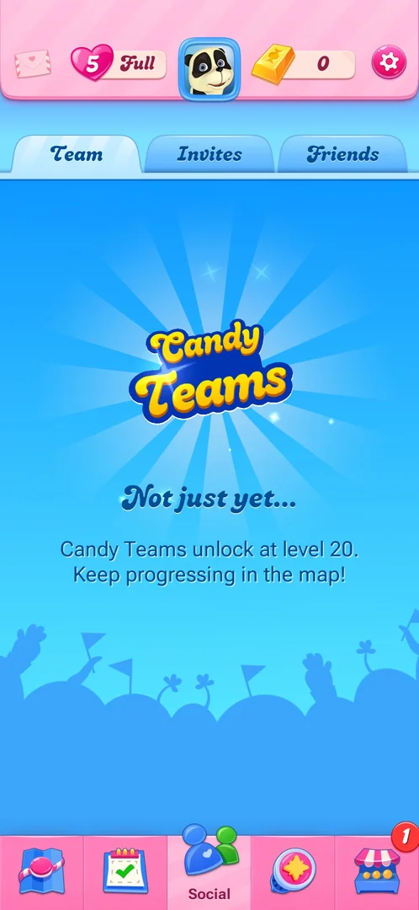
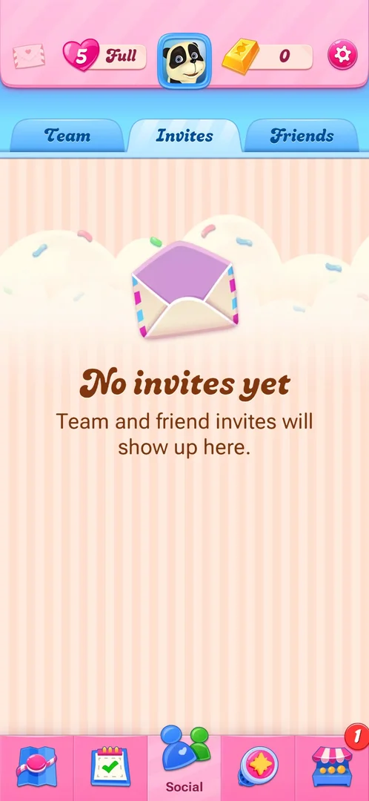

# Candy Teams

Player teams, on the Team sub-tab of the map's Social tab. At level 2 it was locked: the tab says Candy Teams
unlock at level 20 [^s1].

## Why it appeared

The Social tab is in the map's bottom bar from the first view of the map, after level 1; its first sub-tab,
Team, opens on a locked Candy Teams screen with the unlock level written on it: level 20 [^s1].

## Where to find it

The two-figure icon in the middle of the map's bottom tab bar opens Social; Team is its first sub-tab and
opens by default [^s2] [^s1].

 [^s2]
*Social icon (two figures), middle of the bottom tab bar of the map*

## What it looks like

 [^s1]
*Team at level 2: locked until level 20*

Three sub-tabs at the top: Team, Invites, Friends. Under Team, on a blue background, the Candy Teams logo,
the heading "Not just yet..." and the line "Candy Teams unlock at level 20. Keep progressing in the map!"
[^s1]. No button on the screen.

## What you can do

| Tab or button | What it does |
|---|---|
| [Team](#team) | The locked Candy Teams screen |
| [Invites](#invites) | Team and friend invites; empty at level 2 |
| [Friends](#friends) | The friends list |

### Team

<!-- no-frame: Team is the screen frame above -->
The first sub-tab, open by default: the locked screen above [^s1].

### Invites

 [^s3]
*Invites at level 2: empty*

An open envelope, the heading "No invites yet" and the line "Team and friend invites will show up here."
[^s3].

### Friends

<!-- no-frame: the frame is on the Friends list page -->
See [Friends list](friends.md).

## How it works

Version 1.337.0.2. The lock is level 20, as written on the Team sub-tab [^s1]. How teams are formed and what
they give was not seen.

## Cases

| Case | What was done | Result | Source |
|---|---|---|---|
| Why it appeared <!-- case:chk-appeared --> | Opened the Social tab at level 2 | ✅ Locked screen, unlock at level 20 | [^s1] |
| Where to find it <!-- case:chk-entry --> | Tapped the two-figure tab | ✅ Social opens on Team | [^s1] |
| What it looks like <!-- case:chk-screen --> | Looked at Team | ✅ partly: the locked screen only | [^s1] |
| The board <!-- case:chk-board --> | — | not verified: locked |  |
| What earns points <!-- case:chk-points --> | — | not verified: locked |  |
| The period and its timer <!-- case:chk-period --> | — | not verified: locked |  |
| Rewards per rank <!-- case:chk-rewards --> | — | not verified: locked |  |
| The end of a period <!-- case:chk-end --> | — | not verified: locked |  |

## Not verified

- The unlocked Team screen (from level 20) <!-- case:chk-screen -->
- The team board, points, period, rewards and the end of a period <!-- case:chk-board --> <!-- case:chk-points --> <!-- case:chk-period --> <!-- case:chk-rewards --> <!-- case:chk-end -->

[^s1]: session 20261003-194350-chrono-2FYKPJ, step 9 — [video at 2:50](https://youtu.be/OjVVcEHXMyI?t=170)
[^s2]: session 20261003-194350-chrono-2FYKPJ, step 7 — [video at 2:16](https://youtu.be/OjVVcEHXMyI?t=136)
[^s3]: session 20261003-194350-chrono-2FYKPJ, step 10 — [video at 2:59](https://youtu.be/OjVVcEHXMyI?t=179)
