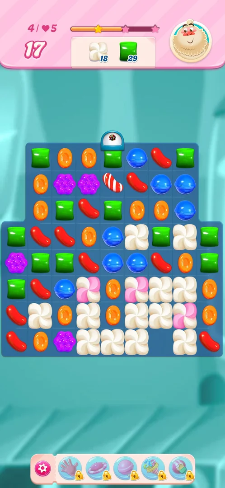

# Colour bomb

A special piece on the [level](core-level.md) board: a chocolate ball covered in coloured sprinkles, made by
lining up five candies of one colour; on level 4 a [dispenser](bomb-dispenser.md) also drops one every
three moves [^s7]. Swapped with a neighbouring candy, it removes every candy of that
candy's colour from the board in one move [^s1]
[^s2] [^s3].

## Why it appeared

On level 1, a swap that lined up five blue candies left a colour bomb on the board; no tutorial or hint
came with it [^s1] [^s3]. On level 4 a second
five-candy line made another one [^s4]. The loading screen before level 2
showed a tip for the Wrapped Candy, not for the colour bomb [^s5]. On level 4 the dome above the
middle column drops colour bombs on its own: after moves 3, 6 and 9 of a run with no five-in-a-line
[^s7] (see [Candy dispenser](bomb-dispenser.md)).

## Where to find it

On the board of a level, after a five-in-a-line match. Level 4 starts with a top row of blue, blue, green,
blue, blue and a blue candy under the green: swapping that green down lines up five blues
[^s4].

 [^s4]
*The green in the middle of the top row, under the dome: swapped with the blue below it, it lines up five blues*

 [^s4]
*Clip 5.5 s · [original on YouTube from 15:56](https://youtu.be/EeHt-Knje2A?t=956)*

The start popup of a level also shows a colour bomb in its "Select boosters" slots (the first of three); it
was not tapped [^s6] (see [Boosters](boosters.md)).

On level 4 a bomb also falls into the middle column through the dome above it, every three moves
[^s8] [^s7].

## What it looks like

 [^s4]
*The colour bomb: the brown ball with sprinkles in the top row, under the dome*

A brown ball covered in multicoloured sprinkles, the size of one candy; it sits in a cell and falls like a
candy [^s4]. On level 4 a white dome with a small colour bomb icon stands
above the fourth column of the board [^s4]. The bomb in this frame was left by the five-blue match, in
the cell where the swap was made; the dome drops its own bombs into that column every three moves
[^s7].

## How it works

Version 1.337.0.2.

- **Made by:** five candies of one colour in a line, by one swap. On level 4 the match also counted for the
  meringue next to it: meringue 65 to 59, moves 25 to 24 [^s4].
- **Used by:** a swap of the bomb with any neighbouring candy; no match is needed. It costs one move
  [^s3].
- **Effect:** every candy of the swapped candy's colour on the board clears. On level 1, swapped with a blue,
  it cleared all blue candies, and a striped candy on the board fired; the order of 40 blue was done
  [^s2]. On level 4, swapped with a green, it cleared every green: the green
  order went 50 to 32 and the meringue order 59 to 24 in that one move, as the cleared greens hit the meringue
  next to them; moves 24 to 23, and the star bar reached its first star [^s3]. A bomb dropped by the
level 4 dome, swapped with a blue, cleared the blues: meringue 52 to 50, green 47 unchanged, moves 22 to
21 [^s9].
- **Set off by a blast (inferred):** on level 4 a dropped bomb was next to a wrapped candy that went off on
  move 7; after that move the bomb was gone, meringue went 44 to 13 and green 39 to 16
  [^s10]. Not seen frame by frame which colour it cleared.
- **Striped candies of the swapped colour fire.** On level 4 (18 moves, meringue 23, green 30) a dropped bomb
  in the top row was swapped with the purple candy left of it. A purple striped candy and a blue striped
  candy stood in one column, the blue one at the top. After the move every purple was gone, both striped
  candies were gone, meringue went 23 to 18, green 30 to 29 and moves 18 to 17; the game showed "Sweet!"
  [^s12]. By the player's note, the purple striped candy fired as part of the clear and the blue striped
  candy fired with it; inferred, not seen frame by frame: the purple one fired its column, which held the
  blue one [^s12] [^s13]. A direct swap of the bomb with a striped candy was not reachable: no valid swap
  brought one next to the bomb [^s13].

 [^s2]
*Clip 5.5 s · [original on YouTube from 1:28](https://youtu.be/OjVVcEHXMyI?t=88)*

 [^s3]
*After the swap with a green: the greens are gone and the meringue around them is thinned out*

 [^s12]
*After the bomb with a purple: the purple striped and blue striped candies have fired and gone*

## Outcomes

| Outcome | What happens | Source |
|---|---|---|
| Win: order done | Same as the base level; the bomb only speeds it up (level 1 was won by the bomb move) | [^s2] |
| Quit from Settings | Same as the base level; the bomb does not change it (level 4 was quit after the bomb move) | [^s3] |
| Out of moves | Not reached; no extra way to lose was seen with a bomb on the board | [^s3] |

## Cases

| Case | What was done | Result | Source |
|---|---|---|---|
| Made by a 5-in-a-row match (level 1: 5 candies in line; level 4: 5 blues on top row), and on level 4 dispensed by a bomb dispenser on the top row <!-- case:chk-entry --> | Lined up five of a colour on levels 1 and 4; nine moves on level 4 with no five-in-a-line | ✅ A colour bomb each time; the level 4 dome dropped one after moves 3, 6 and 9 | [^s3] [^s7] |
| Chocolate ball with colourful sprinkles; sits on the board like a candy, dispenser dome on top (level 4) <!-- case:chk-screen --> | Looked at it on level 4 | ✅ As described | [^s3] |
| Level 1: first 5-line (no tutorial seen); level 4: dispenser spawns them; the Level 2 loading screen tip shows Wrapped Candy, not bomb <!-- case:chk-first-level --> | Played levels 1 to 4 | ✅ First made on level 1, no tutorial seen | [^s3] |
| Swap with a candy of one colour: removes all candies of that colour on the board; also hits meringue next to cleared candies (level 4: 41 meringue layers and 18 greens in one move). Costs one move <!-- case:chk-rules --> | Swapped the bomb with a green on level 4 | ✅ Green 50 to 32 and meringue 59 to 24 in one move | [^s3] |
| With meringue: cleared colour tiles hit adjacent meringue. With striped/wrapped: not tested here (bomb+special combos open). A swap of bomb with plain candy always works (no match needed) <!-- case:chk-interactions --> | Level 4; on 2026-10-06 a combo test on level 1 | ✅ With meringue and plain candies. Level 1 gave no five-in-a-line in six moves, so the bomb with a striped, wrapped or another bomb was not tried | [^s3] [^s11] |
| No extra way to lose seen; the bomb is helpful only. Not an outcome <!-- case:chk-loss --> | Levels 1 and 4 | ✅ None seen; not an outcome of its own | [^s3] |
| Bomb swapped with a plain colour while a striped candy of that colour is on the board <!-- case:combo-bomb-colour-with-specials --> | On level 4, swapped a dropped bomb with a purple; a purple striped and a blue striped candy were in one column | ✅ Every purple cleared; both striped candies fired; meringue 23 to 18 in one move. The bomb swapped directly with a striped candy is still not run | [^s12] [^s13] |
| Why it appeared: the trigger that brought it up (the first launch, a level won, a threshold, a timer, a loss): a fact with its frame, or a hypothesis to test <!-- case:chk-appeared --> | Level 1, a five-blue line | ✅ The bomb was left on the board; swapped with a blue it won the level | [^s1] |

## Not verified

- The colour bomb swapped with a striped candy, a wrapped candy or another colour bomb: the level 1 try on
  2026-10-06 built no bomb (each setup swap matched on its own) [^s11]; on level 4 the dropped bombs sat in
  the top row, or fell to the bottom row between meringue, where no valid swap brought a special next to
  them [^s13].
- Which line the purple striped candy fired when the bomb cleared it (inferred: its column); the clip of
  that move starts after the swap, so the page has the frame after it and the video link.
- Which colour a bomb clears when a blast sets it off (level 4, move 7 on 2026-10-06).
- The colour bomb slot of the level start popup ("Select boosters"): not tapped; see [Boosters](boosters.md).
- A clip of the level 4 bomb move: the cut for that step started after the move, so the move is shown by the
  frames before and after it.

[^s1]: session 20261003-194350-chrono-2FYKPJ, step 5 — [video at 1:12](https://youtu.be/OjVVcEHXMyI?t=72)
[^s2]: session 20261003-194350-chrono-2FYKPJ, step 6 — [video at 1:33](https://youtu.be/OjVVcEHXMyI?t=93)
[^s3]: session 20261003-225003-chrono-2FYKPJ, step 46 — [video at 16:26](https://youtu.be/EeHt-Knje2A?t=986)
[^s4]: session 20261003-225003-chrono-2FYKPJ, step 45 — [video at 16:01](https://youtu.be/EeHt-Knje2A?t=961)
[^s5]: session 20261003-225003-chrono-2FYKPJ, step 14 — [video at 2:14](https://youtu.be/EeHt-Knje2A?t=134)
[^s6]: session 20261003-225003-chrono-2FYKPJ, step 13 — [video at 2:05](https://youtu.be/EeHt-Knje2A?t=125)
[^s7]: session 20261006-094912-chrono-2FYKPJ, step 32 — [video at 12:44](https://youtu.be/7Qqt9Jow58Q?t=764)
[^s8]: session 20261006-094912-chrono-2FYKPJ, step 26 — [video at 8:45](https://youtu.be/7Qqt9Jow58Q?t=525)
[^s9]: session 20261006-094912-chrono-2FYKPJ, step 27 — [video at 10:20](https://youtu.be/7Qqt9Jow58Q?t=620)
[^s10]: session 20261006-094912-chrono-2FYKPJ, step 30 — [video at 11:37](https://youtu.be/7Qqt9Jow58Q?t=697)
[^s11]: session 20261006-094912-chrono-2FYKPJ, step 19 — [video at 6:04](https://youtu.be/7Qqt9Jow58Q?t=364)
[^s12]: session 20261006-120721-chrono-2FYKPJ, step 18 — [video at 6:53](https://youtu.be/d7On5DG_97A?t=413)
[^s13]: session 20261006-120721-chrono-2FYKPJ, step 25 — [video at 8:27](https://youtu.be/d7On5DG_97A?t=507)
