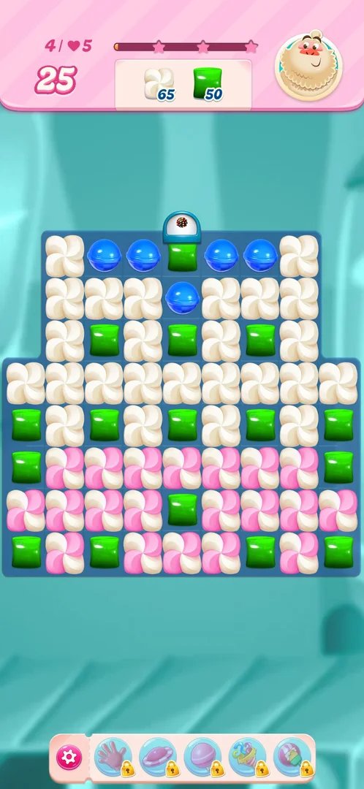
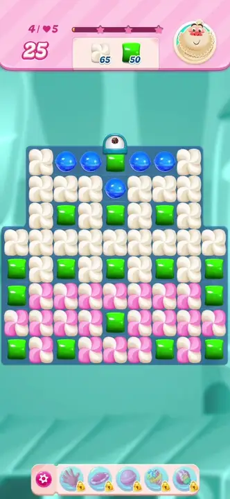
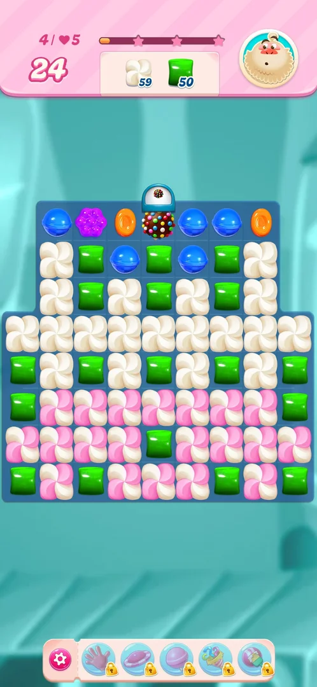
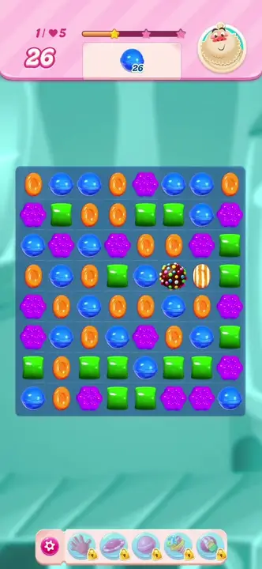
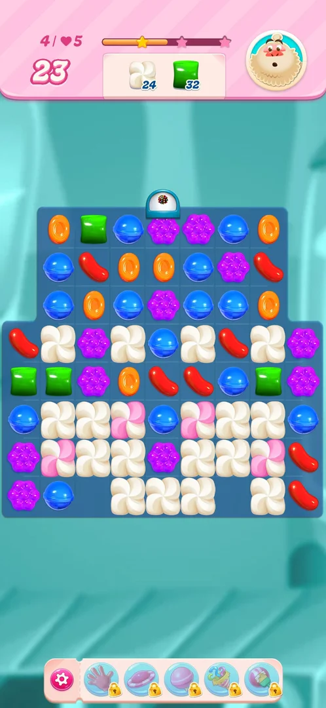

# Colour bomb

A special piece on the [level](core-level.md) board: a chocolate ball covered in coloured sprinkles, made by
lining up five candies of one colour. Swapped with a neighbouring candy, it removes every candy of that
candy's colour from the board in one move [^s1]
[^s2] [^s3].

## Why it appeared

On level 1, a swap that lined up five blue candies left a colour bomb on the board; no tutorial or hint
came with it [^s1] [^s3]. On level 4 a second
five-candy line made another one [^s4]. The loading screen before level 2
showed a tip for the Wrapped Candy, not for the colour bomb [^s5].

## Where to find it

On the board of a level, after a five-in-a-line match. Level 4 starts with a top row of blue, blue, green,
blue, blue and a blue candy under the green: swapping that green down lines up five blues
[^s4].

 [^s4]
*The green in the middle of the top row, under the dome: swapped with the blue below it, it lines up five blues*

 [^s4]
*Clip 5.5 s · [original on YouTube from 15:56](https://youtu.be/EeHt-Knje2A?t=956)*

The start popup of a level also shows a colour bomb in its "Select boosters" slots (the first of three); it
was not tapped [^s6] (see [Boosters](boosters.md)).

## What it looks like

 [^s4]
*The colour bomb: the brown ball with sprinkles in the top row, under the dome*

A brown ball covered in multicoloured sprinkles, the size of one candy; it sits in a cell and falls like a
candy [^s4]. On level 4 a white dome with a small colour bomb icon stands
above the fourth column of the board [^s4]. Inferred from the icon: the dome
drops colour bombs into that column; not seen dropping one (the bomb on the board was left by the
five-blue match, in the cell where the swap was made).

## How it works

Version 1.337.0.2.

- **Made by:** five candies of one colour in a line, by one swap. On level 4 the match also counted for the
  meringue next to it: meringue 65 to 59, moves 25 to 24 [^s4].
- **Used by:** a swap of the bomb with any neighbouring candy; no match is needed. It costs one move
  [^s3].
- **Effect:** every candy of the swapped candy's colour on the board clears. On level 1, swapped with a blue,
  it cleared all blue candies, and a striped candy on the board fired; the order of 40 blue was done
  [^s2]. On level 4, swapped with a green, it cleared every green: the green
  order went 50 to 32 and the meringue order 59 to 24 in that one move, as the cleared greens hit the meringue
  next to them; moves 24 to 23, and the star bar reached its first star [^s3].

 [^s2]
*Clip 5.5 s · [original on YouTube from 1:28](https://youtu.be/OjVVcEHXMyI?t=88)*

 [^s3]
*After the swap with a green: the greens are gone and the meringue around them is thinned out*

## Outcomes

| Outcome | What happens | Source |
|---|---|---|
| Win: order done | Same as the base level; the bomb only speeds it up (level 1 was won by the bomb move) | [^s2] |
| Quit from Settings | Same as the base level; the bomb does not change it (level 4 was quit after the bomb move) | [^s3] |
| Out of moves | Not reached; no extra way to lose was seen with a bomb on the board | [^s3] |

## Cases

| Case | What was done | Result | Source |
|---|---|---|---|
| Entry: made by a five-in-a-line match (level 1: five candies in a line; level 4: five blues in the top row); a dome with a colour bomb icon above level 4 <!-- case:chk-entry --> | Lined up five of a colour on levels 1 and 4 | ✅ A colour bomb each time | [^s3] |
| Screen: a chocolate ball with coloured sprinkles that sits on the board like a candy <!-- case:chk-screen --> | Looked at it on level 4 | ✅ As described | [^s3] |
| First level: level 1 (no tutorial); the loading tip before level 2 is about the Wrapped Candy <!-- case:chk-first-level --> | Played levels 1 to 4 | ✅ First made on level 1, no tutorial seen | [^s3] |
| Rules: the swap with one colour clears every candy of that colour and hits the meringue next to them; costs one move <!-- case:chk-rules --> | Swapped the bomb with a green on level 4 | ✅ Green 50 to 32 and meringue 59 to 24 in one move | [^s3] |
| Interactions: with meringue, the cleared candies hit the meringue next to them; a swap with a plain candy needs no match <!-- case:chk-interactions --> | Level 4 | ✅ With meringue and plain candies; with striped, wrapped or another bomb not tried | [^s3] |
| Loss: an extra way to lose with the bomb <!-- case:chk-loss --> | Levels 1 and 4 | ✅ None seen; not an outcome of its own | [^s3] |
| Why it appeared <!-- case:chk-appeared --> | Level 1, a five-blue line | ✅ The bomb was left on the board; swapped with a blue it won the level | [^s1] |

## Not verified

- The colour bomb swapped with a striped candy, a wrapped candy or another colour bomb (task
  colorbomb-combos).
- The dome above level 4 dropping a colour bomb: inferred from its icon only.
- The colour bomb slot of the level start popup ("Select boosters"): not tapped; see [Boosters](boosters.md).
- A clip of the level 4 bomb move: the cut for that step started after the move, so the move is shown by the
  frames before and after it.

[^s1]: session 20261003-194350-chrono-2FYKPJ, step 5 — [video at 1:12](https://youtu.be/OjVVcEHXMyI?t=72)
[^s2]: session 20261003-194350-chrono-2FYKPJ, step 6 — [video at 1:33](https://youtu.be/OjVVcEHXMyI?t=93)
[^s3]: session 20261003-225003-chrono-2FYKPJ, step 46 — [video at 16:26](https://youtu.be/EeHt-Knje2A?t=986)
[^s4]: session 20261003-225003-chrono-2FYKPJ, step 45 — [video at 16:01](https://youtu.be/EeHt-Knje2A?t=961)
[^s5]: session 20261003-225003-chrono-2FYKPJ, step 14 — [video at 2:14](https://youtu.be/EeHt-Knje2A?t=134)
[^s6]: session 20261003-225003-chrono-2FYKPJ, step 13 — [video at 2:05](https://youtu.be/EeHt-Knje2A?t=125)
