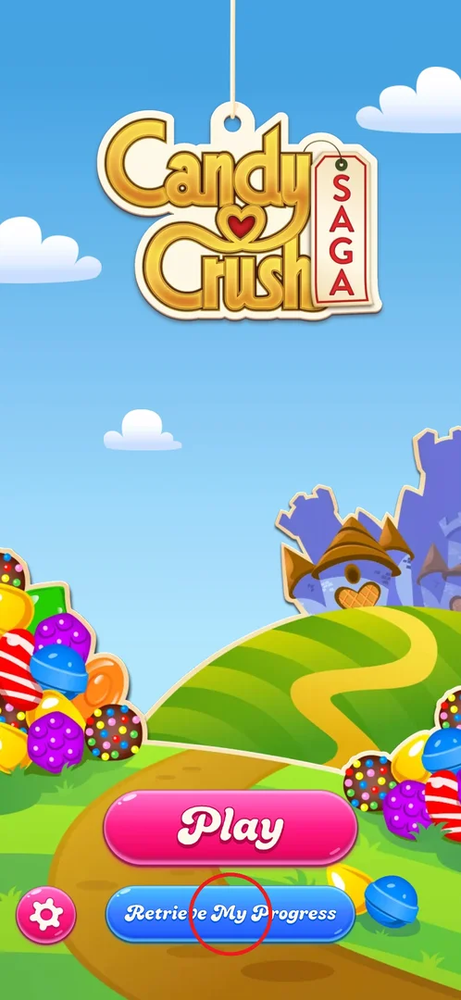
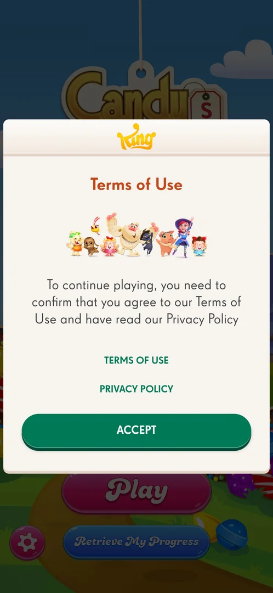
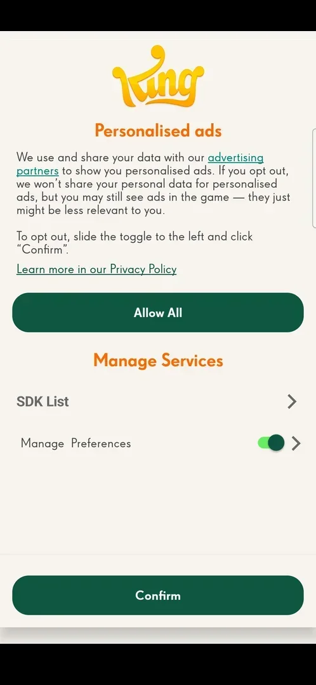

# Terms of Use consent and privacy settings

On the first launch of a fresh install, before anything else can be tapped, King asks the player to
agree to its Terms of Use and confirm they have read its Privacy Policy. The game cannot be played until
the popup is accepted [^s1] [^s2]. Later, the player can review King's privacy choices (personalised ads,
e-mails from King) through the account panel behind Retrieve My Progress [^s3] [^s4].

## Where to find it

The Terms of Use popup is not opened from anywhere: it appears by itself over the title screen on the
first launch [^s1].

The privacy settings: title screen → Retrieve My Progress (circled) → Privacy and security row at the
bottom of the King panel → Personalized ads / Do not Sell or Share my Personal Information
[^s5] [^s4] [^s3]. See [Retrieve My Progress](account-retrieve.md) for the panel itself.

 [^s5]

## What it looks like

The first-launch popup: a white popup with the King logo, the title "Terms of Use", a group picture of
characters from King games, one sentence saying that to continue playing the player must agree to the
Terms of Use and confirm reading the Privacy Policy, two green text links (TERMS OF USE, PRIVACY POLICY)
and a big green ACCEPT button. The title screen's Play, Retrieve My Progress and settings gear are visible
but covered behind it [^s1].

 [^s1]

The personalised ads page, reached from the privacy settings: the King logo, the title "Personalised
ads", a short paragraph saying King shares data with its advertising partners for personalised ads and
that opting out keeps ads in the game but makes them less relevant, with a link to the Privacy Policy. A
green Allow All button follows, then a "Manage Services" block with an SDK List row and a Manage
Preferences row with a toggle (on), and a green Confirm button at the bottom [^s3].

 [^s3]

## What you can do

| Tab or button | Where | What it does |
|---|---|---|
| [ACCEPT](#accept) | First-launch popup | Agrees to the terms and opens the title screen |
| [Terms of Use](#terms-of-use) | First-launch popup, King panel | Opens King's terms |
| [Privacy and security](#privacy-and-security) | King panel | Personalised ads row, e-mails toggle, Privacy Policy |
| [Personalised ads](#personalised-ads) | Privacy and security | Allow All, SDK List, Manage Preferences, Confirm |

### ACCEPT

<!-- no-frame: ACCEPT is on the first-launch popup frame above -->

The only button that closes the first-launch popup; no decline button was seen. After ACCEPT the title
screen is shown [^s1] [^s2].

### Terms of Use

<!-- no-frame: the page opens in the browser, outside the game -->

From the King panel, the Terms of Use link opens King's terms page on king.com in a Chrome tab with a
cookie banner; going back to the game returns to the panel [^s6]. The popup's own TERMS OF USE link was
not tapped.

### Privacy and security

<!-- no-frame: the King panel is a separate window that the harness does not export -->

A page titled "Privacy and security" about personalising the experience across King games. It has a
Personalized ads / Do not Sell or Share my Personal Information row with an arrow, a "Get emails from King"
toggle about new games and offers (off on this install) and a Privacy Policy link at the bottom; a green
back arrow at the top left returns to the panel [^s4].

### Personalised ads

<!-- no-frame: the page is the frame under What it looks like -->

The page in the frame above. To opt out, the player slides the Manage Preferences toggle to the left and
taps Confirm, as the page itself explains; Allow All keeps everything on. SDK List and the arrow next to
the toggle lead further (not opened) [^s3]. Nothing was changed: the page was left with the back key
[^s3].

## How it works

- The first-launch popup has only one way out, ACCEPT [^s1].
- No age gate or ad-tracking question came with the first-launch popup on this install (version
  1.335.1.2) [^s2].
- Personalised ads appear to be on by default: the Manage Preferences toggle was on, and the player had
  not been asked about ads before (inferred; version 1.335.1.2) [^s3] [^s2].
- E-mails from King are off by default (version 1.335.1.2) [^s4].
- Opting out of personalised ads does not remove ads from the game, according to the page [^s3].

## Cases

| Case | What was done | Result | Source |
|---|---|---|---|
| Accept the Terms of Use on first launch | Tapped ACCEPT | ✅ The popup closed, the title screen appeared | [^s2] |
| Open the Terms of Use link from the King panel | Tapped the link, then returned to the game | ✅ king.com terms page in a Chrome tab with a cookie banner; the panel was back after returning | [^s6] |
| Look at the privacy settings | Opened Privacy and security, then the personalised ads row | ✅ Personalised ads page with Allow All, SDK List, Manage Preferences (on) and Confirm; e-mails toggle off; Privacy Policy link | [^s4] [^s3] |

## Not verified

- What the first-launch popup's TERMS OF USE and PRIVACY POLICY links open.
- Whether the first-launch popup comes back after an update of the terms.
- What SDK List and Manage Preferences list, and what changes after opting out and tapping Confirm.

[^s1]: session 20261001-202316-chrono-2FYKPJ, step 0 — [video at 0:00](https://youtu.be/EORPFmWikL0?t=0)
[^s2]: session 20261001-202316-chrono-2FYKPJ, step 1 — [video at 0:12](https://youtu.be/EORPFmWikL0?t=12)
[^s3]: session 20261001-232021-chrono-2FYKPJ, step 4 — [video at 0:54](https://youtu.be/3u8PuF6BhwY?t=54)
[^s4]: session 20261001-232021-chrono-2FYKPJ, step 3 — [video at 0:37](https://youtu.be/3u8PuF6BhwY?t=37)
[^s5]: session 20261001-232021-chrono-2FYKPJ, step 13 — [video at 2:27](https://youtu.be/3u8PuF6BhwY?t=147)
[^s6]: session 20261001-232021-chrono-2FYKPJ, step 9 — [video at 1:43](https://youtu.be/3u8PuF6BhwY?t=103)
