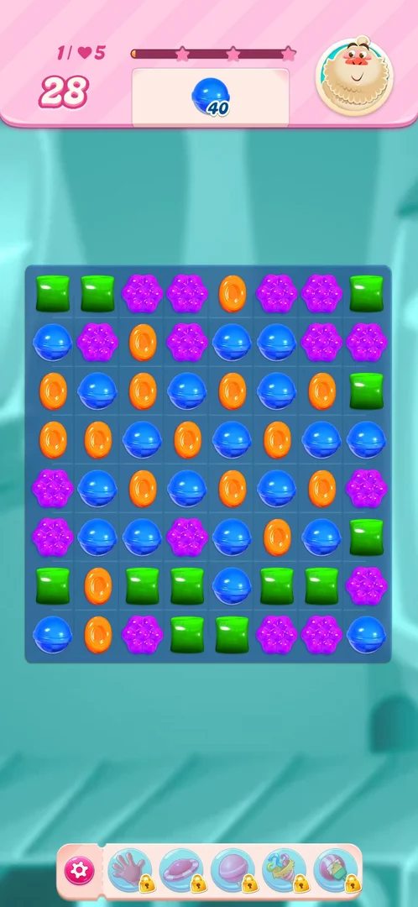
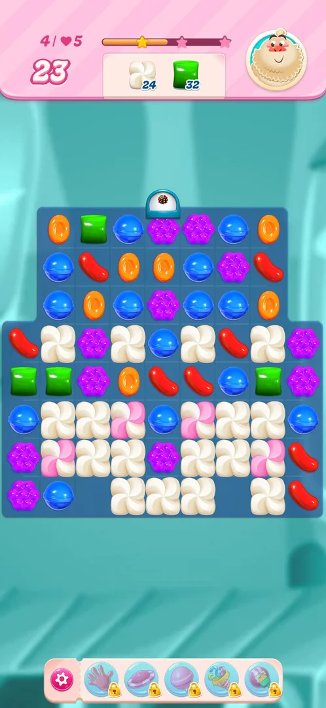
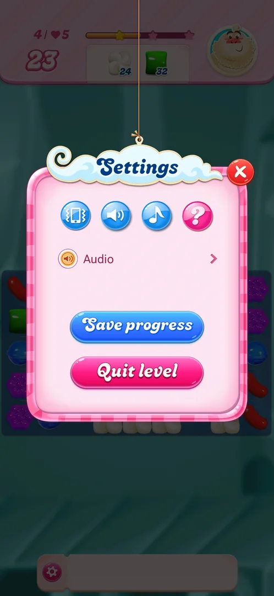
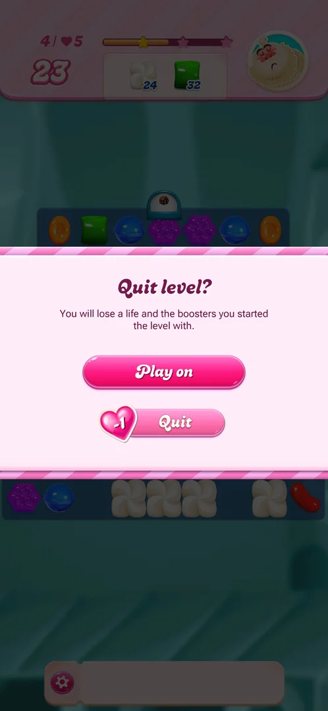
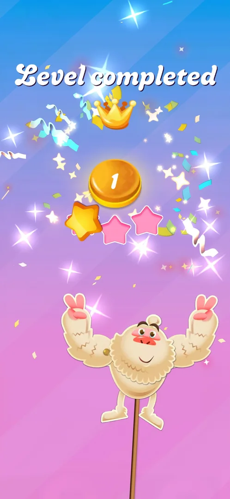
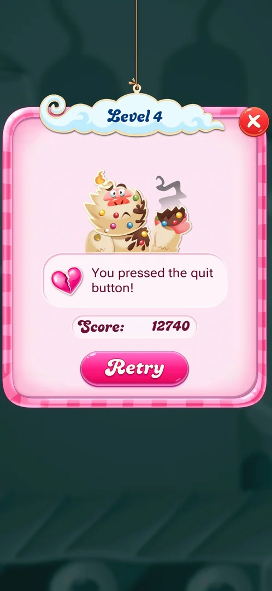
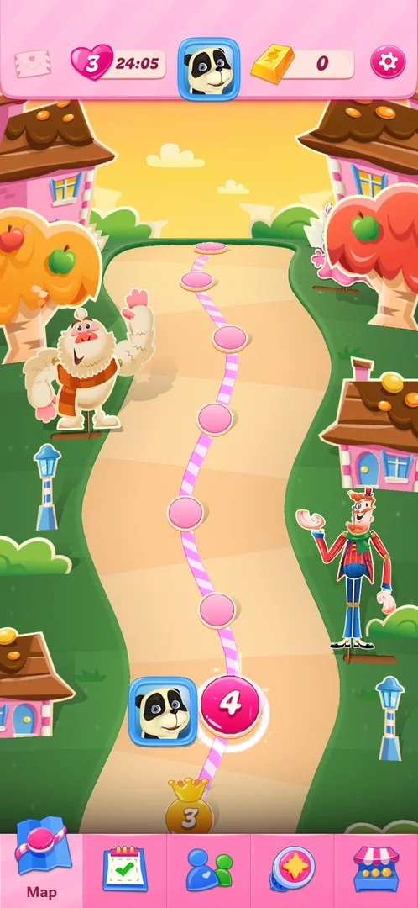

# Level (core match-3)

The match-3 level: a board of coloured candies where the player swaps two neighbouring candies to make lines
of three or more, within a limit of moves, to complete the level's order. Level 1 asked for 40 blue candies
in 28 moves and was won in 3 moves; levels 2 and 3 asked to clear all the meringue on the board; level 4
asked for 65 meringue layers and 50 green candies in 25 moves [^s1]
[^s2] [^s3] [^s4].

## Why it appeared

First launch: after the Terms of Use, the Play button on the title screen and the system notification
prompt, level 1 opened directly, with no map before it [^s5]
[^s1]. From level 2 on, a level opens from its node on the
[Level map](map.md) through the level start popup [^s2]
[^s6].

## Where to find it

On a fresh install, Play on the title screen leads straight into level 1 [^s5].
Afterwards, the next level's node on the level map (the pink numbered circle next to the player's avatar)
opens the level start popup with Play! [^s6]. After a won level the next
level's popup opens by itself over the map [^s7]
[^s8].

 [^s5]
*Play on the title screen, above Retrieve My Progress*

 [^s6]
*Play! on the level start popup, opened from the level's node on the map*

### Level start popup

Titled with the level number ("Level 2"). The order line reads "Collect all orders!" next to the order's
icon (a white meringue on levels 2 and 3); below, "Select boosters:" with three round slots (a colour bomb,
a wrapped and striped candy pair, and a slot with a tick); then a Play! button and a red X at the top right
[^s6] [^s8]. The X closes it to the map
[^s9]. Play! shows a loading screen with a tip (before level 2: "Wrapped
Candy", five orange candies in a T turning into a wrapped candy), then the board
[^s3].

## What it looks like

 [^s1]
*Level 1 at its start: moves top left, the order in the middle, the score bar with three stars above it*

The top bar shows the level number and lives ("1 / heart 5"), the moves left in large digits, a score bar
with three stars, the order (each goal with its count) and a character portrait on the right. Under the
board, a bar holds a gear and five boosters, each with a padlock (see [Boosters](boosters.md))
[^s1] [^s10]. The board's shape changes from
level to level; level 1 is a full 8 by 8 square, levels 2 to 4 have notched shapes
[^s1] [^s3] [^s4].

 [^s10]
*Level 4: a two-goal order (meringue and green candies); the dome over the top row drops pieces into the board*

## What you can do

| Tab or button | What it does |
|---|---|
| [Settings](#settings) | The gear left of the booster bar: sound toggles, help, Save progress, Quit level |
| [Quit level](#quit-level) | In Settings: confirmation, then the level is lost for one life |
| [Level completed](#level-completed) | Not a button: the screen shown by itself after the order is done |

### Settings

 [^s11]
*The gear at the left end of the booster bar opens Settings*

A popup titled "Settings" with a red X: four round buttons (vibration, sound effects, music, and a pink "?"
help), an Audio row with an arrow, a blue Save progress button and a pink Quit level button
[^s11]. There is no Restart button [^s12].
Save progress, the help button and Audio were not tapped.

### Quit level

 [^s13]
*Quit level in Settings asks for confirmation; the Quit button carries a "-1" heart*

"Quit level?" with the line that the player will lose a life and the boosters the level was started with;
Play on returns to the board, Quit (with a "-1" heart badge) ends the level
[^s13]. What follows is under [Outcomes](#outcomes).

### Level completed

 [^s8]
*The win screen after level 3: "Level completed", the stars fill one by one*

"Level completed" with a crown, a gold badge with a number, three star slots that fill in turn, and the
level's character celebrating, on a blue to pink background with confetti
[^s8]. It has no buttons and no score; a few seconds later the map shows, with a
"Sweet!" tag and a crown on the node of the won level, and the next level's start popup opens by itself
[^s8].

## How it works

Version 1.337.0.2.

**Moves.** A swap of two neighbouring candies that lines up three or more of a colour clears them and counts
them towards the order; the moves counter drops by one per swap (level 1: 28 at the start, 25 after three
swaps) [^s1] [^s2]. Moves per level: 28 (level 1),
25 (levels 2 and 4) [^s1] [^s3]
[^s4].

**Special candies.** Made by a longer match and fired by matching or swapping them
[^s14]:

| Match | Makes | Seen |
|---|---|---|
| Four in a line | A striped candy; matched again it clears its row or column | Levels 1 to 3 [^s15] [^s16] |
| L or T of five | A wrapped candy (the loading tip before level 2) | Level 3 [^s3] [^s17] |
| A 2 by 2 square | A fish | Level 3 [^s18] |
| Five in a line | A [colour bomb](color-bomb.md) | Levels 1 and 4 [^s19] [^s20] |

A striped candy swapped with a wrapped candy cleared three columns at once (level 3)
[^s8].

**Level elements.** Meringue fills cells on levels 2 to 4: a white block, and a pink and white block that
takes two hits; a match or a blast next to it removes one layer, and each layer counts towards the meringue
order (level 4 asked for 65) [^s7] [^s10]. Domes
above the top row drop special candies into their column: striped candies on level 2, colour bombs on level 4
(inferred from their icons) [^s3] [^s4].

Level 1 in three moves [^s21] [^s19]
[^s2]:

1. A swap that lined up three blue candies.
2. A swap that lined up five blue candies; it left a colour bomb (a brown ball with sprinkles) and a
   striped candy on the board; 26 blue were left in the order.
3. The colour bomb swapped with a blue candy: every blue on the board cleared, the striped candy fired a
   column, the order count dropped to zero and turned into a green tick. The star bar filled to all three
   stars.

 [^s2]
*Clip 5.5 s · [original on YouTube from 1:28](https://youtu.be/OjVVcEHXMyI?t=88)*

Level 2 was won in 10 moves: the meringue order was ticked with 15 moves left; the next frame, about 8 s
later, showed the moves counter at 0, all three stars and blasts on the refilled board, and the Level 3
popup opened by itself about 6 s after that [^s7]. Inferred: the moves left
were turned into bonus blasts (the game's Sugar Crush); not verified. Level 3 was ticked with 10 moves left,
and the next frame was the Level completed screen [^s8].

**Lives.** Quitting a level or closing the app in the middle of one costs a life; the map then shows the
lives with a timer to the next life (4 lives and 27:26 after a quit; 3 lives and 24:05 after the app was
closed) [^s14] [^s22]. See [Lives](lives.md).

## Outcomes

| Outcome | What happens | Source |
|---|---|---|
| Win: the order is done | The order shows a tick; the moves left may run down with blasts; the Level completed screen; the map with "Sweet!" and a crown on the node; the next level's popup opens by itself. No score was shown | [^s8] |
| Quit: Settings > Quit level > Quit | A "Level 4" popup with a broken heart, "You pressed the quit button!", the score (12740) and Retry; the X goes to the map; one life spent (5 to 4) | [^s23] |
| Leaving the app mid-level (force stop, no move made) | The game reopens on the map, the level is not resumed, one life spent (4 to 3) | [^s22] |
| Out of moves | Not reached | |

### Quit

 [^s23]
*After Quit: the score of the quit level and Retry; the X returns to the map*

Retry was not tapped [^s14].

### Leaving the app

 [^s22]
*The map after a force stop mid-level: one life fewer, the level not resumed*

## Cases

| Case | What was done | Result | Source |
|---|---|---|---|
| HUD seen on level 1: level number and lives (1 / heart 5), moves left (28), the order (40 blue), a 3-star score bar, a character portrait, bottom bar with settings gear and 5 locked boosters <!-- case:chk-hud --> | Played level 1 | ✅ As listed | [^s1] |
| Entry: the map node opens the Level N start popup (order "Collect all orders!", Select boosters with 3 slots, Play!, close X) <!-- case:chk-entry --> | Won level 1; opened level 2 from the map | ✅ The popup as described; X closes it | [^s2] |
| Why it appeared <!-- case:chk-appeared --> | Fresh install, Play on the title screen | ✅ Level 1 opens with no map before it | [^s1] |
| Screen: board with HUD (level and lives, moves, order panel, star bar, portrait, gear and 5 locked boosters); level 4 order meringue and green <!-- case:chk-screen --> | Levels 1 to 4 | ✅ As listed | [^s14] |
| Rules: swap neighbours for a line of 3+; 4 = striped, 5 = colour bomb, L/T = wrapped, 2x2 = fish; striped + wrapped swap = three-column blast; meringue loses layers to matches and blasts next to it; domes drop special candies <!-- case:chk-rules --> | Levels 2 to 4 | ✅ As listed | [^s14] |
| Win screen of a level <!-- case:win-screen-unseen --> | Won level 3 | ✅ "Level completed" exists; the session's first note that there was none was wrong (it fell between frames on level 2) | [^s8] |
| Win: order done, then the Level completed screen, the map with "Sweet!" and a crown, then the next level's popup by itself; level 3 ended with 10 moves left <!-- case:chk-win --> | Won levels 2 and 3 | ✅ As listed; no score on the win screen | [^s8] |
| Quit: gear > Settings > Quit level > "Play on" or "Quit -1 heart"; the Level 4 failed popup with Score and Retry; X to the map; lives 5 to 4 <!-- case:chk-quit --> | Quit level 4 | ✅ As listed | [^s14] |
| Restart from inside the level <!-- case:chk-restart --> | Opened the in-level Settings | ✅ No Restart button; a restart is a quit and Play! again from the map | [^s22] |
| Exit the app mid-level <!-- case:chk-exit-app --> | Opened level 4, made no move, force-stopped the app and reopened it | ✅ Map, level not resumed, lives 4 to 3 | [^s22] |
| Level elements: meringue (white, and pink and white with two layers), striped, wrapped, fish, colour bomb, domes that drop candies <!-- case:chk-elements --> | Levels 1 to 4 | ✅ As listed | [^s14] |
| Out of moves: the level ends with no move left <!-- case:out-of-moves --> | — | not verified: never reached |  |
| Each loss <!-- case:chk-loss --> | — | not verified: only a quit and a force stop so far |  |
| After a loss: retry and continue offers <!-- case:chk-retry --> | — | not verified: Retry seen, not tapped; no continue offer seen |  |
| An empty case in the map <!-- case:list --> | — | not verified: logged with no text by session 20261003-230937-chrono-2FYKPJ |  |

## Not verified

- Running out of moves: the screen, a continue offer and its price <!-- case:out-of-moves -->
- Each kind of loss, its screen and what it costs <!-- case:chk-loss -->
- Retry after a loss, and continue offers (extra moves) and their price <!-- case:chk-retry -->
- The case with id "list": no text in the map, nothing to check <!-- case:list -->
- The moves left turning into bonus blasts after a win (Sugar Crush): inferred from two frames of level 2.
- The dome on level 4 dropping colour bombs: inferred from its icon.
- Save progress, the help button and Audio in the in-level Settings: not tapped.
- A clip of the Level completed animation: the frames are seconds apart and no step marks its start.

[^s1]: session 20261003-194350-chrono-2FYKPJ, step 3 — [video at 0:29](https://youtu.be/OjVVcEHXMyI?t=29)
[^s2]: session 20261003-194350-chrono-2FYKPJ, step 6 — [video at 1:33](https://youtu.be/OjVVcEHXMyI?t=93)
[^s3]: session 20261003-225003-chrono-2FYKPJ, step 14 — [video at 2:14](https://youtu.be/EeHt-Knje2A?t=134)
[^s4]: session 20261003-225003-chrono-2FYKPJ, step 44 — [video at 15:23](https://youtu.be/EeHt-Knje2A?t=923)
[^s5]: session 20261003-194350-chrono-2FYKPJ, step 1 — [video at 0:11](https://youtu.be/OjVVcEHXMyI?t=11)
[^s6]: session 20261003-225003-chrono-2FYKPJ, step 13 — [video at 2:05](https://youtu.be/EeHt-Knje2A?t=125)
[^s7]: session 20261003-225003-chrono-2FYKPJ, step 25 — [video at 6:18](https://youtu.be/EeHt-Knje2A?t=378)
[^s8]: session 20261003-225003-chrono-2FYKPJ, step 43 — [video at 14:44](https://youtu.be/EeHt-Knje2A?t=884)
[^s9]: session 20261003-194350-chrono-2FYKPJ, step 7 — [video at 2:12](https://youtu.be/OjVVcEHXMyI?t=132)
[^s10]: session 20261003-225003-chrono-2FYKPJ, step 46 — [video at 16:26](https://youtu.be/EeHt-Knje2A?t=986)
[^s11]: session 20261003-225003-chrono-2FYKPJ, step 47 — [video at 17:10](https://youtu.be/EeHt-Knje2A?t=1030)
[^s12]: session 20261003-230937-chrono-2FYKPJ, step 10 — [video at 1:47](https://youtu.be/QXlart4AJGo?t=107)
[^s13]: session 20261003-225003-chrono-2FYKPJ, step 48 — [video at 17:19](https://youtu.be/EeHt-Knje2A?t=1039)
[^s14]: session 20261003-225003-chrono-2FYKPJ, step 50 — [video at 17:42](https://youtu.be/EeHt-Knje2A?t=1062)
[^s15]: session 20261003-225003-chrono-2FYKPJ, step 19 — [video at 4:01](https://youtu.be/EeHt-Knje2A?t=241)
[^s16]: session 20261003-225003-chrono-2FYKPJ, step 24 — [video at 5:59](https://youtu.be/EeHt-Knje2A?t=359)
[^s17]: session 20261003-225003-chrono-2FYKPJ, step 30 — [video at 8:06](https://youtu.be/EeHt-Knje2A?t=486)
[^s18]: session 20261003-225003-chrono-2FYKPJ, step 40 — [video at 12:55](https://youtu.be/EeHt-Knje2A?t=775)
[^s19]: session 20261003-194350-chrono-2FYKPJ, step 5 — [video at 1:12](https://youtu.be/OjVVcEHXMyI?t=72)
[^s20]: session 20261003-225003-chrono-2FYKPJ, step 45 — [video at 16:01](https://youtu.be/EeHt-Knje2A?t=961)
[^s21]: session 20261003-194350-chrono-2FYKPJ, step 4 — [video at 0:52](https://youtu.be/OjVVcEHXMyI?t=52)
[^s22]: session 20261003-230937-chrono-2FYKPJ, step 12 — [video at 2:12](https://youtu.be/QXlart4AJGo?t=132)
[^s23]: session 20261003-225003-chrono-2FYKPJ, step 49 — [video at 17:27](https://youtu.be/EeHt-Knje2A?t=1047)
