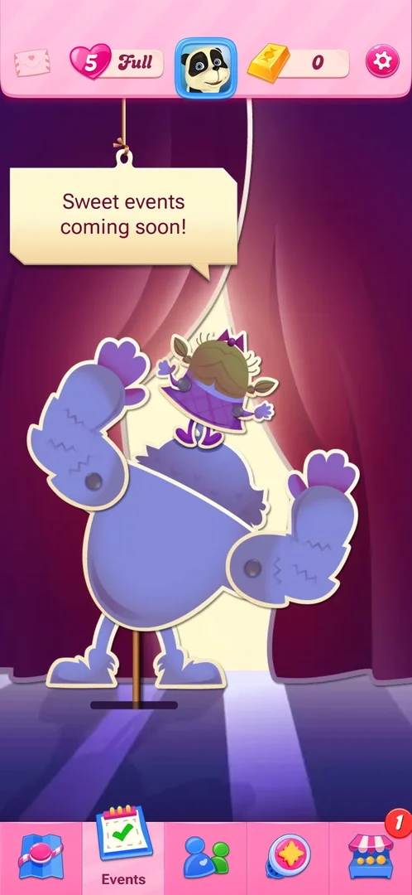

# Events tab

The second tab of the map's bottom bar, meant for the game's time-limited events. At level 2 and again at
level 4 it held no event: only a sign reading "Sweet events coming soon!" over a stage with two characters
[^s1] [^s2].

## Why it appeared

The tab is in the bottom bar from the first view of the map, after level 1 was won; it showed no events at
that point [^s1], and still none with level 4 next on the map
[^s2]. The level at which the first event shows up was not seen.

## Where to find it

The calendar icon with a green tick, second from the left in the map's bottom tab bar
[^s3].

 [^s3]
*Calendar icon, second in the bottom tab bar of the map*

## What it looks like

 [^s2]
*Events with level 4 next: empty, a "coming soon" sign*

A stage with purple curtains, a large purple cut-out character with a smaller one standing on its head,
and a hanging sign "Sweet events coming soon!". The map's top bar stays (mail, lives with the refill timer,
avatar, gold bars, gear); the calendar tab is selected and labelled "Events"
[^s2]. The screen has no sub-tabs and no buttons of its own; nothing on it
was tapped [^s2].

## How it works

Version 1.337.0.2. No event ran at level 2 or level 4, so no rules, timer or rewards were seen
[^s1] [^s2].

## Cases

| Case | What was done | Result | Source |
|---|---|---|---|
| Why it appeared <!-- case:chk-appeared --> | Won level 1, opened the tab; opened it again with level 4 next | ✅ In the tab bar from the first map view; empty both times | [^s4] |
| Where to find it <!-- case:chk-entry --> | Tapped the calendar tab | ✅ Events opened | [^s1] |
| What it looks like <!-- case:chk-screen --> | Opened the tab at level 2 and level 4 | ✅ The empty "coming soon" screen, no sub-tabs | [^s2] |
| Rules <!-- case:chk-rules --> | — | not verified: no event yet |  |
| Its timer and schedule <!-- case:chk-timer --> | — | not verified |  |
| What shows during a level while it runs <!-- case:chk-in-level --> | — | not verified |  |
| Progress per level <!-- case:chk-progress --> | — | not verified |  |
| The rewards <!-- case:chk-rewards --> | — | not verified |  |
| The end <!-- case:chk-end --> | — | not verified |  |
| A level won while an event runs <!-- case:under-win --> | — | not verified |  |
| A level quit while an event runs <!-- case:under-quit --> | — | not verified |  |
| A level lost out of moves while an event runs <!-- case:under-out-of-moves --> | — | not verified |  |
| The app closed mid level while an event runs <!-- case:under-exit-app --> | — | not verified |  |
| A level restarted while an event runs <!-- case:under-restart --> | — | not verified |  |
| An empty entry named "list" in the map <!-- case:list --> | — | not verified: no content |  |

## Not verified

- The level at which the first event shows up in this tab
- An event's rules, timer, in-level display, progress, rewards and end <!-- case:chk-rules --> <!-- case:chk-timer --> <!-- case:chk-in-level --> <!-- case:chk-progress --> <!-- case:chk-rewards --> <!-- case:chk-end -->
- A level won, quit, lost out of moves, left with the app closed or restarted while an event runs <!-- case:under-win --> <!-- case:under-quit --> <!-- case:under-out-of-moves --> <!-- case:under-exit-app --> <!-- case:under-restart -->
- "list": an entry with no content, written to the map by the session's case listing <!-- case:list -->

[^s1]: session 20261003-194350-chrono-2FYKPJ, step 8 — [video at 2:32](https://youtu.be/OjVVcEHXMyI?t=152)
[^s2]: session 20261003-230937-chrono-2FYKPJ, step 1 — [video at 0:20](https://youtu.be/QXlart4AJGo?t=20)
[^s3]: session 20261003-194350-chrono-2FYKPJ, step 7 — [video at 2:12](https://youtu.be/OjVVcEHXMyI?t=132)
[^s4]: session 20261003-230937-chrono-2FYKPJ, step 6 — [video at 1:06](https://youtu.be/QXlart4AJGo?t=66)
