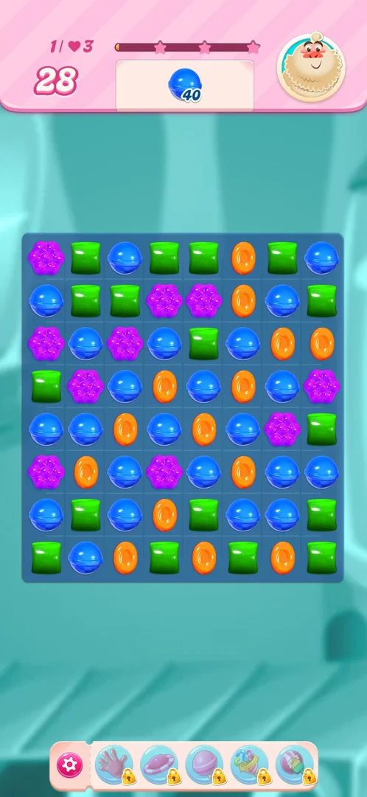
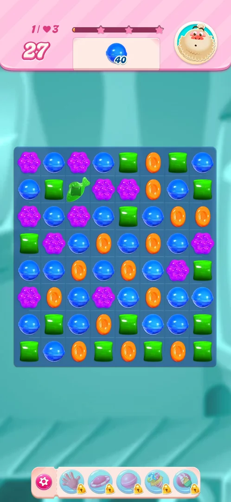
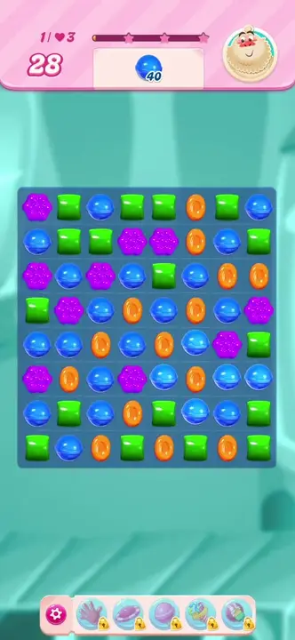
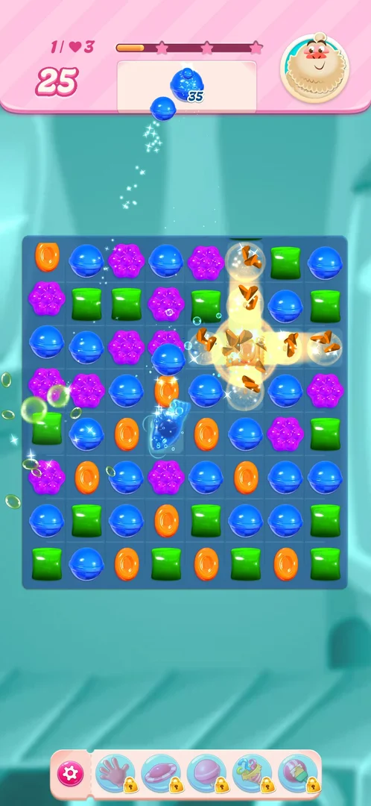
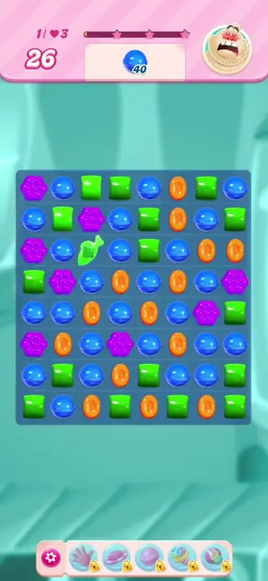

# Fish candy

A special candy of the [level](core-level.md) board: a small fish in the colour of the candies that made
it. The player makes it by lining up four candies of one colour in a 2x2 square; the four clear and the fish
stays in one of their cells. Swapped like a plain candy it only moves; when it is part of a line of three it
fires, swims off its cell across the board and clears a candy elsewhere [^s1] [^s2].

## Why it appeared

Made by the player: one swap that put four green candies in a 2x2 square, with no line of three, made a
green fish on level 1 [^s1]. A fish had already been on the board at the end
of level 3 on 2026-10-03, among the candies of the final cascade; how it was made there was not
recorded [^s3].

## Where to find it

There is no button: the fish is made on the board of a level. On level 1 (plain candies only, 28 moves, an
order of 40 blue candies in version 1.337.0.2) the top row has a blue candy between two greens, under a pair
of greens in the second row; swapping that blue with the green on its right closes a 2x2 green square
[^s4]. On levels 3 and 4 the meringue left no room for a 2x2 square in the
session's attempts [^s5].

 [^s4]
*Level 1 before the swap: the blue third in the top row and the green right of it are swapped*

## What it looks like

 [^s1]
*The green fish in the second row, third column*

A green, fish-shaped candy with a square body, in place of a plain candy. It takes one cell and the colour of
the square that made it [^s1].

 [^s1]
*Clip 5.9 s · [original on YouTube from 6:11](https://youtu.be/UOyVRJxygXc?t=371)*

### Result

 [^s2]
*The fish leaving its cell across the board while the cascade clears candies*

## How it works

Version 1.337.0.2, level 1.

- **Making it.** Four candies of one colour in a 2x2 square, with no line of three, clear and leave a fish
  of that colour in one of the four cells (the lower right one in the one case seen). It cost one move
  (28 to 27); the blue order did not change (40), as the square was green [^s1].
- **A plain swap does not fire it.** The fish swapped with the purple candy below it moved down one cell and
  the purple moved up; nothing cleared, and the swap cost a move (27 to 26) [^s6].
- **In a line of three it fires.** The next move lined up three greens in the top row (moves 26 to 25). In the
  cascade that followed, the fish was in a line of three with two greens in its row; it rose off its cell,
  swam across the board and cleared a candy where it landed. The cascade then made a striped and two
  wrapped candies; the blue order went from 40 to 21 in that move and the game showed "Divine!"
  [^s2].
- Inferred from one firing, not verified: how the fish picks the cell it flies to (the order's colour, a
  blocker, or at random).

 [^s2]
*Clip 7.9 s · [original on YouTube from 6:56](https://youtu.be/UOyVRJxygXc?t=416)*

## Outcomes

The base level is [core-level](core-level.md).

| Outcome | What happens | Source |
|---|---|---|
| Win: order done | Same as the base level: level 1 (a replay) was won after the fish move; the lives stayed at 3 | [^s7] |
| Out of moves | Not reached with a fish on the board | [^s7] |
| Quit | Not tried with a fish on the board | [^s7] |

## Cases

| Case | What was done | Result | Source |
|---|---|---|---|
| Why it appeared: made by the player from a 2x2 square <!-- case:chk-appeared --> | On level 1, one swap closed a 2x2 green square with no line of three | ✅ The four greens cleared and a green fish appeared | [^s1] |
| Where to find it: not a menu feature, made on a level board <!-- case:chk-entry --> | Map > level 1 > Play, then the swap above | ✅ Made on the board; no button opens it | [^s1] |
| What it looks like <!-- case:chk-screen --> | Looked at the board after the swap | ✅ A small green fish in one cell, the colour of the square | [^s1] |
| The first level where it is seen <!-- case:chk-first-level --> | Replayed level 1 (plain candies) after levels 3 and 4 gave no room for a square | ✅ Made on level 1; a fish was also on the level 3 board on 2026-10-03 | [^s1] [^s3] |
| The rules: what fires it and what it does <!-- case:chk-rules --> | Swapped the fish with a plain candy; then made a move after which it was in a line of three greens | ✅ The plain swap only moved it and cost a move; in the line of three it flew across the board and cleared a candy | [^s6] [^s2] |
| How it interacts with the other pieces <!-- case:chk-interactions --> | — | not verified |  |
| Whether it adds a way to lose <!-- case:chk-loss --> | — | not verified |  |

## Not verified

- How the fish combines with a striped candy, a wrapped candy, a colour bomb or another fish, and what it does
  to meringue and other blockers (task fish-interactions) <!-- case:chk-interactions -->
- Whether it adds a way to lose; the level with the fish was won, out of moves not reached <!-- case:chk-loss -->
- How the fish chooses the cell it flies to
- Which cell of the square keeps the fish when the square is made by different swaps

[^s1]: session 20261005-072135-chrono-2FYKPJ, step 26 — [video at 6:16](https://youtu.be/UOyVRJxygXc?t=376)
[^s2]: session 20261005-072135-chrono-2FYKPJ, step 28 — [video at 7:03](https://youtu.be/UOyVRJxygXc?t=423)
[^s3]: session 20261003-225003-chrono-2FYKPJ, step 43 — [video at 15:07](https://youtu.be/EeHt-Knje2A?t=907)
[^s4]: session 20261005-072135-chrono-2FYKPJ, step 25 — [video at 5:53](https://youtu.be/UOyVRJxygXc?t=353)
[^s5]: session 20261005-072135-chrono-2FYKPJ, step 18 — [video at 4:33](https://youtu.be/UOyVRJxygXc?t=273)
[^s6]: session 20261005-072135-chrono-2FYKPJ, step 27 — [video at 6:38](https://youtu.be/UOyVRJxygXc?t=398)
[^s7]: session 20261005-072135-chrono-2FYKPJ, step 31 — [video at 8:51](https://youtu.be/UOyVRJxygXc?t=531)
