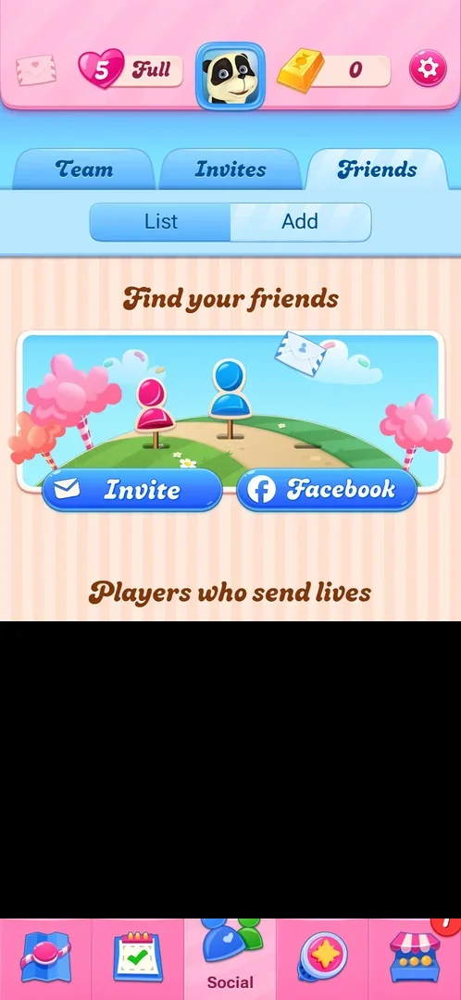
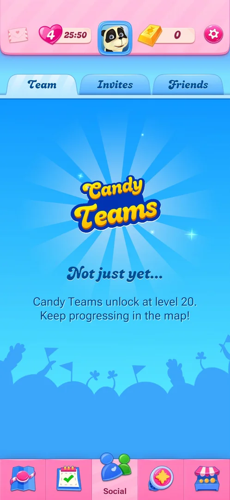
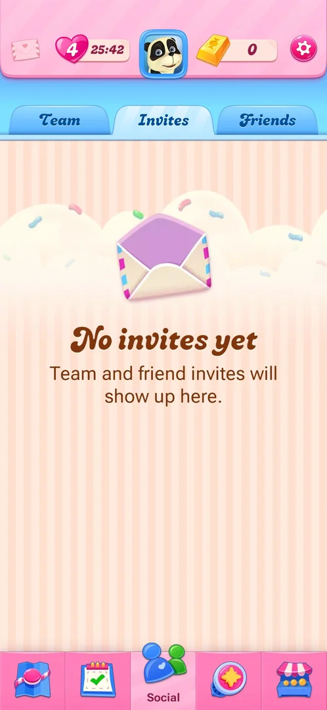
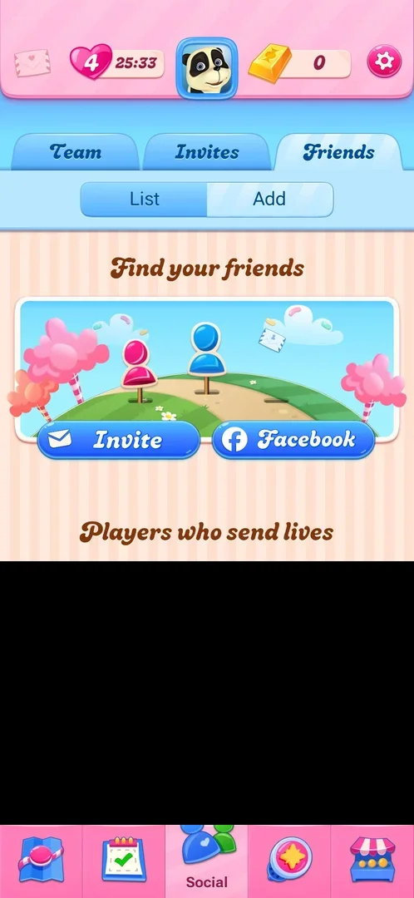
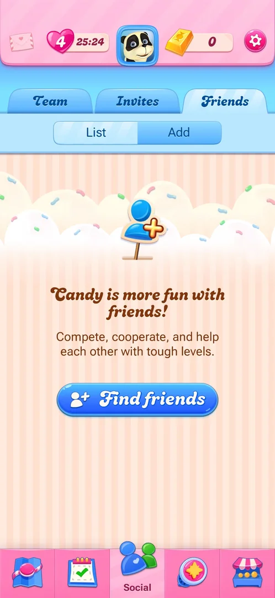

# Friends list

The map's Social tab and its Friends sub-tab: ways to find friends (Invite, Facebook, Find friends), a list
of other players offered to add under the heading "Players who send lives", and the player's own friends
list, empty on this account. The Social tab also holds Team (Candy Teams, locked until level 20) and Invites
(empty) [^s1] [^s2]
[^s3] [^s4].

## Why it appeared

The Social tab is in the map's bottom bar from the first view of the map, after level 1; the Friends
sub-tab was open at level 2 with no friends added and a list of suggested players
[^s5]. With level 4 next, all three sub-tabs looked the same as at level 2
[^s4].

## Where to find it

Map, the two-figure Social icon in the middle of the bottom tab bar; it opens on Team. Friends is the third
sub-tab at the top, right of Invites [^s6] [^s1].

 [^s6]
*Friends sub-tab, right of Invites at the top of the Social tab*

## What it looks like

 [^s5]
*Friends at level 2, on Add; the list of suggested players is blacked out: it shows real players' names*

Under the three sub-tabs (Team, Invites, Friends), Friends has a two-part switch, List and Add; the part
in use is drawn lighter. Tapping Friends opened it on Add both times
[^s5] [^s3]. The map's top bar stays above
the sub-tabs [^s3].

## What you can do

| Tab or button | What it does |
|---|---|
| [Team](#team) | Candy Teams: locked, "unlock at level 20" |
| [Invites](#invites) | Team and friend invites; "No invites yet" |
| [Friends: Add](#friends-add) | Invite, Facebook, and suggested players with Add; nothing tapped |
| [Friends: List](#friends-list) | The player's friends; empty, with Find friends |

No button that acts on accounts or other players (Invite, Facebook, Add, Find friends) was tapped
[^s4].

### Team

 [^s1]
*Team with level 4 next: locked until level 20*

The Candy Teams logo, "Not just yet..." and "Candy Teams unlock at level 20. Keep progressing in the map!";
no button [^s1]. See [Candy Teams](candy-teams.md).

### Invites

 [^s2]
*Invites: empty*

An open envelope, "No invites yet" and "Team and friend invites will show up here."; no button
[^s2].

### Friends: Add

 [^s3]
*Add, with level 4 next; the suggested players are blacked out*

"Find your friends" over a picture of two player figures, with two buttons: Invite (an envelope) and
Facebook. Below, the heading "Players who send lives" and a scrolling list: each row has a player's
avatar, name, a number next to a pink candy icon and a blue Add button; at least four rows were visible
[^s3]. Inferred: the number is the player's level; not verified. The list
is blacked out on this page because it shows other players' names and photos.

### Friends: List

 [^s4]
*List: no friends yet*

With no friends: a figure with a plus sign, the heading "Candy is more fun with friends!", a one-line
description (compete, cooperate, help with tough levels) and a Find friends button
[^s4].

## How it works

Version 1.337.0.2. Candy Teams unlock at level 20, by the Team sub-tab's own text
[^s1]. Inferred from the heading "Players who send lives": added friends can
send lives (see [Lives](lives.md), whose popup has an Ask friends button); not verified.

## Cases

| Case | What was done | Result | Source |
|---|---|---|---|
| Social tab Invites sub-tab: No invites yet, team and friend invites show up here <!-- case:invites-subtab --> | Opened Invites at level 2 and level 4 | ✅ Empty: "No invites yet" | [^s2] |
| Why it appeared <!-- case:chk-appeared --> | Opened Social, Friends at level 2 | ✅ There from the first map view | [^s5] |
| Where to find it <!-- case:chk-entry --> | Tapped Social, then the Friends sub-tab | ✅ Social opens on Team; Friends opens on Add | [^s3] |
| What it looks like <!-- case:chk-screen --> | Opened Team, Invites, Friends (Add and List) | ✅ Team locked to level 20, Invites empty, Add with suggested players, List empty | [^s4] |
| The board <!-- case:chk-board --> | Opened List and Add | ✅ No ranks or places: List is empty with no friends; suggested players on Add are listed without a place | [^s4] |
| What earns points <!-- case:chk-points --> | Opened every sub-tab | ✅ Does not apply: no points on any sub-tab | [^s4] |
| The period and its timer <!-- case:chk-period --> | Opened every sub-tab | ✅ Does not apply: no period or timer shown | [^s4] |
| Rewards per rank <!-- case:chk-rewards --> | Opened every sub-tab | ✅ Does not apply: no ranks or rewards shown | [^s4] |
| The end of a period <!-- case:chk-end --> | Opened every sub-tab | ✅ Does not apply: no period | [^s4] |

## Not verified

- What List shows when there are friends; inferred from the empty-List text ("Compete, cooperate"), friends may be compared on levels, not verified
- Whether added friends send lives, as the heading "Players who send lives" suggests
- Invite, Facebook, Add and Find friends: not tapped (they act on real accounts and other players)

[^s1]: session 20261003-230937-chrono-2FYKPJ, step 3 — [video at 0:40](https://youtu.be/QXlart4AJGo?t=40)
[^s2]: session 20261003-230937-chrono-2FYKPJ, step 4 — [video at 0:48](https://youtu.be/QXlart4AJGo?t=48)
[^s3]: session 20261003-230937-chrono-2FYKPJ, step 5 — [video at 0:56](https://youtu.be/QXlart4AJGo?t=56)
[^s4]: session 20261003-230937-chrono-2FYKPJ, step 6 — [video at 1:06](https://youtu.be/QXlart4AJGo?t=66)
[^s5]: session 20261003-194350-chrono-2FYKPJ, step 11 — [video at 3:01](https://youtu.be/OjVVcEHXMyI?t=181)
[^s6]: session 20261003-194350-chrono-2FYKPJ, step 9 — [video at 2:44](https://youtu.be/OjVVcEHXMyI?t=164)
