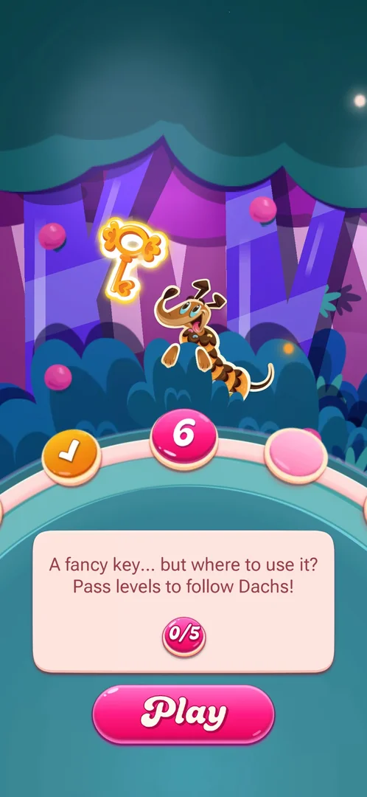
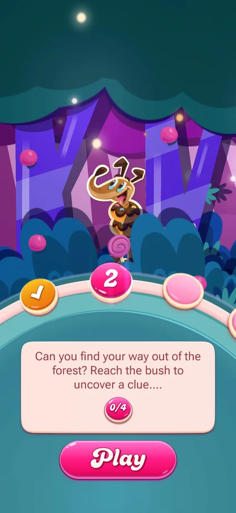
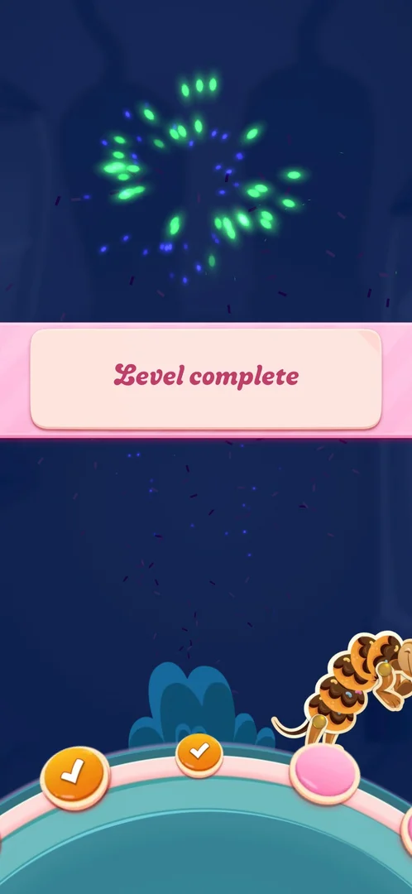

# FTUE story path (forest chapters)

In the first-time user experience the first levels are not shown on the usual saga map: they are stops
along a path in a night forest, told as a short story in chapters. Each chapter has a goal counted in
levels (reach the bush to uncover a clue; then follow Dachs, a long candy dog), and the screen is shown
between some levels with a Play button for the next one [^s1] [^s5] [^s7]. After six levels the saga
map had still not appeared [^s7].

## Where to find it

It appears by itself: after level 1 is won, after some later levels, and when the player taps Play on the
title screen during the FTUE [^s1] [^s5].

<!-- no-entry: shown automatically between levels and after Play on the title screen -->

## What it looks like

A purple forest at night under a teal canopy, with Dachs, a dog whose long body is made of candy, standing
at the top. A curved path of round stops runs across the middle: done levels have a tick, the next level
is a big pink stop with its number, further stops are pale pink. Under it, a card with the chapter's goal
and a progress counter, and a big pink Play button at the bottom [^s5] [^s7].

 [^s7]

The first chapter's card (seen after level 1 at 0/4 and before level 4 at 2/4) asks the player to find the
way out of the forest by reaching the bush to uncover a clue [^s1] [^s5].

 [^s1]

## What you can do

| Tab or button | What it does |
|---|---|
| [Play](#play) | Starts the next level on the path |
| [Level complete](#level-complete) | Shown on the path after a won level (no buttons) |

### Play

<!-- no-frame: the Play button is on both screen frames above -->

The only button on the screen: it starts the level of the big pink stop [^s2] [^s8].

### Level complete

 [^s6]

After level 4 the win was shown as a pink "Level complete" banner with fireworks over the dark forest
path, the done stops ticked and Dachs walking on; then level 5 loaded straight away [^s6] [^s9].

## How it works

- Chapter 1, the clue at the bush: 4 levels after level 1. The counter was 0/4 after level 1 and 2/4 before
  level 4 (version 1.335.1.2) [^s1] [^s5].
- Chapter 2, follow Dachs: 5 levels, counter 0/5 before level 6 [^s7].
- The reward of chapter 1 is a golden "fancy key" shown at the start of chapter 2; what it opens is the
  story's next question (inferred from the card) [^s7].
- The path screen is not shown after every level: after levels 2, 3 and 4 the next level loaded directly,
  after levels 1 and 5 the screen waited for Play [^s3] [^s4] [^s9] [^s7].
- The FTUE was still on after level 6: level 7 started directly with no map (version 1.335.1.2)
  [^s10].

## Cases

| Case | What was done | Result | Source |
|---|---|---|---|
| Reach the bush (chapter 1) | Won levels 2 to 5 | ✅ Chapter 2 started with a golden key and a new goal (follow Dachs, 0/5); the moment the clue was found was not on a frame | [^s7] |
| Resume the FTUE from the title screen | Tapped Play on the title screen | ✅ The path screen at 2/4 with level 4 next | [^s5] |
| Win a level on the path | Won level 4 | ✅ Level complete banner over the path, then level 5 | [^s6] |
| Follow Dachs to the end of chapter 2 (5 levels) | <!-- --> | not verified |  |

## Not verified

- What the key opens and what chapter 2 ends with.
- When the FTUE ends and the regular saga map appears (not reached by level 7).
- Why the path screen is shown after some levels and not others.

[^s1]: session 20261001-202316-chrono-2FYKPJ, step 11 — [video at 3:17](https://youtu.be/EORPFmWikL0?t=197)
[^s2]: session 20261001-202316-chrono-2FYKPJ, step 12 — [video at 4:05](https://youtu.be/EORPFmWikL0?t=245)
[^s3]: session 20261001-202316-chrono-2FYKPJ, step 18 — [video at 6:46](https://youtu.be/EORPFmWikL0?t=406)
[^s4]: session 20261001-202316-chrono-2FYKPJ, step 31 — [video at 13:17](https://youtu.be/EORPFmWikL0?t=797)
[^s5]: session 20261001-232021-chrono-2FYKPJ, step 14 — [video at 2:44](https://youtu.be/3u8PuF6BhwY?t=164)
[^s6]: session 20261001-232021-chrono-2FYKPJ, step 32 — [video at 11:43](https://youtu.be/3u8PuF6BhwY?t=703)
[^s7]: session 20261001-232021-chrono-2FYKPJ, step 42 — [video at 16:16](https://youtu.be/3u8PuF6BhwY?t=976)
[^s8]: session 20261001-232021-chrono-2FYKPJ, step 43 — [video at 16:41](https://youtu.be/3u8PuF6BhwY?t=1001)
[^s9]: session 20261001-232021-chrono-2FYKPJ, step 33 — [video at 12:28](https://youtu.be/3u8PuF6BhwY?t=748)
[^s10]: session 20261001-232021-chrono-2FYKPJ, step 52 — [video at 20:54](https://youtu.be/3u8PuF6BhwY?t=1254)
