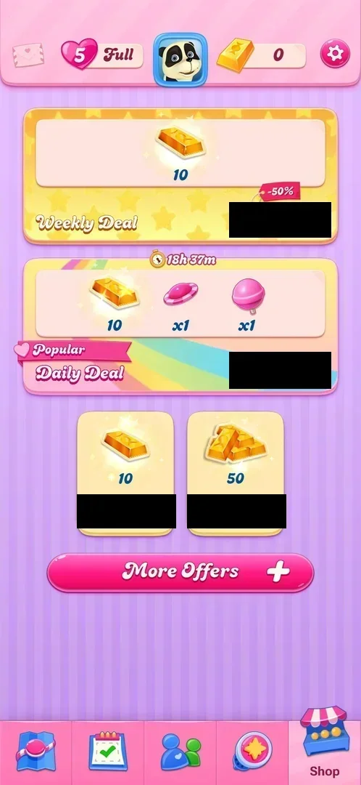
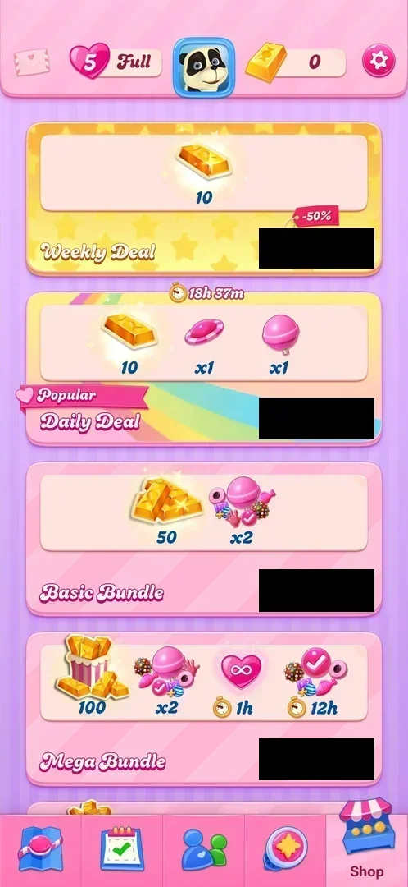
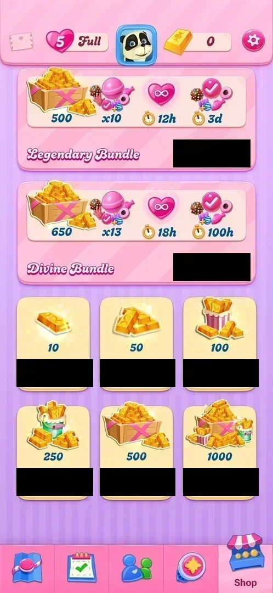

# Gold bars

The game's premium currency: a gold bar with a number in the top bar of the map. Gold bars are bought for
real money in the [Shop](shop.md), alone or in bundles, and are spent on offers such as 6 hours of
unlimited [lives](lives.md) for 69 bars. The balance was 0 from the first map view through level 4; no free
source was seen [^s1] [^s2] [^s3].

## Why it appeared

The counter is in the top bar of the map from the first map view after level 1 was won, at 0; gold bars
are sold in the Shop for real money [^s1]. The counter stays at the same
place on the Events, Social and Shop tabs [^s4].

## Where to find it

The gold bar counter in the map's top bar, between the avatar and the gear: a gold bar and the balance (0)
[^s4]. Tapping it on the map opens the Shop tab
[^s5].

 [^s4]
*The gold bar counter (a gold bar and 0) right of the avatar in the map's top bar*

 [^s5]
*What the counter opens: the Shop tab, with **More Offers** under the two bar packs (prices blacked out: local currency)*

## What it looks like

Gold bars have no screen of their own. The counter is a gold bar icon and a number on a light pill in the top
bar [^s4]. While the Refill Lives popup is open, the counter gets a green plus
on its right [^s3]. In the Shop, gold bars are shown as stacks, boxes and
crates that grow with the amount [^s6].

 [^s6]
*The Shop after **More Offers**: the bundles start under the two deals (prices blacked out)*

## What you can do

| Tab or button | What it does |
|---|---|
| [Gold bar packs](#gold-bar-packs) | Six packs of 10 to 1000 bars for real money; not bought |
| [Bundles](#bundles) | Gold bars with boosters and timed unlimited lives, for real money; not bought |
| [Refill Lives](#refill-lives) | Spends 69 bars on 6 hours of unlimited lives; not bought (balance 0) |

### Gold bar packs

 [^s2]
*The six bar packs at the bottom of the Shop, under the two largest bundles (prices blacked out)*

At the bottom of the Shop after **More Offers**: packs of 10, 50, 100, 250, 500 and 1000 bars, each with a
green price button in real money. The 10 and 50 packs are also shown before More Offers is tapped
[^s5] [^s2]. Prices are under How it works.

### Bundles

<!-- no-frame: the bundles are on the Shop frames above -->
Four bundles between the deals and the packs; besides the bars they hold boosters (a "xN" count under a
group of booster icons), timed unlimited lives (an infinity heart with a stopwatch) and a timed item shown
as boosters with a check mark (inferred: boosters free for that time) [^s6] [^s2]:

| Bundle | Gold bars | Boosters | Unlimited lives | Boosters with a check mark |
|---|---|---|---|---|
| Basic Bundle | 50 | x2 | — | — |
| Mega Bundle | 100 | x2 | 1h | 12h |
| Legendary Bundle | 500 | x10 | 12h | 3d |
| Divine Bundle | 650 | x13 | 18h | 100h |

The Weekly Deal (10 bars, marked -50%) and the Daily Deal (10 bars and one each of two boosters, a timer
of 18h 37m) are at the top of the Shop; see [Shop](shop.md) [^s5].

### Refill Lives

 [^s3]
*Refill Lives: the green **69** button with a gold bar spends gold bars; the counter at 0 shows a green plus*

Opened from the heart in the top bar at 5 lives (Full). The card "6h" with an infinity heart has a green
button "69" with a gold bar: the only price in gold bars seen so far. At a balance of 0 the button is shown
as usual. Not tapped [^s3]. Inferred, not verified: the green plus on the
counter leads to the bar packs.

## How it works

Version 1.337.0.2, 2026-10-05:

- **Balance.** 0 from the first map view after level 1 to level 4; no level win or reward added bars, and no
  timer refills them [^s1] [^s3].
- **Spent on.** 6 hours of unlimited lives: 69 bars [^s3].
- **Bought.** Only for real money in the Shop. Prices were in the local currency (blacked out); here as a
  multiple of the 10-bar pack's price [^s5] [^s6] [^s2]:

| Offer | Gold bars | Price (10-bar pack = 1) | Price per bar (10-bar pack = 1) |
|---|---|---|---|
| Pack | 10 | 1 | 1 |
| Pack | 50 | 4.34 | 0.87 |
| Pack | 100 | 8.36 | 0.84 |
| Pack | 250 | 16.4 | 0.66 |
| Pack | 500 | 28.4 | 0.57 |
| Pack | 1000 | 46.8 | 0.47 |
| Weekly Deal (-50%) | 10 | 0.50 | 0.50 |
| Daily Deal | 10, with two boosters | 1.84 | — |
| Basic Bundle | 50, with boosters | 4.68 | — |
| Mega Bundle | 100, with boosters and lives | 10.7 | — |
| Legendary Bundle | 500, with boosters and lives | 43.5 | — |
| Divine Bundle | 650, with boosters and lives | 46.8 | — |

The Divine Bundle costs the same as the 1000-bar pack and holds 650 bars plus boosters and timed items
[^s2].

## Cases

| Case | What was done | Result | Source |
|---|---|---|---|
| A sink seen: unlimited lives <!-- case:sinks-seen --> | Opened Refill Lives from the heart | ✅ 69 gold bars for 6 hours of unlimited lives | [^s3] |
| Why it appeared <!-- case:chk-appeared --> | First map view after level 1 | ✅ The counter in the map's top bar at 0; bars sold in the Shop | [^s1] |
| Where to find it <!-- case:chk-entry --> | Tapped the gold bar counter on the map | ✅ The Shop tab opened | [^s5] |
| What it looks like <!-- case:chk-screen --> | Tapped the counter; More Offers; scrolled the Shop | ✅ No own screen: the Shop with bar packs of 10 to 1000 and bundles | [^s6] [^s2] |
| What it does <!-- case:chk-effect --> | Read the Shop and Refill Lives | ✅ Premium currency: bought in the Shop, spent on unlimited lives (69 for 6 hours) | [^s3] |
| The balance <!-- case:chk-balance --> | Read the top bar | ✅ Next to the gold bar icon in the top bar; 0 from the start | [^s5] |
| Sources <!-- case:chk-sources --> | Scrolled the whole Shop | ✅ Real-money packs (10 to 1000 bars), the Weekly and Daily Deals and four bundles; no free source seen up to level 4 | [^s2] |
| Sinks <!-- case:chk-sinks --> | Read Refill Lives and the Shop | ✅ 69 bars for 6 hours of unlimited lives; the Shop's offers cost real money, not bars | [^s3] |
| At zero <!-- case:chk-empty --> | Opened Refill Lives at 0 bars | ✅ The 69 button stays shown; the counter gets a green plus (not tapped); no free refill | [^s3] |
| Refill timer <!-- case:chk-refill --> | Read the counter on two days | ✅ None: no timer, the balance stays 0 | [^s3] |

## Not verified

- What the 69 button does at 0 bars (an error, or the bar packs); what the green plus opens
- Any other price in gold bars (boosters, extra moves at out of moves): none reached up to level 4
- Free sources of gold bars (events, rewards) later in the game

[^s1]: session 20261003-194350-chrono-2FYKPJ, step 23 — [video at 4:41](https://youtu.be/OjVVcEHXMyI?t=281)
[^s2]: session 20261005-072135-chrono-2FYKPJ, step 4 — [video at 0:47](https://youtu.be/UOyVRJxygXc?t=47)
[^s3]: session 20261005-072135-chrono-2FYKPJ, step 5 — [video at 1:02](https://youtu.be/UOyVRJxygXc?t=62)
[^s4]: session 20261003-194350-chrono-2FYKPJ, step 7 — [video at 2:12](https://youtu.be/OjVVcEHXMyI?t=132)
[^s5]: session 20261005-072135-chrono-2FYKPJ, step 2 — [video at 0:24](https://youtu.be/UOyVRJxygXc?t=24)
[^s6]: session 20261005-072135-chrono-2FYKPJ, step 3 — [video at 0:37](https://youtu.be/UOyVRJxygXc?t=37)
