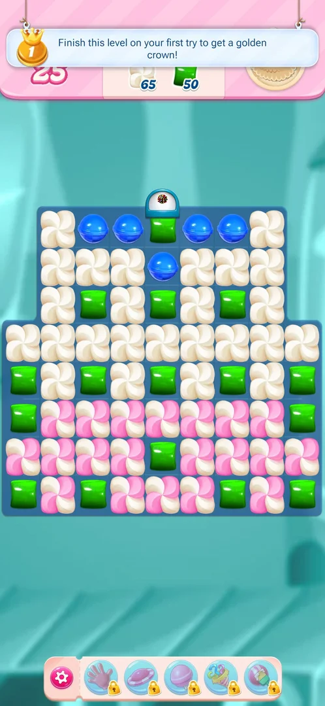

# Golden crown (first-try win)

A reward for winning a level without failing it first: the game promises a golden crown to a player who
finishes the level on the first try [^s1].

## Where to find it

A banner slides over the top of the board when level 4 starts [^s1].

 [^s1]

## What it looks like

A light banner across the top of the level screen with a gold crown icon marked "1" on the left and a line
of text promising a golden crown for finishing the level on the first try. It covers the moves counter while
it is shown [^s1].

<!-- no-screen: level 4 was not played, so no crown was earned and no crown screen was seen -->

## How it works

- The first banner was seen on level 4 (version 1.335.1.2); levels 1 to 3 had none
  [^s1].
- The "1" on the crown icon may count crowns or first-try wins in a row (inferred, not verified).

## Cases

| Case | What was done | Result | Source |
|---|---|---|---|
| Win a level on the first try and see where the crown shows (map, profile) | <!-- --> | not verified |  |

## Not verified

- What the crown gives and where it is shown after a first-try win.
- What the number on the crown icon means.
- Whether every level from 4 on offers a crown.

[^s1]: session 20261001-202316-chrono-2FYKPJ, step 31 — [video at 13:17](https://youtu.be/EORPFmWikL0?t=797)
