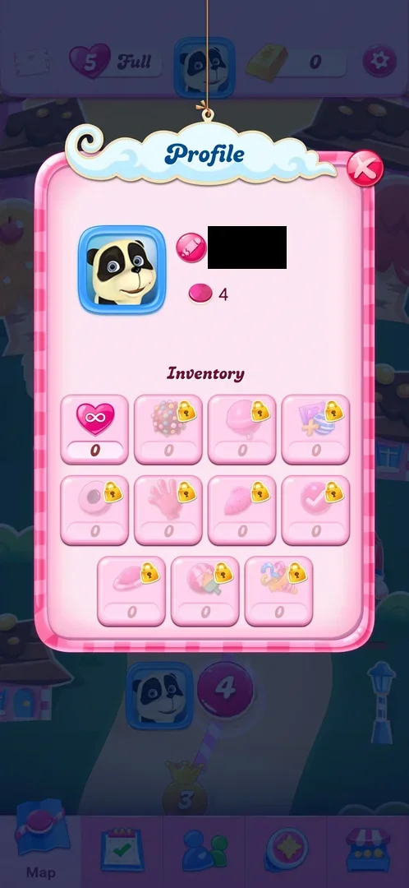

# Inventory slot row2 #4 (check icon)

A booster slot in the Profile inventory: the fourth slot of the second row, with a pink round candy with a white tick as its icon. In version 1.337.0.2, at
level 4, it is locked with a count of 0, and a tap on it shows "Unlocks at level 50" [^s2] [^s3]. What the
booster does, and its name, were not seen: the tooltip gives only the level.

## Why it appeared

It is in the inventory, locked, from the first look at Profile at level 2 [^s4]. Its unlock level is a
fact from its tooltip: "Unlocks at level 50" [^s3] [^s1].

## Where to find it

Map > the avatar in the middle of the top bar > Profile > Inventory: the fourth slot of the second row, a pink round candy with a white tick with a gold
padlock [^s2].

 [^s2]
*Profile, Inventory: the candy with a tick slot is the fourth slot of the second row*

## What it looks like

 [^s3]
*A tap on the candy with a tick slot: "Unlocks at level 50"*

A pink inventory tile with a faded icon (a pink round candy with a white tick), a gold padlock at its top right and 0 under it. A tap
shows a speech-bubble tooltip above the tile, "Unlocks at level 50", with no booster name and no
description [^s3].

## What you can do

| Tab or button | What it does |
|---|---|
| [Locked slot](#locked-slot) | A tap shows the level that unlocks it |

### Locked slot

<!-- no-frame: the tooltip is the frame under What it looks like -->
A tap on the tile opens the tooltip "Unlocks at level 50"; nothing else opens and the count stays 0
[^s3].

## How it works

Version 1.337.0.2. The slot stays locked until level 50; at level 4 its count is 0 [^s3]. With this
session's six tooltips and the four read on 2026-10-06 before it, the unlock level of every booster slot in
the inventory is known [^s5] [^s1]. The slots are not laid out in unlock order:

| Slot | Icon | Unlocks at level |
|---|---|---|
| Row 1, second | Colour bomb | 10 |
| Row 1, third | Lollipop hammer | 7 |
| Row 1, fourth | Striped and wrapped pair | 20 |
| Row 2, first | Round candy | 65 |
| Row 2, second | Hand | 43 |
| Row 2, third | Fish | 35 |
| Row 2, fourth | Candy with a tick | 50 |
| Row 3, first | Flying saucer | 73 |
| Row 3, second | Ball with a paintbrush | 58 |
| Row 3, third | Party popper | 88 |

Inferred, not verified: the Level 2 start popup's Select boosters row has a slot with a tick and no padlock ([Boosters](boosters.md)); whether it is the same booster was not checked. What it does once unlocked, how it is got and how it is spent were not seen.

## Cases

| Case | What was done | Result | Source |
|---|---|---|---|
| Why it appeared <!-- case:chk-appeared --> | Tapped the slot in the Profile inventory | ✅ Locked; tooltip "Unlocks at level 50" | [^s1] [^s3] |
| Where to find it <!-- case:chk-entry --> | Map > avatar > Profile > Inventory | Open in the map: the locked tile was found as above; the unlocked booster's entry was not seen | [^s2] |
| What it looks like <!-- case:chk-screen --> | Looked at the tile and its tooltip | Open in the map: a padlocked tile at 0 and the tooltip; the unlocked booster not seen | [^s3] |
| What it does <!-- case:chk-effect --> | — | not verified: locked until level 50 |  |
| The balance <!-- case:chk-balance --> | Read the inventory | Open in the map: 0 under the tile at level 4 | [^s3] |
| Sources <!-- case:chk-sources --> | — | not verified |  |
| Sinks <!-- case:chk-sinks --> | — | not verified |  |
| At zero <!-- case:chk-empty --> | — | not verified |  |
| Refill timer <!-- case:chk-refill --> | — | not verified |  |

## Not verified

- Where it is used once unlocked (the in-level booster bar, the level start popup) <!-- case:chk-entry -->
- The booster's own screen or effect animation; only the locked tile and its tooltip were seen <!-- case:chk-screen -->
- What one use does <!-- case:chk-effect -->
- The balance once unlocked, and whether level 50 gives a starting amount <!-- case:chk-balance -->
- Every way to get it (level rewards, events, the Shop's bundles) <!-- case:chk-sources -->
- How it is spent and its price in gold bars <!-- case:chk-sinks -->
- What a tap at a count of 0 offers once unlocked <!-- case:chk-empty -->
- Whether it refills on a timer <!-- case:chk-refill -->

[^s1]: session 20261006-120721-chrono-2FYKPJ, step 7 — [video at 1:17](https://youtu.be/d7On5DG_97A?t=77)
[^s2]: session 20261006-120721-chrono-2FYKPJ, step 1 — [video at 0:19](https://youtu.be/d7On5DG_97A?t=19)
[^s3]: session 20261006-120721-chrono-2FYKPJ, step 4 — [video at 0:48](https://youtu.be/d7On5DG_97A?t=48)
[^s4]: session 20261003-194350-chrono-2FYKPJ, step 18 — [video at 4:08](https://youtu.be/OjVVcEHXMyI?t=248)
[^s5]: session 20261006-000939-chrono-2FYKPJ, step 10 — [video at 1:28](https://youtu.be/CpL9KWG38IA?t=88)
