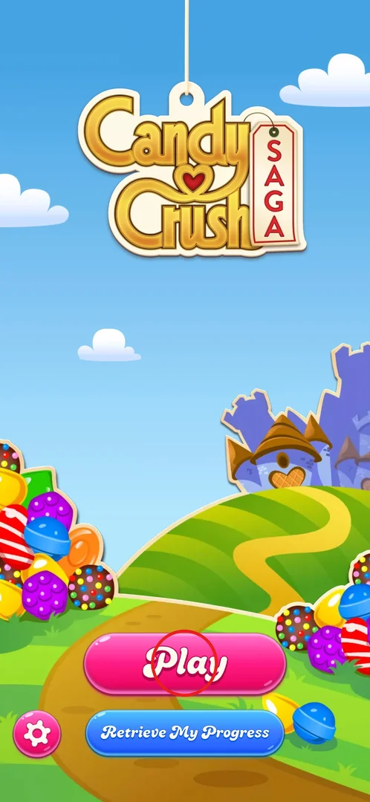
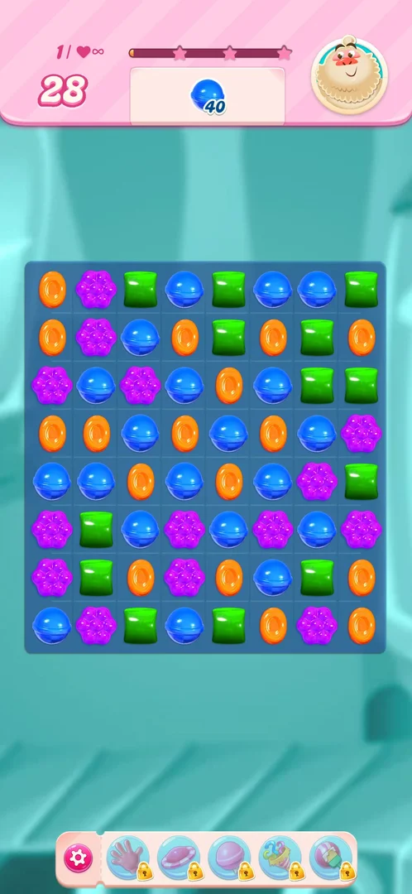
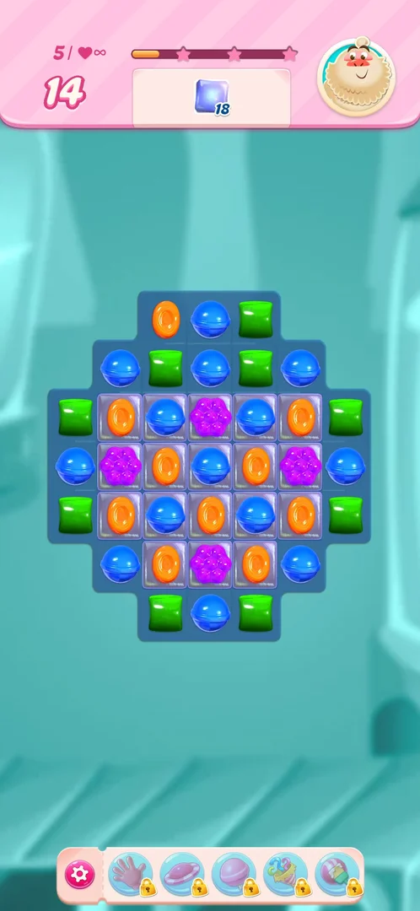

# Level play (match-3 board)

The core of the game. Each level is a board of coloured candies; the player swaps two neighbouring candies
to line up three or more of the same colour, which clears them and lets new candies fall in. Every level
has an order (for example, collect 40 blue candies, or clear 25 meringue) and a limited number of moves.
Matching more than three candies makes special candies whose effects clear bigger areas
[^s2] [^s3].

## Where to find it

On a fresh install: the Play button on the title screen; after Android's notification request, level 1
loads directly, with no map in between [^s4] [^s2].
Later levels start from the Play button on the story path screen after level 1, or load by themselves right
after the previous level is won (level 2 to 3, and 3 to 4) [^s5]
[^s6] [^s7].

 [^s1]

## What it looks like

A pink header bar over the board shows, from left to right: the moves left (a big number), a small number
followed by a heart with an infinity sign, the score bar with three stars, the order (a candy icon with the
count still needed), and a character portrait on the right. The board sits in the middle. Under it, a bar
with a pink gear on the left and five booster slots, all locked with padlocks during the first levels
[^s2].

 [^s2]

The small number before the heart was 1, 2 and 3 on levels 1, 2 and 3, so it reads as the level number,
and the heart with infinity as unlimited lives during the first levels (inferred)
[^s2] [^s5] [^s6].

## How it works

Numbers from version 1.335.1.2, levels 1 to 6 of a fresh install.

| Level | Order | Moves | Board notes | Source |
|---|---|---|---|---|
| 1 | Collect 40 blue candies | 28 | Plain 8x8 board of five colours | [^s2] |
| 2 | Clear 25 meringue | 25 | A 5x5 block of meringue in the bottom right; two dispensers on top drop striped candies | [^s5] |
| 3 | Clear 50 meringue layers | 25 | White meringue (1 layer) and pink meringue (2 layers); pre-placed orange wrapped candies | [^s6] |
| 4 | Clear 65 meringue and collect 50 green | 25 | A dispenser on top drops colour bombs; golden-crown banner at the start | [^s7] [^s17] |
| 5 | Clear 21 jelly | 15 | A round board, jelly under its centre cells | [^s12] |
| 6 | Clear 58 jelly | 25 | 9 wide; double jelly in the middle rows | [^s14] |

- **Special candies seen.** Four in a row makes a striped candy; matching it with two candies of its colour
  fires a whole row or column [^s8] [^s9].
  Five in a row makes a colour bomb; swapping it with a candy clears every candy of that colour on the
  board and also sets off the special candies of that colour [^s3]
  [^s6] [^s10]. Wrapped candies and a fish
  candy were also seen and fired by matching them with candies of their colour
  [^s11].
- **Meringue.** A meringue tile loses a layer when a match is made next to it, and also when a candy next to
  it is cleared by a colour bomb. Cells under a meringue block do not refill until the meringue is gone
  [^s7].
- **Sugar Crush.** When the order is complete with moves left, "Sugar Crush!" appears and the game spends
  the remaining moves by itself [^s3].
- **After a win.** Level 1 ended on a story path screen (see [FTUE story path](ftue-story.md)); levels 2 and
  3 went straight on to the next level with no win screen [^s3]
  [^s6] [^s7].
- The cascade after a move takes about three seconds to settle [^s9].
- **Jelly.** Jelly (the glassy tiles under candies) clears only when the candy on it is matched or blasted; the order counts the jelly left [^s12] [^s13].

 [^s12]

## Cases

| Case | What was done | Result | Source |
|---|---|---|---|
| Win level 1 | Four-in-a-row striped candies, then a colour bomb swapped with blue | ✅ Won in 6 of 28 moves (2.6 min) | [^s3] |
| Win level 2 | Matches next to the meringue, then a colour bomb with blue that set off two striped candies and a fish | ✅ Won in 6 of 25 moves (3.0 min) | [^s6] |
| Win level 3 | Matches in the centre column, a fish and wrapped orange combo, a colour bomb with orange | ✅ Won in 13 of 25 moves (6.4 min) | [^s7] |
| Win level 4 | Colour bombs from the top dispenser swapped with green, matches next to the meringue | ✅ Won on the first try in 17 moves (8.8 min) | [^s15] |
| Win level 5 | Matches inside the jelly cells | ✅ Won with 5 of 15 moves left (4.3 min) | [^s13] |
| Win level 6 | Colour bomb on the colour sitting on jelly, wrapped candy into lines | ✅ Won in about 8 of 25 moves (4.3 min) | [^s14] |

## Not verified

- What happens when a level is lost (out of moves), and how lives work once they are no longer unlimited.
- The win screen and the star rating of a level (not shown on levels 1 to 3).
- The saga map: it had not appeared by level 7 [^s16].
- What the gear on the booster bar opens during a level.

[^s1]: session 20261001-202316-chrono-2FYKPJ, step 1 — [video at 0:12](https://youtu.be/EORPFmWikL0?t=12)
[^s2]: session 20261001-202316-chrono-2FYKPJ, step 5 — [video at 0:46](https://youtu.be/EORPFmWikL0?t=46)

[^s3]: session 20261001-202316-chrono-2FYKPJ, step 11 — [video at 3:17](https://youtu.be/EORPFmWikL0?t=197)
[^s4]: session 20261001-202316-chrono-2FYKPJ, step 4 — [video at 0:39](https://youtu.be/EORPFmWikL0?t=39)
[^s5]: session 20261001-202316-chrono-2FYKPJ, step 12 — [video at 4:05](https://youtu.be/EORPFmWikL0?t=245)
[^s6]: session 20261001-202316-chrono-2FYKPJ, step 18 — [video at 6:46](https://youtu.be/EORPFmWikL0?t=406)
[^s7]: session 20261001-202316-chrono-2FYKPJ, step 31 — [video at 13:17](https://youtu.be/EORPFmWikL0?t=797)
[^s8]: session 20261001-202316-chrono-2FYKPJ, step 6 — [video at 1:26](https://youtu.be/EORPFmWikL0?t=86)
[^s9]: session 20261001-202316-chrono-2FYKPJ, step 8 — [video at 2:15](https://youtu.be/EORPFmWikL0?t=135)
[^s10]: session 20261001-202316-chrono-2FYKPJ, step 28 — [video at 11:55](https://youtu.be/EORPFmWikL0?t=715)
[^s11]: session 20261001-202316-chrono-2FYKPJ, step 27 — [video at 11:29](https://youtu.be/EORPFmWikL0?t=689)
[^s12]: session 20261001-232021-chrono-2FYKPJ, step 33 — [video at 12:28](https://youtu.be/3u8PuF6BhwY?t=748)
[^s13]: session 20261001-232021-chrono-2FYKPJ, step 42 — [video at 16:30](https://youtu.be/3u8PuF6BhwY?t=990)
[^s14]: session 20261001-232021-chrono-2FYKPJ, step 52 — [video at 21:10](https://youtu.be/3u8PuF6BhwY?t=1270)
[^s15]: session 20261001-232021-chrono-2FYKPJ, step 32 — [video at 11:43](https://youtu.be/3u8PuF6BhwY?t=703)
[^s16]: session 20261001-232021-chrono-2FYKPJ, step 53 — [video at 21:22](https://youtu.be/3u8PuF6BhwY?t=1282)
[^s17]: session 20261001-232021-chrono-2FYKPJ, step 15 — [video at 3:04](https://youtu.be/3u8PuF6BhwY?t=184)
