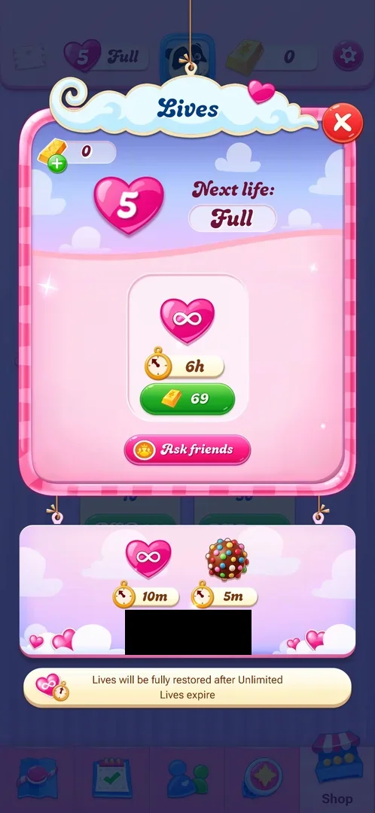
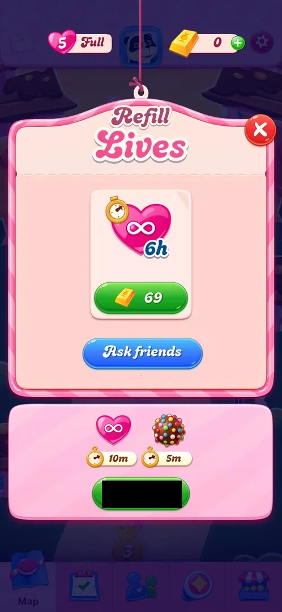
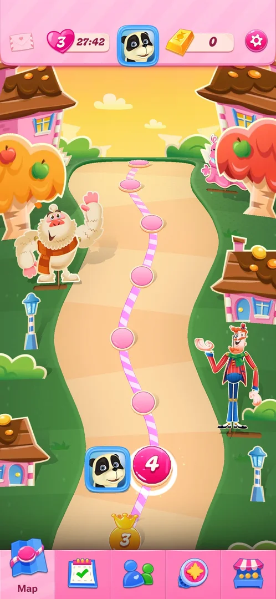
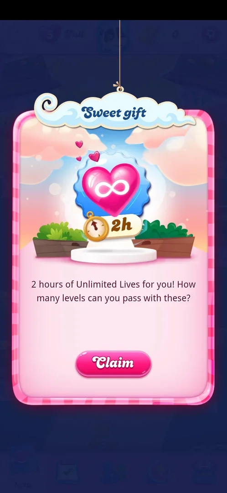

# Lives

The number of attempts at levels the player has, shown as a heart in the map's top bar: 5 and "Full" on a
fresh install. A tap opens a Lives popup with the count, the time to the next life and offers of unlimited
lives for gold bars, from friends or for real money [^s1]. Unlimited lives replace the count with an
infinity heart and a countdown [^s8].

## Why it appeared

The heart is in the map's top bar from the first view of the map, after level 1, at 5 Full; the level 1 top
bar also showed "heart 5" [^s2] [^s3].

## Where to find it

The pink heart with 5 and "Full", left of the avatar in the map's top bar; it stays in the top bar on the
Events, Social and Shop tabs [^s2].

 [^s2]
*Heart with 5 and Full, left of the avatar in the top bar of the map*

 [^s19]
*The same heart, 5 and Full, at level 4: a tap on it opens the Refill Lives popup*

## What it looks like

 [^s1]
*The Lives popup at 5 Full; the real-money price is blacked out (local currency)*

A popup titled "Lives" with a red X. Top left, the gold bar balance (0) with a green plus. A large heart with
5 and "Next life: Full". In the middle, an offer card: a heart with an infinity sign, a stopwatch "6h" and a
green button "69" with a gold bar. Under it a pink "Ask friends" button. Below the popup a second card: an
infinity heart with "10m" and a colour bomb with "5m", for a real-money price. At the bottom the note
"Lives will be fully restored after Unlimited Lives expire" [^s1].

### Refill Lives

 [^s19]
*The popup on 2026-10-05, titled **Refill Lives** although lives were full; the real-money price is blacked out*

On 2026-10-05 the same heart opened a popup titled "Refill Lives", at 5 Full as well as below it: no count
and no "Next life" line on the popup, the 6-hour card for 69 gold bars, a blue Ask friends button, and the
10-minute unlimited lives with a 5-minute colour bomb for real money; the red X closes it to the map
[^s19] [^s12]. Opened from the Shop tab it looked the same (see [Gold bars](gold-bars.md#refill-lives)).

### The heart with a refill timer

 [^s13]
*The heart in the map's top bar at 3 lives, with the time to the next life (27:42) in place of "Full"*

Below 5 lives the heart shows the count and, in place of "Full", a countdown to the next life
[^s14] [^s13].

### Sweet gift

 [^s7]
*The Sweet gift popup on opening the game: 2 hours of unlimited lives, the pink **Claim** button*

On 2026-10-05 the game opened with a "Sweet gift" popup: an infinity heart, a stopwatch "2h", a line
offering 2 hours of Unlimited Lives, and a pink Claim button; lives were at 5 Full behind it [^s7]. After
Claim, the heart in the map's top bar showed an infinity sign and "02:00" in place of the count [^s8]; on
the level board the top bar showed "4 / heart ∞" (level 4) [^s9]. What triggered the gift (a launch, a
returning player, a day count) is not known.

## What you can do

| Tab or button | What it does |
|---|---|
| [Unlimited lives for gold bars](#unlimited-lives-for-gold-bars) | 6 hours for 69 gold bars; not bought |
| [Ask friends](#ask-friends) | Not tapped |
| [Real-money offer](#real-money-offer) | 10 minutes of unlimited lives and a 5-minute colour bomb; not tapped |
| [Gold bar balance](#gold-bar-balance) | 0, with a green plus; not tapped |

The X closes the popup to the screen behind [^s4].

### Unlimited lives for gold bars

<!-- no-frame: the card is on the popup frame above -->
The middle card: an infinity heart, a stopwatch "6h", a green button "69" with a gold bar [^s1]. Not
tapped: the balance was 0.

### Ask friends

<!-- no-frame: the button is on the popup frame above -->
A pink button under the card [^s1]. Not tapped (it acts on other players). See [Friends list](friends.md).

### Real-money offer

<!-- no-frame: the card is on the popup frame above -->
A card hung under the popup: an infinity heart with "10m" and a colour bomb with "5m", and a green price
button in real money (blacked out) [^s1]. Not tapped.

### Gold bar balance

<!-- no-frame: the balance is on the popup frame above -->
Top left of the popup: a gold bar, 0, and a green plus [^s1]. Inferred: the plus opens the
[Shop](shop.md); not tapped.

## How it works

Version 1.337.0.2 [^s1]:

- Maximum shown: 5 lives; at 5 the timer reads "Full".
- Unlimited lives: 6 hours for 69 gold bars; 10 minutes (with a 5-minute colour bomb) in the real-money
  offer; 30 minutes in the Shop's Daily Deal (see [Shop](shop.md)) [^s5].
- After unlimited lives expire, lives are fully restored (the popup's note).
- Unlimited lives also come free: a Sweet gift of 2 hours at launch on 2026-10-05 [^s7] [^s8]; and in the
  Shop's Daily Deal, 30 minutes on 2026-10-03 and 15 minutes on 2026-10-05 [^s5] [^s10].
- While unlimited lives run, the top bar shows a countdown (02:00 right after the gift) instead of the count
  [^s8].

After a lost life the map's top bar showed 4 and a refill timer (27:42) in place of "Full" [^s11].

Force-stopping the app in the middle of a level, with no move made, cost one life (4 to 3) and showed a
refill timer in the map's top bar [^s6]. Inferred: a lost level also costs
one life; not verified.

The refill timer, 2026-10-05, after the 2-hour gift had ended (lives back at 5 Full
[^s15]):

- **Quit costs a life.** Quitting level 4 from the in-level Settings showed a "Level 4" popup with a broken
  heart, "You pressed the quit button!", Score 0 and a Retry button; closed, the map showed 4 lives and
  29:12 [^s16] [^s14]. Quitting level 3 the same
  way left 3 lives [^s17] [^s13].
- **One timer, for the next life only.** After the second quit, under two minutes after the first, the timer read
  27:42: it kept counting from the first lost life and did not restart [^s13].
- **About 30 minutes per life.** Inferred from the timer starting just under 30:00 right after a life was
  lost; a life coming back was not watched.
- **A won level costs nothing.** Level 1 replayed and won: the map showed 3 lives and 22:50 afterwards
  [^s18].
- **The cap is 5.** About five hours after the map showed 3 lives and 22:50, the heart read 5 and "Full"
  [^s18] [^s19]. The single lives coming back in between were not watched.

## Cases

| Case | What was done | Result | Source |
|---|---|---|---|
| Why it appeared <!-- case:chk-appeared --> | First map view | ✅ The heart at 5 Full in the top bar | [^s2] |
| Where to find it <!-- case:chk-entry --> | Tapped the heart in the map's top bar | ✅ The Lives popup opened (2026-10-03), the Refill Lives popup (2026-10-05) | [^s1] [^s19] |
| What it looks like <!-- case:chk-screen --> | Looked at the popup and the heart | ✅ The popup as described above; below 5 the heart shows the count and the time to the next life | [^s1] [^s19] [^s13] |
| What it does <!-- case:chk-effect --> | Quit levels, replayed and won level 1 | ✅ A quit cost one life, a won level none; a level lost on moves not reached | [^s16] [^s18] |
| The balance <!-- case:chk-balance --> | Read the top bar and the popup | ✅ 5, "Full", in the map's top bar and the level's top bar; after a lost life 4 and a refill timer 27:42 in place of "Full" | [^s1] [^s11] |
| Sources <!-- case:chk-sources --> | Read the popup and the Shop, watched the timer | ✅ The refill timer, unlimited lives for 69 gold bars, the real-money offer, the Daily Deal, the Sweet gift; Ask friends not tried | [^s1] [^s19] [^s13] |
| Sinks <!-- case:chk-sinks --> | Quit levels 4 and 3, force-stopped a level | ✅ Each quit cost one life (5 to 4 to 3), the force stop one; a level lost on moves not reached | [^s16] [^s17] [^s6] |
| At zero <!-- case:chk-empty --> | — | not verified |  |
| Leaving the app mid level <!-- case:sink-exit-app --> | Opened level 4, made no move, force-stopped the app and reopened it | ✅ One life spent: the game reopened on the map with 3 lives (was 4) and a refill timer at 24:05; the level was not resumed | [^s6] |
| Sweet gift at launch <!-- case:source-sweet-gift --> | Opened the game, tapped Claim | ✅ 2 hours of unlimited lives: the heart showed ∞ 02:00 on the map and "4 / heart ∞" on the level board | [^s7] [^s8] |
| Shop Daily Deal <!-- case:source-daily-deal --> | Read the Daily Deal on two days | ✅ Timed unlimited lives in a paid deal: 30 min on 2026-10-03, 15 min on 2026-10-05; not bought | [^s5] [^s10] |
| Refill timer <!-- case:chk-refill --> | Lost two lives by quitting after the gift ended, read the timer | ✅ A single countdown to the next life, 29:12 right after the first loss, 27:42 at 3 lives, 22:50 later; inferred about 30 minutes per life | [^s14] [^s13] [^s18] |
| The cap <!-- case:chk-cap --> | Opened the map about five hours after 3 lives | ✅ 5 and "Full": the lives had refilled to 5 | [^s19] |

## Not verified

- The screen and offers at 0 lives (task lives-zero) <!-- case:chk-empty -->
- A level lost on moves costing a life
- What Ask friends sends, and whether friends' lives arrive
- A single life coming back when the timer ends, and the exact time per life
- What triggers the Sweet gift

[^s1]: session 20261003-194350-chrono-2FYKPJ, step 16 — [video at 3:53](https://youtu.be/OjVVcEHXMyI?t=233)
[^s2]: session 20261003-194350-chrono-2FYKPJ, step 7 — [video at 2:16](https://youtu.be/OjVVcEHXMyI?t=136)
[^s3]: session 20261003-194350-chrono-2FYKPJ, step 3 — [video at 0:29](https://youtu.be/OjVVcEHXMyI?t=29)
[^s4]: session 20261003-194350-chrono-2FYKPJ, step 17 — [video at 4:04](https://youtu.be/OjVVcEHXMyI?t=244)
[^s5]: session 20261003-194350-chrono-2FYKPJ, step 14 — [video at 3:34](https://youtu.be/OjVVcEHXMyI?t=214)

[^s6]: session 20261003-230937-chrono-2FYKPJ, step 12 — [video at 2:12](https://youtu.be/QXlart4AJGo?t=132)
[^s7]: session 20261005-001914-chrono-2FYKPJ, step 0 — [video at 0:00](https://youtu.be/oC4G7CtG6t4?t=0)
[^s8]: session 20261005-001914-chrono-2FYKPJ, step 1 — [video at 0:16](https://youtu.be/oC4G7CtG6t4?t=16)
[^s9]: session 20261005-001914-chrono-2FYKPJ, step 5 — [video at 0:58](https://youtu.be/oC4G7CtG6t4?t=58)
[^s10]: session 20261005-001914-chrono-2FYKPJ, step 2 — [video at 0:26](https://youtu.be/oC4G7CtG6t4?t=26)
[^s11]: session 20261003-225003-chrono-2FYKPJ, step 50 — [video at 18:12](https://youtu.be/EeHt-Knje2A?t=1092)

[^s12]: session 20261005-072135-chrono-2FYKPJ, step 5 — [video at 1:02](https://youtu.be/UOyVRJxygXc?t=62)
[^s13]: session 20261005-072135-chrono-2FYKPJ, step 19 — [video at 4:40](https://youtu.be/UOyVRJxygXc?t=280)
[^s14]: session 20261005-072135-chrono-2FYKPJ, step 13 — [video at 3:15](https://youtu.be/UOyVRJxygXc?t=195)
[^s15]: session 20261005-072135-chrono-2FYKPJ, step 1 — [video at 0:12](https://youtu.be/UOyVRJxygXc?t=12)
[^s16]: session 20261005-072135-chrono-2FYKPJ, step 12 — [video at 2:59](https://youtu.be/UOyVRJxygXc?t=179)
[^s17]: session 20261005-072135-chrono-2FYKPJ, step 18 — [video at 4:33](https://youtu.be/UOyVRJxygXc?t=273)
[^s18]: session 20261005-072135-chrono-2FYKPJ, step 31 — [video at 8:51](https://youtu.be/UOyVRJxygXc?t=531)

[^s19]: session 20261005-133157-chrono-2FYKPJ, step 1 — [video at 0:11](https://youtu.be/kSZtZtaGl-g?t=11)
