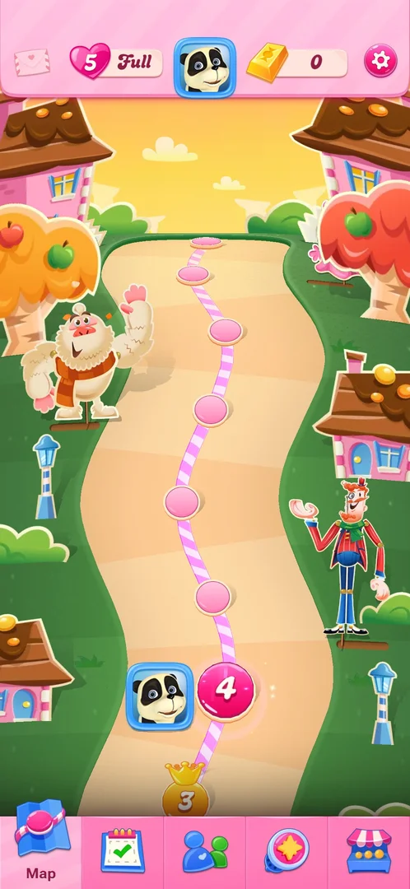

# Mailbox icon

A pale envelope icon at the left end of the map's top bar. In every session so far it opened nothing: two
taps on 2026-10-03 and one at level 4 on 2026-10-05 left the screen unchanged [^s3] [^s4] [^s5]. Inferred
from the icon: an inbox for messages or gifts; not verified.

## Why it appeared

The envelope is in the top bar from the first view of the map, after level 1 [^s2]. Hypothesis: the tap does
nothing while the inbox is empty or the game is not tied to an account, not verified [^s1].

## Where to find it

The envelope at the left end of the top bar, left of the lives heart; it is there on the map and on the
Events, Social and Shop tabs [^s2] [^s5].

 [^s5]
*The envelope at the left end of the map's top bar, at level 4: no badge; a tap opens nothing*

## What it looks like

<!-- no-screen: three taps on the envelope (2026-10-03 steps 15 and 22, 2026-10-05 step 3) changed nothing on screen -->
No screen opened. The envelope is pale, as if greyed out, with a small heart on its flap, and showed no badge,
counter or timer at level 1 or at level 4 [^s2] [^s5].

## How it works

Version 1.337.0.2. On 2026-10-03 both taps were made with the Shop tab open; on 2026-10-05 the tap was made on
the map at level 4. Each time the frame after the tap was the same as before (on 2026-10-05, 1.4% of the
frame changed: the map's idle animation) [^s3] [^s4] [^s5].

## Cases

| Case | What was done | Result | Source |
|---|---|---|---|
| Why it appeared <!-- case:chk-appeared --> | — | not verified: the hypothesis above |  |
| Where to find it <!-- case:chk-entry --> | Found the envelope in the top bar | ✅ Left end of the map's top bar | [^s2] [^s5] |
| What it looks like <!-- case:chk-screen --> | Tapped the envelope on the Shop tab twice and on the map once | ✅ No screen opens; the icon is pale | [^s3] [^s5] |
| Every entry point on it <!-- case:chk-entries --> | Tapped the envelope | ✅ None: nothing opens | [^s5] |
| Badges, timers and counters on it <!-- case:chk-badges --> | Looked at the icon at levels 1 and 4 | ✅ No badge, counter or timer | [^s2] [^s5] |
| What changes on it with progress <!-- case:chk-changes --> | Compared level 4 with level 1 | ✅ Unchanged up to level 4; later progress not tested (task mailbox-exp) | [^s5] |

## Not verified

- Why a tap does nothing (an empty inbox, no account, or not yet unlocked) <!-- case:chk-appeared -->
- Whether the envelope becomes active later in the game or after logging in to an account (task mailbox-exp)

[^s1]: session 20261003-194350-chrono-2FYKPJ, step 23 — [video at 4:49](https://youtu.be/OjVVcEHXMyI?t=289)
[^s2]: session 20261003-194350-chrono-2FYKPJ, step 7 — [video at 2:16](https://youtu.be/OjVVcEHXMyI?t=136)
[^s3]: session 20261003-194350-chrono-2FYKPJ, step 15 — [video at 3:45](https://youtu.be/OjVVcEHXMyI?t=225)
[^s4]: session 20261003-194350-chrono-2FYKPJ, step 22 — [video at 4:40](https://youtu.be/OjVVcEHXMyI?t=280)
[^s5]: session 20261005-133157-chrono-2FYKPJ, step 3 — [video at 0:36](https://youtu.be/kSZtZtaGl-g?t=36)
